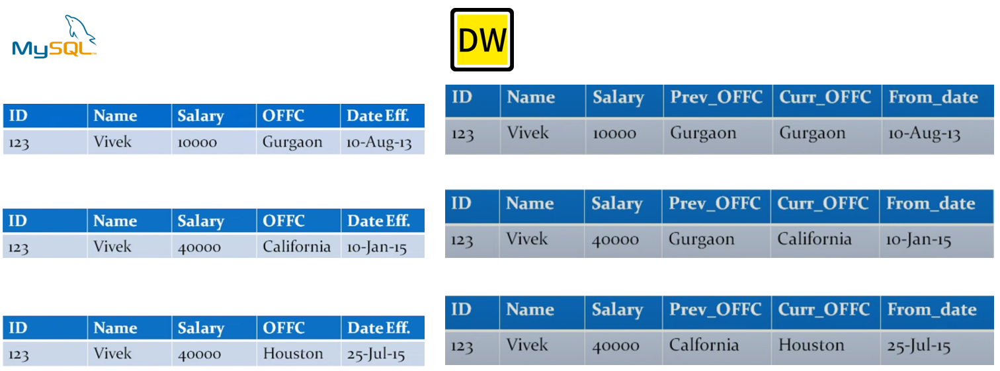
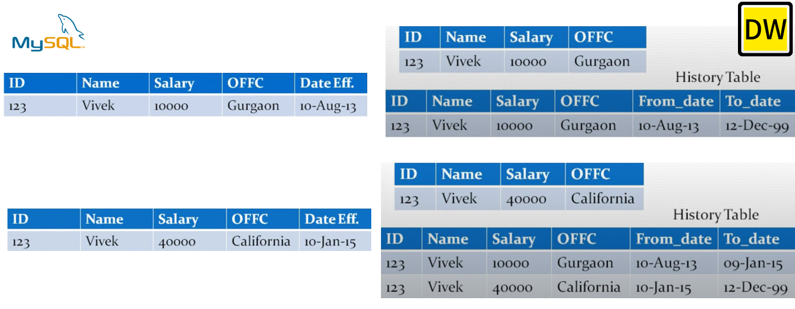

# SCD

SCD全称：Slowly changing dimension，中译为缓慢变化维度，是数据库(记录系统)和数据仓库(衍生系统)领域的问题，比如商品表中，商品的价格这个维度一般是不会变化，但是可能会竞品的降价而变化，我们称商品价格是缓慢变化维[^1][^2]

## 一、SCD x

下面介绍几个处理缓慢变化维的方式

### 1.0-SCD 0(retain original)

> 无论记录系统中的值如何变化，数据仓库中保留第一次的值

可能是因为维度的变化，业务逻辑并不关心

### 1.1-SCD 1(overwrite)

> 无论记录系统中的值如何变化，数据仓库中记录系统中最新的值

业务逻辑只关注最新的数据，对历史的数据毫无兴趣，比如你有500$美元，你希望知道它值多少RMB，如果你保存的是汇率列，即便汇率一直在变动，你都只需要保存最新的汇率，因为你只关心当前的价值而不是5天前的价值

### 1.2-SCD 2

> 每当记录系统改变一次，数仓中都会增加一**行**

如果我们想在数仓中保留数据库的当前值和历史值，需要使用到SCD 2，SCD 1和 SCD 2是数据仓库/集市最常见的处理缓慢变化维的方式，如下是SCD 2 的示意图

### 1.3-SCD 3

> 每当记录系统改变一次，数仓中都会增加一**列**

这种方式会丢失数据，并且需要为每个缓慢变化维增加一列，不被推荐使用

### 1.4-SCD 4

> SCD 1 + SCD 2

比如投资银行有很多投资产品被交易，而且这些产品的变动会非常大，比如在使用美元进行Bitcoin交易中，比特币的价格每2分钟会刷新一次，这意味着每两分钟维度表会增加一行，但是在交易的那个时刻你希望使用最新的价格进行分析，同时你希望维护历史值，如此你可以分析2天前买入/卖出和当前买入/卖出之间的价差，如果只是使用SCD2的话，假设有100,0000的产品，每个小时变动10次，那么1个小时SCD2将会有1000,0000行，所以可以分隔为2个表，其中一个表是存储快照，另外一个表存储历史数据，即为SCD1+SCD2

### 1.4-SCD 6

> SCD1 + SCD2 + SCD3

最常用的是SCD1、SCD2，SCD4也会使用，SCD0，SCD3，SCD6用的很少

### 1.4-zipper table

Reference

[^1]:wiki addr  https://en.wikipedia.org/wiki/Slowly_changing_dimension
[^2]:YouTube tutorial https://www.youtube.com/watch?v=XqdZF0DJpUs

