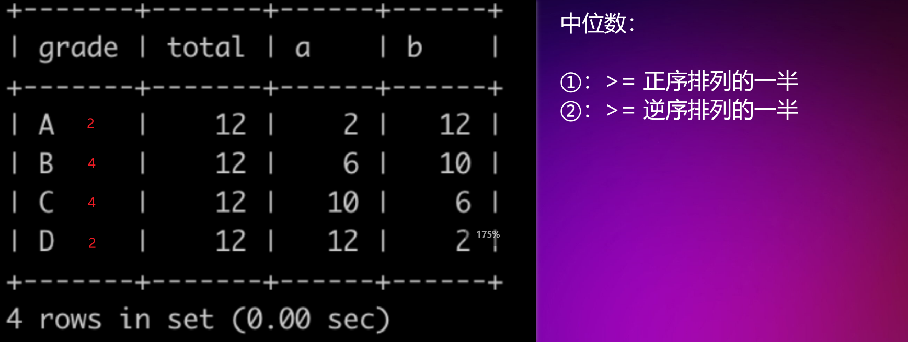
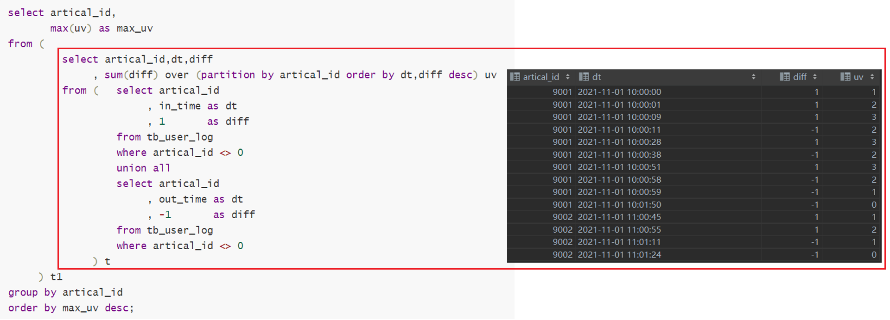
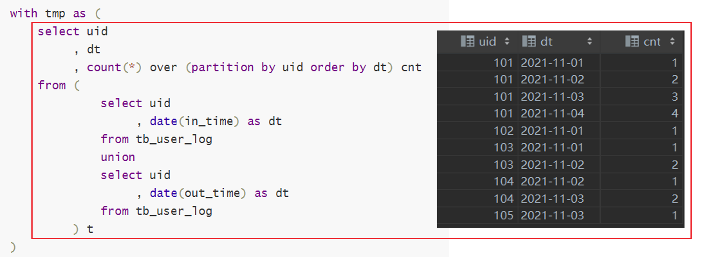

# 好用的SQL范例

01-[delete-duplicate-emails](https://leetcode.com/problems/delete-duplicate-emails/)

```sql
-- method 1 
delete
from Person
where Id not in (
    select Id
    from (
             select min(Id) as Id
             from Person
             group by Email
         ) t
)
;
-- method 2 
delete
from Person
where id In
      (   select id
          from (   select email
                        , id
                        , row_number() over (partition by email order by id asc) as rank_id
                   from Person
               ) as c
          where c.rank_id > 1
      );
-- the following method doesn't work , you will get 
-- " You can't specify target table 'Person' for update in FROM clause"
delete
from Person
where Id not in (
    select min(Id) as Id
    from Person
    group by Email
);
```

02-[rising-temperature](https://leetcode.com/problems/rising-temperature/submissions/)

```sql
-- just a windows function , to avoid the every one or more day such as 2022-05-01 2022-05-04, we use timestampdiff function
select id
from (
         select id
              , temperature
              , recordDate
              , timestampdiff(day,lag(recordDate, 1) over (order by recordDate),recordDate) as date_diff
              , lag(temperature, 1) over (order by recordDate) yes_temperature

         from Weather
     ) t
where temperature > yes_temperature
and date_diff = 1
;
-- param2 - param1
select timestampdiff(day,'2022-05-04','2022-05-05') -- 1
```

03-[swap-salary](https://leetcode.com/problems/swap-salary/)

```sql
update Salary
set sex = if(sex = 'm','f','m');
```

04-[nth-highest-salary](https://leetcode.com/problems/nth-highest-salary/)

```sql
select max(salary)
from (
    select t1.salary
    from Employee t1
    inner join Employee t2
    on t1.salary <= t2.salary
    group by t1.salary
    having  count(distinct  t2.salary) = n
) t
; -- 这里使用了非等值连接，n=1 比自己(>=)的元素,只有自己，n=2,比自己(>=)的元素是自己和最大值；以此类推


select max(salary )
from (
    select id,salary 
         , dense_rank() over(order by salary  desc)  as rk
    from Employee
) t2
where t2.rk = n
```

05-[consecutive-numbers](https://leetcode.com/problems/consecutive-numbers/submissions/)

```sql
select distinct num as ConsecutiveNums
from (
         select  num
              , cast(id as signed) - cast(row_number() over(partition  by num order by id) as signed) as diff
         from Logs
     ) t
group by diff,num
having count(*) >=3;

-- mysql中
select cast(1 as signed)-(cast(-2 as unsigned));
-- 会引发：data truncation: BIGINT value is out of range in 的错误
```

06-[exchange-seats](https://leetcode.com/problems/exchange-seats/)

```sql
select case
           when mod(id, 2) != 0 and counts != id then id + 1
           when mod(id, 2) != 0 and counts = id then id
           else id - 1 end as id
     , student
from seat
   , ( select count(*) as counts
       from seat ) as seat_counts
order by id asc;
```

优先考虑偶数情况，然后再考虑奇数情况

07-[human-traffic-of-stadium/](https://leetcode.com/problems/human-traffic-of-stadium/submissions/)

```sql
with tmp1 as (
    select id
              , visit_date
              , people
              , id - row_number() over(order by id) as diff
    from stadium
    where people >=100
)
select id,visit_date ,people
from (
         select id
              , visit_date
              , people
              , diff
              , count(*) over( partition  by diff) as cnt
         from tmp1
     ) t
where t.cnt >=3
```

08-[中位数档次](https://www.nowcoder.com/practice/165d88474d434597bcd2af8bf72b24f1?tpId=82&tqId=37925&rp=1&ru=%2Fta%2Fsql&qru=%2Fta%2Fsql%2Fquestion-ranking)

```sql
select grade
from (
         select grade
              , ( select sum(number) from class_grade ) as total
              , sum(number) over (order by grade)          a
              , sum(number) over (order by grade desc)     b
         from class_grade
     ) t
where a >= total / 2
  and b >= total / 2
order by grade;
```

具体的图解如下图：



09-一些时间处理

:one:[`start_time`~某个时间字段~时间的最近三十天](https://www.nowcoder.com/practice/a78cf92c11e0421abf93762d25c3bfad?tpId=268&tqId=2285068&ru=/ta/sql-factory-interview&qru=/ta/sql-factory-interview/question-ranking)

```sql
-- mysq 语法
datediff((select max(start_time) from tb_user_video_log), t1.start_time) <= 29
```

上面的例子中，对于状态位标记为1，0的这种状态，求和可复用，`sum(t1.if_retweet) as retweet_cnt` 大于 `sum(if(t1.if_retweet=1,1,0))`

:two:最近7天内，一般而言最近7天都是包含今天~计算日期~的

```sql
select date_add('2022-01-07', -6);
-- 最近的7天分别是：
2022-01-01,2022-01-02,2022-01-03,2022-01-04,2022-01-05,2022-01-06,2022-01-07
```

10-[国庆期间每类视频的点赞量和转发量](https://www.nowcoder.com/practice/f90ce4ee521f400db741486209914a11?tpId=268&tags=&title=&difficulty=0&judgeStatus=0&rp=0)

```sql
select tag
     , dt
     , sum_like_cnt_7d
     , max_retweet_cnt_7d
from (
         select tag
              , dt
              , like_cnt
              , retweet_cnt
              , sum(like_cnt) over (partition by tag order by dt rows 6 preceding)    as sum_like_cnt_7d
              , max(retweet_cnt) over (partition by tag order by dt rows 6 preceding) as max_retweet_cnt_7d
         from (	  select t2.tag
                       , date(t1.start_time) dt
                       , sum(if_like)    as  like_cnt
                       , sum(if_retweet) as  retweet_cnt
                  from tb_user_video_log t1
                  left join tb_video_info t2
                  on t1.video_id = t2.video_id
                  where date(start_time) <= '2021-10-03'
                    and date(start_time) >= date_sub('2021-10-01', interval 6 day)
                  group by t2.tag, date(t1.start_time)
              ) t
     ) t2
where dt >= '2021-10-01'
  and dt <= '2021-10-03'
order by tag desc,dt;
```

11-[近一个月发布的视频中热度最高的top3视频](https://www.nowcoder.com/practice/0226c7b2541c41e59c3b8aec588b09ff?tpId=268&tqId=2285071&ru=/practice/f90ce4ee521f400db741486209914a11&qru=/ta/sql-factory-interview/question-ranking)

```sql
select video_id,
       round((100 * complete_rate + 5 * like_cnt + 3 * comment_cnt + 2 * retweet_cnt) 
                 / (un_play_day_cnt + 1),0) as hot_index
from (
 select t1.video_id
      , sum(if(t2.duration <= timestampdiff(second, start_time, end_time), 1, 0))
            / count(*) as complete_rate
      , sum(if_like)         as like_cnt
      , count(comment_id)    as comment_cnt
      , sum(if_retweet)      as retweet_cnt
      , datediff(( select max(end_time) from tb_user_video_log ), 
                 max(t1.end_time))  as un_play_day_cnt
 from tb_user_video_log t1
 inner join tb_video_info t2
 on t1.video_id = t2.video_id
 where datediff(( select max(end_time) from tb_user_video_log ), t2.release_time) <= 29
 group by t1.video_id
) t
order by hot_index desc limit 3
```

12-[每篇文章同一时刻最大在看人数](https://www.nowcoder.com/practice/fe24c93008b84e9592b35faa15755e48?tpId=268&tqId=2285071&ru=%2Fpractice%2Ff90ce4ee521f400db741486209914a11&qru=%2Fta%2Fsql-factory-interview%2Fquestion-ranking)

```sql
select artical_id,
       max(uv) as max_uv
from (
         select artical_id,dt,diff
              , sum(diff) over (partition by artical_id order by dt,diff desc) uv
         from (	  select artical_id
                       , in_time as dt
                       , 1       as diff
                  from tb_user_log
                  where artical_id <> 0
                  union all
                  select artical_id
                       , out_time as dt
                       , -1       as diff
                  from tb_user_log
                  where artical_id <> 0
              ) t
     ) t1
group by artical_id
order by max_uv desc;
```

这种方法学名叫做：编码+联立~code-plus-union~，具体的图示如下：



13-[2021年11月每天新用户的次日留存率](https://www.nowcoder.com/practice/1fc0e75f07434ef5ba4f1fb2aa83a450?tpId=268&tags=&title=&difficulty=0&judgeStatus=0&rp=0)

```sql
with tmp as (
    select uid
         , dt
         , count(*) over (partition by uid order by dt) cnt
    from (
             select uid
                  , date(in_time) as dt
             from tb_user_log
             union
             select uid
                  , date(out_time) as dt
             from tb_user_log
         ) t
)
select today.dt as dt
     , round(count(tomorrow.uid) / count(*),2) as uv_left_rate
from tmp today
left join tmp tomorrow
on today.uid= tomorrow.uid
and today.dt = date_sub(tomorrow.dt, interval 1 day)  -- 控制点x
where today.cnt = 1									 
and today.dt >= '2021-11-01'
and today.dt <= '2021-11-30'
group by today.dt
order by dt
;
```

控制点x的变动可以改变n日留存，方法示意图示如下：




```sql
with max_day as (
    select date(max(in_time)) as today
    from tb_user_log
)
select user_grade,
       round(count(*) / (select count(distinct uid) from tb_user_log),2) as ratio
from (
 select uid
      , case
            when date(max(in_time)) between date_sub(( select today from max_day ), interval 6 day) 
                and ( select today from max_day ) -- 最大活跃日期在7天之内
                and date(min(in_time)) < date_sub(( select today from max_day ), interval 6 day) -- 最小活跃日期在7天开外(非新晋用户)
                then '忠实用户'
            when date(min(in_time)) between date_sub(( select today from max_day ), interval 6 day) 
                and ( select today from max_day ) -- 最小活跃日期在7天之内
                then '新晋用户'
            when date(max(in_time)) between date_sub(( select today from max_day ), interval 6 day) 
                and date_sub(( select today from max_day ), interval 29 day) -- 最大活跃日期在7天和30天范围之间的
                then '沉睡用户'
            else '流失用户' -- 最大活跃日期小于[三十天前]
     end as user_grade
 from tb_user_log
 group by uid
 ) t
group by user_grade
order by ratio desc
```

使用线段去理解该问题

