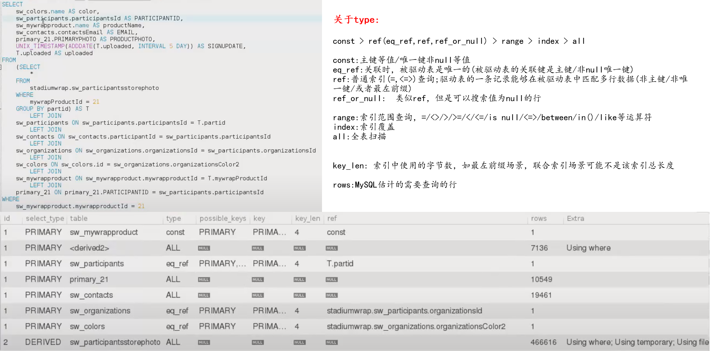
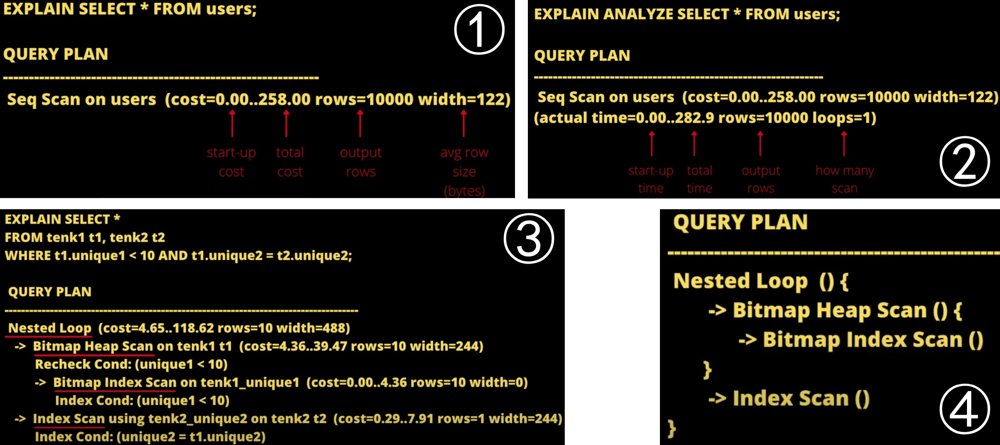
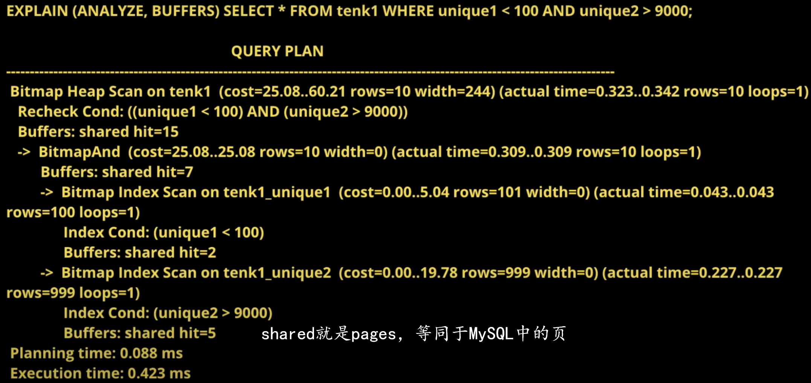
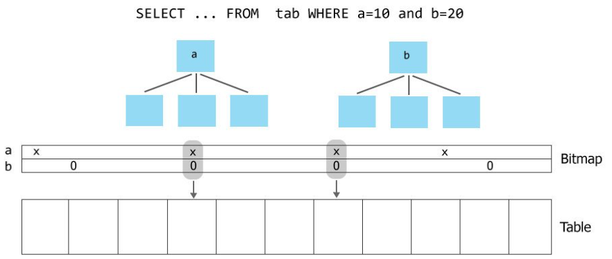

# Execution plan

执行/查询计划老外有三种叫法：Execution plan/query explanation paln/query plan[^1]。这个概念起源于关系型数据库，后来随着开源OLAP引擎同样follow了RDB的传统，实现了查询计划。关于执行计划，要注意2点：

:a: 执行计划是*优化器/执行器*打算访问数据步骤

:b: 执行计划不会真正的执行查询，而是对查询的一个预测

## 1-MySQL 执行计划

下图是MySQL的执行计划[^2]的例子

MySQL的执行计划输出[^3]，Oracle官网有详细的描述，可以前往查看

## 2-PostgreSQL执行计划

上图是PostgreSQL的执行计划[^4]的例子，③号图中的执行计划可以缩略理解为④号图，类似编程语言中的函数调用

> 关于PostgreSQL中的 seq_scan,index_scan,bitmap scan[^5]：
>
> :one:seq_scan：全表扫描 when select a LOT of data from a table
>
> :two:index_scan:  Index Only Scan  when select a handful of rows
>
> :three:bitmap scan :  too much row for an index scan to be efficient but too little for a sequential scan，如下图：
>
> 

PostgreSQL的执行计划输出，PostgreSQL官网[^6][^7]有详细的描述，可以前往查看

## 3-impala执行计划

🔞Reference

[^1]:query plan wiki : https://en.wikipedia.org/wiki/Query_plan
[^2]: mysql query plan : https://www.youtube.com/watch?v=9K26Wb84f50
[^3]: mysql explain output format: https://dev.mysql.com/doc/refman/8.0/en/explain-output.html

[^4]:postgresql query plan : https://www.youtube.com/watch?v=Mll5SqR4RYk&t=632s

[^5]: seq_scan,inde_scan,bitmap_scan: https://www.cybertec-postgresql.com/en/postgresql-indexing-index-scan-vs-bitmap-scan-vs-sequential-scan-basics/
[^6]:  postgresql explain output format : https://www.postgresql.org/docs/10/using-explain.html | ↩
[^7]:  postgresql performance tuning:  https://www.postgresql.org/docs/8.1/performance-tips.html

