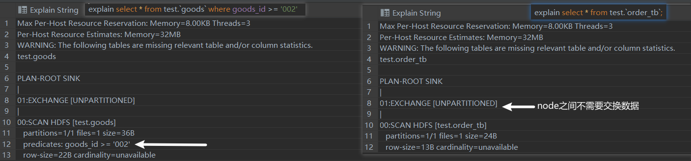
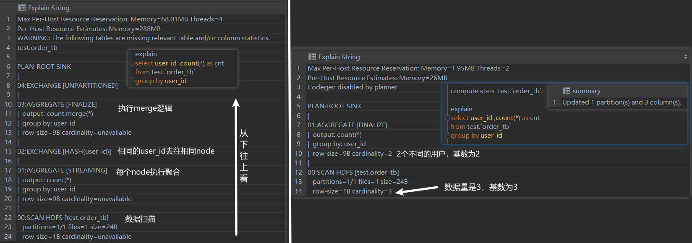
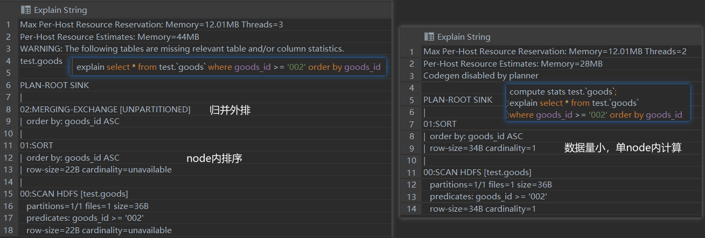
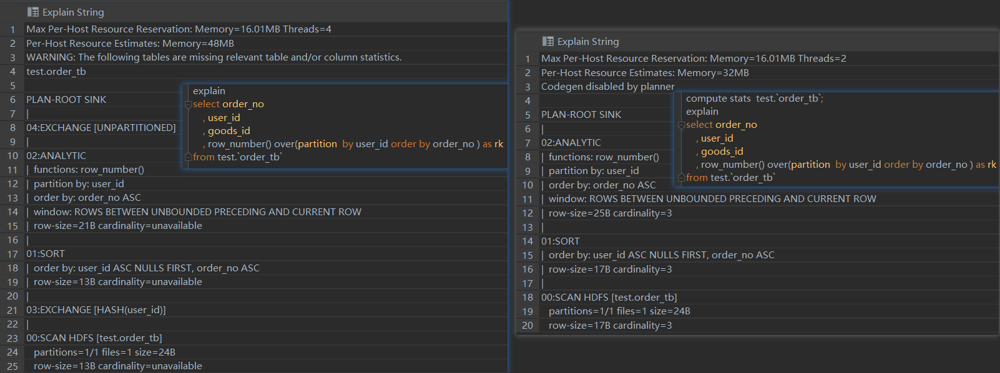
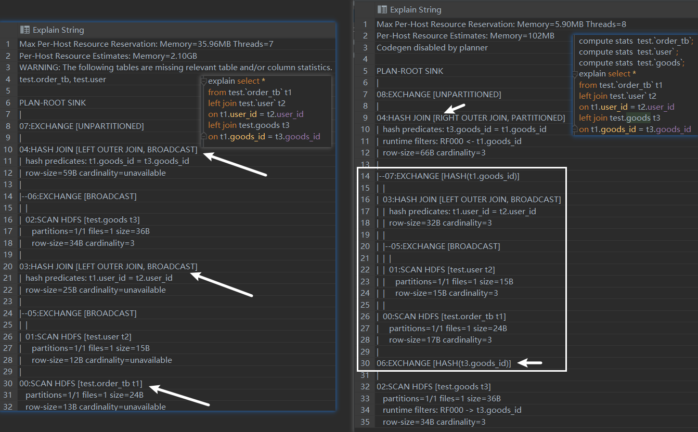
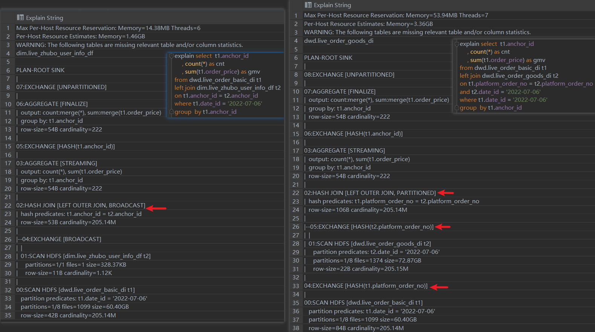
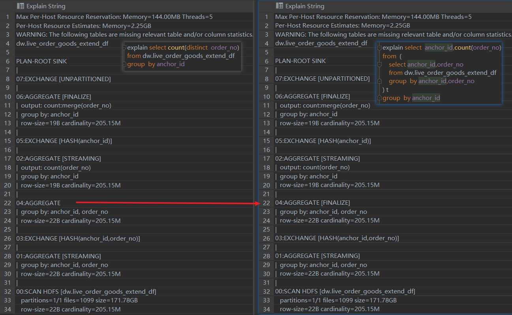
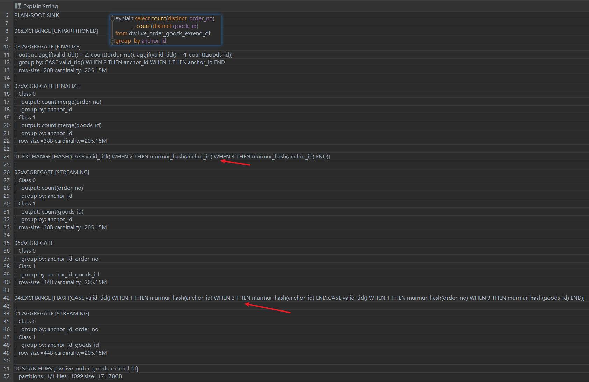

# impala execuiton plan

Impala是一个MPP~MassivelyParallelProcessing~计算引擎，简单来说就是将计算压力分到多个节点，得到结果后汇总最后返回给客户端。如果你留意过Impala的执行计划，会观察到`exchange`节点，该节点的作用就是分散计算压力的过程。下面我们通过`sql`语句 + 截图的方式熟悉下impala的执行计划

查看impala的执行情况有3种途径， :one: execution plan 在sql没有实际运行之前就可以获取;:two: profile SQL实际运行之后搜集的执行信息;:three: summary也是SQL实际执行之后搜集的信息相比于profile更加详细

本文将重点探讨第一种execution plan的执行

## :one: 常见SQL及其执行计划

测试表表结构及数据状况如下

```sql
drop table if exists  test.user;
create table if not exists test.user as
select 1 as user_id , 'z1' as user_name union all
select 2 as user_id , 'z2' as user_name union all
select 3 as user_id , 'z3' as user_name
;
drop table if exists test.goods;
create table if not exists test.goods as
select '001' as goods_id , '手机' as  goods_name union all
select '002' as goods_id , '洗衣机' as  goods_name union all
select '003' as goods_id , '冰箱' as  goods_name ;
;

drop table if exists test.order_tb;
create table if not exists test.order_tb as
select 1 as order_no , 1 as user_id , '001' as goods_id union all
select 2 as order_no , 1 as user_id , '002' as goods_id union all
select 3 as order_no , 2 as user_id , '002' as goods_id
;
```

### 1.1 select 查询



简单的`select * ` 操作，exechange中不需要partitioned，切没有搜集表的统计信息，基数~cardinality~信息不可用~unaviable~

### 1.2 group by 



左边的逻辑是执行表扫描之后，进行一次预聚合然后按照user_id的哈希值分发，相同user_id去往同一个节点后merge结果；右侧和坐车的区别在于执行了`compuate status`之后，数据都在一个节点只需要单节点内的聚合

### 1.3 order by



左图：首先节点内排序，排序完成后所有节点归并外排~即归并排序~。右图中搜集了目标表的统计信息，只需要在单节点内执行排序操作

### 1.4 windows_function



左图中首先按照`partition by`~分区字段~exechange往不同的节点，然后是排序~user_id正序null值排在队首~，然后是执行窗口操作，可以观察到实际使用的是`rows between unbounded preceding and current row`~队首到当前行~，最后exechange之后返回结果。右图的区别在于搜集到目标表的统计信息后，所有操作在单节点内完成

### 1.5 join



左图中：扫描t2表后广播到t1表，关联方式为`hash join` ，关联完成后扫描t3表，广播t3和t1关联，关联方式为`hash join`，最后exechange返回结果。右图中搜集到了各个表的统计信息后认为t3是小表，于是关联顺序变为t1和t2关联，之后以t3为驱动表`right join` t1表。二者使用的方式都是Hash Join，关于Hash Join可以参考这篇文章[单机与分布式下的 Join 是怎么玩的？](http://mp.weixin.qq.com/s?__biz=MzIxNTQyNjQzNA==&mid=2247485549&idx=1&sn=c98487cd74a3c9bede539980714f6156&chksm=97993c80a0eeb596d325968c99b24f11e3368bd653cc2abbb65a220327f378d0a11cf0d2cf0c&scene=21#wechat_redirect)

我们可以发现即便我们使用大表`left join`小表，impala一旦识别某个表是小表后，会立即将小表作为驱动表，基于小表构建Hash Table，然后大表做探测，从而完成哈希关联(转为`right join`)

## :two:-大表关联

上面描述的表数据量很小，是小表之间的关联，下面描述的是大表之间的关联及其执行计划

* `dwd.live_order_basic_di` ,`dwd.live_order_goods_di` 亿级记录的的大表
* `dim.live_zhubo_user_info_df` 小表千条记录

### 2.1 大表关联大表&大表关联小表



:a:左图是大表关联小表，可以认为是**广播哈希关联**

* 扫描t1表，
* 扫描t2，exechange的方式是广播
* t1表和t2表hash join
* 节点内聚合
* 按照分组键 anchor_id 执行exechange
* merge多个节点的结果
* exechange 给协调器~QueryCoordinator~

:b:右图是大表关联大表，可以认为是**混洗哈希关联**

* 扫描t1表，并且按照关联键exechange
* 扫描t2表，并且按照关联键exechange  (经过步骤1和步骤2之后，相同的关联键都去往同一个节点)
* 执行hash join
* 按照分组键~anchor_id~聚合(节点内聚合)
* 按照分组键~anchor_id~exechange(相同的分组键去往相同的节点)
* merge多个节点的结果
* exechange 给协调器~QueryCoordinator~

### 2.2-group by + distinct单字段



上图左图和右图展示了，如果group by A字段，distinct B字段的实际效果就是先group by A B字段，然后在按照其中一个字段group by，然后执行聚合函数

### 2.3-group by + distinct多个字段



如上图所示，如果对多个字段执行distinct，将会有多个分组~calss_x~同时进行，这对impalad的压力是非常大的，生产环境中多字段distict非常容易把impalad玩坏


## 3-其他问题

#### :a: 关于为什么有时候执行`compute stats tb_name`时候，整体脚本更慢？

执行`explain`的时候即便没有表的统计信息也会生成一个执行计划，按照该执行计划执行得到耗时为time_A,若在`compute stats tb_name`的耗时为time_B，但是在执行`explain`之后得到了和之前一样的执行计划，此时整体消耗的时间为：$time\_A + time\_B$

:tipping_hand_man: 所以一个建议是在涉及大表的查询/关联时，不建议优先执行 `compute stats tb_name`

Impala在没有收集统计信息的前提下，执行关联有如下逻辑

:one: `t1 left join t2` ，`exchange` (哈希或者广播) t2表

:two: `t1 right join t2` , `exchange` (哈希或者广播) t1表

#### :b: 关于行列剪裁的辨析

| projection~投影~ pushdown | predicate~谓词~ pushdown | runtime filter             |
| ------------------------- | ------------------------ | -------------------------- |
| 列过滤                    | 行过滤(更底层的过滤方式) | 行过滤(运行加载到内存过滤) |

> 关于**predicate pushdow**和**runtime filter**的区别
>
> This optimization is called **filter pushdown** or **predicate pushdown** and aims at pushing down the filtering to the "bare metal", i.e. a data source engine. That is to increase the performance of queries since the filtering is performed at the very low level rather than dealing with the entire dataset after it has been loaded to Spark’s memory and perhaps causing memory issues.


Reference

[^1]:https://conferences.oreilly.com/strata/strata-ca-2018/cdn.oreillystatic.com/en/assets/1/event/269/How%20to%20use%20Impala_s%20query%20plan%20and%20profile%20to%20fix%20performance%20issues%20Presentation.pdf


