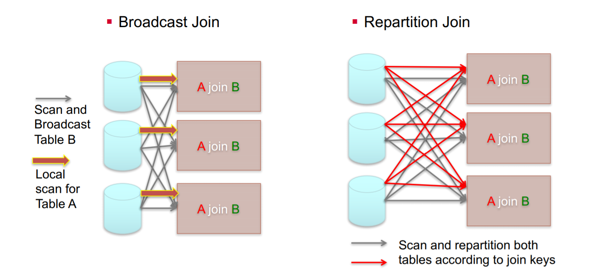

# impala 执行计划详解

Impala是一个MPP~MassivelyParallelProcessing~计算引擎，简单来说就是将计算压力分到多个节点，得到结果后汇总，然后再返回给客户端。如果你留意过Impala的执行计划，会观察到`exchange`节点，该节点的作用就是分散计算压力的过程，`impala`的架构相关，可点击[关于MySQL,PostgreSQL,Impala,Spark的执行计划](http://mp.weixin.qq.com/s?__biz=MzIxNTQyNjQzNA==&mid=2247485695&idx=1&sn=ecfdaffa817bf6e0d6c7305b86f3b393&chksm=97993c12a0eeb50443675461ef10c0a9d271b245a19fb90d40fb0dc340fc363bb07f35f4accc&scene=21#wechat_redirect)

下面我们通过`sql`语句 + 截图的方式熟悉下`impala`的执行计划

查看`impala`的执行情况有3种途径， :one: `execution plan` 在`SQL`没有实际运行之前就可以获取;:two: `profile` ` SQL`实际运行之后搜集的执行信息;:three: `summary`也是`SQL`实际执行之后搜集的信息相比于`profile`更加详细

本文将重点探讨第一种`execution plan`的执行

## :one: 常见SQL及其执行计划

测试表表结构及数据状况如下

```sql
drop table if exists  test.user;
create table if not exists test.user as
select 1 as user_id , 'z1' as user_name union all
select 2 as user_id , 'z2' as user_name union all
select 3 as user_id , 'z3' as user_name
;
drop table if exists test.goods;
create table if not exists test.goods as
select '001' as goods_id , '手机' as  goods_name union all
select '002' as goods_id , '洗衣机' as  goods_name union all
select '003' as goods_id , '冰箱' as  goods_name ;
;

drop table if exists test.order_tb;
create table if not exists test.order_tb as
select 1 as order_no , 1 as user_id , '001' as goods_id union all
select 2 as order_no , 1 as user_id , '002' as goods_id union all
select 3 as order_no , 2 as user_id , '002' as goods_id
;
```

### 1.1 select 查询


简单的`select * ` 操作，exechange中不需要partitioned，且没有搜集表的统计信息，基数~cardinality~信息不可用~unaviable~

### 1.2 group by 


左边的逻辑是执行表扫描之后，进行一次预聚合然后按照user_id的哈希值分发，相同user_id去往同一个节点之后，merge结果；右侧和左侧的区别在于执行了`compuate status`之后，统计到数据都在一个节点，所以只需要单节点内的聚合

### 1.3 order by


左图：首先节点内排序，排序完成后所有节点归并外排~即归并排序~[^i]。右图中搜集了目标表的统计信息，只需要在单节点内执行排序操作

> [^i]:几乎无一例外的，只要涉及到大规模数据的排序，都需要使用归并排序，因为归并排序的优势在于可以突破内存的限制，而且是一个 $O(n*log^n)$的时间复杂度的排序方式

### 1.4 windows_function


左图中首先按照`partition by`~分区字段~`exechange`往不同的节点，然后是排序~user_id正序null值排在队首~，然后是执行窗口操作，可以观察到实际使用的是`rows between unbounded preceding and current row`~队首到当前行~，最后`exechange`之后返回结果，相比于`order by` 的排序的区别在于没有最终归并排序的步骤。右图的区别在于搜集到目标表的统计信息后，所有操作在单节点内完成

### 1.5 join


左图中：扫描t2表后广播t2表，关联方式为`hash join` ，关联完成后扫描t3表，广播t3后，和t1关联，关联方式为`hash join`，最后`exechange`返回结果。右图中搜集到了各个表的统计信息后，t1和t2关联，之后t3 `right join` t1表。二者使用的方式都是`Hash Join`，关于`Hash Join`可以参考这篇文章[单机与分布式下的 Join 是怎么玩的？](http://mp.weixin.qq.com/s?__biz=MzIxNTQyNjQzNA==&mid=2247485549&idx=1&sn=c98487cd74a3c9bede539980714f6156&chksm=97993c80a0eeb596d325968c99b24f11e3368bd653cc2abbb65a220327f378d0a11cf0d2cf0c&scene=21#wechat_redirect)

在没有收集表信统计信息的情况下，`Impala`不会知道谁是大表谁是小表，也就无法完成类似Hive优化器那样，总是用小表驱动大表的功能

## :two:-大表关联

上面描述的表数据量很小，是小表之间的关联，下面描述的是大表之间的关联及其执行计划

* `dwd.live_order_basic_di` ,`dwd.live_order_goods_di` 亿级记录的的大表
* `dim.live_zhubo_user_info_df` 小表（千条记录）

### 2.1 大表关联大表&大表关联小表


:a:左图是大表关联小表，可以认为是**广播哈希关联**

* 扫描t1表，
* 扫描t2，`exechange`的方式是广播
* t1表和t2表`hash join`
* 节点内聚合
* 按照分组键 `anchor_id` 执行`exechange`
* `merge`多个节点的结果
* `exechange` 给协调器~QueryCoordinator~

:b:右图是大表关联大表，可以认为是**混洗哈希关联**

* 扫描t1表，并且按照关联键`exechange`
* 扫描t2表，并且按照关联键`exechange`  (**经过步骤1和步骤2之后，相同的关联键都去往同一个节点**)
* 执行`hash join`
* 按照分组键~anchor_id~聚合(节点内聚合)
* 按照分组键~anchor_id~ `exechange`(相同的分组键去往相同的节点)
* `merge`多个节点的结果
* `exechange` 给协调器~QueryCoordinator~

下图是两种关联方式的区别：



### 2.2-group by + distinct单字段


上图左图和右图展示了，如果`group by A`字段，`distinct B`字段的实际效果就是先`group by A, B`字段，然后在按照其中一个字段group by，然后执行聚合函数

### 2.3-group by + distinct多个字段


如上图所示，如果对多个字段执行`distinct`，将会有多个分组~calss_x~同时进行，这对`impalad`的压力是非常大的，生产环境中多字段`distict`非常容易把`impalad`玩坏

## 3-其他问题

#### :a: 关于为什么有时候执行`compute stats tb_name`时候，整体脚本更慢？

**情况1**：执行`explain`的时候即便没有表的统计信息也会生成一个执行计划，按照该执行计划执行得到耗时为$time\_A$，

**情况2**：假设执行`compute stats tb_name`的耗时为$time\_B$，但是在执行`explain`之后得到了和*情况1*一样的执行计划，此时整体消耗的时间为：$time\_A + time\_B$

:tipping_hand_man: 所以一个建议是在涉及大表的查询/关联时，不建议优先执行 `compute stats tb_name`

Impala在没有收集统计信息的前提下，执行关联有如下逻辑

:one: `t1 left join t2` ，`exchange` (哈希或者广播) t2表

:two: `t1 right join t2` , `exchange` (哈希或者广播) t1表

#### :b: 关于行列剪裁的辨析

| projection~投影~ pushdown | predicate~谓词~ pushdown | runtime filter             |
| ------------------------- | ------------------------ | -------------------------- |
| 列过滤                    | 行过滤(更底层的过滤方式) | 行过滤(运行加载到内存过滤) |

> 关于**predicate pushdow**和**runtime filter**的区别
>
> This optimization is called **filter pushdown** or **predicate pushdown** and aims at pushing down the filtering to the "bare metal", i.e. a data source engine. That is to increase the performance of queries since the filtering is performed at the very low level rather than dealing with the entire dataset after it has been loaded to Spark’s memory and perhaps causing memory issues.

由于谓词下推~predicatePushdown~是一种更底层的过滤方式，因此比较于运行时过滤~runtimeFilter~具备更高的效率


Reference

[^1]:strata 分享PDF : https://conferences.oreilly.com/strata/strata-ca-2018/cdn.oreillystatic.com/en/assets/1/event/269/How%20to%20use%20Impala_s%20query%20plan%20and%20profile%20to%20fix%20performance%20issues%20Presentation.pdf

