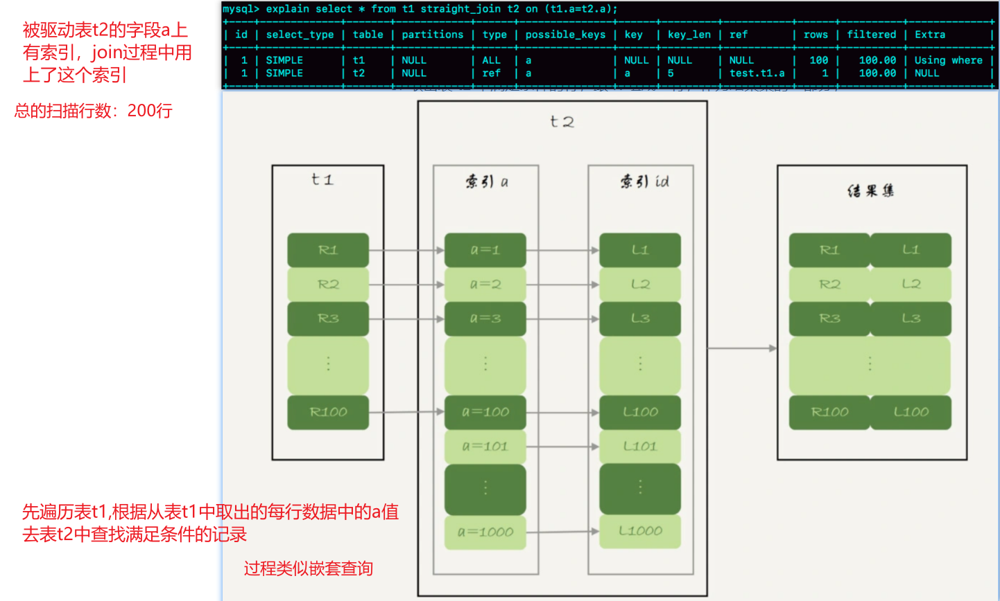

# Join

🔞本文讨论*表表关联* 在存储引擎层面是如何实现的，不讨论`left join`,`inner join`,`left semi join`等相关知识

#### 1、简单嵌套循环关联(Simple Nested-Loop Join)

t1 和 t2的表结构如下，其中t1中100条记录，t2中1000条记录。

```sql
create table `t2` (`id` int(11) not null,
                   `a`  int(11) default null,
                   `b`  int(11) default null
) engine = innodb
```

```sql
select * from t1 straight_join t2 on (t1.a=t2.a);
```

如果对于以上查询，执行的流程如下：

:one: 从表 t1 中读入一行数据 R；

:two: 从数据行 R 中，取出 a 字段到表 t2 里去查找；

:three: 取出表 t2 中满足条件(t2.a=t1.a)的行，跟 R 组成一行，作为结果集的一部分；

:four: 重复执行步骤 :one: :two: :three:，直到表 t1 的末尾，循环结束。

由于t2的字段`b`上没有索引，每次去t2匹配的时候，就需要做一个全表扫描，共扫描次数:$100,000 = 100\times1000$。若t1共N行，t2共M行，那么耗时的地方为：

* 扫描次数：$N\times M$。
* 比较次数：$N \times M$

🎈 *简单嵌套关联*是最简单，最基本的关联方式，直白的说就是2个循环嵌套，复杂度高，所以多数存储引擎都不会使用。

#### 2、块嵌套循环关联(Block Nested-Loop Join)

由于SNLJ(simple nested-loop join) 的性能问题，MySQL对其进行了一定的优化，流程如下：

:a: 把表 t1 的数据读入线程内存`join_buffer`中，由于我们这个语句中写的是 `select *`，因此是把整个表 t1 放入了内存

:b: 描表t2，把表 t2 中的每一行取出来，跟`join_buffer`中的数据做对比，满足`join(t1.a = t2.a`) 条件的，作为结果集的一部分返回

其中耗时的地方为：

* 扫描次数:$100+1000$ ; 
* 比较次数:$100 \times 1000$ 。

`join_buffer` 如果放不下驱动表t1，就需要分块(block)放置，过程如下：

1️⃣ 扫描表 t1，顺序读取数据行放入`join_buffer`中，若`join_buffer`满了，继续第:two:步；

2️⃣ 扫描表 t2，把t2中的每一行取出来，跟`join_buffer`中的数据对比，满足`join(t1.a = t2.a`)条件的，作为结果集的一部分返回；

3️⃣ 清空`join_buffer`；

4️⃣ 继续扫描表t1，顺序读取余下的记录放入`join_buffer`中，继续执行第:two:步。

 

耗时的地方为：

* 扫描次数： $N+ \lambda \times M$
* 比较次数：$N \times M$

> 比如这里 $\lambda$ 取值2，那么就表示驱动表要分两次才能放入 `join_buffer`，即$\lambda = ceiling(\frac{t1\_size}{join\_buffer\_size})$
>
> * 扫描次数：$N+ 2\times M$ :warning: 扫描过程是很消耗IO资源的
> * 比较次数：$N \times M$
>
> 直观上理解为：驱动表t1需要划分为多少份才能装进`join_buffer`内，可见驱动表通常是使用较小的表，因为驱动表越小，$\lambda$ 越小，扫描次数越小，效率越高。
>
> :tipping_hand_man: 为了使得更小的占用`join_buffer`应该使用过滤谓词，而且只选择必要字段
>
> :tipping_hand_woman: BNLJ在应对大表Join的时候性能很差

🎈可以发现BNLJ相对于SNLJ来说的优势是，BNLJ的优势是将驱动表分块放入内存中，批量的和被驱动表比对，而不需要像SNLJ那样一次次的从驱动表中获取数据。

#### 3、索引嵌套循环关联(Index Nested-Loop Join)

t1 和 t2的表结构如下，其中t1中100条记录，t2中1000条记录。

```sql
create table `t2` (`id` int(11) not null,
                   `a`  int(11) default null,
                   `b`  int(11) default null,
                   primary key (`id`),
                   key `a` (`a`)
) engine = innodb
```

```sql
select * from t1 straight_join t2 on (t1.a = t2.a);
```

如果对于以上查询，执行的流程如下：

:one: 从表 t1 中读入一行数据 R；

:two: 从数据行 R 中，取出 a 字段到表 t2 里去查找(**该查询过程会使用到t2表字段b上的索引**)；

:three: 取出表 t2 中满足条件(t2.a=t1.a)的行，跟 R 组成一行，作为结果集的一部分；

:four: 重复执行步骤 :one: :two: :three:，直到表 t1 的末尾，循环结束。

  


整个过程如上图。若t1共M行，t2共N行，那么耗时操作为：

* 扫描操作：$ N + N \times2\times\log_2^M $[^1]
* 比对操作：t2的二级索引树高度 + t2的主键索引树高度

> [^1]: N : 为t1表扫描次数；查询t2表使用`b`字段的索引,并且需要回表，因此是2倍的 $log_2^M$​

🎈 索引嵌套循环关联使用了索引，能够加速关联过程，是一个不错的选择。

#### 4、批量key值访问-索引嵌套循环关联(Batched Key Access)

Batched Key Accesss(BKA)算法，是对INLJ(Index Nested Loop Join) 算法的优化。INLJ的逻辑是，从驱动表`t1`，一行行取出a的值，再到被驱动表t2做`join`，对于表`t2`来说，每次都是匹配一个值，这样效率不高，回想BNLJ中我们将驱动表加载到`join_buffer`中，就能利用MRR[^2], 一起传给`t2`，从而达到匹配多个值的目标。

 

> [^2]:Multi-Range Read :多范围读  

##### 4.1-MRR(Multi-Range Read)

```sql
create table t1(id int primary key, a int, b int, index(a)); 
-- t1 插入1000行数据，每行的a = 1001-id，即表t1中的字段a是逆序的
create table t2 like t1;  -- 在表t2中插入 100w 数据
```

```sql
select * from t1 where a>=1 and a<=100;
```

如上查询中，涉及回表过程，*回表是一行行搜索主键索引的*。但是随着a的值递增顺序查询的话，id的值就变成随机的了，那么就会出现随机访问磁盘，性能相对较差。因为大多数的数据都是按照主键递增顺序插入的，所以我们可以认为，如果按照主键的递增顺序查询的话，对磁盘的读比较接近顺序读，能够提升读性能。所以MRR 优化的设计思路是这样的：

:one: 根据索引`a`，定位到满足条件的记录，将`id`值放入`read_rnd_buffer`中 ; (如果`read_rnd_buffer`放满了，就会先执行:two: :three: 步骤

:two: 将`read_rnd_buffer`中的`id`进行递增排序；

:three: 排序后的`id`数组，依次到主键`id`索引中查记录，并作为结果返回。


🎈MRR 提升性能的核心在于，查询语句在索引 `a` 上做的是一个范围查询(即多值查询)，可以得到足够多的主键 `id`。这样通过排序以后，再去主键索引查数据，才能体现出“顺序性”的优势。

------

#### x something 

🤣上面涉及的BNLJ、INLJ、BKA+MRR都是MySQL正在使用的Join方式。MySQL在国内应该是普及度最大的开源数据库，故这些内容非常值得了解。

😒索引的存在，不仅降低了查询latency，而且提升了关联的效率，但是维护索引也是有成本的，很多OLAP engine 中是没有索引这个概念的。

```sql
select * from t1 join t2 on (t1.b=t2.b) where t2.b>=1 and t2.b<=2000;
--b字段无索引
--t1 1000 记录； t2 1000,000记录
```

如上查询按照BNLJ来进行关联的话，取出`t1`所有字段放入`join_buffer` 中(:warning: 内存中结构是一个无序数组)，扫描`t2`时，需要取出每一行跟`join_buffer`(1000行只需要已个block)比对:

:a: `(t1.b=t2.b)` 不满足，跳过

:b: `(t1.b=t2.b)` 满足时，进一步判断`t2.b in [1,2000]`中，是放入结果集，否则跳过

其中:a:步骤的*是否相等*判断次数是 $1000 \times 1000,000 = 1000,000,000 $ 次，试想一下，如果在`join_buffer`维护的是哈希表的话，那么10亿次判断，不就是1000,000次hash查找了吗？这就说到了众多存储引擎使用的 *Hash Join* 就是这个思路。

#### 5、哈希关联(Hash Join )[^3]


[^3]: https://en.wikipedia.org/wiki/Hash_join

