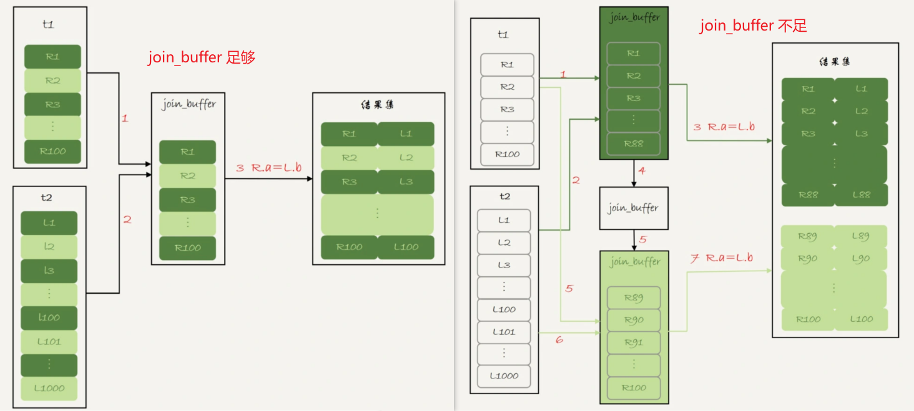

# Join

🔞You need to be at least 18 years to access this passage。

🔞本文讨论*表表关联* 在存储引擎层面是如何实现的，不讨论`left join`,`inner join`,`left semi join`等相关知识。

### 一、嵌套循环关联

嵌套循环关联原理上和双重`for` 循环非常类似，下面简述几种嵌套循环关联的关联算法。

#### 1.1、简单嵌套循环关联(Simple Nested-Loop Join)

t1 和 t2的表结构如下，其中t1中100条记录，t2中1000条记录。

```sql
create table `t2` (`id` int(11) not null,
                   `a`  int(11) default null,
                   `b`  int(11) default null
) engine = innodb
```

```sql
select * from t1 straight_join t2 on (t1.a=t2.a);
```

如果对于以上查询，执行的流程如下：

:one: 从表 t1 中读入一行数据 R；

:two: 从数据行 R 中，取出 a 字段到表 t2 里去查找；

:three: 取出表 t2 中满足条件(t2.a=t1.a)的行，跟 R 组成一行，作为结果集的一部分；

:four: 重复执行步骤 :one: :two: :three:，直到表 t1 的末尾，循环结束。

由于t2的字段`b`上没有索引，每次去t2匹配的时候，就需要做一个全表扫描，共扫描次数:$100,000 = 100\times1000$。若t1共N行，t2共M行，那么耗时的地方为：

* 扫描次数：$N\times M$。
* 比较次数：$N \times M$

🎈 *简单嵌套关联*是最简单，最基本的关联方式，直白的说就是2个循环嵌套，复杂度高，所以多数存储引擎都不会使用。

#### 1.2、块嵌套循环关联(Block Nested-Loop Join)

由于SNLJ(simple nested-loop join) 的性能问题，MySQL对其进行了一定的优化，流程如下：

:a: 把表 t1 的数据读入线程内存`join_buffer`中，由于我们这个语句中写的是 `select *`，因此是把整个表 t1 放入了内存

:b: 描表t2，把表 t2 中的每一行取出来，跟`join_buffer`中的数据做对比，满足`join(t1.a = t2.a`) 条件的，作为结果集的一部分返回

其中耗时的地方为：

* 扫描次数:$100+1000$ ; 
* 比较次数:$100 \times 1000$ 。

`join_buffer` 如果放不下驱动表t1，就需要分块(block)放置，过程如下：

1️⃣ 扫描表 t1，顺序读取数据行放入`join_buffer`中，若`join_buffer`满了，继续第:two:步；

2️⃣ 扫描表 t2，把t2中的每一行取出来，跟`join_buffer`中的数据对比，满足`join(t1.a = t2.a`)条件的，作为结果集的一部分返回；

3️⃣ 清空`join_buffer`；

4️⃣ 继续扫描表t1，顺序读取余下的记录放入`join_buffer`中，继续执行第:two:步。

 

耗时的地方为：

* 扫描次数： $N+ \lambda \times M$
* 比较次数：$N \times M$

> 比如这里 $\lambda$ 取值2，那么就表示驱动表要分两次才能放入 `join_buffer`，即$\lambda = ceiling(\frac{t1\_size}{join\_buffer\_size})$
>
> * 扫描次数：$N+ 2\times M$ :warning: 扫描过程是很消耗IO资源的
> * 比较次数：$N \times M$
>
> 直观上理解为：驱动表t1需要划分为多少份才能装进`join_buffer`内，可见驱动表通常是使用较小的表，因为驱动表越小，$\lambda$ 越小，扫描次数越小，效率越高。
>
> :tipping_hand_man: 为了使得更小的占用`join_buffer`应该使用过滤谓词，而且只选择必要字段
>
> :tipping_hand_woman: BNLJ在应对大表Join的时候性能很差

🎈可以发现BNLJ相对于SNLJ来说的优势是，BNLJ的优势是将驱动表分块放入内存中，批量的和被驱动表比对，而不需要像SNLJ那样一次次的从驱动表中获取数据。

#### 1.3、索引嵌套循环关联(Index Nested-Loop Join)

t1 和 t2的表结构如下，其中t1中100条记录，t2中1000条记录。

```sql
create table `t2` (`id` int(11) not null,
                   `a`  int(11) default null,
                   `b`  int(11) default null,
                   primary key (`id`),
                   key `a` (`a`)
) engine = innodb
```

```sql
select * from t1 straight_join t2 on (t1.a = t2.a);
```

如果对于以上查询，执行的流程如下：

:one: 从表 t1 中读入一行数据 R；

:two: 从数据行 R 中，取出 a 字段到表 t2 里去查找(**该查询过程会使用到t2表字段b上的索引**)；

:three: 取出表 t2 中满足条件(t2.a=t1.a)的行，跟 R 组成一行，作为结果集的一部分；

:four: 重复执行步骤 :one: :two: :three:，直到表 t1 的末尾，循环结束。

  


整个过程如上图。若t1共M行，t2共N行，那么耗时操作为：

* 扫描操作：$ N + N \times2\times\log_2^M $[^1]
* 比对操作：t2的二级索引树高度 + t2的主键索引树高度

> [^1]: N : 为t1表扫描次数；查询t2表使用`b`字段的索引,并且需要回表，因此是2倍的 $log_2^M$​

🎈 索引嵌套循环关联使用了索引，能够加速关联过程，是一个不错的选择。

#### 1.4、批量key值访问-索引嵌套循环关联(Batched Key Access)

Batched Key Accesss(BKA)算法，是对INLJ(Index Nested Loop Join) 算法的优化。INLJ的逻辑是，从驱动表`t1`，一行行取出a的值，再到被驱动表t2做`join`，对于表`t2`来说，每次都是匹配一个值，这样效率不高，回想BNLJ中我们将驱动表加载到`join_buffer`中，就能利用MRR[^2], 一起传给`t2`，从而达到匹配多个值的目标。

 

> [^2]:Multi-Range Read :多范围读  

##### 1.4.1-MRR(Multi-Range Read)

```sql
create table t1(id int primary key, a int, b int, index(a)); 
-- t1 插入1000行数据，每行的a = 1001-id，即表t1中的字段a是逆序的
create table t2 like t1;  -- 在表t2中插入 100w 数据
```

```sql
select * from t1 where a>=1 and a<=100;
```

如上查询中，涉及回表过程，*回表是一行行搜索主键索引的*。但是随着a的值递增顺序查询的话，id的值就变成随机的了，那么就会出现随机访问磁盘，性能相对较差。因为大多数的数据都是按照主键递增顺序插入的，所以我们可以认为，如果按照主键的递增顺序查询的话，对磁盘的读比较接近顺序读，能够提升读性能。所以MRR 优化的设计思路是这样的：

:one: 根据索引`a`，定位到满足条件的记录，将`id`值放入`read_rnd_buffer`中 ; (如果`read_rnd_buffer`放满了，就会先执行:two: :three: 步骤

:two: 将`read_rnd_buffer`中的`id`进行递增排序；

:three: 排序后的`id`数组，依次到主键`id`索引中查记录，并作为结果返回。


🎈MRR 提升性能的核心在于，查询语句在索引 `a` 上做的是一个范围查询(即多值查询)，可以得到足够多的主键 `id`。这样通过排序以后，再去主键索引查数据，才能体现出“顺序性”的优势。

------

### 二、something have to say

🤣上面涉及的BNLJ、INLJ、BKA+MRR都是MySQL正在使用的Join方式。MySQL在国内应该是普及度最大的开源数据库，故这些内容非常值得了解。

😒索引的存在，不仅降低了查询latency，而且提升了关联的效率，但是维护索引也是有成本的，很多OLAP engine 中是没有索引这个概念的。

```sql
select * from t1 join t2 on (t1.b=t2.b) where t2.b>=1 and t2.b<=2000;
--b字段无索引
--t1 1000 记录； t2 1000,000记录
```

如上查询按照BNLJ来进行关联的话，取出`t1`所有字段放入`join_buffer` 中(:warning: 内存中结构是一个无序数组)，扫描`t2`时，需要取出每一行跟`join_buffer`(1000行只需要已个block)比对:

:a: `(t1.b=t2.b)` 不满足，跳过

:b: `(t1.b=t2.b)` 满足时，进一步判断`t2.b in [1,2000]`中，是放入结果集，否则跳过

其中:a:步骤的*是否相等*判断次数是 $1000 \times 1000,000 = 1000,000,000 $ 次，试想一下，如果在`join_buffer`维护的是哈希表的话，那么10亿次判断，不就是1000,000次hash查找了吗？这就说到了众多存储引擎使用的 *Hash Join* 就是这个思路的实现。

### 三、哈希关联(Hash Join )[^3][^4][^5]

哈希关联算是一个比较古老的概念，诞生于上世纪80年代，那时候关系型数据库也只是发展了十几年。有三种常见的Hash Join有三种，分别是:one: `Classic Hash Join`、:two:`Grace Hash Join`、:three: `Hybrid GRACE Hash Join` 

哈希关联有2个特征：

:a: 至少1个等值关联谓词；:warning: 重要特征

:b: 分为2个阶段，

* 第:one:阶段叫做**build phase(构建阶段)** , 基于驱动表R构建内存哈希表
* 第:two:阶段叫做 **probe phase(探测阶段)**，

#### 3.1、经典/简单哈希关联(classic/simple hash join)

经典哈希关联是最古老哈希关联算法，该算法要求驱动表(小表[^6])，并且*要求驱动表R构建的哈希表能够放入到内存*中，其过程如下：

:one: 构建阶段：根据驱动表R的关联键构建内存哈希表，其中key为关联键，value为当前行

:two: 探测阶段：扫描被驱动表S的每一行，然后根据关联键在(构建阶段形成的)哈希表中查找，若匹配放入到结果集，否则继续下一行，直到S的最后一行。

:three: 若内存无法容纳基于R构建的Hash表，发生类似于BNLJ的切块过程[#2、块嵌套循环关联(Block Nested-Loop Join)]

> [^6]: 小表的衡量标准并不是记录数，而是Bytes数

举个来自于MySQL官网的:chestnut:

```sql
select given_name, country_name
from  persons join countries 
on persons.country_id = countries.country_id;
```

如上查询的构建阶段和探测阶段图示如下：


🎈 Simple Hash Join的问题是如果驱动表构建的哈希表大于内存大小，则会发生哈希表分块过程，那么扫描被驱动表S的次数就从一次增长为$N = ceiling(\frac{hashTableSize}{memerySize})$次，优化这个过程的方式使用Grace Hash Join

#### 3.2、优雅哈希关联(Grace Hash Join)

“优雅”哈希关联，是我自己翻译的，Grace有优雅、恩惠的意思，至于为什么叫做"Grace Hash Join" 应该是因GRACE Database第一次实现了这种算法而得名，维基百科上的说法是：

> after the GRACE database machine for which it was first implemented

其过程如下；

:one: 扫描驱动表R，并使用 A Hash函数对关联键partition(partition的大小应该趋近于内存大小)，每个partition刷写到磁盘

:two: 被驱动表S，执行和步骤:one:相同的操作，:warning: 使用相同的hash函数

:three: 

* :a: 构建阶段：将R的分区 r~x~  加载到内存中并构建Hash表:warning: 不同于步骤:one::two: 的hash函数 

* :b: 探测阶段：对S的分区 s~x~[^7]  扫描，在r~x~ 形成的Hash表中查找，若找到放入结果集，否则下一行知道分区最后一行

:four: 重复执行步骤:three:，直到R和S的最后一个分区

> [^7]: 注意这里使用的都是 x,表示的是R和S的分区是相对应的，因为使用相同的hash函数，分区之后的分区/桶编号是一一对应

上述过程的图示如下:


#### 3.3、混合哈希关联(Hybrid Hash Join) 

从*混合*2字就可以看出，不难guess混合哈希关联是将经典哈希关联和优雅哈希关联想结合进行使用，其过程如下:

:one: 扫描驱动表R，并使用 A Hash函数对关联键partition(partition的大小趋近于内存大小)，加载内存基于B Hash函数**构建**哈希表

:two: 对于被驱动表S，使用A Hash函数partition,并对每个分区进行**探测**，直到最后一个分区

🎈可见混合哈希关联相较于优雅哈希关联的精髓是:a: **不落盘**，:b:是一个边分区，边构建探测的过程。如此就降低了IO消耗。

### 四、归并关联(Merge Join)

归并关联也称为排序归并关联(sort-merge-join)，同样的要求等值谓词，即等值关联或自然关联，也有2个阶段：

:a: 排序阶段：通过关联键对R和S排序；:warning: 由于索引的存在关联键可能已经是有序的

:b: 合并阶段：扫描已经排好序的R和S，输出关联键匹配的记录

其中过程:b:的细节是比较复杂的，具体看下图中的伪代码和例子


> `mark` 每个连续值块的起始值，初始化为null；
>
> `r` 、`s` 分别是R和S的当前指针位置，初始值指向记录头
>
> `advance r` 表示指针向前移动一位
>
> 建议按照图中的例子把伪代码逻辑人肉执行一遍，可以获的更深入的理解。该图来自油管教学视频截图[^9]，视频的质量堪称上乘而且是每次的Speaker都是不同的大叔，加之Berkeley的标签我猜想应该是来自于加州大学伯克利分校的计算机科学教研组，有兴趣的同学可以开启刷剧mode。
>
> 细心的读者可以发现该过程在思想上和归并排序是一致的，只是coding的细节有不同的地方。

### 五、分布式场景下的关联

上面谈及到的关联算法都是基于单节点下关联算法，大规模数据场景下的关联就不能采取上述的关联算法了，毕竟对于数据密集型应用必然和分布式紧密相关，下面我们介绍一些分布式计算引擎(MapReduce、Tez、Spark-SQL)在做关联的时候使用到的一些算法，下面我们重点说一下Spark-SQL 的三种关联算法[^10]，分别是广播哈希关联，洗牌哈希关联，排序排序关联，三种关联方式都依赖于单节点下的关联算法，所以理解前面文章提及的算法是理解分布式场景下关联算法的必要条件。另外你得理解shuffle[^11]的过程

> [^11]:shuffle : 洗牌，在MapReduce中对的shuffle定义是`map`之后，`reduce`方法之前，简述来说就是按照key排序，然后相同key聚到一块，由于不同node/partition 的相同key要聚到一块，过程非常类似于洗牌，因此叫做shuffle。

#### 5.1-广播哈希关联(Broadcast Hash Join)[^12]

卓越的工程师起的名字必然都是见名识意的，广播哈希关联算法，对于一个没有了解该算法的人应该也能知道就是shuffle + hash join的玩法，该关联算法适用于事实表和维度[^13]表关联的场景，有2个要求:one:`spark.sql.autoBroadcastJoinThreshold `限定小表的size，:two: 等值关联但不是`full join` ，该算法2个阶段如下：

:a: 广播阶段：将维度(小)表广播到每个 excutor

:b: Hash Join 阶段：在每个executor上执行hash join(构建阶段 + 探测阶段) => Grace/Hybrid Hash Join过程


整个过程如上图所示，其中 10~1~ 表示10来自DataFrame1，30~2~表示来自DataFrame2；2个分区，2个task，1个stage(没有shuffle)。

```sql
val data1 = Seq(10, 20, 20, 30, 40, 10, 40, 20, 20, 20, 20, 50)
val data2 = Seq(30, 20, 40, 50)
```

> [^13]: 事实表和维度表是维度模型中的概念，不了解的伙伴可以将事实表看成是大表；维度表是小表

#### 5.2-洗牌哈希关联(Shuffle Hash Join)[^14]

洗牌哈希关联同样遵循见名识意的规律，直白来说就是shuffle + hash join ，同样地2个条件:one: 等值连接；:two:无数据倾斜[^16] ，洗牌哈希关联划分了2个阶段：

:a: shuffle阶段：对所有表进行shuffle，shuffle之后所有表相同key的记录会去往同一个partition

:b: Hash Join阶段： 在每个executor上执行Join(构建阶段 + 探测阶段) => Grace/Hybrid Hash Join过程

上述:a::b:过程具体的图示如下：


> [^16]:data skew : 这里特指在shuffle中由于其中部分key对应的记录数过多，导致key分布的不均衡 

#### 5.3-洗牌排序归并关联(shuffle Sort Merge Join)[^15]

从该关联算法的名字行推断，洗牌排序归并算法分为2/3个阶段：

:a: Shuffle 阶段：对所有的表R、S进行shuffle

:b: sort-merge-join 阶段

* :one:Sort 阶段：对shuffle之后的结果按照`key`排序
* :two: 归并阶段：遍历R、S，输出关联键匹配的记录


上图展示了shuffle阶段和sort阶段，具体的最后的merge细节，可回看 sort-merge-join。

### 八、something have to speak

至此，我们不深不浅的剖析了在SQL/计算引擎层面不同的关联算法，目前最综合实力最强的当属混合哈希关联和归并哈希关联，最菜最傻白甜的是简单嵌套循环关联，BKA理解起来有些费劲也是MySQL8以前对关联的优化策略，但是MySQL8之后，开始支持哈希关联了。对关联算法来说，你可以有两个角度去分类，:a:单机场景下关联算法和:b:分布式场景下的关联算法；按照效率去分，:one:嵌套类；:two:哈希类；:three: 排序类。

现如今一般而言无论是OLTP引擎还是OLTP引擎都已经支持哈希关联了/排序归并关联，毕竟coder们对高效都是一定的执念的。 

💕以上就是isea_you关于关联算法的一些学习、思考及启发，欢迎reader们吐槽。

😒曾经有几份爱情摆在我的面前，我没有好好珍惜，直到做了程序员才后悔莫及

----

**references:**

[^3]: hash wiki 地址 https://en.wikipedia.org/wiki/Hash_join

[^4]: hive confluence https://cwiki.apache.org/confluence/display/Hive/Hybrid+Hybrid+Grace+Hash+Join%2C+v1.0
[^5]: MySQL Blog Archive https://dev.mysql.com/blog-archive/hash-join-in-mysql-8/
[^9]: sort merge join video : https://www.youtube.com/watch?v=jiWCPJtDE2c
[^10]: 分布式场景下的join 参考 https://www.linkedin.com/pulse/spark-sql-3-common-joins-explained-ram-ghadiyaram
[^12]:spark-broadcast-hash-join 参考： https://www.hadoopinrealworld.com/how-does-broadcast-hash-join-work-in-spark/
[^14]: spark-shuffle-hash-join 参考: https://www.hadoopinrealworld.com/how-does-shuffle-hash-join-work-in-spark/
[^15]: spark-shuffle-sort-merge-join参考： https://www.hadoopinrealworld.com/how-does-shuffle-sort-merge-join-work-in-spark/
[^8]: consecutive 连续的