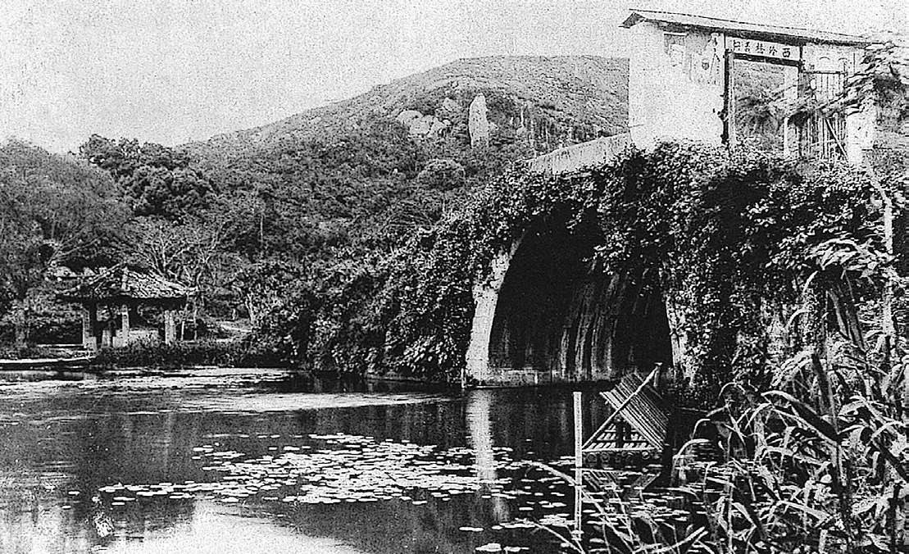

# 杭州西湖

西湖，也叫西子湖，是杭州的第一明信片，也是浙江的第一明信片，主要得益于历代文人墨客的推动，最大的推动者就是唐代的白居易~白提~和北宋苏轼~苏堤~，

游西湖必游，西湖十景，“西湖十景”最初是南宋画院的题名山水画，南宋的首都不是临安~今杭州~，实际上西湖远不止十景

苏堤春晓、曲院荷风、平湖秋月、断桥残雪、柳浪闻莺、花港观鱼、雷峰夕照、两峰插云、南屏晚钟、三潭印月

南屏山视角下的老西湖

上帝视角下的西湖

* 🚗 **凤起路**下车 

* **北山街**~经过蒋经国旧居~
* **白堤**
* **01-断桥残雪**
* **02-平湖秋月**
* **孤山路/孤山后路** 民国建筑，清行宫遗址
* **秋谨墓**
* **西冷桥**
* **苏小小之墓** 如果不上苏堤，可以去看岳飞墓
* **03-苏堤春晓**
* **04-曲院风荷**
* **05-三潭印月**
* **06-花港观鱼**
* **07-南屏晚钟** 南山路
* **08-雷锋夕照**
* **09-柳浪闻莺**
* **湖滨银泰**

## 白堤

唐代~长庆三年（822）~，白居易任杭州刺史~相当于现在的省长或者市长~时，主持疏浚西湖，白居易描写的“乱花渐欲迷人眼，浅草才能没马蹄”的画面了，1922年，公共汽车亮相杭州，然后土路就变成柏油路了，日本占领杭州后，将白堤两边改种樱花，抗战胜利后，时任浙江省民政厅厅长阮毅成决定将堤上樱花全部拔去，然后在白堤上改种桃柳，一桃一柳，相间成行，一般而言，白堤上的人是最多的

1911年白堤

## 01-断桥残雪

西湖大致是个圆，位于白堤一端的断桥是这个圆的起点，“断桥残雪”讲的是西湖的冬景，是“断桥残雪”和“雷峰夕照”，都因了白蛇与许仙的爱情故事而闻名。桥，是故事的起点，两人在此相识~因此西湖最出名的桥就是断桥，许嵩有一首很出名的歌曲也是这个名字~；塔，是故事的终结，白娘子被镇于塔下

断桥残雪

## 02-平湖秋月

位置在白堤西侧，临近外湖，是西湖观月的最佳地点，地处西湖中心

## 秋谨墓

秋谨~家在湖南，牺牲于绍兴，葬于杭州西湖~，1966年8月，西湖边掀起了一场“破四旧”清坟运动，西湖边所有的墓葬都被清理，秋瑾墓被清理，，杭州园林局职工陈而扬记录了新墓地的位置，1980年的初秋，人们在那棵柏树下找到秋瑾的遗骨，第三次，将她请回到西泠桥畔

## 西冷桥

西泠桥是连接北岸与孤山的唯一通道

西冷桥旧址1

西冷桥旧址2

## 苏小小墓

西泠桥边埋着两个名女人，一是侠女秋瑾，一是南齐名伎苏小小

一代名妓，其中《[西湖拾遗](https://zh.wikipedia.org/w/index.php?title=西湖拾遗&action=edit&redlink=1)》小说中，在该故事中，苏小小为了追求自由，宁愿做一个青楼女子，途经钱塘的[观察使](https://zh.wikipedia.org/wiki/觀察使)孟浪对她非常痴迷，但却遭到了苏小小的拒绝。而后苏小小又慧眼识才，资助穷书生鲍仁进京赶考。她因偶得风寒，年纪轻轻就香消玉殒。死后，鲍仁将其隆重下葬，埋于杭州西湖西泠桥侧

苏小小墓

## 03-苏堤春晓

苏堤，原名苏公堤，是苏轼来杭州~第2次来杭州~出任知州~相当于杭州市的市长~的时候，当时为了治理西湖，将湖底的淤泥筑堤形成苏堤，

堤西是小南湖、西里湖、岳湖，东侧是西湖，南屏山山麓至北山，贯穿了整个西湖，长度约不到3公里~2797米~ ，中间有六座石拱桥

## 04-曲院风荷

南宋时就有了曲院风荷，但是后来湖西由于大量淤泥无人修缮，形成了农田和沼泽，清代重新进行了修缮，康熙南游的时候重新题词

曲院风荷旧址

## 05-三潭印月

西湖中心有*三岛* ，三潭印月~小瀛洲~、湖心亭和阮公墩，其中三潭印月主要由两大景点组成，

:a: 小瀛洲~也就是三潭印月本身~

:b: 三潭印月的三座石塔

## 06-花港观鱼

清朝皇帝题字，可以看到鱼字是个有意为之的错别字~三点表示水，四点表示火，希望鱼永远快乐的生活在水里~，康熙题的字，乾隆也来过这里

清代花港观鱼旧址

## 07-南屏晚钟

地址位于雷锋塔不远处

## 08-雷锋夕照

和雷峰没有关系，关押白娘子的地方

1924年9月的一个下午，它倒了

## 09-柳浪闻莺

描写的是西湖的春景，今天柳浪闻莺的位置是南宋的时候，皇家御花园所在地

## 10-双峰插云

北高峰和南高峰~并不是最高的山~，可以看到西湖是三面环山，一面临城，原来山上各有一座塔，因此称作是双峰插云~其实是雾气~

