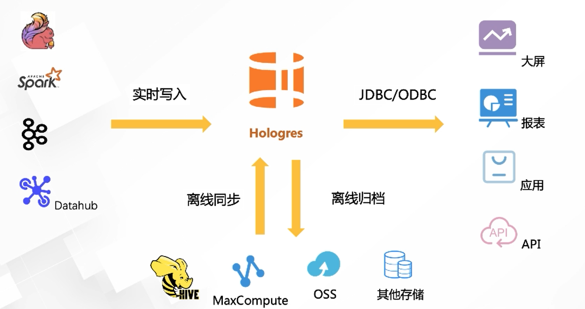
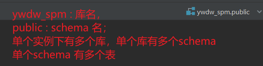
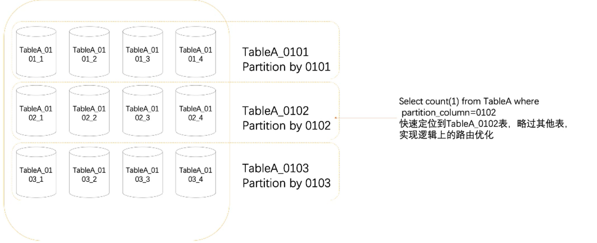
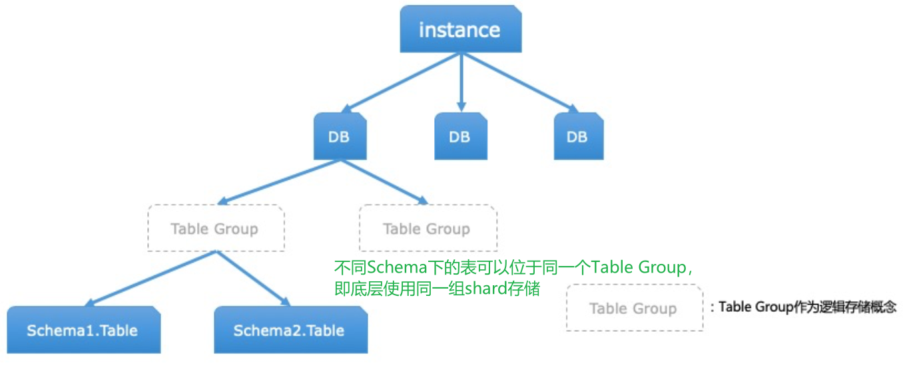
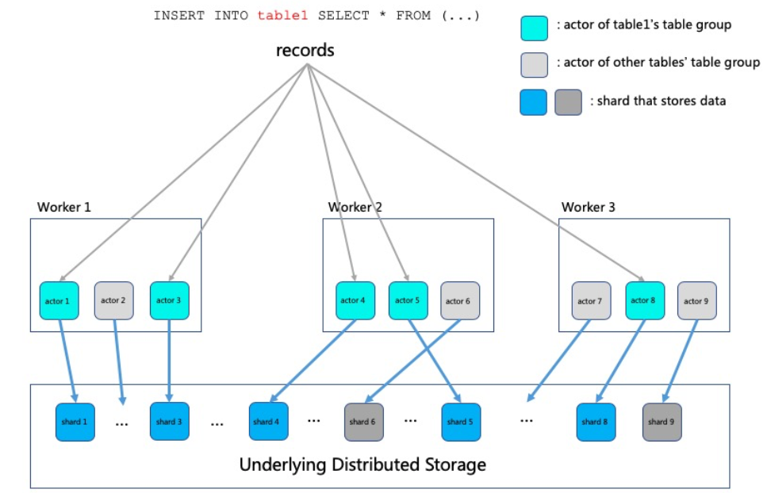

# Hologres

> 什么是RAM：Resource Access Management，是阿里云提供的资源访问控制服务。通过 RAM，您可以集中管理您的用户（比如员工、系统或应用程序），以及控制用户可以访问您名下哪些资源的权限。

### hologres 生态



:one:  将实时数据写入到hologres

:two: 将离线的数据同步到hologres，或者将hologres的数据归档到离线存储中

:three: 直接基于JDBC推出报表

hologres的设计初衷：**分析服务一体化**

我们可以用标准的PostgreSQL语句查询分析MaxCompute中的海量数据。 需要熟悉 Postgres 的语法特点。

## Hologres 相关的背景

* 阿里云中Hologres 的计算资源单位 CU （1CU = 1core 4 GB)


## Hologres + FlinkSQL数据类型

常用数据类型对应

| Hologres字段类型 (括号中为别名)                              | Flink字段类型           |
| :----------------------------------------------------------- | :---------------------- |
| INT (INT 、INT4)                                             | INT                     |
| INT[]                                                        | ARRAY<INT>              |
| BIGINT (INT8)                                                | BIGINT                  |
| BIGINT[]                                                     | ARRAY<BIGINT>           |
| REAL                                                         | FLOAT                   |
| REAL[]                                                       | ARRAY<REAL>             |
| DOUBLE PRECISION (FLOAT8)                                    | DOUBLE                  |
| DOUBLE PRECISION[]                                           | ARRAY<DOUBLE PRECISION> |
| BOOLEAN (BOOL)                                               | BOOLEAN                 |
| BOOLEAN[]                                                    | ARRAY<BOOLEAN>          |
| TEXT (VARCHAR)                                               | VARCHAR                 |
| TEXT[]                                                       | ARRAY<TEXT>             |
| NUMERIC (DECIMAL)                                            | DECIMAL                 |
| DATE  {如：2004-10-19}                                       | DATE                    |
| TIMESTAMP WITH TIMEZONE (TIMESTAMPTZ）<br />{2004-10-19 10:23:54+02} <br />**如果没有给定时区，系统自动给数据添加时区** | TIMESTAMP               |

下面是详细的类型

* [Hologres数据类型汇总](https://help.aliyun.com/document_detail/130398.htm?spm=a2c4g.11186623.0.0.13881018inOE9W#concept-1597919)

* [Hologres 和 Flink 的数据类型匹配](https://help.aliyun.com/document_detail/178795.html)

在[Flink](阿里云工作台)中数据字段如果是空，查询展示为 **null **。

## Hologres 相关概念

  **关于 实例 - 库 - schema 之间的关系**

```sql
-- 切换schema 到dim
set search_path to dim;

-- 不能删除系统默认创建的命名为public的Schema
```


### hologres建表语句

```sql
begin;
create table [if not exists] [schema_name.]table_name ([
  {
   column_name column_type [column_constraints, [...]]
   | table_constraints
   [, ...]
  }
]);

call set_table_property('<table_name>', property, value);
commit;
```

* 其中行约束支持：**主键约束** ：

  * primary key  支持多列 ： **唯一且非空的列或者列组合** , 行存表及行列共存表必须有主键，列存表可以没有主键

  * not null

  * null

  * default

  * unique  & check 不支持   🧡 ： 唯一约束和 检查约束不支
* 不支持修改数据类型，如果必须修改，请重新建表。
* 与数据存储布局有关的参数必须和建表语句同时执行，其中以下几个属性创建后当前版本不支持修改

  * orientation、
* distribution_key、
  * clustering_key、-> [目测这个字段更多的是为了行存表的优化](官方文档中列存表的clustering_key为空，且行存表的时候clustering_key 列 查询时遵循坐匹配原则)
* event_time_column

[hologre 中 DDL语法及各个表属性的介绍](https://help.aliyun.com/document_detail/160754.html)

### Hologres 行存&列存

##### hologres 行存

* 按主键进行高QPS的查询
* 一次读取大量的列
* Blink|Flink 维表采用行存

##### hologress 列存

* 复杂的关联
* 过滤场景复杂
* 覆盖的场景多，更为通用

### 内部表&外部表

##### 内部表

数据存储在hologres中

##### 外部表

数据不存储在hologres中，只是通过hologres进行映射，在hologres中创建外部表，可以加速查询外部数据源的数据，例如查询MaxCompute的数据

### 分区表

分区表是物理表，具备shard 能力，但是多了一个分区键进行 table [pruning](剪裁)



💛：如果单日分区数据小于1亿条，不建议使用分区表。

不同于其他组件中描述的分区（如Kafka、Kudu的分区） ，父表按分区键（Partition Key）的值划分为不同的子表，先创建子表，后创建父表。


### table group

所谓table group 是Hologres特有的一个存储逻辑概念，创建 table时，[负责存储table数据的一组shard]( 这一组shard 的逻辑概念就是table group)就被分配好了，数据被写入hologres时会按照 **distribution key** 被sharding 到具体的 shard中。

##### table group 和 scheme 的关系



##### hologres 底层存储和计算原理示意图

* hologres 为计算存储分离架构，数据存储在分布式存上，计算在worker上
* 每个hologres 计算worker 都有若干个 actor 对应真实存储数据的 shard 负责shard 的数据的读取、写入、管理
* actor和shard 一一对应，所以table group 既可以说是 一组actor的组合，也可以是说shard的组合



* 默认的Table Group ，hologres 实例的每个DB都会创建一个默认的Table Group，在DB的第一表被创建的，如果没有指定 表所在的Table Group 信息，hologres会自动创建一个默认的 Table group **{DBname}_tg_default**.

* shart count ，一个Table Group 拥有的shard的数量，在创建 Table Group 的时候指定，后续无法更改。建议的shard count 和 CPU的数量相对应[设置为cpu数量的60% 左右](官方建议) ，**集群扩容的时候，最好同时修改shard count**

  ```sql
  -- 查询某表的shard count数
  select property_value
  form hologress.hg_table_propreties
  where table_naem = '${table_name}'
  and property_key = 'table_group'; -- tpch_tg_default
  
  -- 去查询该TG 的shard count 数量
  select propperty_value
  from hologres.hg_table_propreties
  where tablegroup_name = 'tpch_tg_default'
  and property_key = 'shard_count'
  
  ```

  

##### distribution_key

```sql 
call set_table_property('table_name', 'distribution_key', '[columnName[,...]]');
```

当前这个表属性指定了数据库 表分布策略，前面提到过，数据会按照 distribution_key sharding 到具体的 shard上，系统会保证 distribution_key 一致的值会分配到同一个shard上。

* 在没有设置distribution_key （或者distribution key 如果是空）的时候，数据会尽可能均匀**random**的分到各个shard

* 如果存在primary key , 没有指定distribution key 列时候，默认primary key 列为 distribution key

* distribution key 需要是 primary key 的子集

* 设置 distribution key 的优势在于，对于一些**join**的场景，A表和B表的关联的 key 都是 distribution key的情况下，就可以减少数据的**shuffle**，直接做 **local join**，（AB表在一个[TG](Table Group)下）

   🧡 ： 非 local join 和 local join 之间的性能差别可能是数量级上的。

* distribution key 设置多列的时候需要和查询一一对应，否则无法准确命中shard

* 建议： 关联键作为distribution key, 聚合（group by）字段作为 distribution key ,

具体详细的distribution key 描述见[阿里云Hologres SQL - DDL](https://help.aliyun.com/document_detail/160754.html?spm=5176.21213303.J_6704733920.13.6f183edaCq0jjo&scm=20140722.S_help%40%40%E6%96%87%E6%A1%A3%40%40160754.S_hot%2Bos0.ID_160754-RL_distribution%20key-OR_helpmain-V_2-P0_1)

#### hologres 中各个key


