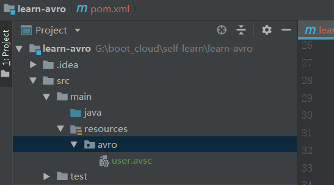
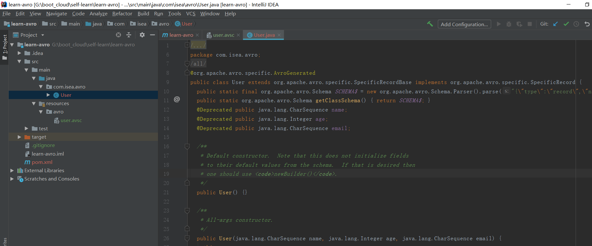

# Avro

[Avro学习地址](<https://www.iteye.com/blog/shift-alt-ctrl-2217425>)

> Apache Avro™ is a data serialization system.

**我们把变量从内存中变成可存储或传输的过程称之为序列化，序列化之后，就可以把序列化后的内容写入磁盘，或者通过网络传输到别的机器上。反过来，把变量内容从序列化的对象重新读到内存里称之为反序列化**

Avro是Apache的顶级项目。Avro提供了RPC机制，可以不需要生成额外的API代码即可使用Avro来存储数据和RPC交互，“代码生成”是可选的，这一点区别于`protobuf`和`thrift`(也是数据序列化框架)。此外Hadoop平台上的多个项目正在使用（或者支持）Avro作为数据序列化的服务。

Avro尽管提供了RPC机制，事实上Avro的核心特性决定了它通常用在“大数据”存储场景（`MapReduce`），即我们通过借助schema将数据写入到“本地文件”或者HDFS中，然后Reader再根据**`schema`**去迭代获取数据条目。它的schema可以有限度的变更、调整，而且Avro能够巧妙的兼容，这种强大的可扩展性正是“文件数据”存储所必须的。

Avro是基于schema（模式），这和`protobuf、thrift`没什么区别，在schema文件中（**`.avsc`**文件）中声明数据类型或者protocol（RPC接口），那么Avro在read、write时将依据schema对数据进行序列化。因为有了schema，那么Avro的读、写操作将可以使用不同的平台语言。Avro的schema是JSON格式，所以编写起来也非常简单、可读性很好。目前Avro所能支持的平台语言并不是很多，其中包括JAVA、C++、Python。

当Avro将数据写入文件时，将会把schema连同实际数据一同存储，此后Reader将可以根据这个schema处理数据，如果reader使用了不同的schema，那么Avro也提供了一些兼容机制来解决这个问题。

在RPC中使用Avro，Client和server端将会在传输数据之前，首先通过handshake交换Schema，并在Schema一致性上达成统一。

## java和avro的例子

配置schema(user.avsc)：

~~~json
{"namespace": "com.isea.avro",
  "type": "record",
  "name": "User",
  "fields": [
    {"name": "name", "type": "string"},
    {"name": "age",  "type": ["int", "null"]},
    {"name": "email", "type": ["string", "null"]}
  ]
}
~~~

添加依赖

~~~xml
<!--avro和avro-tools两个依赖包，是avro开发的必备的基础包。 -->
<dependency>
    <groupId>org.apache.avro</groupId>
    <artifactId>avro</artifactId>
    <version>1.7.7</version>
</dependency>

<dependency>
    <groupId>org.apache.avro</groupId>
    <artifactId>avro-tools</artifactId>
    <version>1.7.7</version>
</dependency>
~~~

如果你的项目需要让maven来根据.avsc文件生成java代码的话，还需要增加如下avro-maven-plugin依赖，否则此处是不需要的。

~~~xml
<plugins>
    <plugin>
        <groupId>org.apache.avro</groupId>
        <artifactId>avro-maven-plugin</artifactId>
        <version>1.7.7</version>
        <executions>
            <execution>
                <phase>generate-sources</phase>
                <goals>
                    <goal>schema</goal>
                </goals>
                <configuration>
                    <sourceDirectory>${project.basedir}/src/main/resources/avro/</sourceDirectory>
                    <outputDirectory>${project.basedir}/src/main/java/</outputDirectory>
                </configuration>
            </execution>
        </executions>
    </plugin>
    <plugin>
        <groupId>org.apache.maven.plugins</groupId>
        <artifactId>maven-compiler-plugin</artifactId>
        <configuration>
            <source>1.8</source>
            <target>1.8</target>
        </configuration>
    </plugin>
</plugins>
~~~

项目的目录结构：

**基于代码生成进行序列化和反序列化**，  这种方式是比较常见的，即根据Avro schema生成JAVA代码，然后根据JAVA API来进行数据操作。如果你在pom.xml配置了avro-maven-plugin插件，那么只需要只需要执行：

~~~shell
maven compile
~~~

执行成功之后，可以查看到代码的生成：

代码很简单，描述了将User通过avro schema写入文件，我们可以通过二进制文本编辑器查看这个结果文件，会发现文件的开头部分是schema，后续是逐个user序列化的二进制结果。我们在稍后介绍encoding format，你会知道文件的数据结构。在reader迭代读取数据时，“_current”对象不能在while循环之外的其他地方使用，这样是不安全的。

**原理：**代码生成时，User的Schema信息已经作为一个静态常量写入了User.java中，同时根据schema中fields的列表严格顺序，显式的生成Fields数组，数组的index为schema中filed的声明的位置，比如name字段为0，age为1，email为2。这个严格有序性，保证了writer按照field的顺序依次编码，同时reader也按照此顺序依次解码；这也意味着开发工程者不能随意更改filed在Schema中的顺序，这个特性和protobuf、thrift都一样。

在writer写入实际数据之前，首先把schema作为header写入文件，这个header将作为Avro数据文件的合法性校验提供帮助，如果reader和writer使用的schema无法兼容（通过此Header校验），将导致数据文件无法读取；当user对象被写入文件时，将会依次遍历user的每个filed，并根据filed的数据类型对值进行encoder，然后将bytes写入通道，编码由BinaryEncoder来实现，具体format稍后详解。

 在创建reader时会指定Schema，这个Schema称为“expected”，那么writer写入文件中还有一个Schema，这个称为“actual”，那么在reader读取数据时，究竟哪个生效呢？如果“expected”没有指定，那么将使用“actual”，否则最终的Schema将会是这两个Schema互相兼容的结果：Avro约定，Filed顺序不能更改，即相应的index上Filed的Type必须兼容（一致，或者兼容，比如long兼容int），如果对应index上的Filed名称不同，那么它们应该可以通过“别名”（aliase）互相兼容，即filed的name可以不一样，但是允许使用aliase来声明它的曾用名。

那么在迭代时（next方法）也需要传递一个“_current”对象，如果_current与“expected”的Schema不一样（==）,即它们的Class类型不同，如果_current为"expected"的父类，则使用_current类型，否则尝试根据其实际的class类型与expected，通过反射机制的方式构建一个实例。next方法的迭代过程，将根据上述“兼容”后的Schema，使用BinaryDecoder逐个解析Filed。

 由此可见，保持Avro Schema的设计严谨性是非常重要的，这可以避免解析过程带来的困惑。如果Schema有了巨大的变化，我们通常将数据写入新的文件，并更新解析器的API。（而不是将它们混淆在一起）

