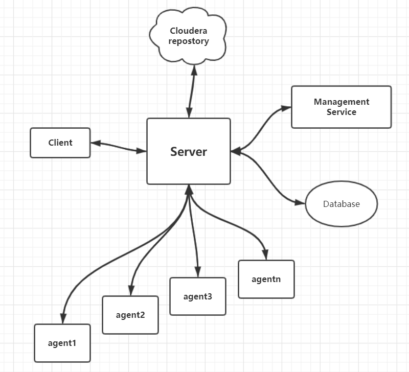

# CDH

在官网上有这么一句话：

> CDH is Cloudera’s 100% open source platform distribution, including Apache Hadoop and built specifically to meet enterprise demands. 
>
> CDH delivers everything you need for enterprise use right out of the box.  By integrating Hadoop with more than a dozen other critical open source projects, Cloudera has created a functionally advanced system that helps you perform end-to-end Big Data workflows.

Hadoop有三大版本：

* Apache ：学习的时候使用
* CDH：企业使用，最大的优点是解决了框架和框架之间的兼容性，如果使用Apache的话，需要自己去解决这个兼容性的问题
* `HotWorks` ：文档写的好

# CM（`cloudera manager`）

## 是什么？

在官网上有这么的一句话：

> Cloudera Manager is the industry’s trusted tool for managing Hadoop in production.
>
> Cloudera Manager — making Hadoop easy

集群自动化安装，中心化管理，集群监控，报警功能的一个工具（软件）,使得安装集群从几天的时间缩短在几个小时内，

* 管理：对集群进行管理，如添加、删除节点等操作。
* 监控：监控集群的健康情况，对设置的各种指标和系统运行情况进行全面监控。
* 诊断：对集群出现的问题进行诊断，对出现的问题给出建议解决方案。
* 集成：多组件进行整合。

## CM架构

* Server：负责软件安装、配置，启动和停止服务，管理服务运行的群集。

* Agent：安装在每台主机上。负责启动和停止的过程，配置，监控主机。

* Management Service：由一组执行各种监控，警报和报告功能角色的服务，图表即为该组件生成。

* Database：存储配置和监视信息，通常使用mysql。

* Cloudera Repository：软件由Cloudera 管理分布存储库。（有点类似Maven的中心仓库）

* Clients：是用于与服务器进行交互的接口（API和Admin Console）

在虚拟机上尝试安装CM的时候，如果内存是16G，分配原则是 10 ，2，2，windows主机2g。在机器上安装CDH的时候，原来的机器上最好不要安装Hadoop，hive等，因为非常容易产生jar冲突。在安装CM的时候，需要使用root用户来安装。

## CM的安装

这里假设在Hadoop105,106,107上尝试安装CM；

* 内存分配：105的配置10G，剩余各两G。

* 在三个节点上都需要安装JDK，并配置环境变量
* 在105上安装MySQL，配置对应的用户权限
* 三个节点上都需要关闭，`selinux`，方法为： `/etc/selinux/config` 中设置 **`SELINUX=disabled`** 重启之后生效

* 三个节点之间配置免密登录
* 下载第三方的依赖：

~~~shell
yum -y install chkconfig python bind-utils psmisc libxslt zlib sqlite cyrus-sasl-plain cyrus-sasl-gssapi fuse fuse-libs redhat-lsb
~~~

以上留个步骤为必须的步骤。

具体的安装步骤，详见：CM的安装文档。

### 启动和关闭

在安装好了之后，就可以启动了：

* 启动服务节点：105

~~~shell
/opt/module/cloudera-manager/cm-5.12.1/etc/init.d/cloudera-scm-server start
~~~

* 启动工作节点：105,106 ，107

~~~shell
/opt/module/cloudera-manager/cm-5.12.1/etc/init.d/cloudera-scm-agent start
~~~

启动的过程是比较慢的：

查看是否启动成功了：

~~~shell
netstat -anp | grep 7180
tcp        0      0 0.0.0.0:7180                0.0.0.0:*                   LISTEN   5498/java
~~~

访问<http://hadoop105:7180>，（用户名admin、密码：admin）

* 关闭服务

~~~shell
/opt/module/cloudera-manager/cm-5.12.1/etc/init.d/cloudera-scm-server stop
~~~

* 关闭工作节点，三个

~~~shell
/opt/module/cloudera-manager/cm-5.12.1/etc/init.d/cloudera-scm-agent stop
~~~

在能够成功访问了CM的客户端之后，最好指定离线库，这个离线库就是我们事先已经准备好的CDH，注意版本的选择。我们这里使用的CDH的版本是**5.12.1**

访问CM客户端的情形如下：

