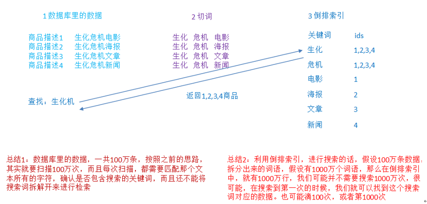
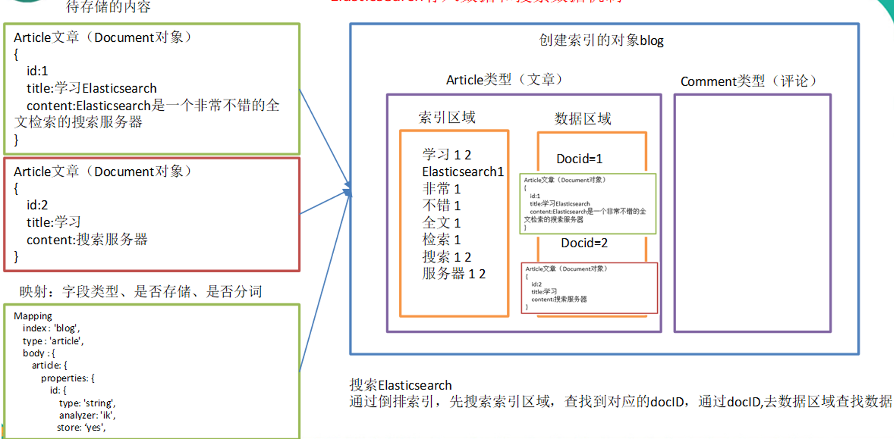
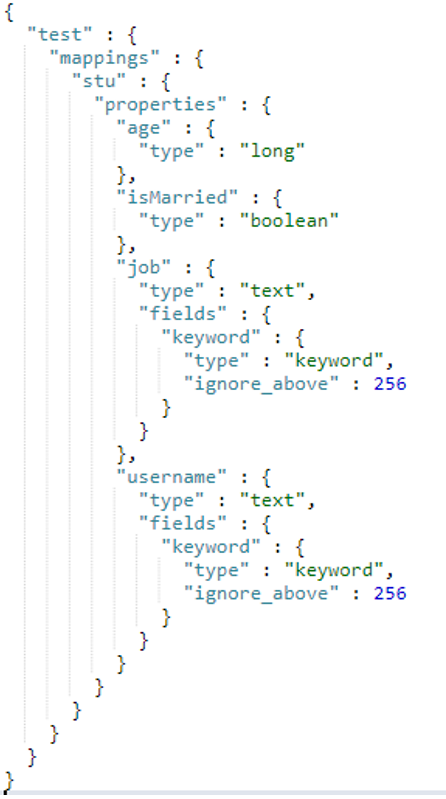
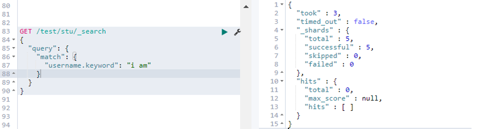

# `Elasticsearch`

## 倒排索引和搜索引擎

搜索引擎要做的两件事情是：爬取网页，和 索引的构建；

什么是全文检索？

指的是计算机索引程序通过扫描文章中的每一个词，对每一个词建立一个索引，指明该词在文章中出现的**次数和位置**，当用户查询的时候，检索程序就根据事先建立的索引进行查找，并将查找的结果返回给用户的检索方式。

`Lucene`是什么？`lucene`，就是一个jar包，里面包含了封装好的各种建立倒排索引，以及进行搜索的代码，包括各种算法。我们就用java开发的时候，引入`lucene jar`，然后基于`lucene`的`api`进行去进行开发就可以了。

## `Elasticsearch `

是一个实时分布式搜索和分析引擎，它用于全文搜索，结构化搜索，分析。下面介绍关于`Elasticsearch` 的数据模型的概念：

### `Elasticsearch `的数据模型

#### Index：（索引对应数据库）

索引包含一堆有相似结构的文档数据，比如可以有一个客户索引，商品分类索引，订单索引。商品索引里面存放的是所有的商品数据，所有的商品document。

#### Type（类型对应表）

每个索引里都可以有一个或者是多个type，type是index中的一个逻辑数据分类，一个type下的document，都有相同的field（只要是字段相同，就相当于是在一张表中，一个type中，如果不在里面，就说明是另外的一张表）。比如商品索引里很多的type，日化商品type，电器商品type，生鲜商品type

#### Field（字段-列）

Field是`Elasticsearch`的最小单位，一个document里面有多个field，每个field就是一个数据字段。

| Type 名      | Field字段名                                                  |
| ------------ | ------------------------------------------------------------ |
| 日化商品type | product_id，product_name，`product_desc`，category_id，category_name |
| 电器商品type | product_id，product_name，`product_desc`，category_id，category_name，service_period |
| 生鲜商品type | product_id，product_name，`product_desc`，category_id，category_name，eat_period |

#### Document（文档相当于行）

每一个type里面都有一堆的document：

~~~json
# 第一个文档
{
  "product_id": "1",
  "product_name": "长虹电视机",
  "product_desc": "4k高清",
  "category_id": "3",
  "category_name": "电器",
  "service_period": "1年"
}

# 第二个文档
{
  "product_id": "2",
  "product_name": "基围虾",
  "product_desc": "纯天然，冰岛产",
  "category_id": "4",
  "category_name": "生鲜",
  "eat_period": "7天"
}
~~~

文档是`es`中最小的数据单元，一个document可以是一条客户数据，一条商品分类数据，一条订单数据，通常使用JSON数据结构来表示。每一个index下的type都可以存储多个document。

#### Mapping（映射相当于约束） 

数据如何存放到索引对象上，需要一个映射配置，包括：数据类型，是否存储，是否分词（数据是否作为一个整体，还是拆分开来）：

~~~json
client.indices.putMapping({
    index : 'blog',
    type : 'article',
    body : {
        article: {
            properties: {
                id: {
                    type: 'string',
                    analyzer: 'ik',
                    store: 'yes',
                },
                title: {
                    type: 'string',
                    analyzer: 'ik',
                    store: 'no',
                },
                content: {
                    type: 'string',
                    analyzer: 'ik',
                    store: 'yes',
                }
            }
        }
    }
});

~~~

### `ElasticSearch`和数据库的比较。

| 关系型数据库（比如MySQL） | 非关系型数据库（Elasticsearch） |
| ------------------------- | ------------------------------- |
| 数据库Database            | 索引Index                       |
| 表Table                   | 类型Type                        |
| 数据行Row                 | 文档Document                    |
| 数据列Column              | 字段Field                       |
| 约束 Schema               | 映射Mapping                     |

### `Elasticsearch`存入数据和搜索数据机制

Text类型的值，会存储两种类型：text是支持分词的（默认的分词器是按照空格来分词的），但是keyword是不支持分词的。

下面是使用`Elasticsearch`的案例：

使用username_keyword的时候，是不支持分词的。

