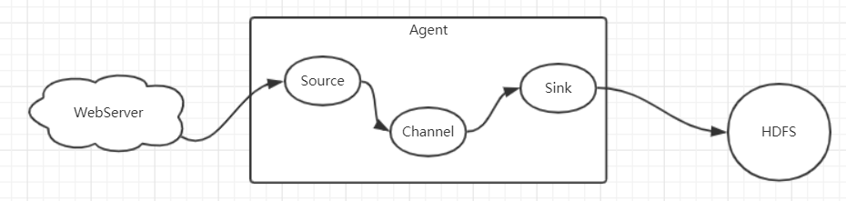
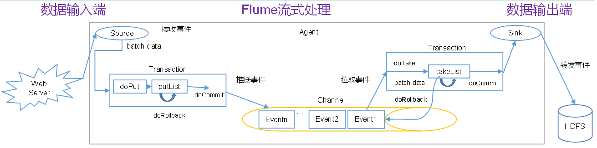
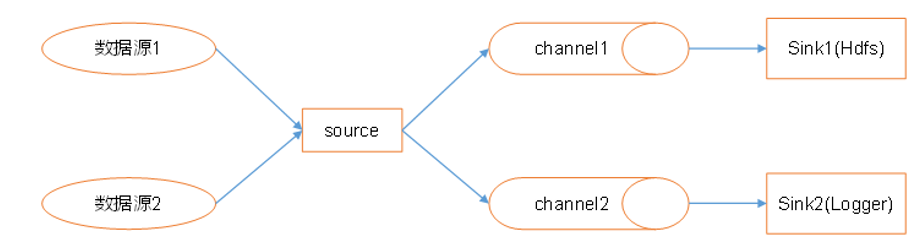

# Flume

## 是什么

Cloudera公司提供的分布式，高可靠，海量日志采集，聚合传输系统，主要的作用就是实时读取服务器磁盘的数据，将数据写入HDFS。

## Flume的架构

Flume的组成：

1）Agent是一个JVM进程，他以事件的形式，将数据从源头送到目的地，由上面的三个部分组成

2）Source是负责将数据接收到Flume的Agent的组件，支持多种数据格式：`avro、thrift、`、jms、**`exec , spooling directory`**、netcat、sequence generator、syslog、http、legacy`

3）Channel是位于Source和Sink之间的缓冲区。因此，Channel允许Source和Sink运作在不同的速率上。Channel是线程安全的，可以同时处理几个Source的写入操作和几个Sink的读取操作。Flume自带两种Channel：Memory Channel和File Channel。

* Memory Channel是内存中的队列。Memory Channel在不需要关心数据丢失的情景下适用。如果需要关心数据丢失，那么Memory Channel就不应该使用，因为程序死亡、机器宕机或者重启都会导致数据丢失。

* File Channel，将所有事件写到磁盘，因此在程序关闭或机器宕机的情况下不会丢失数据。

4）Sink不断地轮询Channel中的事件且批量地移除它们，并将这些事件批量写入到存储或索引系统、或者被发送到另一个Flume Agent。Sink是完全事务性的。在从Channel批量删除数据之前，每个Sink用Channel启动一个事务。批量事件一旦成功写出到存储系统或下一个Flume Agent，Sink就利用Channel提交事务。事务一旦被提交，该Channel从自己的内部缓冲区删除事件。Sink组件目的地包括hdfs、logger、avro、thrift、ipc、file、null、HBase、solr、自定义。

传输单元，Flume数据传输的基本单元，以事件的形式将数据从源头送至目的地。  Event由可选的header和载有数据的一个byte array 构成。Header是容纳了key-value字符串对的HashMap。

## 怎么玩？

如何启动flume：

~~~shell
bin/flume-ng agent -c conf/ -n a1 –f job/flume-netcat-logger.conf -Dflume.root.logger=INFO,console

# 对应的各个参数的信息：
--conf conf/   #：表示配置文件存储在conf/目录
--name a1	   # ：表示给agent起名为a1
--conf-file  job/flume-netcat.conf   # ：flume本次启动读取的配置文件是在job文件夹下的flume-telnet.conf文件。
-Dflume.root.logger==INFO,console  # ：-D表示flume运行时动态修改flume.root.logger参数属性值，并将控制台日志打印级别设置为INFO级别。日志级别包括:log、info、warn、error。

# 启动之后会有一个Application的进程
~~~

### Channel选择器：

Flume中channel的数据是完整的数据，如果一个channel对应了多个sink，那么每个sink只是channel中的部分数据，但是分流的时候往往不这么做，通常的做法是会使用一个拦截器，将event拦截下来，然后打上特定的标签，然后再使用channel选择器将分往不同的channel，在进入channel之前就完成数据的分流，而不是使用sink。

Channel selector 可以让不同的项目日志通过不同的Channel到不同的sink中去，有两种Channel选择器：

* Replicating Channel Selector ：会将source过来的events发往所有的**Channel**
* Multiplexing Channel Selector ：可以选择（是否匹配上）应该发往哪些**Channel**

### Flume的项目经验

#### Source

:one:Taildir Source相比Exec Source、Spooling Directory Source的优势

* TailDir Source：断点续传、多目录。Flume1.6以前需要自己自定义Source记录每次读取文件位置，实现断点续传。(所谓的断点续传指的就是记录每次读取文件的位置，下次在读的时候，可以从该处读取数据)

* Exec Source可以实时搜集数据，但是在Flume不运行或者Shell命令出错的情况下，数据将会丢失。这样的方式相当于我们使用linux命令：`tail -f filename` 一旦shell出错，数据将会丢失。

* Spooling Directory Source监控目录，不支持断点续传。如果挂掉的话，会导致数据的重复

#### batchSize大小如何设置？

Event 1K左右时，500-1000合适（默认为100）

#### Channel

采用Kafka Channel，省去了Sink，提高了效率。也即如果下一级是Kafka的话，直接使用了就OK。

在Flume中可以做轻微的数据清洗工作，譬如说判断数据的完整性（大括号开头，大括号结尾的Json数据格式）下面介绍一个Flume的配置文件，如何写，这里使用的是数据仓库中使用的配置文件：

##### 配置文件案例1

~~~properties
# 组件的定义
a1.sources=r1
a1.channels=c1 c2

# configure source
a1.sources.r1.type = TAILDIR
# source的类型
a1.sources.r1.positionFile = /opt/module/flume-1.7.0/test/log_position.json
# 记录日志读取的位置
a1.sources.r1.filegroups = f1
a1.sources.r1.filegroups.f1 = /tmp/logs/app.+
# 读取日志的位置

a1.sources.r1.fileHeader = true
a1.sources.r1.channels = c1 c2

#interceptor 拦截器
a1.sources.r1.interceptors =  i1 i2
a1.sources.r1.interceptors.i1.type = com.isea.flume.interceptor.LogETLInterceptor$Builder
a1.sources.r1.interceptors.i2.type = com.isea.flume.interceptor.LogTypeInterceptor$Builder

# 选择器，multiplexing 选择性的发送到channel，默认是replicating
a1.sources.r1.selector.type = multiplexing
a1.sources.r1.selector.header = topic
a1.sources.r1.selector.mapping.topic_start = c1
a1.sources.r1.selector.mapping.topic_event = c2

# configure channel
a1.channels.c1.type = org.apache.flume.channel.kafka.KafkaChannel
a1.channels.c1.kafka.bootstrap.servers = hadoop104:9092,hadoop105:9092,hadoop106:9092
# 该主题kafka会自动创建
a1.channels.c1.kafka.topic = topic_start
a1.channels.c1.parseAsFlumeEvent = false
# 发送到kafka的时候，不在event的前面拼接主题名
a1.channels.c1.kafka.consumer.group.id = flume-consumer

a1.channels.c2.type = org.apache.flume.channel.kafka.KafkaChannel
a1.channels.c2.kafka.bootstrap.servers = hadoop104:9092,hadoop105:9092,hadoop106:9092
a1.channels.c2.kafka.topic = topic_event
a1.channels.c2.parseAsFlumeEvent = false
a1.channels.c2.kafka.consumer.group.id = flume-consumer
~~~

##### 配置文件案例2

~~~properties
## 组件
a1.sources=r1 r2
a1.channels=c1 c2
a1.sinks=k1 k2

## source1
a1.sources.r1.type = org.apache.flume.source.kafka.KafkaSource
a1.sources.r1.batchSize = 5000
a1.sources.r1.batchDurationMillis = 2000
a1.sources.r1.kafka.bootstrap.servers = hadoop104:9092,hadoop105:9092,hadoop106:9092
a1.sources.r1.kafka.topics=topic_start

## source2
a1.sources.r2.type = org.apache.flume.source.kafka.KafkaSource
a1.sources.r2.batchSize = 5000
a1.sources.r2.batchDurationMillis = 2000
a1.sources.r2.kafka.bootstrap.servers = hadoop104:9092,hadoop105:9092,hadoop106:9092
a1.sources.r2.kafka.topics=topic_event

## channel1
a1.channels.c1.type = file
a1.channels.c1.checkpointDir = /opt/module/flume-1.7.0/checkpoint/behavior1
a1.channels.c1.dataDirs = /opt/module/flume-1.7.0/data/behavior1/
a1.channels.c1.maxFileSize = 2146435071
a1.channels.c1.capacity = 1000000
a1.channels.c1.keep-alive = 6

## channel2
a1.channels.c2.type = file
a1.channels.c2.checkpointDir = /opt/module/flume-1.7.0/checkpoint/behavior2
a1.channels.c2.dataDirs = /opt/module/flume-1.7.0/data/behavior2/
a1.channels.c2.maxFileSize = 2146435071
a1.channels.c2.capacity = 1000000
a1.channels.c2.keep-alive = 6

## sink1
a1.sinks.k1.type = hdfs
a1.sinks.k1.hdfs.path = /origin_data/gmall/log/topic_start/%Y-%m-%d
a1.sinks.k1.hdfs.filePrefix = logstart-
a1.sinks.k1.hdfs.round = true
a1.sinks.k1.hdfs.roundValue = 10
a1.sinks.k1.hdfs.roundUnit = second

##sink2
a1.sinks.k2.type = hdfs
a1.sinks.k2.hdfs.path = /origin_data/gmall/log/topic_event/%Y-%m-%d
a1.sinks.k2.hdfs.filePrefix = logevent-
a1.sinks.k2.hdfs.round = true
a1.sinks.k2.hdfs.roundValue = 10
a1.sinks.k2.hdfs.roundUnit = second

## 不要产生大量小文件，在企业开发中设置为1小时，或者是128M，满足其一即可将tmp文件滚动生成文件
a1.sinks.k1.hdfs.rollInterval = 10
a1.sinks.k1.hdfs.rollSize = 134217728
a1.sinks.k1.hdfs.rollCount = 0

a1.sinks.k2.hdfs.rollInterval = 10
a1.sinks.k2.hdfs.rollSize = 134217728
a1.sinks.k2.hdfs.rollCount = 0

## 控制输出文件是原生文件。
a1.sinks.k1.hdfs.fileType = CompressedStream 
a1.sinks.k2.hdfs.fileType = CompressedStream 

a1.sinks.k1.hdfs.codeC = lzop
a1.sinks.k2.hdfs.codeC = lzop

## 拼装
a1.sources.r1.channels = c1
a1.sinks.k1.channel= c1

a1.sources.r2.channels = c2
a1.sinks.k2.channel= c2
~~~

启动flume：

~~~shell
nohup /opt/module/flume-1.7.0/bin/flume-ng agent --conf-file /opt/module/flume-1.7.0/jobs/kafka-flume-hdfs.conf --name a1 -Dflume.root.logger=INFO,LOGFILE >/opt/module/flume-1.7.0/log.txt   2>&1 &
~~~

flume在消费Kafka的数据的时候，两者之间是相互通信的，要先启动Kafka，Flume才能拿到数据，Flume如果没有联系到Kafka会产生异常。

### Flume的内存优化

