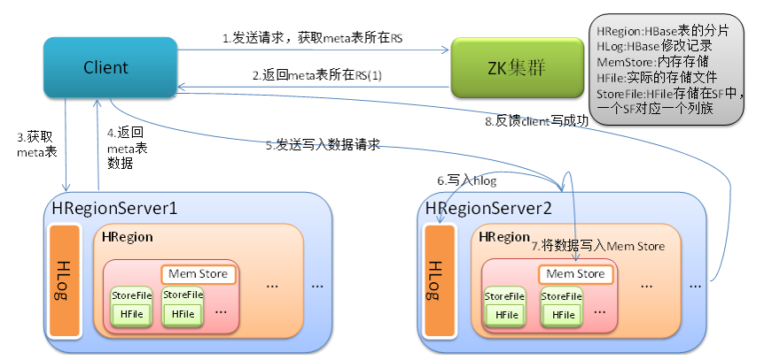

# HBase

[参考资料](<https://blog.csdn.net/qq_31807385/article/details/84994267>)

HBase的原型是Google的BigTable，可**以支持结构化的数据存储**。HBase是一个高可靠，高性能，**面向列**，可伸缩的分布式存储系统，利用**HBase可以实现在廉价PC上搭建大规模结构化存储集群**。在HBASE中使用zookeeper实现HMaster的高可用，google的大表使用的是Chubby。

 面向列存储指的是面向列簇存储，HBase根据列簇来存储数据，列簇下面可以指定很多的列，列簇在建立表的时候，就必须指定。 MySQL数据库是面向行存储的，取数据的时候，也是按照行来存储的。

HBase的优点（为什么不使用MySQL集群而是使用，HBase存储）：因为HBase有若干的优点，

* 海量存储，适合存储PB级别的数据，并且基于廉价的机器，能够在几十毫秒内相应数据；
* 稀疏性，HBASE面向列族进行数据的存储，如果列的数据为空，不会占用存储空间；
* 易扩展，基于HDFS，还可以横向扩展RegionServer
* 高并发 

MySQL的宽表优化：表中的数据越多，查询的效率就会越慢，因为MySQL在进行查询的时候，每次都要查询所有的字段，所以如果表很宽的话，就会影响查询的速率。所以在设计表的时候，需要把两张表拆分成一张表，来提升查询效率。

MySQL宽表的优化：如果数非常的深，查询的效率也会收到影响，高表的优化策略是水平拆分，分成两个部分，在插入和查询数据的时候，使用分区的策略，如下图：

由于大数据要处理的数据量非常的大，所以HBase在设计之初，就考虑到了高表和宽表拆分问题，另外为了提高效率，HBase会将写操作放置在缓存中，对于新产生的安全性的问题，又产生了log日志，最后HBase的设计模型大约是下面的这个样子：

## HBASE架构

**Region是HBase表的分片，**HBase表会根据RowKey的值被切分成不同的region，存储在RegionServer中，在一个RegionServer中可以有多个不同的region。Store，HFile存储在Store中，**一个store对应着Hbase表中的一个列族**。一个region中可以有多个store。Memstore：内存存储，用来保存当前的数据操作所以当数据存储在WAL中之后，RegionServer会在内存中存储键值对。

Write-Ahead logs：HBase的修改记录，当对HBase读写数据的时候，数据不是直接写进磁盘，它会在内存中一段时间，但是由于这样可能会导致数据丢失，**数据会先写在这个文件中，然后在写入内存。也叫HLog。**StoreFile是原始数据的实际的物理文件，是实际的存储文件，StoreFile是以Hfile的形式存储在HDFS上的。Hfile是一种文件格式，类似TXT。

### Client

Client包含了访问HBase的接口，还维护了对应的cache来加速对HBase的访问。

### Zookeeper

* HBase通过zookeeper来做Master的高可用，保证集群中只有一个Master在运行，如果Master异常，会通过竞争机制产生新的Master

* 通过zookeeper来监控RegionServer的状态，当RegionServer有异常的时候，通过回调的形式通知Master RegionServer上下线的信息
* 通过zookeeper存储元数据的统一入口地址。

### Master

* 为RegionServer分配Region

* 维护整个集群的负载均衡
* 维护集群的元数据信息
* 发现失效的Region，并将失效的Region分配到正常的RegionServer上。
* RegionServer失效的时候，协调对应的HLog的拆分

### RegionServer

RegionServer直接对接用户的读写请求，是真正干活的节点。

* 管理Master为其分配的Region

* 处理来自客户端的读写请求

* 负责和底层HDFS的交互，将数据存储到HDFS上

* 负责Region变大之后的拆分

* 负责Storefile的合并工作。

## HBase的数据结构

### RowKey

数据按照Rowkey的字段序在HBase表中排序存储。可以是任意字符串。实际常用的是60-100字节。

### ColumnFamily

列族：HBase表中的每个列，都归属于某个列族，列族是表的一部分。

### Cell

Rowkey，column Family，column，version。确定唯一的单元。Cell中的数据是没有类型的。

cell的数据存储格式是字节码。

### TimeStamp

Rowkey，列族，列名，版本确定唯一的单元，在单元中，都保存一份数据的额多个版本。版本的信息就是时间戳来确定的。最新的数据排列在最前面。HBase常用的命令，scan扫描表，put添加数据，get获取数据，delete删除数据，还有超级强大的help

## HBase的原理

### HBase读流程

------

* client先访问zookeeper，获取meta表所在的region的位置，然后读取meta表中的数据。

* 根据namespace，表名，rowkey在meta表中找到对应的region的信息

* 找到region对应的RegionServer，并找到对应的region

* 先从Memstore找数据，如果没有，在到BlockCache里面读

* BlockCache还没有读到，再到storeFile上读数据，如果在StoreFile中读到了数据，并不是直接返回给客户端，而是先写入到BlockCache，在返回给客户端。

以上client就获取了数据在哪台个RegionServer的哪个Region里面，获取到该数据阿按照下面的步骤：

* 读取MemStore（写缓存）

* 读取BlockCache(读缓存)

* 读取HFile(真正的数据文件)

* 将查询结果放置到BlockCache当中

* 将结果返回给客户

### HBase写流程

* client向RegionServer发送写请求 
* RegionServer将数据写到HLog（write ahead log）为了数据的持久化和恢复
* RegionServer将数据写到内存。

### 数据刷写

当满足一定的条件的时候，RegionServer会将数据刷写到磁盘，将内存中的数据删除，同时删除HLog中的历史数据。并将数据存储到HDFS中。在HLog中做标记点。

### 数据合并

数据的合并，在数据刷写的过程中，会产生很多的文件，当数据块到达了3块，master即会触发合并操作，region将数据加载到本地，进行小文件的合并。当数据合并的容量超过了256M的话，要将数据进行拆分。拆分后的Region分配给不同的RegionServer进行管理，当RegionServer宕机之后，还会将RegionServer上的hlog，然后分配给不同的RegionServer进行管理。**合并和拆分和master有关，数据的读写和mater没有关联**

合并的小文件只能同一个列族的，也即只能合并同一个store的。如果列族设置的过多的话，就会有多个Memstore，一旦触发了region的内存的最大设置的话，会一起刷写到磁盘，从而产生多个小文件，而这些小文件从属于不同的列族，他门并不会合并。

当合并的数据超过一定的大小，还要进行拆分，将拆分后的region分配给不同的RegionServer

### HBase的优化

#### 高可用

Master负责监控RegionServer的生命周期，均衡RegionServer的负载，如果master挂掉了，那么整个集群将进入不健康的状态。在HBase的conf目录下的的backup-masters中添加备用的master节点。

#### 预分区

每一个region都维护这startRow和endRow，如果加入的数据符合某个region维护的rowkey的范围，则将该数据交给该region维护。按照这个原则，我们可以将所要放置的分区，提前规划好，以提高HBase的性能。

#### Rowkey的设计

一条数据唯一的标识就是rowkey，那么这条数据存储到哪个分区，取决于rowkey处于哪个分区的区间，设计rowkey的主要目的就是为了让数据均匀的分布于所有的region，防止数据倾斜。 

设计原则：

* 唯一性原则：rowkey就是关系型数据库中的主键

* 长度原则：64k，推荐10-100byte，一般是60-80字节，一般是8的倍数，在满足查询的条件下，越短越好。

* 散列原则：希望将rowkey所代表的数据均匀的分布到不同的分区中。盐值散列，一般放置在rowkey的前面或者使用字符串翻转或者添加分区号。

