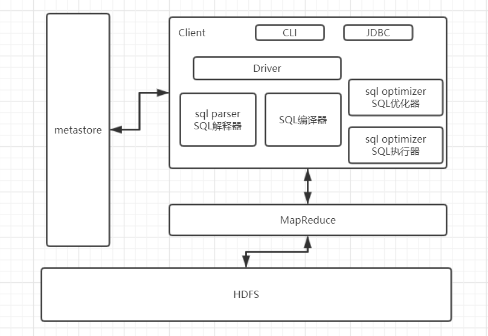
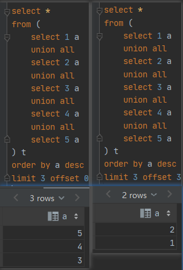
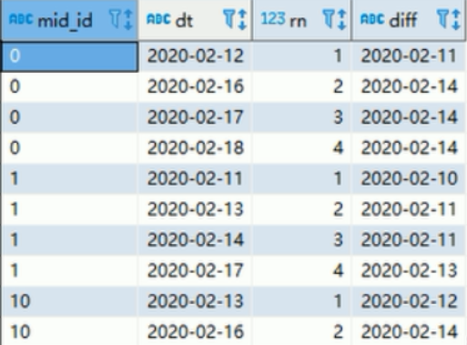
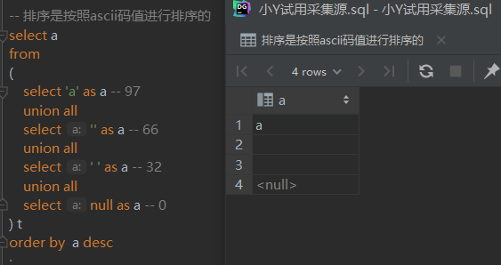

Hive 

## hive的架构



* metastrore是存储元数据的数据库，默认使用的是derby，可以更改为***MySQL***，元数据指的是将结构化数据映射成一张表的**表名，表所属的数据库（默认为default），表的拥有者，表的列，分区字段，表的类型（是否为外部表），表所在的目录**等

用户通过hive的客户端向hive发送SQL语句，hive收到SQL语句之后，会结合SQL语句和元数据信息生成MapReduce程序，最后提交到Yarn上执行，并将MapReduce执行的结果返回给客户端。

## 

Hive只是和数据库在SQL语句上有着类似之处，only。

group by 之后，才会进行开窗


## 系统函数

### collect_set函数

在Hive中还有一个函数，collect_list函数，该函数不去重。

~~~SQL
--1）创建原数据表
drop table if exists stud;
create table stud (name string, area string, course string, score int);
--2）向原数据表中插入数据

insert into table stud values('zhang3','bj','math',88);
insert into table stud values('li4','bj','math',99);
insert into table stud values('wang5','sh','chinese',92);
insert into table stud values('zhao6','sh','chinese',54);
insert into table stud values('tian7','bj','chinese',91);

--3）查询表中数据
hive (gmall)> select * from stud;
stud.name       stud.area       stud.course     stud.score
zhang3 bj      math    88
li4     bj      math    99
wang5   sh      chinese 92
zhao6   sh      chinese 54
tian7   bj      chinese 91
--4）把同一分组的不同行的数据聚合成一个集合 
hive (gmall)> select course, collect_set(area), avg(score) from stud group by course;
chinese ["sh","bj"]     79.0
math    ["bj"]  93.5
--5） 用下标可以取某一个
hive (gmall)> select course, collect_set(area)[0], avg(score) from stud group by course;
chinese sh      79.0
math    bj      93.5
~~~

### 日期函数

#### date_format函数（根据格式整理日期）

~~~SQL
hive (gmall)> select date_format('2019-02-10','yyyy-MM');
2019-02
~~~


#### date_add函数（加减日期）

~~~SQL
select date_add('2019-02-10',-1);
2019-02-09

select date_add('2019-02-10',1);
2019-02-11
~~~

#### next_day函数  

~~~SQL
--（1）取当前天的下一个周一
hive (gmall)> select next_day('2019-02-12','MO')
2019-02-18
--说明：星期一到星期日的英文（Monday，Tuesday、Wednesday、Thursday、Friday、Saturday、Sunday）

--（2）取当前周的周一   
hive (gmall)> select date_add(next_day('2019-02-12','MO'),-7);
2019-02-11
hive (gmall)> select date_add(next_day('2019-06-09','mo'),-1);
2019-06-09
--计算本周周日，通常用下周一减一，避免直接使用next_day(‘sunday’,’su’),如果今天是周日，会产生错误
~~~

#### 4）last_day函数（求当月最后一天日期）

~~~SQL
hive (gmall)> select last_day('2019-02-10');
2019-02-28
~~~

#### 5） 时区问题

```sql
-- 将北京时间转为巴西时间
select from_utc_timestamp(to_utc_timestamp("2021-05-09 22:14:30",'GMT+8'),"GMT-3")
-- 2021-05-09 11:14:30.0

select date_format(from_utc_timestamp(to_utc_timestamp("2021-05-09 22:14:30",'GMT+8'),"GMT-3"),'yyyy-MM-dd HH:mm:ss')
-- 2021-05-09 11:14:30
```


在Hive中需要掌握的函数：

add_months

ceil

ceiling

collect_list

collect_set

concat

concat_ws

date_add

date_format

day

dayofmonth

explode

get_json_object

~~~SQL
0	0	11|9|10	1.3.0|1.1.4|1.1.7|1.3.8	pt|en|es	H|C|F|S	8.2.0|8.1.3|8.0.0	MX    sumsung-19|HTC-11|sumsung-3|sumsung-9	Sumsung|HTC	V2.5.1|V2.9.6|V2.3.2|V2.2.4	N26O1Q7A@gmail.com|7CG3GN13@gmail.com|7X71PS36@gmail.com|H9982FEV@gmail.com	640*1136|750*1134|1080*1920	1567819394278|1549706258369|1549636125769|1549721035899	3G|4G|WIFI	-53.3|-92.3|-55.8|-77.9	-41.0|-8.1|22.2|21.3	2019-02-10
~~~

### 求上个月的方法：如2021-07-21,求上个月 2021-06

```sql 
-- 方式1
select substr(date_sub(from_unixtime(unix_timestamp()), dayofmonth(from_unixtime(unix_timestamp()))), 1, 7)

-- 方式2
select substr(add_months(current_date(),-1),1,7)
```


### 对collect_set 内容排序

```sql 
-- 使用 sort_array 函数。
select concat_ws('\073', sort_array(collect_set(dept_id)))                                     as dept_id   from dim.ywcloud_user_info_df    
```

### `instr` 函数 某字符串是另外一个字符串的子串

```sql 
 instr(string string, string substring)
 -- 返回查找字符串string中子字符串substring出现的位置，如果查找失败将返回0，如果任一参数为Null将返回null，位置为从1开始。
```


### HDFS上有数据，Hive中没有查询到数据

``` sql 
-- 1修复分区
MSCK REPAIR TABLE ods.live_input_warehouse_detail_da;

-- 2手动增加分区
alter table ods.live_input_warehouse_detail_da add PARTITION (date_id = '2021-07-22')

-- 如果以上都不行，试试删除了分区，然后重新建立一下
```


### 关联条件中出现if

```sql 
on if(t1.created_at < '2021-07-01 12:01:01', t5.raw_so_id, t5.order_no) = t1.outer_order_no  
-- join的两侧都出现 t1是不允许编译通过的

on (t5.raw_so_id  = t1.outer_order_no) or (t5.order_no = t1.outer_order_no) 
-- on 条件中不允许出现我or 的语句。

```

### 字符串插入类型为数值类型

```sql 
insert into default.business values('xioaming','2021-08-22','')

name		ordera_date	cost
xioaming    2021-08-22  NULL
```


### 侧写视图

```SQL
select col_a,col_b,col_c
from (
    select *
    from (
        select "1" as col_A, 'a/b/c/d' as col_B
    ) t lateral view explode(split(col_B, '/')) x as col_c
) t1
```

| 1    | a/b/c/d | a    |
| ---- | ------- | ---- |
| 1    | a/b/c/d | b    |
| 1    | a/b/c/d | c    |
| 1    | a/b/c/d | d    |

### left semi join
```sql
select t1.id, t1.fieldA
from `table_A` t1
where t1.id in (
    select id
    from `table_B`
); -- A 和 B的 交集

-- 改写为
select t1.*
from `table_A` t1
left join `table_B` t2
on t1.id = t2.id
where t2.id is not null -- A 和 B 的交集
;
-- 改写为 ，todo 这种方式更加高效
select t1.* -- 不允许出现t2 的字段
from `table_A` t1
left semi join `table_B` t2
on t1.id = t2.id;

-- 也可以只用 exists 的方式
select t1.*
from `table_A` t1
where exists (
    select t2.id
    from `table_B` t2
    where t1.id = t2.id
)

```


### not  exist
```sql
select t1.*
from `table_A` t1
left join `table_B` t2
on t1.id = t2.id
where t2.id is  null -- A中有B中没有
;
-- 我们换成下面的写法
select t1.*
from `table_A` t1
where not exists (
    select t2.id
    from `table_B` t2
    where t1.id = t2.id
) -- A中有B中没有

-- 或者换成下面的写法
select t1.*
from `table_A` t1
where not in (
    select t2.id
    from `table_B` t2
    where t1.id = t2.id
) -- A中有B中没有
```

### distinct 和 order by 的结合

	**先执行distinct ，后执行order by ，最后limit**

### having 在[impala、postgreSQL] 和 [hive、mysql] 中的不同

```sql
select a, count(*) as cnt
from (
    select 5 as a
    union all
    select 4 as a
    union all
    select 4 as a
    union all
    select 3 as a
    union all
    select 3 as a
) t
group by a
having cnt > 1;
```

上述的SQL在MySQL 和 hive中执行都是没问题的。**在分组聚合完成之后，才会执行 having 过滤**

在 impala和postgreSQL报错 `column "cnt" does not exist`,需要下面的写法

```sql
select a, count(*) as cnt
from (
    select 5 as a
    union all
    select 4 as a
    union all
    select 4 as a
    union all
    select 3 as a
    union all
    select 3 as a
) t
group by a
having count(*) > 1;
```

### 不使用order by 找到工资第二的员工

```sql
select
    e.emp_no,
    salary,
    last_name,
    first_name
from employees e
inner join salaries s
on e.emp_no = s.emp_no
where s.to_date = '9999-01-01' 
and s.salary = 
(
    select 
        s1.salary
    from salaries s1
    inner join salaries s2
    on s1.salary <= s2.salary
    where s1.to_date = '9999-01-01' and s2.to_date = '9999-01-01' 
    group by s1.salary
    having count(distinct s2.salary) = 2
)
```

  [最大值只能小于等于最大值](出现1次)；**[次大值只能小于等于最大值和本身](出现2次)**


### with 的语法

```sql
with t1 as
(
),
t2 as
(
)
select 
from t1 
inner join t2
...
```

### select 非 group by 字段

🧡 ： 对于下面这一段SQL

```sql
select dept
     , emp
     , max(sal) as max_sal
from (
    select 'A' as dept, 'a1' as emp, 10 as sal
    union all
    select 'A' as dept, 'a2' as emp, 20 as sal
    union all
    select 'B' as dept, 'b2' as emp, 100 as sal
    union all
    select 'B' as dept, 'b1' as emp, 200 as sal
) t
group by dept
```

##### MySQL 通过

 [MySQL 选择记录中的第一个记录](从实验结果来看，是记录的第一行)

##### postgreSQL 中：

```sql
[42803] ERROR: column "t.emp" must appear in the GROUP BY clause or be used in an aggregate function
```

##### Hive 中：

```sql
Error while compiling statement: FAILED: SemanticException [Error 10025]: line 2:7 Expression not in GROUP BY key 'emp'
```

##### Impala中：

```sql
AnalysisException: select list expression not produced by aggregation output (missing from GROUP BY clause?): emp
```


### sum()  + over()  


> * over() 全局求和
> * over(order by) 全局累积求和
> * over(partition by ) 分区内全局求和
> * over(partition by order by) 分区内累积求和 

### limit offset 



```sql
select *
from (
    select 1 a
    union all
    select 2 a
    union all
    select 3 a
    union all
    select 4 a
    union all
    select 5 a
) t
order by a desc
limit 3 offset 3  -- limit x offset y , y是x的倍数出现。
```

### lag +  over 的使用

 

* lag 是获取上一个
* lead 是获取下一个

#### 最近一周连续2天活跃



```sql
select mid_id
from
(
    select mid_id,dt,Row_NUMBER() over(partiton by mid_id order by dt) rn
    date_sub(dt,Row_NUMBER() over(partiton by mid_id order by dt)) diff
    from table_x
    where dt between date_sub('2020-02-18',7) and '2020-02-18'
) tmp
group by .diff
having count(*)>3
```

#### order by 字符串

如下：倒序排列，null会排到最后；因为其 **ascii值为0**

 


#### null 与 x 关联

 

:one: null 和 null 无法相互关联

:two: null 和 ‘’  无法相互关联

#### 24/5 的结果

| 数据库                | 值   |
| --------------------- | ---- |
| Java / PostgreSQL     | 4    |
| Hive / Impala / MySQL | 4.8  |


### hive 参数

```sql 
set hive.exec.parallel=true;
set hive.vectorized.execution.enabled=false;


set hive.execution.engine=mr;
set mapred.job.name=app.live_purchase_statistics_anchor_month_mf;


-- 每个Map最大输入大小(这个值决定了合并后文件的数量)
set mapred.max.split.size=256000000;
-- 一个节点上split的至少的大小(这个值决定了多个DataNode上的文件是否需要合并)
set mapred.min.split.size.per.node=100000000;
-- 一个交换机下split的至少的大小(这个值决定了多个交换机上的文件是否需要合并)
set mapred.min.split.size.per.rack=100000000;
-- 执行Map前进行小文件合并
set hive.input.format=org.apache.hadoop.hive.ql.io.CombineHiveInputFormat;
-- 设置map端输出进行合并，默认为true
set hive.merge.mapfiles = true;
-- 设置reduce端输出进行合并，默认为false
set hive.merge.mapredfiles = true;
-- 设置合并文件的大小
set hive.merge.size.per.task = 256000000;
-- 当输出文件的平均大小小于该值时，启动一个独立的MapReduce任务进行文件merge。
set hive.merge.smallfiles.avgsize=16000000;

set hive.exec.reducers.bytes.per.reducer=2560000000;

set mapred.job.name=t_ed_live_order_goods_extend_dwd;
SET hive.exec.dynamic.partition.mode=nonstrict;
SET hive.exec.max.dynamic.partitions.pernode = 2000;
SET hive.exec.max.dynamic.partitions=2000;


set spark.yarn.executor.memoryOverhead = 1024mb;
```


查询索引文件的大小 和 本身表的数据量大小 。


