# SQL/Hive

下面是关于SQL在引擎内部执行的顺序的简易版/必记版：

> from 某表，group by 某字段，开窗 ，聚合函数，having，distinct , order by , limit ，尤其注意当group by 和 开窗相遇时，一定是分组优先

## 01-hive的架构

如下图是Hive的架构图，即解析器-编译器-优化器-执行器，区别于MySQL的，连接器-分析器-优化器-执行器

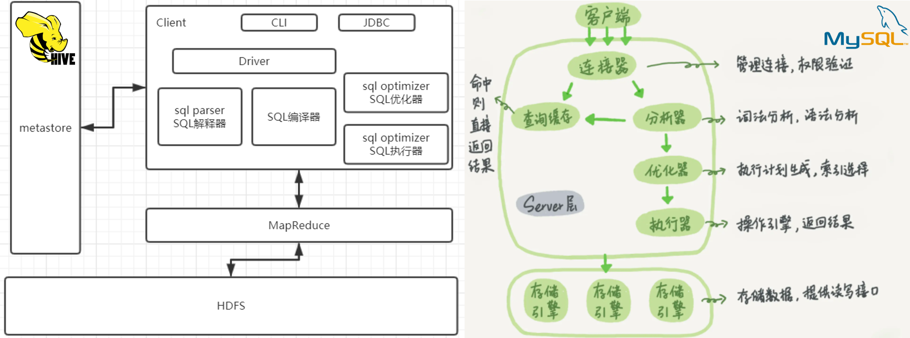

metastrore是存储元数据的数据库，默认使用的是derby，可以更改为***MySQL***，元数据指的是将结构化数据映射成一张表的表名，表所属的数据库(默认为default)，表的拥有者，表的列，分区字段，表的类型(是否为外部表)表所在的目录等。Hive只是和RDB只是在SQL语句上有着类似之处

## 02-一些hive中的函数

### 2.1-collect_x

在使用这个函数时，需要设置`set hive.map.aggr = false;` 否则可能会发生`IllegalArgumentException Size requested for unknown type: java.util.Collection`的异常[^1]

~~~SQL
select collect_set(col_a)  as          set_a
     , collect_list(col_a) as          list_a
     , sort_array(collect_list(col_a)) sort_list_a
from (
         select 'a' col_a
         union all
         select 'b' col_a
         union all
         select 'a' col_a
         union all
         select 'a' col_a
     ) t
~~~

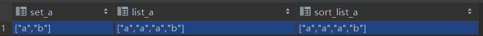

>[^1]: 改参数设置map的聚合为false , 在map端聚合还可能会引发内存溢出的问题，详情可查看：http://dev.bizo.com/2013/02/map-side-aggregations-in-apache-hive.html

### 2.2-日期/时区

~~~SQL
select date_format('2019-02-10','yyyy-MM');  
2019-02

select date_add('2019-02-10',-1),date_add('2019-02-10',1);
2019-02-09	2019-02-11
~~~

~~~SQL
-- (1)取当前天的下一个周一
select next_day('2019-02-12','MO')
2019-02-18
-- 说明：星期一到星期日的英文(Monday，Tuesday、Wednesday、Thursday、Friday、Saturday、Sunday)

-- (2)取当前周的周一   
select date_add(next_day('2019-02-12','MO'),-7);
2019-02-11

-- (3)取当前周的周日   
select date_add(next_day('2019-06-09','mo'),-1);
2019-06-09

-- (4)求当月最后一天日期
select last_day('2019-02-10');
2019-02-28
~~~

~~~SQL
-- 将北京时间转为巴西时间
select from_utc_timestamp(to_utc_timestamp("2021-05-09 22:14:30",'GMT+8'),"GMT-3")
2021-05-09 11:14:30.0

select date_format(from_utc_timestamp(to_utc_timestamp("2021-05-09 22:14:30",'GMT+8'),"GMT-3"),'yyyy-MM-dd HH:mm:ss')
2021-05-09 11:14:30
~~~

```sql 
-- 求上个月
select substr(add_months(current_date(),-1),1,7) method_one
, substr(date_sub(from_unixtime(unix_timestamp()), dayofmonth(from_unixtime(unix_timestamp()))), 1, 7) as method_two
```

### 2.3-字符串处理

`substr`，`replace`等就赘述了

```sql 
-- 1)
select regexp_extract('http://a.m.taobao.com/i41915173660.html', 'i([0-9]+)', 0)
     , regexp_extract('http://a.m.taobao.com/i41915173660.html', 'i([0-9]+)', 1)
-- i41915173660    ,   41915173660

-- 2)
select  regexp_replace('a1b2c3d4', '[0-9]', '-');
-- a-b-c-d-

-- 3)
-- 某字符串是另外一个字符串的子串
instr(string string, string substring)
-- 返回查找字符串string中子字符串substring出现的位置，如果查找失败将返回0，如果任一参数为Null将返回null，位置为从1开始。
```

### 2.4-除数为0处理

这里我们将比较不同的引擎是如何处理除数为0的问题的，如下图：

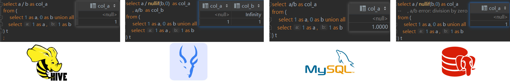

> 对于除数为0问题，优先使用`nullif`函数来进行处理，但是该函数Hive2.2才有对应实现

## 03-一些hive中的语法

### 3.1-sum()  + over()  

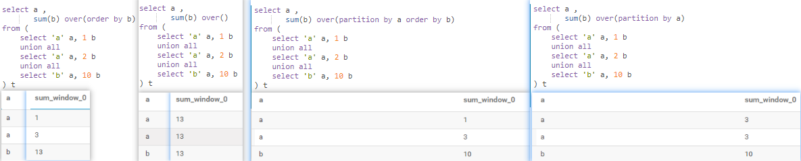

> * over() 全局求和
> * over(order by) 全局累积求和
> * over(partition by ) 分区内全局求和
> * over(partition by order by) 分区内累积求和 

### 3.2-侧写视图(lateral view)

🎈侧写试图主要用来处理行转列的问题

```SQL
select col_b,col_c
from (
    select 'a/b/c/d' as col_b
) t lateral view explode(split(col_B, '/')) x as col_c
```

| col_b   | col_c |
| ------- | ----- |
| a/b/c/d | a     |
| a/b/c/d | b     |
| a/b/c/d | c     |
| a/b/c/d | d     |

### 3.3-lag+over的使用

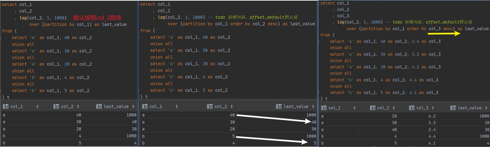

* lag 是获取上一个
* lead 是获取下一个

### 3.4-一周内连续3天活跃

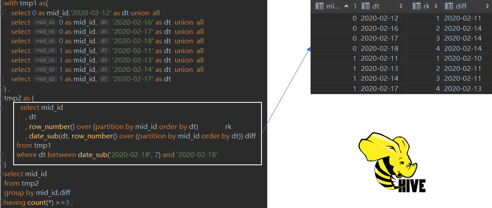

```sql
with tmp1 as(
    select 0 as mid_id,'2020-02-12' as dt union  all
    select 0 as mid_id,'2020-02-16' as dt  union  all
    select 0 as mid_id,'2020-02-17' as dt  union  all
    select 0 as mid_id,'2020-02-18' as dt  union  all
    select 1 as mid_id,'2020-02-11' as dt  union  all
    select 1 as mid_id,'2020-02-13' as dt  union  all
    select 1 as mid_id,'2020-02-14' as dt  union  all
    select 1 as mid_id,'2020-02-17' as dt
) ,
tmp2 as (
         select mid_id
            , dt
            , row_number() over (partition by mid_id order by dt)               rk
            , date_sub(dt, row_number() over (partition by mid_id order by dt)) diff
       from tmp1
       where dt between date_sub('2020-02-18', 7) and '2020-02-18'
)
select mid_id
from tmp2
group by mid_id,diff
having count(*) >=3 ;
```

### 3.5-left semi join

关于`left semi join` 注意2点：

:a:`left semi join` 要严格区分于`left outer join(left join)` 

:b: `t1 left semi join t2 ` 选列时，不允许出现t2 的字段

```sql
select t1.id, t1.fieldA
from `table_A` t1
where t1.id in (
    select id
    from `table_B`
); -- A 和 B的 交集

-- 可改写为exists的方式
select t1.*
from `table_A` t1
where exists (
    select t2.id
    from `table_B` t2
    where t1.id = t2.id
)

-- 还可改写为
select t1.*
from `table_A` t1
left join `table_B` t2
on t1.id = t2.id
where t2.id is not null -- A 和 B 的交集
;

-- 改写为 ，todo 这种方式更加高效
select t1.* -- 不允许出现t2 的字段
from `table_A` t1
left semi join `table_B` t2
on t1.id = t2.id;
```

同理对于`not  exist`

```sql
select t1.*
from `table_A` t1
left join `table_B` t2
on t1.id = t2.id
where t2.id is  null -- A中有B中没有
;
-- 我们换成下面的写法
select t1.*
from `table_A` t1
where not exists (
    select t2.id
    from `table_B` t2
    where t1.id = t2.id
) -- A中有B中没有

-- 或者换成下面的写法
select t1.*
from `table_A` t1
where not in (
    select t2.id
    from `table_B` t2
    where t1.id = t2.id
) -- A中有B中没有
```

### 3.6-distinct

#### :a:distinct 和 order by 的结合

先执行distinct ，后执行order by ，最后limit

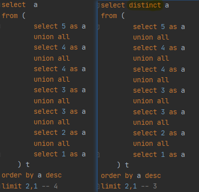

#### :b:distinct 多个字段

`distinct` 多个字段对所有字段都起作用，并不是一个；如 `select distinct field_a,field_b from table;` 

```sql
a1,b1;
a1,b2;
a2,b2;
-- 只要有不同就会被选择出来
```

### 3.7-limit offset 

`limit x offset y` , y是x的倍数出现，可以恰好将数据取完，Impala,MySQL, PostgreSQL三者是一致的，Hive 有点反人类，不列了

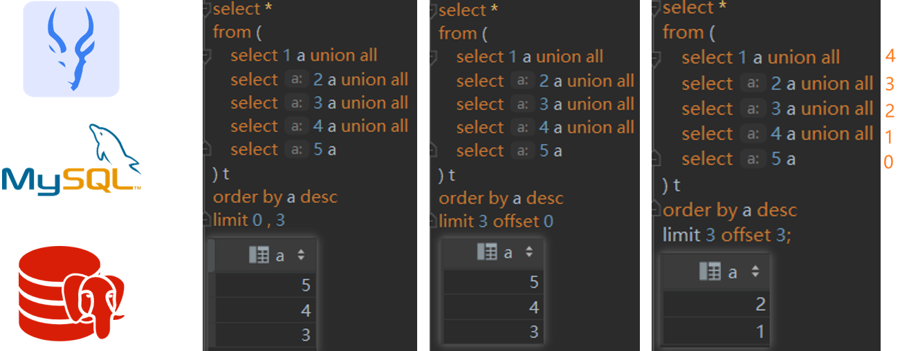

```sql
select *
from (
    select 1 a
    union all
    select 2 a
    union all
    select 3 a
    union all
    select 4 a
    union all
    select 5 a
) t
order by a desc
limit 3 offset 3; 
```

## 04-引擎的一些不同

### 4.1-select 非 group by 字段

MySQL支持，Hive,Impala,PostgreSQL 不支持

对于下面这一段SQL

```sql
select dept
     , emp
     , max(sal) as max_sal
from (
    select 'A' as dept, 'a1' as emp, 10 as sal union all
    select 'A' as dept, 'a2' as emp, 20 as sal union all
    select 'B' as dept, 'b2' as emp, 100 as sal union all
    select 'B' as dept, 'b1' as emp, 200 as sal
) t
group by dept
```

:one:MySQL 通过

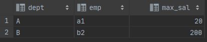 MySQL 选择记录中的第一个记录(从实验结果来看，是记录的第一行)

:two:postgreSQL：

```sql
[42803] ERROR: column "t.emp" must appear in the GROUP BY clause or be used in an aggregate function
```

:three:Hive：

```sql
Error while compiling statement: FAILED: SemanticException [Error 10025]: line 2:7 Expression not in GROUP BY key 'emp'
```

:four:Impala：

```sql
AnalysisException: select list expression not produced by aggregation output (missing from GROUP BY clause?): emp
```

### 4.2-having过滤是否支持别名

MySQL和Hive是支持的， impala和postgreSQL不支持

```sql
select a, count(*) as cnt
from (
    select 5 as a
    union all
    select 4 as a
    union all
    select 4 as a
    union all
    select 3 as a
    union all
    select 3 as a
) t
group by a
having cnt > 1;
```

上述的SQL在MySQL 和 hive中执行都是没问题的，在impala和postgreSQL报错 `column "cnt" does not exist`,需要下面的写法

```sql
select a, count(*) as cnt
from (
    select 5 as a
    union all
    select 4 as a
    union all
    select 4 as a
    union all
    select 3 as a
    union all
    select 3 as a
) t
group by a
having count(*) > 1;
```

🎈：推荐无论何时都不使用别名进行分组后过滤

### 4.3-order by 字符串

```sql
select a
from
(
    select  'a' as a union all        -- 97
    select '' as a union all    -- 66
    select  ' ' as a union all  -- 32
    select null as a                -- 0
) t
order  by a desc ;
```

对于以上查询和排序，Hive和MySQL认为NULL是最小；Impala和PostgresSQL认为NULL最大

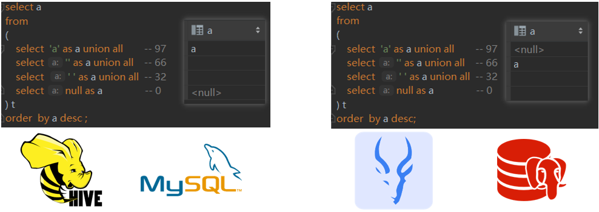 

### 4.4-$24/5$的结果

| DB/Program Language   | value |
| --------------------- | ----- |
| Java / PostgreSQL     | 4     |
| Hive / Impala / MySQL | 4.8   |

### 4.5-窗口函数是否支持`distinct`

```sql
select  A, B , count( distinct A) over()
from (
select 1 as A ,'a' as B union all
select 2 as A ,'b' as B union all
select 1 as A ,'c' as B union all
select 3 as A ,'d' as B
) t
```

比如以上的SQL查询：Hive是支持的，Impala，MySQL，PostgreSQL暂时没有实现

### 4.6-窗口嵌套

窗口函数的嵌套，只Hive中是支持的，PostgreSQL(`window functions are not allowed in window definitions`)，MySQL，Impala 中只能多嵌套一层

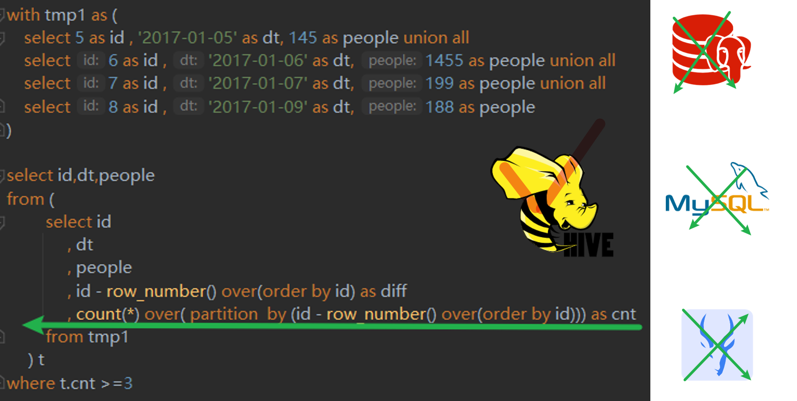

### 4.7-字符串写入数值类型

```sql 
create table if not exists  business (
    name stirng,
    order_date string,
    cost float
);
insert into business values('xioaming','2021-08-22','');
```

Hive 会将字符串转为null写入；Impala，MySQL，PostgreSQL会进行类型检查(即报错)

## 05-一些易犯的错误

### 5.1-`null`,`x` 关联

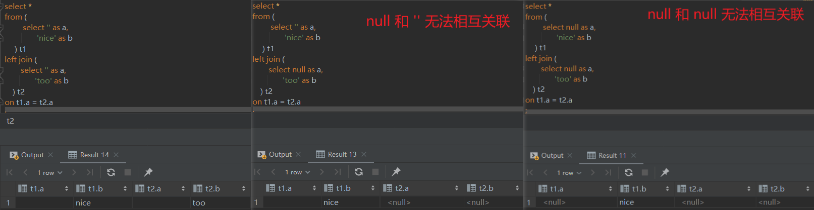

在任何SQL(MySQL,PostgreSQL,Hive,Impala)引擎中，**`null`和任意值都无法关联无法相互关联，包括其本身**

> PostgreSQL中有类型探测，执行以上关联会发生：[Failed to find conversion function from unknown to text](https://stackoverflow.com/questions/18073901/failed-to-find-conversion-function-from-unknown-to-text)

### 5.2-返回1行&返回0行

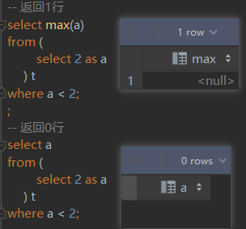 如左图所示 

### 5.3-union all 的类型

任何引擎，`union all`的类型必须保持一致

### 5.4-组合主键非`null`

对于`test01`表，字段`a`和字段`b`在作为联合主键时，在字段`a`为`null`，字段`b`非`null`的时候

:one:`kudu`将不会写入该记录，不会抛异常

:two:`mysql`插入时抛出异常 类似(`primary key not null`)

:three:`postgresql` 插入时抛出异常 类似(`primary key not null`)


整理：

:warning:时间是人可识别的，时间戳基本是机器识别的，比如2022-01-01 00:00:00~1640966400~，前者是时间，后者是时间戳

:one: 获取时间戳

```sql
--mysql
select unix_timestamp('2022-01-01 00:00:00');

-- hive 
select unix_timestamp('2022-01-01 00:00:00');

-- impala 没找到

-- pg

```

:two:获取时间

```sql
-- mysql
select now();

-- hive
select from_unixtime( unix_timestamp());

-- impala
select now(),  utc_timestamp(),current_timestamp(),from_unixtime( unix_timestamp());

-- pg
select  now() ,  current_timestamp;

```


impala，mysql，hive,pg库获取当前时间的方式，已及获取当前时间戳的方式；timediff的方式


整理，窗口函数的范围选择，

```sql
agg_func over(order by col_name rows between 1 proceding and 1 following) -- col_name的前后1行
agg_func over(order by col_name range between 1 proceding and 1 following) -- col_name值的(+/- 1) 的值

agg_func over(order by col_name rows between unbounded preceding and unbounded following) -- 全部行
agg_func over(order by col_name rows between unbounded preceding and current row) -- 开头到当前行
```


去掉文本中的换行符和制表符

```sql
regexp_replace(order_context,'\\s+','') as order_context
```


### 关联条件中出现if

```sql 
on if(t1.created_at < '2021-07-01 12:01:01', t5.raw_so_id, t5.order_no) = t1.outer_order_no  
-- join的两侧都出现 t1是不允许编译通过的

on (t5.raw_so_id  = t1.outer_order_no) or (t5.order_no = t1.outer_order_no) 
-- on 条件中不允许出现我or 的语句。

```

### 不使用order by 找到工资第二的员工

```sql
select
    e.emp_no,
    salary,
    last_name,
    first_name
from employees e
inner join salaries s
on e.emp_no = s.emp_no
where s.to_date = '9999-01-01' 
and s.salary = 
(
    select 
        s1.salary
    from salaries s1
    inner join salaries s2
    on s1.salary <= s2.salary
    where s1.to_date = '9999-01-01' and s2.to_date = '9999-01-01' 
    group by s1.salary
    having count(distinct s2.salary) = 2
)
```

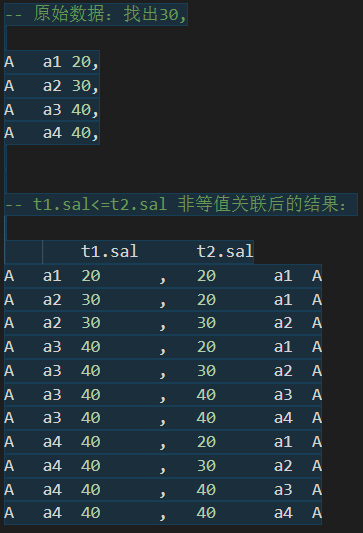  [最大值只能小于等于最大值](出现1次)；**[次大值只能小于等于最大值和本身](出现2次)**


