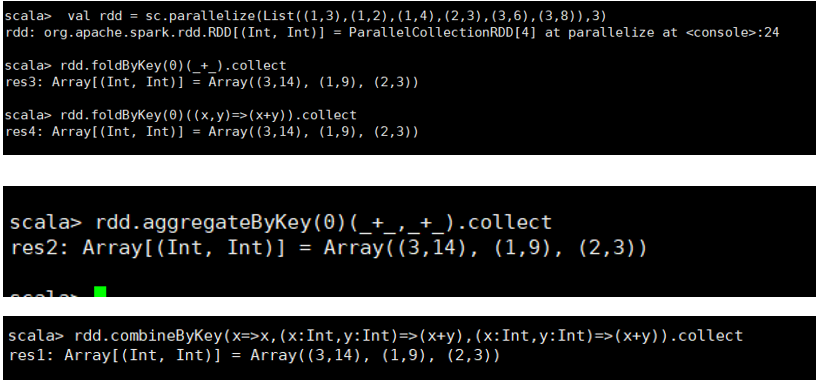
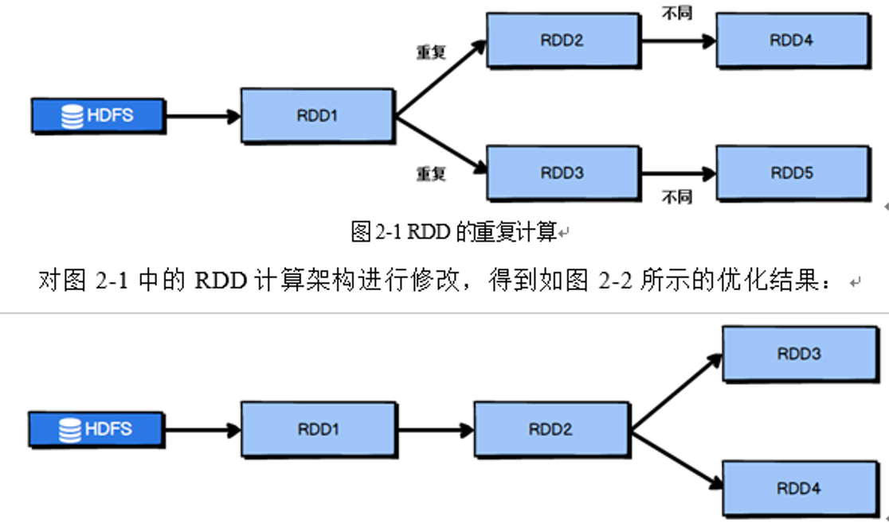

# Spark总结

## Spark core

### Spark和MapReduce的对比：

* Spark速度更快，Spark和MapReduce在进行逻辑回归机器学习的性能比较中，Spark比MapReduce至少快了100倍；

* Spark除了比MapReduce更快之外，还有更加简单易用的编程模型，RDD。

#### Spark为什么快？

在说明Spark为什么那么快之前，我们得说说MapReduce为什么那么慢，其实刚开始的时候， 人们并没有觉得MapReduce很慢，毕竟人家针对的场景是大数据，海量数据，分布式计算么，就应该是这个速度； 但是自从马铁开源了Spark之后，开发者们才知道原来分布式计算可以这么快，从此就开始嫌弃MapReduce的速度了。 

为什么MapReduce较之于Spark会很慢：首先MapReduce的应用一次只是运行一个map和reduce，而Spark会根据应用的复杂程度将任务分割成多个计算阶段，这些计算阶段会组成一个有向无环图DAG，Spark的任务调度器可以根据DAG的依赖关系执行计算阶段。 

在进行逻辑回归的机器学习的算法的性能比较的过程中，Spark比MapReduce快了100多倍。因为在某些机器学习的算法中有大量的迭代计算，产生长达数万个计算阶段，这些计算阶段可以在一个应用中完成。而MapReduce则需要启动数万个应用，因此极大的提高了效率。

在DAG中，Spark会根据RDD（RDD数据也就是我们要处理的数据，RDD存在有分区的）的血缘关系，判断宽窄依赖，从而生成stage（也就是有shuffle的阶段，就会产生stage），如此看来，Spark可以进行连续的shuffle，而不是像MapReduce那样，一个应用只能进行一个shuffle。如此一来也就更快了。 

虽然Spark的DAG的本质也是MapReduce，但是这种多个计算阶段依赖执行的方案能够有效的减少对于HDFS的访问，减少作业的调度执行次数，因此速度也就更快。MapReduce主要使用磁盘存储shuffle过程数据，而Spark优先使用内存进行数据存储，除非是内存不够用了，否则是尽可能的使用内存，所以Spark更快。 

回答的角度：

* DAG角度，让多个MapReduce连接了起来，减少了对于HDFS的访问次数，减少了任务调度执行的次数，然后在举上面的机器学习的例子。
* Spark优先使用内存进行shuffle过程的数据的存储。但是后期的Spark再进行了shuffle之后，所有的数据都要写文件，由ShuffleMapTask去写，有ResultTask去读（如果shuffleMapStage是最后一个的话）。 

### 累加器

累加器是Spark的三大核心数据结构之一，另外两个是**RDD和广播变量**。**累加器是分布式的只写变量**，在executor端是只写变量，返回driver端进行数据的merge，Driver端可以读取merge之后的值。**广播变量是分布式的只读变量。**先看如下的程序：

~~~scala
object Accumulator {
  def main(args: Array[String]): Unit = {
    val conf: SparkConf = new SparkConf().setAppName("learn Accumulator").setMaster("local[*]")
    val sc = new SparkContext(conf)
    val rdd: RDD[Int] = sc.makeRDD(Array(1,2,3,4,5))
    var sum = 0
    rdd.map( item =>{
      sum += item
    }).collect
    println(sum)  // 0 
  }
}
~~~

上述的代码并没有使用累加器，

下面使用累加器来实现累加的功能：

~~~scala
object Accumulator {
  def main(args: Array[String]): Unit = {
    val conf: SparkConf = new SparkConf().setAppName("learn Accumulator").setMaster("local[*]")
    val sc = new SparkContext(conf)
    val rdd: RDD[Int] = sc.makeRDD(Array(1,2,3,4,5))
    val sum = sc.longAccumulator("sum")
    rdd.map( item =>{
      sum.add(item)
    }).collect
    println(sum)  // LongAccumulator(id: 0, name: Some(sum), value: 15)
  }
}
~~~

自定义累加器的时候，需要继承Accumulatorv2类，并实现对应的方法。

### 广播变量

分布式只读对象，广播变量用来高效的分发大的对象，如果在做RDD操作的时候，如果此时有shuffle的话，性能会比较慢，可以使用广播变量，将数据传入到Executor，然后在执行RDD的时候，不在需要做shuffle，Executor在计算的时候，直接从内存中读取数据，自己来做逻辑匹配，而且由于没有shuffle，还不需要落盘。 

要知道在每一个executor中是有多个Task的，而每一个Task代表着一个任务，也就需要进行计算和数据的读取。**广播变量的时候是每一个Executor保存一份数据。**而不是每一个NodeManager，也不是每一个Task，但是**累加器的时候，是每一个Task保存一份累加器数据**。这主要是由累加器和广播变量的数据的大小决定的。

**案例**：

~~~scala
scala> val rdd1 = sc.makeRDD(Array((1,"a"),(2,"b")),2)
rdd1: org.apache.spark.rdd.RDD[(Int, String)] = ParallelCollectionRDD[0] at makeRDD at <console>:24

scala> val rdd2 = sc.makeRDD(Array((1,"aa"),(2,"bb")),2)
rdd2: org.apache.spark.rdd.RDD[(Int, String)] = ParallelCollectionRDD[1] at makeRDD at <console>:24

scala> rdd1.join(rdd2).collect
res1: Array[(Int, (String, String))] = Array((2,(b,bb)), (1,(a,aa)))
~~~

执行的时间非常的长：如下图，为什么会这样呢？因为在做join操作的时候需要shuffle，底层就是rdd1的每一个key和rdd2中的每一个元素做key的比对，所以这样的效率是非常的低效的

原理如下：

针对这种情况，Spark提供给了一种解决方案：原理是，不在shuffle，而是将其中一个rdd中的数据广播出去，放在内存中，另外一个rdd的内容，直接做比对，放置在内存中的数据不能太大。

广播变量：`val bc = sc.broadCast(Array((1,"a"),(2,"b")))`

### Spark结构

#### Spark的架构和作业提交流程：

如果我们需要通过yarn来执行我们的Spark程序，我们要提交：

~~~shell
   bin/Spark-submit   \   #(下面是参数部分)   
   --class   org.apache.Spark.examples.SparkPi \   
   --num-executors   2 \   
   --master   yarn \   
   --deploy-mode   cluster \   
   ./examples/jars/Spark-examples_2.11-2.1.1.jar   \   
   100   
~~~

调用上述的bin/Spark-submit脚本，等同于我们执行了一个下面这个java类，（$@获取了上面脚本中的全部参数）

好了，现在我们知道了，实际上走的是这个SparkSubmit这个类:

流程如下：

#### Spark的内置模块

Spark自带资源的调度器（集群管理器），但是Spark的核心是计算，整个计算是由Spark core和上面的应用组成的，资源的调度可以完全交由YARN（也是目前国内使用最多的）

#### Driver

Driver的作用如下：

* 把用户程序转为Job

* 跟踪Executor的运行状况
* 为执行器节点调度任务
* UI展示应用运行状况 

#### Executor

* 负责运行组成 Spark 应用的任务，**并将结果返回给Driver；**

* 通过自身的块管理器（Block Manager）为用户程序中要求缓存的RDD提供内存式存储。RDD是直接缓存在Executor进程内的，因此任务可以在运行时充分利用缓存数据加速运算。                                            

#### Spark的运行模式部署模式

:one:Local模式，在一台计算机上运行Spark，使用***local[k]***来设置线程数量，**`local[*]`**表示最多。**打开一个Spark-shell就能够运行Spark程序，通常用来测试使用，开始了Spark-shell之后，就会多一个叫做SparkSubmit的进程。**

:two:Standalone模式，构建一个master+Slave的Spark集群（集群中的每一台机器都需要安装Spark），Spark运行在集群中，使用Spark自带的集群管理器，进行相关的资源调度。**此时需要启动sbin/start-all.sh，来启动Spark自带的集群管理区，这里会产生master和worker进程，启动Spark集群的环境。**

~~~shell
bin/Spark-submit \
--master <master-url> Spark : //linux1:7077 \
~~~

Spark-submit会提交一个作业，该作业执行完毕，关闭Spark-submit之后，粗粒度Executor的后台进程会关闭，但是worker和master不会关闭。

:three: YARN模式，（只需要一台机器安装Spark，用来提交作业）Spark客户端直接连接YARN，不需要构建Spark集群，有yarn-client（测试）和yarn-cluster（生产）两种模式（主要的区别是Driver程序的运行节点）使用YARN作为集群管理器，进行相关的资源调度。**需要配置好yarn的环境，和hdfs的环境，并需要驱动，由yarn来提供资源调度，Spark，只是单纯的作为计算的框架。不需要sbin/start-all.sh，来启动Spark的资源调度框架**

~~~shell
bin/Spark-submit \
--master yarn \
#这里只是在ApplicationMaster位置有Spark的程序，使用YARN的资源调度框架。Spark的可插拔性就变的很高，只是做他擅长的计算。在启动之前，要启动HDFS和YARN的集群。为什么要启动HDFS？因为可能程序需要连接Hadoop
~~~

:four:Mesos模式

词频统计的代码：

~~~scala
sc.textFile("/opt/module/datasource/spark").flatMap(_.split(" ")).map((_,1)).reduceByKey(_+_).collect
res0: Array[(String, Int)] = Array((scala,1), (flink,1), (hello,3), (spark,1))
~~~

并发并行区别：

* 并行：是同时执行，三个core，三个任务同时执行

* 并发：是同时抢占，一个core，三个任务同时抢占

## RDD

RDD是分布式弹性数据集、是Spark中最基本的数据抽象

:one: RDD是只读的，如果想要改变RDD的值，会创建新的RDD，

:two: **RDD在逻辑上是分区的**，具体在哪个分区，通过compute函数得到，如`sc.makeRDD(Array(1,2,3,4))`使用compute进行分区。

:three:  **血缘关系**

下面的这张图：一个大块就是一个RDD，里面的小块是RDD的某一个分区，可以发现一个分区中的数据去往了另外一个RDD的不同分区，就是属于宽依赖。

## 算子

### 转化算子：

~~~scala
map //遍历，一个输入对应一个输出，可以返回不同的类型

flatMap //扁平化，可以说词频统计的例子，可以映射出多个元素构成序列，所以传入的func应该返回一个序列。flapMap算子：一个输入，希望得到多个输出，（比如一个文件输入了一行，得到了单词的序列）

sc.texFile().flatMap(_.split(_,1)).reduceByKey(_+_).collect;

mapPartition：//一个分区作为一个输入，所以该分区的数据没有操作完的时候，不会释放，可能会OOM。

mapPartitionWithIndex： //分区号和该分区内的数据构成一个元素作为输入。

glom //将RDD的每一个分区形成一个数组，

sample //主要用来取样，

filter //传入的func判断为true的，会被保留，返回回来新的RDD

distinct：// 去重，发生了shuffle

reparation //重新分区，需要进行shuffle，调用了coalease，colaease不需要进行shuffle。

sortBykey  //按照func的定义的规则排序
~~~

Map算子和MapPartition的区别：MapPartition可能会出现OOM溢出，RDD，发送到Executor上去执行，如果发现Executor的内存不够了，就会触发GC，但是Partiton中还有其他的值要使用到，所以无法回收。

~~~scala
groupbykey  //分组之后，直接shuffle，按照key进行聚合
reducebykey //在shuffle之前有一个预分区，按照key进行聚合
partitionByKey：
~~~

~~~scala
aggregateByKey：// 取出每一个分区相同的key对应的最大值，然后相加。
~~~

foldByKey：分区内和分区间规则一样的，

combinerByKey：第一参数里面可以写逻辑：

这里[C]表名该泛型是不能被推断的，createCombiner:V=>C 将当前的V类型，做了一个转化，创建聚合器；分区内第一会遇到一个key的时候，走这个方法，但是会将value传递过来mergeValue，分区内第二次遇到key，就会执行第二个方法，这里需要指定类型mergeCombiners：分区之间的数据的聚合，这里需要指定类型。

### 执行算子

~~~scala
collect
reduce
foreach
take
first
aggregate // combine函数将每个分区的结果和初始值(zeroValue)进行combine操作,补充：aggregateByKey和aggregate的区别：后者，第一个参数在分区之间计算的时候也参与运算。一个是转化算子，一个执行算子
~~~

### RDD的创建

~~~scala
def textFile(
    path: String,
    minPartitions: Int = defaultMinPartitions): RDD[String] = withScope {
  assertNotStopped()
  hadoopFile(path, classOf[TextInputFormat], classOf[LongWritable], classOf[Text],
    minPartitions).map(pair => pair._2.toString).setName(path)
}

// ClassTag 表示可推断类型
def parallelize[T: ClassTag](
    seq: Seq[T],
    numSlices: Int = defaultParallelism): RDD[T] = withScope {
  assertNotStopped()
  new ParallelCollectionRDD[T](this, seq, numSlices, Map[Int, Seq[String]]())
}

//defaultParallelism 是默认并行度，这是一个方法。
//Parallelize 方法调用了 withScope方法
~~~

创建RDD的方法中，第二个参数都和并行度相关，也和分区数有关。具体的关系如下：

其中hadoop的分区规则是参见Hadoop源码。在没有指定分区的数量的时候，local的分区如下：

* 最常用的执行算子：reduce，**该算子接收一个函数，该函数操作两个相同数据类型的元素，并返回一个相同数据类型的数据**。

~~~scala
def reduce(f: (T, T) => T): T = withScope {...}
~~~

* fold算子需要传入两个参数，第一参数初始值，来作为每个分区第一次调用时的结果，该初始值应该是你所提供的操作的单位元素。**RDD的执行算子，会将RDD的执行结果返回到Driver。**
* foreach也是一个执行算子，没有返回值。

### 算子举例：

#### glom

#### Sample算子涉及到的两个概率分布：

~~~scala
if (withReplacement) { // withReplacement，是第一个参数，表示是否放回，false表示不放回
   new PartitionwiseSampledRDD[T, T](this, new PoissonSampler[T](fraction), true, seed)
 } else {
   new PartitionwiseSampledRDD[T, T](this, new BernoulliSampler[T](fraction), true, seed)
 }  
// 在传入的第一个参数为false的时候，使用伯努利分布，也即零一分布，传入的第二个参数参数是时间发生的概率，1表示一定发生，0 表示不发生。
~~~

关于这两个分布的解释如下：伯努利分布式？

 伯努利分布也叫做0-1分布或者是两点分布，如果伯努利实验成功，则伯努利随机变量取值为1，如果伯努利实验失败，则伯努利随机变量为0；成功的概率是p，失败的概率是q=1-p，数学期望是 1 * p +0 * q = p

 泊松分布适合描述单位时间内随机事件发生的次数的概率分布。比如一台服务器在一定的时间内收到请求的次数，参数λ是单位时间内（或者单位面积）随机事件发生的概率 

#### Distinct算子：

 ~~~scala
def distinct(numPartitions: Int) (implicit ord: Ordering[T] = null): RDD[T] = withScope {
   map(x => (x, null)).reduceByKey((x, y) => x, numPartitions).map(_._1)
 }
 ~~~

该算子是有shuffle的过程的，该算子的作用是去重。

#### Reparation 和 coalesce算子

Reparation一定会进行shuffle，但是coalesce算子不一定会进行shuffle过程。

 ~~~scala
def repartition(numPartitions: Int)(implicit ord: Ordering[T] = null): RDD[T] = withScope {
 coalesce(numPartitions, shuffle = true)
 }
 ~~~

#### sortBy算子：

SortBy 对传入的函数处理之后的结果，对原数据进行排序。

**关于Shuffle的特别说明：**

调用的shuffle的算子的时候，会涉及到数据的重组（聚合的时候会发生重新分区），数据的重组会涉及到跨Executor（跨机器）的操作，所以会有数据落盘的操作，体现出来就是分成不同的阶段。

#### reduceByKey和groupByKey的区别：

reduceByKey在shuffle之前会有一个预聚合，groupByKey按照key分组，直接进行shuffle、 

#### aggregateByKey的用法

这里有三个参数，初始值（第一次遇见这个key的时候，给定的初始值），分区内的聚合规则，分区间的聚合规则。上面的例子是，分区内求最大，分区间求和的操作。FoldByKey用于分区间和分区内的规则一样的时候。

#### CombineByKey

的初始值是可以写逻辑的，而不再是一个单纯的初始值，计算相同key’累加之后的和：

#### Join和cogroup算子

Join大约的等于内连接，cogroup大约等于外连接。

#### aggregateByKey和aggregate算子的区别 + fold：

第一个是转换算子，剩余两个是执行算子。

第一个函数将RDD中得数据放入到累加器，每个节点都是在Executor中累加的，所以第二个函数用来将两个累加器相加。Aggregate在分区之间，也会使用到初始值。

## Spark中的Shuffle有哪几种？

有两种，**`hashshuffle ， sortshuffle`**，而hashshuffle还分为未经优化的shuffle 和优化过的**`hashshuffle`** ，假设接下来的讨论每一个Executor都只有一个CPU核 

### 未经优化的HashShuffle：

上图中有两个Executor，每一个Executor中有两个Task，一共有四个Task，而reduce端有三个Task；假设我们的四个任务形成一个文件的话，这里会涉及到Executor之间的网络交互，而且reduce端的task在读取数据的时候就很不方便（不知道自己应该读那段的数据）；所以此时会让每一个Task形成三个文件，如此一来reduce端的task就可以读取对应文件的数据了。而且这里还会开辟对应的缓冲区。我们来思考一下这里会存在什么样子的问题？开辟的缓冲区太多；由于每一个Task要形成三个文件，需要形成很多的小文件，文件比较小的时候，打开文件和关闭文件都需要消耗资源。下一个Stage的task有多少个，当前的stage的每一个task就要创建多个磁盘文件，比如当前下一个stage有100个task，那么当前stage的每个task就要创建100个磁盘文件。

### 优化后的HashShuffle

并不是每一个Task产生下一个stage中task个数的文件，而是每一个Executor会产生和下一个stage相同的task个数的文件。如此一来也就减少了小文件的个数，

### 普通的SortShuffle

sort就是排序的意思，也就是形成的文件会有序的存在，既然文件中的数据是有序存在，那么就可以和成一个文件（也就可以使用和Kafka的分段日志类似的原理进行数据的存储）（在上面我们提到过，前一个Stage，具体就是shuffleMapTask进行数据的写，写的话形成indexFile, 和dataFile，一个是索引，一个是数据，两个合在一起Task（ResultTask）就知道了应该去哪里读数据）

### Bypass 的 sortShuffle

两者的区别和reparation和coalesce的区别差不多，Bypass 一定会sort，而sortShuffle不一定会进行sort，比如说任务少的时候，没有必要合成一个大文件，这里会有一个阈值，如果没有达到了阈值（默认是200），就是HashShuffle。

## Spark的内存管理

Spark为什么那么快，基于内存的计算，Spark可以使用java和scala，都是基于JVM的语言，JVM非常的强大，能够做到很好的跨平台性，这是JVM好的地方，但是JVM也有不好的地方，比如GC，以为没有办法手动控制GC，这是有JVM托管的（比如你写完了程序，内存占用的太多了，想要释放一下内存，不允许System.GC）。假设我们现在发现我们的Spark的任务执行的差不多了，可是还有一小部分没有执行完，可是内存不够用了，但是我发现内存中有一个地方可以回收，我想回收这部分内存然后去执行剩下的程序，但是想要回收，jvm可不会马上回收，也就是说这部分内存不受到Spark的控制，有10G的任务，想把内存释放10个G，然后去执行任务，做不到，可能会发生OOM，因为实际内存没有被回收，而你以为你回收了，因为Spark不知道JVM什么时候释放的内存。发生在Executor计算的时候。Spark是如何解决这个问题的呢？

Spark设计了非堆内存。Spark来管理这部分内存和JVM的堆内存没有关系。这里是非堆泛指不是JVM管理的内存。也可以理解为JVM委托OS来分配内存。可以利用C语言和C++的指针的特定，定位到内存的位置，进行内存的管理。优点是不仅仅是对于内存的管理更加方便，而且性能也有一定的提升（因为普通的应用想要把对象保存在os层的话，需要进行一个序列化的操作，但是如果在OS层的话，是不存在对象的概念的，直接就是序列化的文件。）

:o: **逃逸分析 **：

一般的，我们new出来的对象，我们放置在堆内存中，但是我们也可以将对象放置在栈中（如果该对象只是在方法里面使用了，方法外面没有被人用，也就是意味着这个对象的生命周期只和方法有关，那么就不需要将对象放置在堆里面，而是放在栈中）因为放在栈中的对象，方法用完了，会自动弹出，对象也就被释放了 。但是我们怎么知道对象在方法的外面有没有被用（被引用）呢？ 也即对象的引用有没有逃到方法的外面去，如果在方法的外面还拿到了对象的引用。 那么就不能放在栈里面，这个过程可以在编译的时候分析出来。这个性能会更高。

对于Spark的JVM的堆内内存，Spark会将其分为**存储内存和执行内存**，存储内存主要用于RDD的缓存（例如cache和persist），而在shuffle过程中计算需要的内存被划分为执行内存。

###  静态内存管理

对于Spark的堆内内存，一开始的Spark是这样分配的：

但是如今，这种内存分配的方式已经不再使用了，**RDD是存放在storage中的，cache之后的数据放置在了execution中的**，由于Other中的数据可能存在内存碎片，所以在构建cache的时候，将Other中的数据复制到Storage中的时候，有一个展开unroll的操作（有点类似于JVM中的复制算法，GC之后复制到1区）连续之后，性能就会有提升。老的版本中存储区和计算区是不能逾越的。

### 动态内存管理：

此时存储内存和计算内存 可以相互占用。

eviction：驱逐，赶出。第二图中指的意思是执行内存的内存被存储内存占用了，最后满了，但是执行内存也需要进行计算的时候，会对存储内存占用的内存进行驱逐（对于非memory only的可以落盘），看哪些内存可以释放，将其释放掉。第三个图：不会对占用内存进行回收。所以此时存储内存只能溢写磁盘，或者是释放数据。

#### 堆外内存的静态和动态：

## cache，persist，checkpoint

会被重复使用的，但是不是很大的RDD，可以做cache，cache只是使用memory，也就是说RDD之间的血缘关系很长的时候，可以做cache，或者是checkpoint，如果做成了cache的话，在执行计算的时候，我们可以直接从cache 的位置获取数据，而不是从头开始计算。如果进行持久化checkpoint了的话，即便宕机之后，依然能够从某一个中间位置获取RDD的数据。

***cache 不会截断血缘关系，但是checkpoint会截断血缘关系。***

`rdd.persist（StorageLevel.DISK_ONLY）`和checkpoint的区别是，前者将RDD的partition持久化到磁盘，但是该partition交给blockManager去管理，一旦driver 执行结束，也就是`CoarseGrainedExecutorBackend `结束，blockManager也就会结束，那么被cache到磁盘上的RDD也就会清空。但是checkpoint会持久化到HDFS或者是本地文件，必须要手动remove掉。

由于cache数据存放在内存的存储内存中，即便不断电也会不安全，在cache在memory only的情况下，而且占用了计算内存，而计算内存要对内存进行回收的话，cache就会被回收掉，因此cache不能切断血缘关系。

上面的这些描述有点问题啊？

## Spark的调优策略 ：

### 给足资源

提交作业的时候，给更过的资源使用driver-memory ； Executor-memory  num-Executors等。

### RDD的优化

### 广播变量

