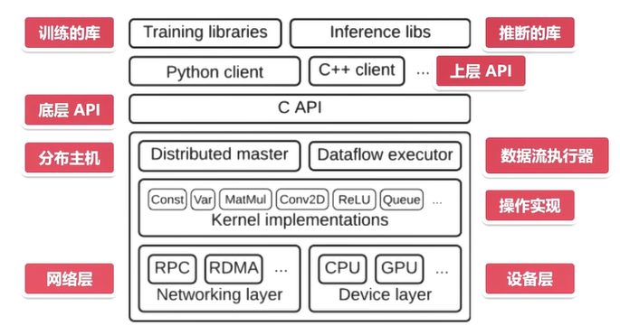
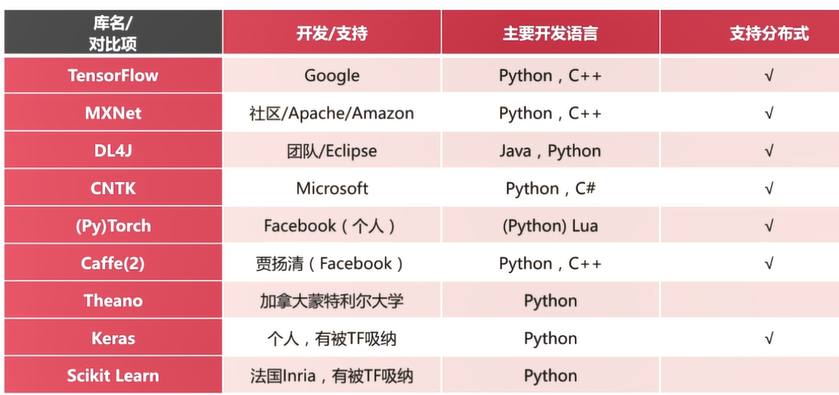

## TensorFlow

### TensorFlow的介绍

TensorFlow是Google开源基于数据流图的科学计算库，适合用于机器学习，构建神经网络。

**tensor**：张量

**flow**：流动

张量在数据流（图）中流动

### TensorFlow的详细架构

#### 系统架构

#### TensorFlow的特点

1. **灵活性** ：只要将计算表示成数据流图，就可以使用TensorFlow
2. **跨凭台** ：支持Linux，Windows，Android，IOS等
3. **多语言** ：上层支持多语言开发，Python，C++，Java，Go等
4. **速度快** ：包含了XLA线性代数编译器
5. **上手快** ： Keras，Estiminator，等等高层的API
6. **可移植** ：代码几乎不加修改移植到CPU，GPU，TPU（Google发布的张量的运算单元）等

### 各个机器学习库的对比

具体参见：[TensorFlow与主流的深度学习框架的对比](https://zhuanlan.zhihu.com/p/25547838)

对人工智能有了解，比较好的数学知识，对机器学习（吴恩达的视屏 + cs156） + 深度学习。  

