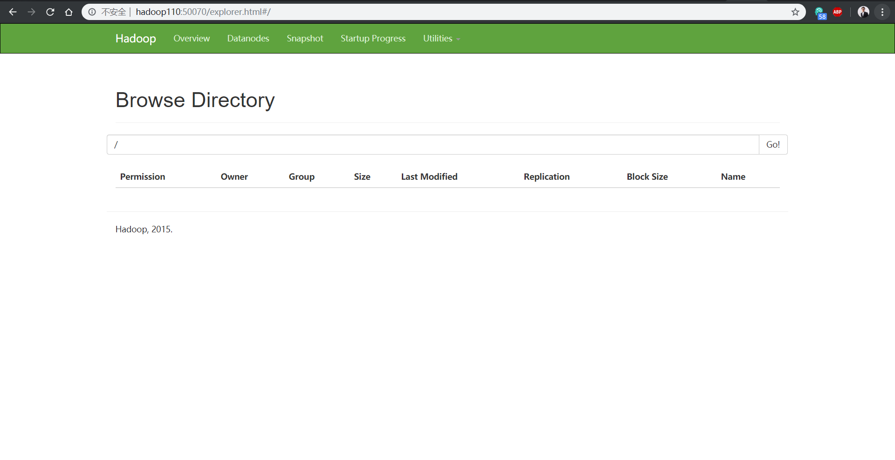

# 集群搭建

## 环境：

* Java8
* hadoop2.7.2
* 虚拟环境：VMVare
* Linux：centOS6

一台只是安装好了CentOS的虚拟机：我们在虚拟机内部打开获取ip地址：然后使用ssh登录，这样操作起来更加方便：使用ssh扥登录之后，立马进行如下的操作。

## Hadoop安装

### `centOS，jdk，hadoop`准备

~~~shell
#1，关闭防火墙
[root@hadoop100 ~]# chkconfig iptables off
[root@hadoop100 ~]# chkconfig --list iptables
iptables       	0:关闭	1:关闭	2:关闭	3:关闭	4:关闭	5:关闭	6:关闭

#2，设置静态ip
[root@hadoop100 ~]# vim /etc/sysconfig/network-scripts/ifcfg-eth0 
DEVICE=eth0
TYPE=Ethernet
ONBOOT=yes
BOOTPROTO=static
NAME="eth0"
IPADDR=192.168.1.108
PREFIX=24
GATEWAY=192.168.1.2
DNS=192.168.1.2

#3，修改主机名
[root@hadoop100 ~]# vim /etc/sysconfig/network
NETWORKING=yes
HOSTNAME=hadoop108

#4，修改网卡的信息，删0改1  精准定位 shift + g  shift + 4 （这里删除第一块网卡的信息，记为删0改1）
[root@hadoop100 ~]# vim /etc/udev/rules.d/70-persistent-net.rules 

# PCI device 0x8086:0x100f (e1000)
SUBSYSTEM=="net", ACTION=="add", DRIVERS=="?*", ATTR{address}=="00:0c:29:66:02:e5", ATTR{type}=="1", KERNEL=="eth*", NAME="eth0"
~              

#5，配置/etc/hosts文件，尽量配置的多一点，可以备用，另外在Windows下的hosts文件需要配置一下（此处不演示）。 在此处添加下面的内容即可，原有的内容不用在删除
[root@hadoop100 ~]# vim /etc/hosts

192.168.1.100 hadoop100

192.168.1.101 hadoop101
192.168.1.102 hadoop102
192.168.1.103 hadoop103
192.168.1.104 hadoop104
192.168.1.105 hadoop105
192.168.1.106 hadoop106
192.168.1.107 hadoop107
192.168.1.108 hadoop108
192.168.1.109 hadoop109

192.168.1.110 hadoop110
192.168.1.111 hadoop111
192.168.1.112 hadoop112
192.168.1.113 hadoop113
192.168.1.114 hadoop114

#6，创建一个一般用户，并设置密码
[root@hadoop100 ~]# useradd isea
[root@hadoop100 ~]# passwd isea

#7，配置该用户的root权限，91 shift + g 直接定位到该行，定位的是root的位置，在下面添加如下的内容即可
[root@hadoop100 ~]# vim /etc/sudoers
isea    ALL=(ALL)       NOPASSWD:ALL

#8，创建opt目录下创建module文件夹和software文件夹，并将所有权赋给一般用户
[root@hadoop100 ~]# mkdir /opt/module /opt/software
[root@hadoop100 ~]# chown isea:isea /opt/software/ /opt/module/
[root@hadoop100 ~]# ll /opt/
总用量 12
drwxr-xr-x. 2 isea isea 4096 11月 14 17:12 module
drwxr-xr-x. 2 root root 4096 3月  26 2015 rh
drwxr-xr-x. 2 isea isea 4096 11月 14 17:12 software

#9，关机，利用本台虚拟机克隆两台虚拟机。
[root@hadoop100 opt]# halt

Broadcast message from root@hadoop100
	(/dev/pts/1) at 16:52 ...

The system is going down for halt NOW!
.....
克隆过程忽略

~~~

克隆完成之后，我们打开108号虚拟机，如果我们上面的步骤都是ok的，那么在108号虚拟机开启之后，我们直接使用ssh登录即可，然后开始如下的步骤：

~~~shell
#10，将拷贝好的109 和 110 号机器使用root账号登录，然后修改其静态ip地址，重启之后使用xshell的isea账号登录，如下：
[root@hadoop108 ~]# vim /etc/sysconfig/network-scripts/ifcfg-eth0 

DEVICE=eth0
TYPE=Ethernet
ONBOOT=yes
BOOTPROTO=static
NAME="eth0"
IPADDR=192.168.1.109
PREFIX=24
GATEWAY=192.168.1.2
DNS=192.168.1.2

[root@hadoop108 ~]# vim /etc/sysconfig/network

NETWORKING=yes
HOSTNAME=hadoop109

[root@hadoop108 ~]# vim /etc/udev/rules.d/70-persistent-net.rules 

# PCI device 0x8086:0x100f (e1000)
SUBSYSTEM=="net", ACTION=="add", DRIVERS=="?*", ATTR{address}=="00:0c:29:73:b1:65", ATTR{type}=="1", KERNEL=="eth*", NAME="eth0"
~              

以上操作对于110 同样。

#11，在hadoop108上安装jdk 和 hadoop
[isea@hadoop108 software]$ tar -zxvf jdk-8u144-linux-x64.tar.gz -C /opt/module/
[isea@hadoop108 software]$ tar -zxvf hadoop-2.7.2.tar.gz -C /opt/module/

#12，配置环境变量
[isea@hadoop108 module]$ sudo vim /etc/profile
#JAVA_HOME
export JAVA_HOME=/opt/module/jdk1.8.0_144
export PATH=$PATH:$JAVA_HOME/bin

#HADOOP_HOME
export HADOOP_HOME=/opt/module/hadoop-2.7.2
export PATH=$PATH:$HADOOP_HOME/bin
export PATH=$PATH:$HADOOP_HOME/sbin

#13，source一下之后，检查jdk 和 hadoop是否成功

[isea@hadoop108 module]$ source /etc/profile
[isea@hadoop108 module]$ java -version
java version "1.8.0_144"
Java(TM) SE Runtime Environment (build 1.8.0_144-b01)
Java HotSpot(TM) 64-Bit Server VM (build 25.144-b01, mixed mode)
[isea@hadoop108 module]$ hadoop version
Hadoop 2.7.2
Subversion Unknown -r Unknown
Compiled by root on 2017-05-22T10:49Z
Compiled with protoc 2.5.0
From source with checksum d0fda26633fa762bff87ec759ebe689c
This command was run using /opt/module/hadoop-2.7.2/share/hadoop/common/hadoop-common-2.7.2.jar

#14，配置集群分发脚本，注意脚本中需要修改的内容

[isea@hadoop108 module]$ cd 
[isea@hadoop108 ~]$ ll
总用量 32
*
[isea@hadoop108 ~]$ mkdir bin
[isea@hadoop108 ~]$ ll
总用量 36
drwxrwxr-x. 2 isea isea 4096 11月 16 18:18 bin
*
[isea@hadoop108 ~]$ cd bin/
[isea@hadoop108 bin]$ ll
总用量 0
[isea@hadoop108 bin]$ vim xsync

[isea@hadoop108 bin]$ chmod 777 xsync 
[isea@hadoop108 bin]$ ll
总用量 4
-rwxrwxrwx. 1 isea isea 500 11月 16 18:19 xsync
#!/bin/bash
#1 获取输入参数个数，如果没有参数，直接退出
pcount=$#
if((pcount==0)); then
echo no args;
exit;
fi

#2 获取文件名称
p1=$1
fname=`basename $p1`
echo fname=$fname

#3 获取上级目录到绝对路径
pdir=`cd -P $(dirname $p1); pwd`
echo pdir=$pdir

#4 获取当前用户名称
user=`whoami`

#5 循环
for((host=108; host<111; host++)); do
        echo ------------------- hadoop$host --------------
        rsync -rvl $pdir/$fname $user@hadoop$host:$pdir
done

#15，配置免密登录
[isea@hadoop108 .ssh]$ pwd
/home/isea/.ssh
[isea@hadoop108 .ssh]$ cd .
[isea@hadoop108 .ssh]$ ssh-keygen -t rsa
连续输入三个enter

#16,同步秘钥到集群所有的机器，实现hadoop108到所有机器的免密
[isea@hadoop108 .ssh]$ ssh-copy-id hadoop108
[isea@hadoop108 .ssh]$ ssh-copy-id hadoop109
[isea@hadoop108 .ssh]$ ssh-copy-id hadoop110

#17，同步秘钥文件/home/isea到机器的机器，实现集群的互通（会把同步脚本也同步过去）在109或110机器上验证

[isea@hadoop108 ~]$ xsync /home/isea/
[isea@hadoop109 ~]$ cd bin/
[isea@hadoop109 bin]$ ll
总用量 4
-rwxrwxr-x. 1 isea isea 500 11月 16 18:29 xsync
[isea@hadoop109 bin]$ cd 
[isea@hadoop109 ~]$ cd .ssh/
[isea@hadoop109 .ssh]$ ll
总用量 16
-rw-------. 1 isea isea  396 11月 16 18:29 authorized_keys
-rw-------. 1 isea isea 1675 11月 16 18:29 id_rsa
-rw-r--r--. 1 isea isea  396 11月 16 18:29 id_rsa.pub
-rw-r--r--. 1 isea isea 1215 11月 16 18:29 known_hosts

#18，同步java，和hadoop到109 110 ，（当然也会同步108自己），在109 ，110 上验证同步是否成功
[isea@hadoop108 opt]$ xsync /opt/module/

[isea@hadoop109 module]$ ll
总用量 8
drwxr-xr-x. 9 isea isea 4096 11月 16 18:32 hadoop-2.7.2
drwxr-xr-x. 8 isea isea 4096 11月 16 18:32 jdk1.8.0_144

#19，同步 /etc/profile文件到109 ，110去， 并分别source
[isea@hadoop108 bin]$ sudo ./xsync /etc/profile
[sudo] password for isea: 
注意这里面，会有输入多个密码，注意root还是isea

[isea@hadoop109 module]$ source /etc/profile
[isea@hadoop109 module]$ java -version
java version "1.8.0_144"
Java(TM) SE Runtime Environment (build 1.8.0_144-b01)
Java HotSpot(TM) 64-Bit Server VM (build 25.144-b01, mixed mode)
[isea@hadoop109 module]$ hadoop version
Hadoop 2.7.2
Subversion Unknown -r Unknown
Compiled by root on 2017-05-22T10:49Z
Compiled with protoc 2.5.0
From source with checksum d0fda26633fa762bff87ec759ebe689c
This command was run using /opt/module/hadoop-2.7.2/share/hadoop/common/hadoop-common-2.7.2.jar
~~~

以上就完成了所有的集群的准备工做，下面可以进行相关的配置：

### 搭键集群`Hdoop安装`

|      | hadoop108        | hadoop109                  | hadoop110                 |
| ---- | ---------------- | -------------------------- | ------------------------- |
| HDFS | NameNodeDataNode | DataNode                   | SecondaryNameNodeDataNode |
| YARN | NodeManager      | ResourceManagerNodeManager | NodeManager               |

我们按照上面的部署搭键集群，需要配置的文件

~~~shell
[isea@hadoop110 hadoop]$ pwd
/opt/module/hadoop-2.7.2/etc/hadoop
[isea@hadoop110 hadoop]$ vim hadoop-env.sh 
[isea@hadoop110 hadoop]$ vim yarn-env.sh 
[isea@hadoop110 hadoop]$ vim mapred-env.sh 
[isea@hadoop110 hadoop]$ vim core-site.xml 
[isea@hadoop110 hadoop]$ vim hdfs-site.xml 
[isea@hadoop110 hadoop]$ vim yarn-site.xml 
[isea@hadoop110 hadoop]$ vim slaves
[isea@hadoop110 hadoop]$ cat slaves 

~~~

开始配置

~~~shell
21，三个环境变量
[isea@hadoop108 hadoop]$ vim hadoop-env.sh 
[isea@hadoop108 hadoop]$ vim yarn-env.sh 
[isea@hadoop108 hadoop]$ vim mapred-env.sh 

export JAVA_HOME=/opt/module/jdk1.8.0_144

22，配置五个配置文件
[isea@hadoop108 hadoop]$ vim core-site.xml 
<!-- 指定HDFS中NameNode的地址 -->
<property>
		<name>fs.defaultFS</name>
      <value>hdfs://hadoop108:9000</value>
</property>

<!-- 指定Hadoop运行时产生文件的存储目录 -->
<property>
		<name>hadoop.tmp.dir</name>
		<value>/opt/module/hadoop-2.7.2/data/tmp</value>
</property>

[isea@hadoop108 hadoop]$ vim hdfs-site.xml 
<property>
		<name>dfs.replication</name>
		<value>3</value>
</property>

<!-- 指定Hadoop辅助名称节点主机配置 -->
<property>
      <name>dfs.namenode.secondary.http-address</name>
      <value>hadoop110:50090</value>
</property>

[isea@hadoop108 hadoop]$ vim yarn-site.xml 

<!-- Reducer获取数据的方式 -->
<property>
		<name>yarn.nodemanager.aux-services</name>
		<value>mapreduce_shuffle</value>
</property>

<!-- 指定YARN的ResourceManager的地址 -->
<property>
		<name>yarn.resourcemanager.hostname</name>
		<value>hadoop109</value>
</property>

[isea@hadoop108 hadoop]$ cp mapred-site.xml.template mapred-site.xml
[isea@hadoop108 hadoop]$ vim mapred-site.xml
<!-- 指定MR运行在Yarn上 -->
<property>
		<name>mapreduce.framework.name</name>
		<value>yarn</value>
</property>

[isea@hadoop108 hadoop]$ vim slaves 
hadoop108
hadoop109
hadoop110
[isea@hadoop108 hadoop]$ cat slaves 
hadoop108
hadoop109
hadoop110

#23，群发配置文件，并在109 和 110 上分别检验是否同步成功：
[isea@hadoop108 hadoop]$ xsync /opt/module/hadoop-2.7.2/etc/hadoop/
fname=hadoop
pdir=/opt/module/hadoop-2.7.2/etc

[isea@hadoop109 hadoop]$ cat yarn-site.xml 
结果一致
[isea@hadoop110 hadoop]$ cat core-site.xml 
结果一致

#24，格式化，namenode
[isea@hadoop108 hadoop]$ hadoop namenode -format
DEPRECATED: Use of this script to execute hdfs command is deprecated.
Instead use the hdfs command for it.

18/11/16 19:03:10 INFO namenode.NameNode: STARTUP_MSG: 
*
*
*
成功了
#25，108群起hdfs 109群起yarn，并jps
[isea@hadoop108 hadoop]$ start-dfs.sh 
[isea@hadoop109 hadoop]$ start-yarn.sh 

[isea@hadoop108 hadoop]$ jps
27376 NameNode
27929 Jps
27515 DataNode
27807 NodeManager

[isea@hadoop109 hadoop]$ jps
2864 DataNode
2982 ResourceManager
3096 NodeManager
3135 Jps

[isea@hadoop110 hadoop]$ jps
2832 DataNode
2912 SecondaryNameNode
3046 NodeManager
3161 Jps

# 26 配置xcall脚本 ,在isea用户的bin目录下：

vim /home/isea/bin/xcall

#!/bin/bash
pcount=$#
if((pcount==0)); then
echo no args;
exit;
fi
 
#command=$1
#export command
 
for((i=108;i<111;i++))
do
        echo ---------hodoop$i----------
        if [ $1=jps ]
        then
                ssh isea@hadoop$i 'source /etc/profile && jps'
        fi
done

[isea@hadoop110 bin]$ xcall jps
---------hodoop108----------
26832 NameNode
27426 Jps
27155 NodeManager
26971 DataNode
---------hodoop109----------
2785 DataNode
2866 ResourceManager
3362 Jps
2982 NodeManager
---------hodoop110----------
26451 DataNode
26534 SecondaryNameNode
26807 Jps
26599 NodeManager
~~~

### 测验Hadoop

[HDFS的客户端](http://hadoop105:50070/dfshealth.html#tab-startup-progress)

如此一来，集群就搭建好了。多练几遍，15分钟，不能再多了。

## 