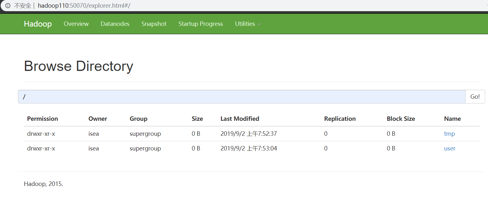

# Hadoop

* 在开发中，可以设置的是DataNode的多目录，也就是在hdfs-site.xml下配置多个数据存储的目录。（其实很多的，涉及到IO落盘的操作，配置多目录都是一个提高性能的选择）

* snappy是不支持切片的，但是lzo是支持切片的。

* 在搭建好集群的时候，一定要做测试，这样才能知道我们的集群的作业能力

[学习环境集群搭建](<https://blog.csdn.net/qq_31807385/article/details/84141835>)

组件监听的端口：

| `NameNode`       | 50070 |
| ---------------- | ----- |
| `SecondNameNode` | 50090 |
|                  |       |

群起YARN，HDFS的脚本：

~~~shell
YARN服务：
1，群起YARN相关的服务——>[isea@hadoop101 hadoop-2.7.2]$ sbin/start-yarn.sh
2，群关YARN相关的服务——>[isea@hadoop101 hadoop-2.7.2]$ sbin/stop-yarn.sh

3，单独开启resourcemanager——>[isea@hadoop102 hadoop-2.7.2]$ sbin/yarn-daemon.sh start resourcemanager
4，单独关闭resourcemanager——>[isea@hadoop102 hadoop-2.7.2]$ sbin/yarn-daemon.sh stop resourcemanager

1，群起HDFS相关的服务——>[isea@hadoop101 hadoop-2.7.2]$ sbin/start-dfs.sh
2，群关HDFS相关的服务——>[isea@hadoop101 hadoop-2.7.2]$ sbin/stop-dfs.sh

~~~

HDFS的块大小：HDFS的文件在物理上是分块，存储的，默认是128M，块大小的设置，不能太大也不能太小，如果太小，程序总是在寻址（寻找块的开始位置），如果设置的太大磁盘传输的时间太长。总结：**HDFS的块大小主要取决于磁盘的传输效率**。HDFS在数据的读写的时候，要先找到目标数据，然后在进行读写操作，找到该文件如果需要10ms，寻址时间为传输时间的1%的时候，为最佳状态，所以磁盘的传输数据的时间为1S，而磁盘的传输速度为100M/S，所以块大小也就是128M。能够使得传输的速率达到最佳状态。

## `NameNode`的操作命令

~~~shell
# 创建两个文件夹
[isea@hadoop110 hadoop-2.7.2]$ bin/hadoop fs -mkdir /tmp
[isea@hadoop110 hadoop-2.7.2]$ bin/hadoop fs -mkdir -p /user/hive/warehouse

# 查看HDFS上的文件路径
[isea@hadoop110 hadoop-2.7.2]$ bin/hadoop fs -ls /
Found 2 items
drwxr-xr-x   - isea supergroup          0 2019-09-02 07:52 /tmp
drwxr-xr-x   - isea supergroup          0 2019-09-02 07:53 /user
~~~

如下：

## HDFS

### HDFS的组成架构

每一条元数据在NN中占150个字节。

`NameNode `: 主要的作用就是管理block的映射信息（也即原始数据和元数据之间的映射关系），处理来自客户端的读写请求。

`DataNode`：负责实际的存储数据，执行具体的读写操作。

`Clinet`：**文件的切分，**文件在上传到HDFS的时候，Client将文件切分成一个一个的block，然后进行上传；和NN交互，获得文件的位置信息；和DN交互，读取或者写入数据；通过client完成对HDFS的一个管理，读写请求等。

`2NN`：合并`Fsimage`和edit文件；紧急情况下可以恢复`Namenode`的数据。

### HDFS写数据流程

客户端通过`FSDataStream`向dn1请求上传数据，dn1收到请求之后会继续调用dn2，然后dn2调用dn3，将通信管道建立完成；dn1，dn2，d3逐级应答客户端。然后客户端开始往dn1上传第一个block（先从磁盘读取数据放到一个本地缓存）以packet为单位，dn1收到一个packet就会传给dn2，dn2传给dn3，dn1每传一个packet会放入一个应答队列等待应答。当第一个block传输完成之后，客户端在此请求`NameNode`上传第二个Block的服务。HDFS在写数据的时候，`NameNode`会选择距离待上传数据最近距离的`DataNode`接收数据，这个距离计算的是拓扑距离（两个节点到达最近的共同祖先的距离总和。）

Hadoop的副本节点的选择：第一个副本在client机器所在的节点，如果客户端在集群外，随机选择一个，第二个副本和第一个副本位于相同的机架，随机节点；第三个副本位于不同机架随机节点。

### HDFS读数据流程

### `NameNode`和`SecondaryNameNode`的工作机制

为了保证查询元数据的高效快速，元数据的信息是放置在NN的内存中的。但是这样存在数据安全问题，因此在磁盘中备份元数据，使用内存快照`Fsimage`（内存数据序列化后的文件），NN中的数据一直在进行更新，所以`Fsimage`有也要及时更新，否则会出现数据一致性的问题，但是一直更新，会导致NN的效率过低，因此引入edits文件，来记录NN的写操作，需要定期的合并edits文件和`fsimage`文件，由于本身NN的工作量很大，所以需要额外的一台机器来解决问题.`SecondaryNameNode`的作用就是帮助`NameNode`进行Edits和`Fsimage`的合并工作。 

NN每次在启动的时候，都会将edit文件和`Fsimage`加载到内存中去（或者是格式化的时候，创建`Fsimage`和edit文件）元数据的增删改操作，会写在edit.process文件中， 2NN会根据时间和edit是否满了，向NN请求是否需要`checkPoint`，如果需要，就会将滚动，生成一个新的edit文件用来记录新的写操作，并将edit文件和`Fsimage`文件都拷贝到2NN中，加载到其内存和成一个新的`Fsimage `checkpoint在拷贝会NN，替换原来的`Fsimage`文件改名为`Fsimage`。 所以但NN宕机之后，2NN可以恢复部分数据。

 集群的安全模式：NN在启动的时候，要加载`Fsimage`和执行edit中的写操作，此时NN对于客户端来说是只读的，如果满足了最小副本条件（整个文件系统百分之九十九的块都有一至少有一个副本），NN就会在30秒之后，退出安全模式。

### DataNode的工作机制：

数据块在DN上以文件形式存储在磁盘上，包括了**数据本身**，还有**数据块的长度**，**块数据的校验和，和时间戳**。

DN给NN发送心跳，NN给DN返回命令，比如删除某个块，或者复制某个块。校验和的作用：数据块传过来的时候，是携带了校验和的信息的，数据传输过来了之后，重新计算校验和，比对是否和传过来的校验和一致。从而达到数据检查的目的。

### HDFS中的小文件问题

每个文件均按照块存储，每个块的元数据存储在`NameNode`的内存中，因此HDFS存储小文件会非常低效。举个例子来说就是5个120M的文件，占用NN中的内存和5个1M的文件占用的内存是一样的，所以说HDFS去存储小文件是一件非常不划算的事情。但是两者在`DataNode`上面消耗的磁盘存储空间是不一致的。 

解决的办法就是存档文件或者是`har`文件，是一个更高效的文件存档工具，也即将多个小文件存档成一个文件，在该文件的内部有多个小文件。

## `MapReduce`

`MapReduce`是一个分布式计算框架，也是一个分布式编程框架，可以将用户编写的业务逻辑代码和自身默认组件整合成一个完整的分布式运算程序，并发运行在一个Hadoop集群上。` MapReduce`编程模型，只能包含一个Map阶段和一个Reduce阶段，如果用户的业务非常复杂，只能多个`MapReduce`程序串行运行。 

一个完整的`MapReduce`程序在分布式运行时有三类实例进程：

* `MrApplicationMaster`：负责整个程序运行过程的调度和状态协调
* `MapTask`：负责整个Map阶段的数据处理流程
* `ReduceTask`：复杂Reduce阶段的数据处理流程 

### 数据切片与`MapTask`并行度决定机制

客户端在提交Job时候的切片数量决定了Job的Map阶段的并行度，每个切片会分配一个`MapTask`进行处理，默认情况下**切片大小等于 块大小**切片的对象不是数据集整体，而是针对每一个文件单独切片。 

源码解析：**`FileInputFormat`**切片源码（`input.getSplits(job)）`

* 程序首先找到数据存储的目录

* 开始遍历目录下面的每一个文件

* 遍历第一个文件获取文件的大小fs.size(target.txt)；计算切片的大小`ComputeSplitSize（Math.max(minSize,Math(min(maxSize,blockSize)))=blocksize=128M）`

* 开始切片，每次切片之前，都要判断文件剩余部分是否大于块的1.1倍，如果小于，剩下的文件为一个切片；并将所有的切片信息写到一个切片的规划文件中去，整个切片的过程在`getSplit（）`方法中完成。`InputSplit`只是记录切片的元数据信息。

* 提交切片规划文件到YARN上，有YARN的`ApplicationMaster`根据切片规划文件，开启相应的`MapTask`。

### `MapReduce`的详细工作流程

Map方法之后，进入环形缓冲区，然后进行分区并排序，做到了同一个分区中的数据是有序的，此时数据都是在内存中的，如果此时环形缓冲区达到了80%，分区中的数据就会溢写到磁盘，所以一个分区中的数据可能会形成多个小文件，然后同一个分区形成的小文件之间会进行归并排序，形成一个大文件，这个大文件中，分区1是一个大文件，且有序；分区2也会形成一个大文件，且有序，这个过程中还可以combiner将该分区中所有相同的键的聚合到一块，做到提前聚合。然后`RduceTask`会从`MapTask`中下载其需要的数据，然后再次使用归并排序，和成一个文件（如果数据量不大的话，直接在内存中归并排序）后一次只是读取一组，然后在分组将数据交由reduce来处理。

Shuffle的过程指的是哪个过程：***map方法之后，reduce方法之前的过程就是shuffle的过程。***

### Shuffle机制：

### `MapTask`工作机制

### `ReduceTask`阶段

## YARN

YARN是一个资源调度平台，负责为运算程序提供运算资源，相当于一个分布式的操作系统平台，而`MapReduce`，spark等相当于运行在操作系统上的应用程序。

### YARN的工作机制：

作业提交全过程详解

（1）作业提交

第1步：Client调用`job.waitForCompletion`方法，向整个集群提交`MapReduce`作业。

第2步：Client向RM申请一个作业id。

第3步：RM给Client返回该job资源的提交路径和作业id。

第4步：Client提交jar包、切片信息和配置文件到指定的资源提交路径。

第5步：Client提交完资源后，向RM申请运行`MrAppMaster。`

（2）作业初始化

第6步：当RM收到Client的请求后，将该job添加到容量调度器中。

第7步：某一个空闲的NM领取到该Job。

第8步：该NM创建Container，并产生`MRAppmaster。`

第9步：下载Client提交的资源到本地。

（3）任务分配

第10步：`MrAppMaster`向RM申请运行多个`MapTask`任务资源。

第11步：RM将运行`MapTask`任务分配给另外两个`NodeManager`，另两个`NodeManager`分别领取任务并创建容器。

（4）任务运行

第12步：MR向两个接收到任务的`NodeManager`发送程序启动脚本，这两个`NodeManager`分别启动`MapTask，MapTask`对数据分区排序。

第13步：`MrAppMaster`等待所有`MapTask`运行完毕后，向RM申请容器，运行`ReduceTask。`

第14步：`ReduceTask`向`MapTask`获取相应分区的数据。

第15步：程序运行完毕后，MR会向RM申请注销自己。

（5）进度和状态更新

YARN中的任务将其进度和状态(包括counter)返回给应用管理器, 客户端每秒(通过`mapreduce.client.progressmonitor.pollinterval`设置)向应用管理器请求进度更新, 展示给用户。

（6）作业完成

除了向应用管理器请求作业进度外, 客户端每5秒都会通过调用`waitForCompletion()`来检查作业是否完成。时间间隔可以通过`mapreduce.client.completion.pollinterval`来设置。作业完成之后, 应用管理器和Container会清理工作状态。作业的信息会被作业历史服务器存储以备之后用户核查。

**默认分区是按照key的`hashCode`对`ReduceTask`个数取模得到的，用户无法控制key被存储到哪个分区。 假设自定义分区数为5，则，

* `job.setNumReduceTasks(1)` 会正常运行，但是就只会产生一个输出文件
* `job.setNumReduceTasks(2) `会报错
* `job.setNumReduceTasks(6) `程序会正常运行，会产生空文件

