# `kafka`

[从单节点到分布式的演进，到Kafka](<https://blog.csdn.net/qq_31807385/article/details/84975720>)

为什么会出现`Kafka`？ 

在消息队列中有两种模式：

* 点对点模式，一对一，消费者主动拉取数据，消息收到后，消息队列中的数据清除
* 发布订阅模式，一对多，数据产生之后，推送给所有的消费者，消息队列中保留着数据。

**在流式计算中，`kafka`一般用来做数据缓存。**

[`Kafka`架构和原理](<https://blog.csdn.net/qq_31807385/article/details/84977511>)

## Kafka遇到的问题

[kafka报Commit cannot be completed since the group has already rebalanced and assigned the partitions](<https://blog.csdn.net/russle/article/details/83040753>)

## Kafka压测

Kafka压测指的是用Kafka官方自带的脚本，对Kafka进行压测。Kafka压测时，可以查看到哪个地方出现了瓶颈（CPU，内存，网络IO）。一般都是网络IO达到瓶颈。 

~~~shell
kafka-consumer-perf-test.sh
kafka-producer-perf-test.sh
~~~

### Kafka Producer压力测试

`/opt/module/kafka/bin`目录下面有这两个文件。我们来测试一下

~~~shell
bin/kafka-producer-perf-test.sh  --topic test --record-size 100 --num-records 100000 --throughput 1000 --producer-props bootstrap.servers=hadoop104:9092,hadoop105:9092,hadoop106:9092
# 说明：record-size是一条信息有多大，单位是字节。`num-records`是总共发送多少条信息。throughput 是每秒多少条信息。
~~~

Kafka会打印下面的信息

~~~shell
5000 records sent, 999.4 records/sec (0.10 MB/sec), 1.9 ms avg latency, 254.0 max latency.

5002 records sent, 1000.4 records/sec (0.10 MB/sec), 0.7 ms avg latency, 12.0 max latency.

5001 records sent, 1000.0 records/sec (0.10 MB/sec), 0.8 ms avg latency, 4.0 max latency.

5000 records sent, 1000.0 records/sec (0.10 MB/sec), 0.7 ms avg latency, 3.0 max latency.

5000 records sent, 1000.0 records/sec (0.10 MB/sec), 0.8 ms avg latency, 5.0 max latency.
~~~

参数解析：本例中一共写入10w条消息，每秒向Kafka写入了**0.10MB**的数据，平均是1000条消息/秒，每次写入的平均延迟为0.8毫秒，最大的延迟为254毫秒。

### Kafka Consumer压力测试

Consumer的测试，如果这四个指标（IO，CPU，内存，网络）都不能改变，考虑增加分区数来提升性能。

~~~shell
bin/kafka-consumer-perf-test.sh --zookeeper hadoop102:2181 --topic test --fetch-size 10000 --messages 10000000 --threads 1
#  10g数据  --zookeeper 指定zookeeper的链接信息 --topic 指定topic的名称 --fetch-size 指定每次fetch的数据的大小 --messages 总共要消费的消息个数
~~~

测试结果说明：

~~~shell
start.time, end.time, data.consumed.in.MB, MB.sec, data.consumed.in.nMsg, nMsg.sec
*,			*		 9.5368, 				2.0714, 	100010, 		21722.4153
~~~

**开始测试时间，测试结束数据，最大吞吐率**9.5368MB/s，平均每秒消费**2.0714MB/s**，最大每秒消费**100010条，平均每秒消费**21722.4153条。

三台Kafka就能够抗住**50M/s**的数据量，能够支持每天2亿左右的数据。50M * 3600 * 24 = 4,320,000 M ；每天支持的数据量是4个T；

## Kafka权威指南

Kafka的数据单元被称作是消息，消息由字节数组组成，Kafka有一个可选的数据单元，叫做键，也是一个字节数组，当消息要写入不同的分区的时候，需要使用到键。为了提高效率，消息被分批次写入Kafka，有一定的延迟，broker接收来自生产者的消息，为消息设置偏移量，并提交到磁盘保存。偏移量是一种元数据，他是不断递增的整数值，在创建消息的时候，Kafka会将其添加到消息里面。在给定的分区中每个消息的偏移量都是唯一的。

消费者将每个分区最后读取到的消息偏移量都保存在Zookeeper或者是Kafka上，如果消费者关闭或者重启，她的读取状态不会丢失。

~~~properties
log.dirs = /opt/module/kafka_2.11-0.11.0.2/logs  
# Kafka将所有的消息都保存在了磁盘上，保存的位置通过其指定，而且可以指定多个目录，

num.recovery.threads.per.data.dir=1
# 为上述的logs.dir目录所在的日志片段设置线程数：  正常启动的时候打开日志片段，服务器挂了之后，检查日志片段，服务器关闭之后，关闭日志片段

auto.create.topics.enable 
# 默认情况下，kafka会在如下的几种情况下自动创建主题：
一个生产者往主题写入消息时；一个消费者开始往主题里读取消息的时候；任意一个客户端向主题发送元数据的时候

log.retention.bytes 
log.retention.ms 
# 决定消息能够在Kafka保留多久的设置，一个是时间，一个是大小

log.segment.bytes 
# 该设置（默认1G）作用在日志片段上而不是单个消息 ：日志片段长成下面的样子：
│ ├── 00000000000000000000.index 
│ ├── 00000000000000000000.log
# 如果达到了上述的大小，该日志片段就会被关闭，一旦关闭，就会等待过期；此时会再建立一个日志片段， 来存储接下来的数据。

log.segment.ms
# 指定了多长时间之后，日志片段会被关闭，

message.max.bytes
# 默认值是1000 000 也就是1M，如果生产者尝试发送的消息超过了这个大小，不仅消息不会接受还会报错，才参数是压缩之后的值；该值越大那么负责处理网络连接和请求的线程就需要花越多的时间来处理这些请求。

内存
# 磁盘影响生产者，而内存影响消费者，消费者一般从分区的尾部读取消息，如果有生产者存在，一般会跟在生产者的后面，在这种情况下，消费者读取的消息会直接存放在系统的页面缓存里面，，这比从磁盘上读快的多。

~~~

延迟和吞吐量之间是要做出权衡的，对于Kafka来说，单批次的数据量越大，也就是吞吐量大，虽然相对于单个消息进行传输而言，网络的开销更小，但是这样做也意味着更高的延迟。

***偏移量*** 是另外一种元数据，是一个不断递增的整数值，在创建消息的时候，Kafka会把它添加到消息里，在给定的分区里，它的每个消息的偏移量都是唯一的。消费者把每个分区最后读取到的消息偏移量都保存到Zookeeper或者是Kafka中，如果消费者关闭或者是重启，她的读取状态不会丢失。

broker接收来自生产者的消息，为消息设置偏移量，并提交消息到磁盘保存；同时，broker为消费者提供服务，对读取分区的请求作出相应，返回已经提交到磁盘的消息。

保留消息，要么保留一段时间（比如七天），要么保留消息到达一定大小的字节数（比如1G），当消息达到这些上限的时候，旧消息就会被删除 ，所以在任何时刻，可用的消息的总量都不会超过配置参数指定的大小。

## Producer

下面的代码都是使用单线程的生产者，生产者其实是可以使用多线程来发送消息的，，刚开始的时候可以使用单个消费者单个线程，如果需要增加吞吐，可以增加多个线程，如果还不够，增加多个消费者。

### Kafka生产者组件

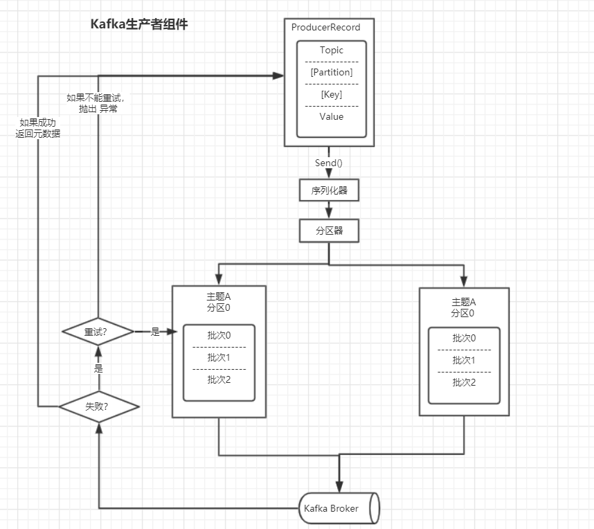


* 这里的`ProducerRecord`是对象，生产者要将`ProducerRecord`对象序列化为字节数组，然后才能在网络上传输。
* 数据传递给分区器之后，如果之前在`ProducerRecord`对象里指定了分区，分区器不会做任何事情，如果没有指定分区，那么分区器会根据`ProducerRecord`的键来选择一个分区。选好分区，生产者就知道往哪个主题哪个分区发送数据了。
* 接着，这条记录被添加到一个记录批次里，这个批次里的所有消息会被发送到相同的主题和分区上，**有一个独立的线程负责把这些记录批次发送到相应的broker上**
* 服务器在收到这些消息的时候会给一个相应，如果消息写入Kafka成功，就返回一个`RecordMetaData`,它包含了主题和分区信息，以及**记录在分区里的偏移量**，如果失败会尝试重新发送消息，几次之后如果还是失败，就返回错误信息

### 配置准备

~~~java
//创建配置对象
Properties properties = new Properties();

//设置kafka集群，必须的参数
properties.setProperty(ProducerConfig.BOOTSTRAP_SERVERS_CONFIG,"hadoop101:9092");

//序列化 ，必须的参数，必须实现：org.apache.kafka.common.serialization.Serializer接口的类
properties.setProperty(ProducerConfig.KEY_SERIALIZER_CLASS_CONFIG,"org.apache.kafka.common.serialization.StringSerializer");
properties.setProperty(ProducerConfig.VALUE_SERIALIZER_CLASS_CONFIG,"org.apache.kafka.common.serialization.StringSerializer");

// 缓冲区的大小，默认是32M,生产者使用它缓冲发送到服务器的消息，如果生产过快，send()方法要么被阻塞，要么爆出异常
properties.setProperty(ProducerConfig.BUFFER_MEMORY_CONFIG,"33554432");

//配置应答机制，等待所有的副本节点的应答，该参数指定了必须有多少分区副本收到消息，生产者才会消息写入是成功的
properties.setProperty(ProducerConfig.ACKS_CONFIG,"all");

// 当生产者发送失败的时候，允许最大尝试的次数，如果达到这个次数，生产者会放弃尝试，并返回错误，每次尝试之间的时间间隔是：retry.backoff.ms(默认100ms)
properties.setProperty(ProducerConfig.RETRIES_CONFIG,"0");

// 当有多个消息需要被发送到一同一个分区的时候，生产者会将他们放在同一个批次里，当批次填满，批次里的消息会被发送出去，半满的批次或者只有一个消息的
// 批次也有可能被发送出去，这里这是16k
properties.setProperty(ProducerConfig.BATCH_SIZE_CONFIG,"16384");

// 指定生产者在发送消息批次之前等待更多的消息加入到批次的时间，生产者会在批次被填满或者是linger.ms达到上限的时候把消息发送出去。
properties.setProperty(ProducerConfig.LINGER_MS_CONFIG,"10");

// 指定分区类：
properties.setProperty(ProducerConfig.PARTITIONER_CLASS_CONFIG,"com.isea.learn.kafka.partition.VirginPartition");

//创建生产者 从这里开始看kafka的源码，可以看到所有的准备工作
Producer<String,String> producer = new KafkaProducer<String, String>(properties);

//准备数据
String topic = "first";
String value = "iseayou,you are so handsome...";
// kafka的生产者，会将发送的数据封装成ProducerRecord对象
ProducerRecord<String, String> record = new ProducerRecord<String, String>(topic,value);
~~~

### 发送消息

生产者发送消息的方式主要有三种：

* **fire-and-forget **把消息发送给服务器，并不担心是否正常到达，多数情况下会正常到达，因为Kafka是高可用的，而且生产者会自动尝试重发（retries参数配置） 不过这种方式有时候也会丢失数据。当我们不关心发送结果，可以使用这种方式，比如记录不太重要的应用程序日志。

~~~java
try {
    producer.send(record); // 这个是异步的方法
}catch (Exception e){
    e.printStackTrace();
}
~~~

* 同步发送，使用send()方法发送，返回一个Future对象，调用get()方法进行等待，就知道消息是否发送成功。如果服务器返回错误，get()方法会爆出以异常，没有发生异常，我们会得到一个`RecordMetadata`对象，可以用它获取消息的偏移量。

~~~java
try {
    producer.send(record).get(); // 这个是同步的方法
}catch (Exception e){
    e.printStackTrace();
}
~~~

* 异步发送，使用send()方法发送，并可以指定回调函数，服务器在返回数据的时候，调用该函数。假设在Kafka集群和应用程序之间一个来回需要10ms，如果在发送完每个消息后都等待回应，那么发送100个消息需要1s。多数情况下，我们并不需要等待响应，尽管Kafka会把目标主题，分区信息，消息的偏移量发送回来，但其实这对应用程序来说并不是必须的。但是在消息发送失败时，我们需要抛出异常：

~~~java
producer.send(record,(metadata,ex)->{
    if (ex != null){
        ex.printStackTrace();
    }
});
~~~

### 顺序保证

如果对消息的顺序有严格的要求，不建议把retries设非零，同时把max.inflight.requests.per.connection设置为1。后者指定了生产者收到服务器响应之前可以发送多少个消息，设为1可以保证消息是按照发送的数据写入服务器的，即便发生了重试。

### 分区

* 如果key为null 而且使用了默认的分区器，分区器会使用轮询（Round Robin）算法将消息均衡的分布到各个主题上

* 如果key不为null，而且使用了默认的分区器，那么Kafka会对key进行散列，然后根据散列值将消息映射到分特定的分区上。，只有不改变主题分区数量的情况下，键和分区之间的映射才能保持不变。所以在创建主题的时候就把分区规划好，而且永远不要增加新的分区。

## Consumer消费者

刚开始，G1群组里有C1，C2等消费者，如果新增一个消费者群组G2，两个消费者组订阅了相同的主题T1，那么G2会接收T1的所有的消息。总的来说G2还是会消费所有的信息，不管有么有其他的群组的存在。

### 消费者群组和再均衡

分区的所有权从一个消费者到了另外一个消费者，这样的行为叫做**再均衡**，在再均衡期间，消费者无法读取消息，会造成整个群组一小段时间的不可用。另外当分区被重新分配给另外一个消费者的时候，消费者当前的读取状态会丢失，它有可能还需要去刷新缓存，在他重新恢复状态之前会拖慢应用程序。消费者会向被指派为**群组协调器**的broker （不同的群组有着不同的协调器）发送**心跳**来维持他们和群组的从属关系以及他们对分区的所有权关系。如果一个消费者发生了崩溃，并停止读取消息，群组协调器会等待几秒钟，（在这几秒内，死掉的消费者不会读取分区里的消息），确认它死亡了才会触发再均衡。在0.10.1版本里，Kafka社区引入了一个独立的心跳线程，可以在轮询消息的空当发送心跳。

当消费者要加入群组的时候，她会向群组协调器发送一个**`JoinGroup`**请求，第一个加入群组的消费者将会成为**“群主”** ，群主会从协调器那里获得群组的成员列表（列表中包含了所有最近发送过心跳的消费者，他们被认为是活跃的）并且负责给每个消费者分配分区，她使用一个实现了**`PartitionAssignor`** 接口的类来决定哪些分区分配给哪些消费者。分配完毕之后，群主会把分配的信息发送给协调器，协调器再发送给所有的消费者

### 轮询

**消息轮询是消费者API的核心**，通过一个简单的轮询向服务器请求消息，一旦消费者订阅了主题，轮询就会处理所有的细节，包扩**①群组协调，②分区再均衡，③发送心跳，④获取数据。**

~~~java
ConsumerRecords<String, String> records = consumer.poll(400); 
// 消费者必须不断地向kafka进行轮询，不然就会被认为是死掉，她的分区会被移交给群组里的其他消费者，在poll方法指定的毫秒内，消费者会一直等待broker返回数据

poll() // 方法返回一个记录列表，每条记录都包含了记录所属主题的信息，记录 所在的分区信息，记录在分区里的偏移量，以及记录的键值对。我们一般会遍历这个列表，逐条处理这些数据。
    
for (ConsumerRecord<String, String> record : records) {
    // 打印数据
    System.out.println(record.value());
} // 在真实的场景里结果一般会保存到数据存储系统里

consumer.close(); // 在退出程序之前，关闭消费者，网络连接和socket也会随之关闭，并立即发出一次再均衡，而不是等待群组协调器发现它不在发送心跳已并确认她死亡，因为那样需要更长的时间，导致整个群组在 一段时间内无法读取消息。
~~~

轮询其实非常复杂的，在原地调用消费者的**poll()**方法的时候，它会负责查找**`GroupCoordinator`**，然后加入群组，接收分配的分区，如果发生了再均衡，整个期间也是在轮询期间进行的。

#### 线程安全：

在同一个群组里，无法使用一个线程运行多个消费者，也无法让多个线程共享一个消费者，按照规定，一个消费者使用一个线程，处理的办法是：让每个消费者运行在自己的线程里，最好是把消费者的逻辑封装在自己的对象里，然后使用Java的**`ExecutorService`**启动多个线程，使得每个消费者运行在自己的线程里。

### 消费者的配置

~~~properties
fetch.min.bytes 
# 指定了消费者从服务器获取记录的最小字节数。broker在收到了消费者的数据请求的时候，如果发现可用的数据量小于该值，会等待有足够的数据的时候才返回给消费者。该值可以降低broker的工作负载

fetch.max.wait.ms
# fetch.min.bytes参数告诉Kafka等到有足够的数据时才返回给消费者，而fetch.max.wait.ms来设置等待的时间，默认为500ms，上述的两个条件任意一个满足，broker即会返回数据给消费者。

max.partiton.fetch.bytes
# 该属性指定了服务器从每个分区返回给消费者最大得字节数，默认1M。

session.timeout.ms
# 该属性指定了消费者在被认为死亡之前可以和服务器断开连接的时间，默认是3s。该属性的修改和heartbeat.internal.ms息息相关

auto.offset.reset
# 该属性指指定了消费者在读取一个没有偏移量的分区或者偏移量无效的情况下（因消费者长时间失效，包含偏移量的记录已经过时并被删除）该作何处理，默认为latest，消费者从最新记录开始读取数据；还有一个值是：earliest，消费者将从起始位置开始读取分区的记录。

enable.auto.commit
# 该属性指定消费者是否自动提交偏移量，默认值是true,为了尽量避免重复消费数据和丢失数据，可以将其设置为false，由自己控制什么时候提交偏移量。如果设置了true的话，还可以配置auto.commit.interval.ms属性来控制提交的频率。

partition.assignment.stragegy
 # 分区会被分配给群组里的消费者，PartitionAssignor根据给定的消费者和主题，决定给哪些分区分配哪个消费者，kafka默认有两个分配策略
~~~

#### Range

​	

#### `RoundRobin`


### 提交和偏移量

每次调用poll()方法，她总是返回生产者写入Kafka但还没有被消费者读取过的记录，***Kafka不会像其他的JMS队列那样需要得到消费者的确认，相反，消费者可以使用Kafka来追踪消息在分区里的位置（偏移量）***。我们把更新分区当前位置的操作叫做**提交 ** 。消费者如何提交偏移量呢？消费者往一个叫做**__consumer_offset** 的特殊主题发送消息，消息里包含每个分区的偏移量。如果消费者一直处于运行状态，那么偏移量就没有用处。但是一旦消费者崩溃或者有新的消费者加入群组，就会触发再均衡，然后每个消费者就能够从**__consumer_offset** 主题里获取到上一个消费者消费的位置，然后自己继续消费。

如果提交的偏移量小于客户端处理的最后一个消息的偏移量，那么处于两个偏移量之间的消息就会被重复消费，如下：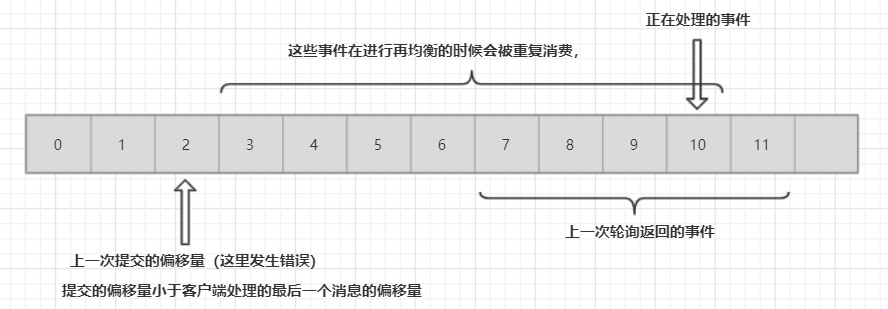

如果提交的偏移量大于客户端处理的最后一个消息的偏移量，那么处于两个偏移量之间的消息就会丢失：

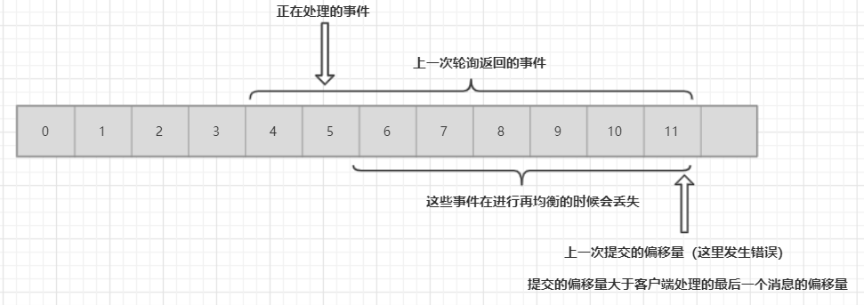

**`KafkaConsumer`**提供了很多种方式来提交偏移量，

#### 自动提交

最简单的方式就是让消费者自己提交偏移量，

~~~properties
enable.auto.commit = true 
auto.commit.interval.ms = 5000  # 提交时间间隔
# 如果设置了上面的两个参数，消费者会自动把poll()方法接收到的最大偏移量提交上去，自动提交也是在轮询里完成的，消费者每次在进行轮询的时候会检查是否提交该偏移量了，如果是，将上次轮询得到的偏移量提交上去。
~~~


使用这提交方式，会带来一定的问题：假如我们使用默认的5s提交时间间隔，在最近的一次提交之后的3s发生了再均衡，再均衡之后消费者从最后一次提交的偏移量位置开始读取消息，这个时候偏移量已经落到了3s，所以在这3s内到达的消息就会被重复处理（简单点的意思就是说，5s之前提交的偏移量，然后拿到了新的数据消费，消费了3s，这个时候，发生了再均衡，再次获取到当前分区的消费者会从上一次提交的位置，也即3s前重新获取数据消费）。可以通过修改提交时间间隔来更频繁的提交偏移量。

在使用自动提交的时候，每次调用轮询方法都会把上一次调用返回的偏移量提交上去，他并不知道具体哪些消息被处理了，所以在再次调用之前最好确保所有当前调用返回的消息都已经处理完毕(在调用close（）方法的时候也会自动提交)，一般没有什么问题，不过在处理异常或提前提出轮询的时候要格外的小心

#### 提交当前偏移量

多数开发者通过控制偏移量提交时间来消除丢失消息的可能性，并在发生在均衡的时候减少重复消息的数量，消费者API提供了提交当前偏移量的方式：

~~~properties
enable.auto.commit = false
# 让应用程序决定何时提交偏移量，使用commitSync()提交偏移量最简单，也最可靠，这个API会提交由poll()方法返回的最新偏移量，提交成功马上返回，失败了爆出异常。
~~~

`commitSync()`将会提交由poll()返回的最新偏移量，所以在处理完所有的记录之后，要确保调用了`commitSync()`，否则还有丢失消息的风险，如果发生再均衡，从最近一批消息到发生再均衡之间的所有消息都将被重复处理。代码演示如下：

~~~java
try{
    while( true ){
        //拉取数据
        ConsumerRecords<String, String> records = consumer.poll(100);
        for (ConsumerRecord<String, String> record : records) {
            System.out.printf("topic = %s,partition = %s,offset = %s,key = %s,value = %s\n",
                    record.topic(),record.partition(),record.offset(),record.key(),record.value());
        }
        try {
            consumer.commitSync(); // 处理完当前批次的消息，在轮询更多的消息之前，在调用该方法提交当前批次最新的消息
        }catch (CommitFailedException e){
            e.printStackTrace();
        }
    }
}finally {
    consumer.close();
}
~~~

只要没有发生不可恢复的错误，`commitSync()`方法会一直尝试提交直到提交成功，如果提交失败，我们也只能将异常记录到错误日志中去。

### 异步提交

手动提交的时候，在broker对请求提交没有做出反应之前，应用程序会一直阻塞在那里，这样会限制应用程序的吞吐量，如果降低提交频率提升吞吐，如果发生了再均衡，会增加重复消费的数量。我们可以使用异步提交的API，直观发送提交请求，无序等待broker的响应。

~~~java
try{
    while( true ){
        //拉取数据
        ConsumerRecords<String, String> records = consumer.poll(100);
        for (ConsumerRecord<String, String> record : records) {
            System.out.printf("topic = %s,partition = %s,offset = %s,key = %s,value = %s\n",
                    record.topic(),record.partition(),record.offset(),record.key(),record.value());
        }
        consumer.commitAsync();
    }
}finally {
    consumer.close();
}
~~~


在成功提交或者碰到了无法恢复的错误之前，`commitSync`会一直进行重试，但是`commitAsync`不会，之所以不进行重试是因为她在收到了服务器的响应之后，还有可能有一个更大的偏移量需要提交，如果重试提交小的偏移量可能会覆盖大的偏移量，从而导致数据的重复消费。异步提交支持回调，回调经常用于记录提交错误或生成度量指标，在应用于重试的时候，一定要注意提交的顺序。

~~~java
while( true ){
    //拉取数据
    ConsumerRecords<String, String> records = consumer.poll(100);
    for (ConsumerRecord<String, String> record : records) {
        System.out.printf("topic = %s,partition = %s,offset = %s,key = %s,value = %s\n",
                record.topic(),record.partition(),record.offset(),record.key(),record.value());
    }
//                consumer.commitAsync();
    consumer.commitAsync((offsetAndMetadataMap,e)->{
        if (e != null){
            logger.error("commit failed for offsets{}",offsetAndMetadataMap,e);
        }
    });
}
~~~

#### 重试异步提交

我们可以使用一个单调递增的序列号来维护异步提交的顺序，在每次提交偏移量之后或在回调里提交偏移量时**递增序列号**。在进行重试之前，先检查回调的序列号和即将提交的偏移量是否相等，如果相等，说明没有新的提交，可以重试，如果序列号比较大，说明有一个新的提交已经发送出去了，应该停止重试。

### 提交特定的偏移量

消费者API 允许你在有调用**`commitSync和commitAsync`的时候传入希望提交的分区和偏移量的map。

~~~java
HashMap<TopicPartition, OffsetAndMetadata> currentOffsets = new HashMap<>();

while(true){
    //拉取数据
    ConsumerRecords<String, String> records = consumer.poll(100);
    for (ConsumerRecord<String, String> record : records) {
        System.out.printf("topic = %s,partition = %s,offset = %s,key = %s,value = %s\n",
                record.topic(),
                record.partition(),
                record.offset(),
                record.key(),
                record.value());
        //  在读取每条记录之后，使用期望处理的下一个消息的偏移量来更新Map里的偏移量，下一次就从这里开始读取消息。
        currentOffsets.put(new TopicPartition(record.topic(),record.partition()),
                new OffsetAndMetadata(record.offset() + 1,"no metadata"));
    }
    // 我们决定每处理1000条消息句提交一次偏移量，在实际的开发中，你可以根据时间或者是记录的内容进行提交
    if (count % 1000 == 0) consumer.commitAsync(currentOffsets,null);
    count ++;
}
~~~

### 再均衡监听器

消费者在进行退出和分区再均衡之前，会做一些清理工作，在消费者失去对一个分区的所有权之前提交最后一个已经处理记录的偏移量，如果消费者准备了一个缓冲区用于处理偶发的事件，那么在失去分区所有权之前，需要处理在缓冲区所有权之前，需要处理在缓冲区积累下来的记录，你可能还需要关闭文件句柄，数据库连接等。

### 从特定的偏移量开始处理记录

到现在，我们已经知道了如何使用poll()方法从各个分区的最新偏移量处开始处理消息，有时候我们也需要从特定的偏移量处开始读取消息。应用程序从`kafka`读取事件，对他们进行处理，然后把结果保存到数据库，NoSQL存储引擎或者是Hadoop，假设我们不想丢失任何数据，也不想在数据库里多次保存相同的结果。

~~~java
while(true){
    ConsumerRecords<String, String> records = consumer.poll(100);
    for (ConsumerRecord<String, String> record : records) {
        currentOffsets.put(new TopicPartition(record.topic(),record.partition()),
                          new OffsetAndMetadata(record.offset() + 1);
		processRecord(record);
		storeRecordDB(record);
		consumer.commitAsync(currentOffsets);
    }
}
~~~

在上述的例子中，每处理一个记录就提交一个偏移量，在记录被保存到数据库之后以及偏移量被提交之前，应用程序还有可能发生崩溃，导致重复处理数据，数据库里会出现重复的记录。如果保存记录和偏移量可以在 一个原子操作里完成，就可以避免上述的情况。如果是记录保存在数据库里面，而偏移量是提交到Kafka上，那么就无法实现原子操作。不过在同一事务里把记录和偏移量都写到数据库里，我们就会知道记录和偏移量要么都成功提交，要么都没有，然后重新处理记录。

现在的问题是：如果偏移量是保存到了数据库里而不是Kafka里，那么消费者在得到了新分区的时候怎么知道该从哪里开始读取呢？这个时候可以使用seek方法，在消费者启动或分配到新分区时，可使用**seek()**方法查找保存到数据库里的偏移量。使用***`ConsumerRebalanceListener`*** 和***seek()***方法确保我们是从数据库里保存的偏移量所指定的位置开始处理消息的。

~~~java
public class SaveOffsetOnRebalance implements ConsumerRebalanceListener {
    @Override
    public void onPartitionsRevoked(Collection<TopicPartition> partitions) {
// 提交数据库事务，大致的想法是：在处理完记录之后，将记录和偏移量插入数据库，然后在即将失去分区所有权之前提交事务，确保成功保存了这些信息
        commmitDBTranscation();
    }
    @Override
    public void onPartitionsAssigned(Collection<TopicPartition> partitions) {
        for (TopicPartition partition : partitions) {
// 另外一个虚构的方法，来从数据库中获取偏移量，在分配到分新分区的时候，使用seek()方法定位到那些记录
            consumer.seek(partition,getOffsetFromDB(partition));
        }
    }
}

consumer.subcribe(topics,new SaveOffsetOnRebalace(consumer));
consumer.poll(0);

for(TopicPartiton partition : consumer.assiginment()){
    // 在订阅主题之后，开始启动消费者，调用poll（）方法，让消费者加入到消费者群组里，并获取分配到的分区，马上调用seek方法定位分区的偏移量，seek方法只更新我们正在使用的位置，在下一次调用poll方法的时候就可以获得正确的小分析，如果seek发生错误，poll就抛出异常
    consumer.seek(partiton,getOffsetFromDB(partition))
}
while(true){
    ConsumerRecords<String,String> records = consumer.poll(100);
     for (ConsumerRecord<String, String> record : records) {
     	processRecord(record);
        storeRecordInDB(record);
        
        // 另外一个虚构的方法，这次要更新的是数据库里用于保存偏移量的表，假设更新的速度非常快，所以每条记录都需要更新一次数据库，但提交的速度比较慢，所以只在每个批次末尾提交一次，这里可以用很多方式优化。
        storeOffsetInDB(record.topic(),record.partition(),record.offset());
     }
    commitDBTracsaction();
}
~~~


## Kafka Streams

流式数据：没有边界的数据。

事件事件：事件时间指的是所追踪事件发生时间和记录的创建时间。0.10.0 之后生产者会自动在记录中添加记录的创建时间，那么如果Kafka的记录是基于事件发生之后数据库记录创建的怎么办？需要自己设置时间戳字段了。

## 集群配置

~~~shell
broker.id=0   # broker的全局唯一编号

# 删除topic功能使能
delete.topic.enable=true

#处理网络请求的线程数量
num.network.threads=3

#用来处理磁盘IO的现成数量
num.io.threads=8

# The maximum size of a request that the socket server will accept (protection against OOM)
socket.request.max.bytes=104857600

# Kafka运行日志存放的路径
log.dirs=

# topic在当前broker上的分区个数
num.partitions=1

# 用来恢复和清理data下数据的线程数量
num.recovery.threads.per.data.dir=1

offsets.topic.replication.factor=1
transaction.state.log.replication.factor=1
transaction.state.log.min.isr=1
log.retention.hours=168
log.segment.bytes=1073741824
 an optional chroot string to the urls to specify the
# root directory for all kafka znodes.
zookeeper.connect=localhost:2181

# Timeout in ms for connecting to zookeeper
zookeeper.connection.timeout.ms=6000
~~~


## `kafka` 的命令行命令

* 启动`kafka`

  ~~~shell
  # 在启动kafka之前，需要先启动zookeeper，对于本机的测试来说，需要启动zookeeper集群（三台），只需要启动一个kafka即可。
  [isea@hadoop101 kafka]$ bin/kafka-server-start.sh config/server.properties &
  ~~~

* 查看当前服务器的所有的主题

  ~~~shell
  [isea@hadoop101 kafka]$ bin/kafka-topics.sh --zookeeper hadoop101:2181 --list
  ~~~

* 创建``zhbr`` 主题

  ~~~shell
  bin/kafka-topics.sh --zookeeper hadoop101:2181 --create --replication-factor 3 --partitions 1 --topic zhbr # 该主题有一个分区，三个副本
  
  # 查看主题的详情：
  bin/kafka-topics.sh --zookeeper hadoop101:2181 --describe --topic zhbr
  
  # 修改分区数量，可以增加，不可以减少
  bin/kafka-topics.sh --zookeeper M1:2181  --alter --topic seconddata-topic --partitions 3
  ~~~

  副本数量3，分区数量1，主题的名字zhbr

* 删除主题``zhbr``

  ~~~shell
  bin/kafka-topics.sh --zookeeper hadoop101:2181 --delete --topic zhbr
  ~~~

  server.properties 中的设置 ``delete.topic.enable=true`` 表明这是实际的删除。 

* 在Hadoop101中生产数据，在Hadoop102 中消费数据，连接zookeeper获取offset，也可以直接从bootstarp中获取offset数据。

  ~~~shell
  # Hadoop101生产：
  [isea@hadoop101 kafka]$bin/kafka-console-producer.sh --broker-list hadoop101:9092 --topic first
  
  bin/kafka-console-producer.sh --broker-list M1:9092 --topic redis-topic
  
  # Hadoop102消费：
  [isea@hadoop102 kafka]$ bin/kafka-console-consumer.sh --zookeeper hadoop101:2181 --from-beginning --topic first
  
  [isea@hadoop102 kafka]$ bin/kafka-console-consumer.sh --bootstrap-server hadoop101:9092 --topic first
  
  
  # 数据的消费 --from-beginning会将主题中以往的数据都读出来
  bin/kafka-console-consumer.sh --bootstrap-server hadoop101:9092 --from-beginning --topic first
  ~~~

* 查看主题的详情信息

  ~~~shell
  # 这里为什么要连接zookeeper呢？ 因为kafka依赖zookeeper，kafka在启动的时候会写入broker的id信息，分区信息，主题信息等，consumer还可以将消费的offset存到zookeeper中。
  [isea@hadoop101 kafka]$ bin/kafka-topics.sh --zookeeper hadoop101:2181 --describe --topic first
  Topic:first	PartitionCount:3	ReplicationFactor:3	Configs:
  	Topic: first	Partition: 0	Leader: 3	Replicas: 3,1,2	Isr: 3,2,1
  	Topic: first	Partition: 1	Leader: 1	Replicas: 1,2,3	Isr: 3,2,1
  	Topic: first	Partition: 2	Leader: 2	Replicas: 2,3,1	Isr: 3,2,1
  	
  
  # 进入zookeeper（也就是进入zookeeper的cli之后），
  ls /consumers  # 即可看到消费者组的信息
  console-consumer-2912
  
  # 然后可以在kafka中查看数据的偏移量
  bin/kafka-consumer-offset-checker.sh --zookeeper hadoop101:2181 --group console-consumer-2912
  ~~~


`ISR (In Sync Replication)` 正在同步的副本，3,2，2 表示的是这三者都在同步副本。

[关于kafka的ISR，和数据存储的位置](<https://blog.csdn.net/qq_31807385/article/details/84948701>)

## 数据生产

### 数据写入的方式

producer采用推（push）模式将消息发布到broker，每条消息都被追加（append）到分区（partition）中，属于顺序写磁盘（顺序写磁盘效率比随机写内存要高，保障`kafka`吞吐率）。

### partition

消息发送时都被发送到一个topic，其本质就是一个目录，而topic是由一些Partition Logs(分区日志)组成，其组织结构如下图所示：

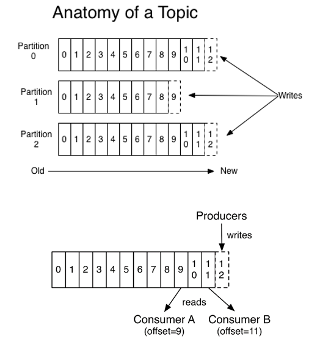

每个Partition中的消息都是有序的，生产的消息被不断追加到Partition log上，其中的每一个消息都被赋予了一个唯一的offset值。

#### partition的原因

1. 负载能力的提升，如果没有分区，大量的数据涌向同一台机器，压力是比较大的
2. 可以提高并发能力，因为可以以partition为单位进行读写数据了

#### partition 的原则

1. 如果指定了partition的话，直接使用

2. 没有指定partition，但是指定了key，可以通过key的value值hash出一个partition

3. partition和key都没有指定的话，使用轮询的方式选择出一个partition，下面是默认的partition类：

   ~~~java
   public int partition(String topic, Object key, byte[] keyBytes, Object value, byte[] valueBytes, Cluster cluster) {
           List<PartitionInfo> partitions = cluster.partitionsForTopic(topic);
           int numPartitions = partitions.size();
           if (keyBytes == null) {
               int nextValue = nextValue(topic);
               List<PartitionInfo> availablePartitions = cluster.availablePartitionsForTopic(topic);
               if (availablePartitions.size() > 0) {
                   int part = Utils.toPositive(nextValue) % availablePartitions.size();
                   return availablePartitions.get(part).partition();
               } else {
                   // no partitions are available, give a non-available partition
                   return Utils.toPositive(nextValue) % numPartitions;
               }
           } else {
               // hash the keyBytes to choose a partition
               return Utils.toPositive(Utils.murmur2(keyBytes)) % numPartitions;
           }
       }
   ~~~

### 副本replication

保证数据的安全。没有replication的情况下，一旦broker宕机，其上所有`patition `的数据都不可被消费，同时producer也不能再将数据存于其上的`patition`。引入replication之后，同一个partition可能会有多个replication，而这时需要在这些replication之间选出一个leader，producer和consumer只与这个leader交互，其它replication作为follower从leader 中复制数据。

#### ISR

Leader维护了一个动态的in-sync replica set(ISR)，**意为和leader保持同步的follower集合。**当ISR中的follower完成数据的同步之后，leader就会给producer发送`ack`。如果follower长时间未向leader同步数据，则该follower将被踢出ISR，该时间阈值由**replica.lag.time.max.ms**参数设定。**Leader发生故障之后，就会从ISR中选举新的leader。**

#### LEO，HW

LEO : 每个副本的最后一个offset（所面临的对象是每个副本）；HW：所有副本中的最小的LEO（所面临的对象是所有的副本）

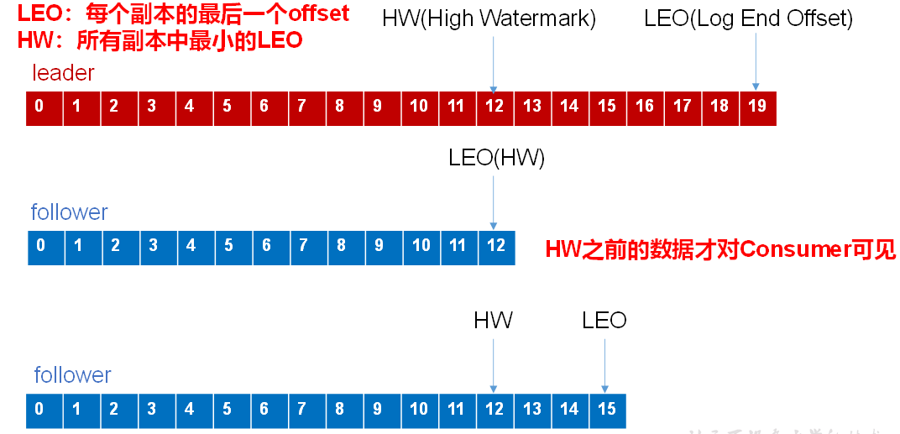

## 数据写入流程

### 流程：

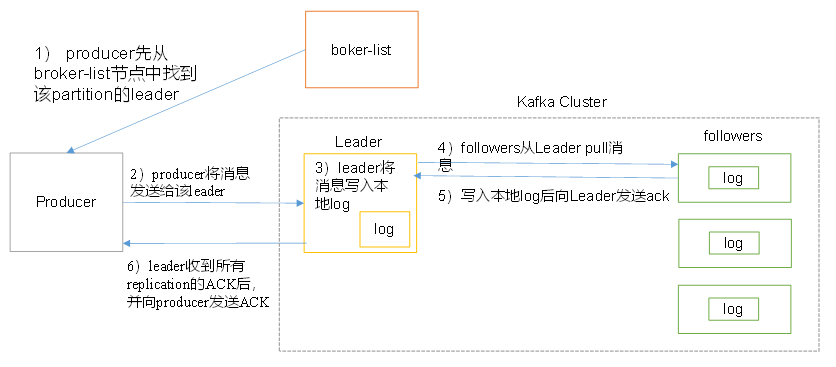

### kafka的ack机制

（request.requred.acks）：

* 0：producer不等待broker的ack，broker一接收到还没有写入磁盘就已经返回，当broker故障时有可能丢失数据；
* 1：producer等待broker的ack，partition的leader落盘成功后返回ack，如果在follower同步成功之前leader故障，那么将会丢失数据；
* -1：producer等待broker的ack，partition的leader和follower全部落盘成功后才返回ack，数据一般不会丢失，延迟时间长但是可靠性高。

## 数据保存方式

物理上把topic分成一个或多个patition（对应 server.properties 中的num.partitions=3配置），每个patition物理上对应一个文件夹（该文件夹存储该patition的所有消息和索引文件），在log文件夹里面：

~~~shell
[isea@hadoop101 kafka]$ cd logs/
[isea@hadoop101 logs]$ ll
总用量 18152
drwxrwxr-x. 2 isea isea   4096 7月   7 22:07 calllog-0
drwxrwxr-x. 2 isea isea   4096 7月   7 22:07 calllog-1
drwxrwxr-x. 2 isea isea   4096 7月   7 22:07 calllog-2
~~~

kafka读取消息的时间复杂度是O（1），无论kafka中的数据有没有被消费，kafka都会保留所有消息。有两种策略可以删除旧数据：

1. 基于时间：log.retention.hours=168
2. 基于大小：log.retention.bytes=1073741824

## 数据消费

`kafka`提供了两套`consumerAPI`：

1. 高级`ConsumerAPI`
2. 低级Consumer API

### 高级API

#### 高级API优点

1. 高级API 写起来简单
2. 不需要自行去管理offset，系统通过zookeeper自行管理。
3. 不需要管理分区，副本等情况，系统自动管理。

消费者断线会自动根据上一次记录在zookeeper中的offset去接着获取数据；可以使用group来区分对同一个topic 的不同程序访问分离开来（不同的group记录不同的offset，这样不同程序读取同一个topic才不会因为offset互相影响）

#### 高级API缺点

1. 不能自行控制offset（对于某些特殊需求来说）
2. 不能细化控制如分区、副本、zk等

### 低级API

#### 低级 API 优点

* 能够让开发者自己控制offset，想从哪里读取就从哪里读取。
* 自行控制连接分区，对分区自定义进行负载均衡
* 对zookeeper的依赖性降低（如：offset不一定非要靠zk存储，自行存储offset即可，比如存在文件或者内存中）

#### 低级 API 缺点

* 太过复杂，需要自行控制offset，连接哪个分区，找到分区leader 等

### 消费者组

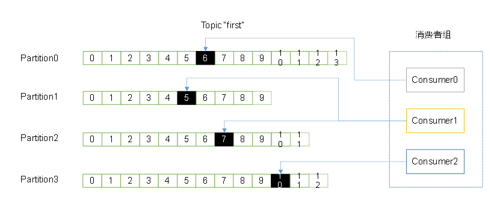

消费者是以consumer group消费者组的方式工作，由一个或者多个消费者组成一个组，共同消费一个topic。

### 消费方式

consumer采用pull（拉）模式从broker中读取数据。

push（推）模式很难适应消费速率不同的消费者，因为消息发送速率是由broker决定的。它的目标是尽可能以最快速度传递消息，但是这样很容易造成consumer来不及处理消息，典型的表现就是拒绝服务以及网络拥塞。而pull模式则可以根据consumer的消费能力以适当的速率消费消息。

对于Kafka而言，pull模式更合适，它可简化broker的设计，consumer可自主控制消费消息的速率，同时consumer可以自己控制消费方式——即可批量消费也可逐条消费，同时还能选择不同的提交方式从而实现不同的传输语义。

pull模式不足之处是，如果kafka没有数据，消费者可能会陷入循环中，一直等待数据到达。为了避免这种情况，我们在我们的拉请求中有参数，允许消费者请求在等待数据到达的“长轮询”中进行阻塞（并且可选地等待到给定的字节数，以确保大的传输大小）

## Kafka API的使用

### Kafka生产者API

**准备：** 启动zk和kk集群，并打开一个消费者，如在Hadoop101上打开一个消费者。

~~~shell
[isea@hadoop101 kafka]$ bin/kafka-console-consumer.sh --zookeeper hadoop101:2181 --topic first
~~~

**测试：**

~~~java
// 自定义分区规则
package com.zhbr.producer.partition;

import org.apache.kafka.clients.producer.Partitioner;
import org.apache.kafka.common.Cluster;

import java.util.Map;

public class MyPartition implements Partitioner {

    @Override
    public int partition(String topic, Object key, byte[] keyBytes, Object value, byte[] valueBytes, Cluster cluster) {
        return 2; // 对于分区规则的测试
    }

    @Override
    public void close() {

    }

    @Override
    public void configure(Map<String, ?> configs) {
    }
}

// Kafka的生产者API 

package com.zhbr.producer;

import org.apache.kafka.clients.producer.*;

import java.util.Properties;

public class TestProducer {
    public static void main(String[] args) {
        // 创建配置对象
        Properties properties = new Properties();

        // 配置kafka集群
        properties.setProperty(ProducerConfig.BOOTSTRAP_SERVERS_CONFIG,"hadoop101:9092,hadoop102:9092,hadoop103:9092");

        // 序列化
        properties.setProperty(ProducerConfig.KEY_SERIALIZER_CLASS_CONFIG,"org.apache.kafka.common.serialization.StringSerializer");
        properties.setProperty(ProducerConfig.VALUE_SERIALIZER_CLASS_CONFIG,"org.apache.kafka.common.serialization.StringSerializer");

        // 配置ACK应答机制
        properties.setProperty(ProducerConfig.ACKS_CONFIG,"all");

        // 指定分区类 ，这里使用默认的分区
         properties.setProperty(ProducerConfig.PARTITIONER_CLASS_CONFIG, "com.zhbr.producer.partition.MyPartition");

        // 创建kafka生产者
        KafkaProducer<String, String> producer = new KafkaProducer<String, String>(properties);

        // 主题
        String topic = "first";

        // 待发送的数据
        String value = "where are you. i want to find you..";

        // 封装数据
        ProducerRecord<String, String> record = new ProducerRecord<>(topic, value);

        // 同步发送数据
        //producer.send(record);
        // 同步发送数据，只要添加了get方法就是同步操作，因为get是Future的方法。
        //producer.send(record).get(); 该方法需要捕获或者是声明异常

        // 使用异步的方法发送数据，并添加回调函数
        producer.send(record, new Callback() {
            @Override
            public void onCompletion(RecordMetadata metadata, Exception exception) {

                // value数据放置的分区
                System.out.println("数据存放的分区：" + metadata.partition());

                // value值对应存放的offset
                System.out.println("数据存放的offset：" + metadata.offset());
            }
        });

        producer.close();
    }
}
~~~

### Kafka消费者API

**准备：** 在控制台中创建生产者：

~~~~shell
[isea@hadoop101 kafka]$ bin/kafka-console-producer.sh --broker-list hadoop101:9092 --topic first
~~~~

#### 高级ConsumerAPI

~~~java
package com.zhbr.consumer;

import org.apache.kafka.clients.consumer.ConsumerConfig;
import org.apache.kafka.clients.consumer.ConsumerRecord;
import org.apache.kafka.clients.consumer.ConsumerRecords;
import org.apache.kafka.clients.consumer.KafkaConsumer;

import java.util.Arrays;
import java.util.Properties;

public class TestHighConsumer {
    public static void main(String[] args) {

        // 创建配置对象
        Properties properties = new Properties();

        // 指定kafka服务的地址，不需要将所有的broker都写上
        properties.setProperty(ConsumerConfig.BOOTSTRAP_SERVERS_CONFIG,"hadoop101:9092");

        // 指定key和value的序列化
        properties.setProperty(ConsumerConfig.KEY_DESERIALIZER_CLASS_CONFIG,"org.apache.kafka.common.serialization.StringDeserializer");
        properties.setProperty(ConsumerConfig.VALUE_DESERIALIZER_CLASS_CONFIG,"org.apache.kafka.common.serialization.StringDeserializer");

        // 设置消费者组
        properties.setProperty(ConsumerConfig.GROUP_ID_CONFIG,"zhbr");

        properties.put("zookeeper.session.timeout.ms", "500");
        properties.put("zookeeper.sync.time.ms", "250");
        properties.put("auto.commit.interval.ms", "1000");

        // 创建消费者
        KafkaConsumer<String, String> consumer = new KafkaConsumer<>(properties);

        // 订阅主题
        consumer.subscribe(Arrays.asList("first"));

        while(true){
            // consumer从kafka消息队列中拉取数据
            ConsumerRecords<String, String> records = consumer.poll(500);
            for (ConsumerRecord<String, String> record : records) {
                System.out.println(record.partition() + ","+ record.offset() + "," + record.key() + "," + record.value()); // 可以读取到数据存储的分区，offset等信息。
            }
        }
    }
}
~~~

#### 低级ConsumerAPI

~~~java
package com.zhbr.consumer;


import kafka.api.FetchRequest;
import kafka.api.FetchRequestBuilder;
import kafka.cluster.BrokerEndPoint;
import kafka.javaapi.*;
import kafka.javaapi.consumer.SimpleConsumer;
import kafka.javaapi.message.ByteBufferMessageSet;
import kafka.message.MessageAndOffset;

import java.io.UnsupportedEncodingException;
import java.nio.ByteBuffer;
import java.util.Arrays;
import java.util.List;

public class TestLowConsumer {
    public static void main(String[] args) throws UnsupportedEncodingException {

        /**
         * 使用低级API消费指定topic，指定partition，指定offset的数据：
         * 使用低级消费者API的步骤：
         *  ①：获取某个topic的partition的leader节点
         *  ②：根据获得的leader信息，消费指定partition下的指定offset的数据
         */

        // leader节点
        BrokerEndPoint leader = null;

        // 种子节点
        String host = "hadoop101";
        int port = 9092;

        // 目标主题
        String topic = "first";

        // 获取分区的leader节点
        SimpleConsumer metaConsumer = new SimpleConsumer(host, port, 500, 1024 * 1024, "metaData");

        // 获取元数据信息 , recommended 用来测试
        TopicMetadataRequest metadataRequest = new TopicMetadataRequest(Arrays.asList(topic,"recommended"));
        TopicMetadataResponse metadataResponse = metaConsumer.send(metadataRequest);

        // 获取所有的主题信息
        List<TopicMetadata> topicMetadata = metadataResponse.topicsMetadata();


        leadLabel:
        for (TopicMetadata topicMetadatum : topicMetadata) {
            if (topic.equals(topicMetadatum.topic())){
                // 获取关心的主题（first）下的所有的分区信息
                List<PartitionMetadata> partitionMetadata = topicMetadatum.partitionsMetadata();
                // 获取指定的partition
                for (PartitionMetadata partitionMetadatum : partitionMetadata) {
                    // 获取partitionID
                    int id = partitionMetadatum.partitionId();
                    if (2 == id){
                        // 获取指定partition的Leader
                        leader = partitionMetadatum.leader();
                        System.out.println(leader);
                        break leadLabel;
                    }
                }
            }
        }

        if (leader == null){
            System.out.println("分区信息有误...");
            return;
        }

        // 指定的partition对应的broker的leader信息
        SimpleConsumer consumer = new SimpleConsumer(leader.host(), leader.port(), 500, 1024 * 1024, "Leader");

        // 消费者抓取数据
        FetchRequest request = new FetchRequestBuilder().addFetch(topic, 2, 5, 1024 * 5).build();
        FetchResponse response = consumer.fetch(request);

        ByteBufferMessageSet messageSet = response.messageSet(topic,2);
        for (MessageAndOffset messageAndOffset : messageSet) {
            ByteBuffer byteBuffer = messageAndOffset.message().payload();
            byte[] bs = new byte[byteBuffer.limit()];
            byteBuffer.get(bs);//将数据放入到字节数据中去
            String value = new String(bs,"UTF-8");
            System.out.println(value);
        }
    }
}
~~~

## 深入`kafka`

### 集群成员关系

Kafka通过zookeeper来维护集群成员的信息，在broker启动的时候通过创建**临时节点**把自己的id注册到zookeeper中，Kafka组件订阅**`zookeeper的/brokers/ids`** 。

### 控制器

其实就是一个broker，负责分区leader的选取，第一个启动的broker通过在zookeeper中创建**临时节点/controller**，其他节点启动的时候也尝试创建该节点，但是他们会收到**“节点已存在”**的异常，然后其他的broker会在控制器节点上创建zookeeper watch对象，来接收该节点变更的通知。

Kafka通过zookeeper的零时节点来选举控制器，并在节点新加入或退出时通知控制器，使用epoch来避免脑裂（两个节点同时认为自己是当前的控制器）

### 复制

复制功能是Kafka的核心。副本有两种类型：

* 首领副本
* 跟随者副本


## 为什么`Kafka`能够实现高吞吐？

### 顺写日志与零拷贝

Java应用程序复制文件的原理：

使用java实现对文件A的拷贝，为B，A ,B两个文件都是属于系统的，所以呢这里由应用层的`JavaApplication`来完成这个操作，在java中创建`BufferInputStream`将A文件读取过来，记为RB（缓冲）所以在java的应用中有 一个缓冲区，如下图：

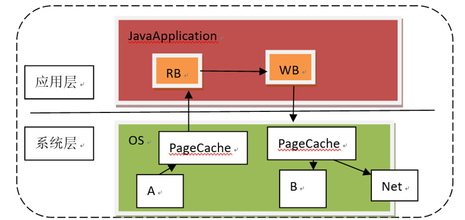

实际上，我们的系统层在和别的层做交互的时候，为了提高效率，也会有一个缓冲区，因为系统层在和别的层级进行交互的时候涉及到两个层级的交互，效率是非常的慢的，这有些像CPU和内存的交互速度差异很大，cpu 和硬磁盘的交互也速度差异也很大，因此计算机的内存模型有四层（早期的时候CPU和硬盘直接交互的，后来，增加了内存，缓存等层级） 计算机的内存模型如下

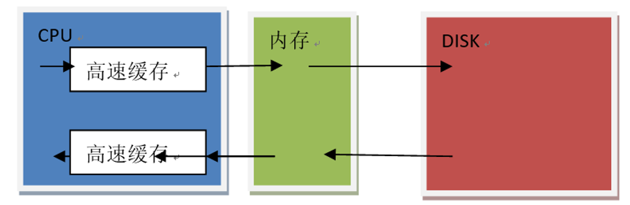 

 

上面我们提到的OS的缓存我们称之为`PageCache`，文件A的内容先读到`PageCache`中，然后到达RB，此时java程序拿到了流，要进行写操作，所以此时有一个WB（`writebuffer`）然后..才到B文件，这就完成了文件的拷贝工作，我们假设这里不是文件的拷贝而是文件的传输，在 `PageCache`之后，还有一个`NetCache（`网卡的缓存）所以这里要拷贝四次，假如有10个消费者要读取数据，就4 * 10 = 40次，这不可能快的起来

`kafka`，对这个文件的缓存做了极大的改善，如下：`kafka`只是向OS发出了一个指令，告知OS这个文件要传输到哪里去，并不对数据进行拷贝。只是将A中的数据拷贝到`PageCache`中去，如下图

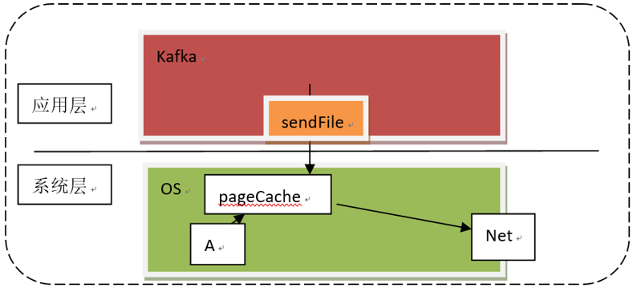

这叫做`kafka`的顺写日志，由于`kafka`没有对数据 进行复制，这涉及到②零复制，`kafka`发送一个操作系统级别的指令，`sendFile`，（和`redis`中的fork指令一样，就是在`redis`在创建`rdb`的时候，`redis`会创建一个分支进程，这个进程会将当前的缓存数据保存到一个文件中，这个过程靠的就是fork这个底层的指令 ）很多的框架为了提到效率和我们的OS 打交道，这样的话性能是很高的，比如`juc`的`copyOnWriteAarrayList`所以在`kafka`中，生产者生产完数据之后，不是OS产生数据，在到Java，在到OS，`kafka`会直接直接顺写到磁盘，即生产完数据之后，直接发指令到OS将数据写到磁盘中去。

### 分段日志：

分段日志 segment（其实在`juc`中也类似的应用，叫做`currentHashMap`使用的就是分段锁，分段锁就是把每一个小格子加了一把锁，来提到并发访问的能力）在`kafka`形成日志的时候，实际上也是在以分区的形式保存着数据信息，在分区中的信息如下：

 ~~~shell
├── first-0 
│ ├── 00000000000000000000.index 
│ ├── 00000000000000000000.log 
│ ├── 00000000000000000000.timeindex 
│ └── leader-epoch-checkpoint
├── first-1 
│ ├── 00000000000000000000.index
│ ├── 00000000000000000000.log
│ ├── 00000000000000000000.timeindex 
│ └── leader-epoch-checkpoint
├── first-2 
│ ├── 00000000000000000000.index
│ ├── 00000000000000000000.log
│ ├── 00000000000000000000.timeindex
│ └── leader-epoch-checkpoint
# 00000000000000000000.log里面存放着数据（共20个零），如： 
[isea@hadoop108 first-2]$ strings 00000000000000000000.log  
kafka 
 ~~~

在分区中，这个00000000000000000000.log会随着数据的增加，而产生新的文件，比如，文件记录10条数据会产生一个新文件，

 ~~~shell
00000000000000000000.log  
00000000000000000010.log 
00000000000000000020.log 
 ~~~

假如我现在要找第12条数据，那么消费者就不需要从头开始遍历，而是直接定位在（10<12<20）00000000000000000010.log里面找。另外，每一个文件还有一个index文件：这个文件专门来记录索引值的，索引值能帮助我们快速的定位到我们数据的位置

 ~~~shell
00000000000000000000.log  
00000000000000000000.index  

00000000000000000010.log 
00000000000000000010.index   

00000000000000000020.log 
00000000000000000020.index 
 ~~~

假设这里面我们寻找第12条数据，首先按照文件的名字计算10<12<20,那么在`00000000000000000010.log`中，大范围确定了，但是具体在哪里呢？ 假设`00000000000000000010.log`中数据是这样存储的， 

~~~shell
1 iseayou  
2 isea 
3 ilvoeyou 
~~~

实际的数据是这样的：

~~~shell
1iseayou2isea3ilvoeyou
~~~

那么这个时候，我们怎么知道数据在哪里呢？所以我们使用`00000000000000000010.index `这个文件中存放着偏移量和所对应的字节的位置，是一份键值对的形式这里是

~~~shell
1 0 
2 9 
3 14 
~~~

找2，那么直接从9的位置开始读，所以就会非常的快，所以追加到partition log中的每一个消息都有一个消息编号来表示这是第多少条消息，还有都会有一个唯一的offset的值，就是这里的0，9 ，14，在深究一下，还有一个问题，从9开始读，读多长或者说是读到哪里停止呢？这个时候涉及到`kafka`对于数据存储，`kafka`是按照k,v存储数据的，消息有固定的格式，这个格式中可以根据key，v的长度信息来计算出value的长度，从而做消费数据的时候，读到读完该条消息就停止了。我们发现kafka将数据分成了好几个文件，形成如下的形式：

~~~shell
00000000000000000000.log  
00000000000000000010.log
00000000000000000020.log 
~~~

而不是将一个数据作为一个整体，这就是分段日志。

### 预读和预写

read ahead， write behind，预读就是在读取某一条数据的时候，并不是单纯的将数据读完，因为（读数据，也可能读周边的数据，也即局部性原理）于是在读本条数据的同时就顺便把周边的数据也读出来放到缓存中；后写：java生成文件是先放到缓存中，然后在到OS系统的文件中，而`kafka`会直接将数据写到OS的缓冲中，再由OS自己来决定什么时候把数据变成文件。两者都是讲数据放到文件中，区别在于两个层级的交互：java程序中，数据先到buffer，然后在跨层级写到OS的文件中（这个过程是很慢的额）而`kafka`是将数据直接传输到OS的缓存，然后OS做同一个层级的写交互，是非常快的。

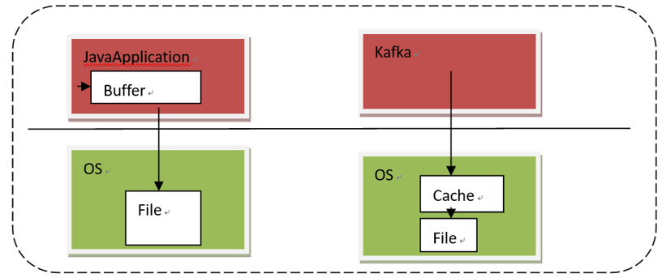


##  源码分析

### 生产者源码：


具体的源码在IDEA中使用了bookmarks进行了标准。

 

## Kafka Connect

[参考链接](<https://howtoprogram.xyz/2016/07/10/apache-kafka-connect-example/>)

### 数据管道

数据管道：实时的生产者和基于批处理的消费者可以同时存在，`kafka`的解耦的特点`kafka`的回压策略：在必要的时候，可以延后向生产者发送确认。多数系统允数据丢失，没什么要紧的，不过大多数情况下，他们要求有至少一次传递，也即源系统的每一个事件都需要到达目的地，不过有时候需要进行重试，而重试可能造成数据重复消费。

Kafka本身就可以保证**至少一次传递**，Connect API 为继承外部系统提供了处理偏移量的API，连接器因此可以构建仅一次传递的端到端的数据管道。实际上很多的开源的连接器都支持仅一次传递。

在向Kafka写入数据或者从Kafka读取数据的时候，要么使用传统的生产者或者是消费者客户端，要么使用Connect API和连接器。什么使用适用哪一个？

Kafka的客户端是要嵌入到应用程序之中的，应用程序使用他们向Kafka写入数据或从Kafka读取数据，如果你是开发人员，你会使用Kafka Client将应用程序连接到Kafka，并修改应用程序的代码，将数据推送到Kafka或者从Kafka读取数据。

如果要将Kafka连接到数据存储系统，可以使用Connect，因为这些系统不是你开发的，你不能也不想修改他们的代码。Connect可以用于从外部存储系统读取数据，或者将数据推送到外部存储系统，如果数据存储系统提供了相应的连接器，那么非开发人员就可以用过配置连接器的方式来实现Connect。如果你要连接的存储系统没有相应的连接器，那么可以考虑使用客户端API或者是Connect API开发一个应用程序，建议首先使用Connect，因为他提供了：配置管理，偏移量管理，并行处理，错误处理，还支持多种数据类型和标准的REST管理API。

***Kafka Connect为连接器插件提供了一组API和一个运行时，Connect负责运行这些插件，他们负责移动数据。***Connect以worker进程集群的方式 运行，我们基于worker进行安装连接器插件，连接器启动额外的task，有效利用工作节点的资源，以并行的方式移动大量的数据。

数据源的连接器负责从源系统读取数据，并把数据对象提供给work进程。数据池的连接器负责从work进程获取数据，并把他们写入目标系统。

可以使用数据池将多个主题写入一个文件，而一个数据源只允许被写入一个主题。


### 是什么？

> ***Apache Kafka Connect*** supports us to quickly define connectors that move large collections of data from other systems into Kafka and from Kafka to other systems.

### 怎么玩？

#### 例子

https://howtoprogram.xyz/2016/07/10/apache-kafka-connect-example/  这里的例子写的很好了。

#### 配置文件

connect进程配置，connect（worker）为连接器插件（connector）提供运行时。

```shell
bootstrap.servers=localhost:9092   # 列出了将要与Connect协同工作的broker服务器，连接器将会从这些broker写入数据，或者是从那里读取数据。
#group.id = isea # 具有相同的id的worker属于同一个connect集群，集群的连接器和他们的任务可以运行在任意一个worker上
key.converter=org.apache.kafka.connect.json.JsonConverter  # Connect可以处理储存在kafka里的不同格式的数据，这里指定了消息的key所使用的转换器，默认使用Kafka提供的Jsonconverter
value.converter=org.apache.kafka.connect.json.JsonConverter
key.converter.schemas.enable=true
value.converter.schemas.enable=true
```

source配置

```shell
name=local-file-source  # connector-source的名字
connector.class=FileStreamSource  # connector-source使用的类
tasks.max=1   # connector source启动的task最大个数
file=test.txt  # 源文件地址，该地址如果是相对地址，默认从kafka开始找
topic=connect-test  # 送往kafka的主题
```

sink的配置

```shell
name=local-file-sink  # connector-sink的名字
connector.class=FileStreamSink  # connector-sink使用的类
tasks.max=1  # connector-sink启动到的最大的task的个数
file=test.sink.txt  # 应该写入的地址，相对于kafka目录
topics=connect-test  # 源主题
```

#### 例子2

:one: 先启动分布式connect

```shelll
[root@M1 /home/pyd/kafka_2.11-1.0.0]# bin/connect-distributed.sh config/connect-distributed.propertie
```

:two:把文件中的内容写到Kafka的主题上去：

```shell
echo '{"name":"from-kafka-to-file","config":{"connector.class":"FileStreamSink","file":"output1","topic":"kafka-config-topic"}}' | curl -X POST -d @- http://localhost:8083/connectors --header "content-Type:application/json"
```

:three:把`kafka`主题上的信息写到文件中：

```shell
echo '{"name":"dump-kafka-config","config":{"connector.class":"FileStreamSink","file":"copy-of-server-properties","topics":"kafka-config-topic"}}' | curl -X POST -d @- http://localhost:8083/connectors --header "content-Type:application/json"
```


#### 关于connect的shell命令：

```shell
#在使用connect之前，要保证zookeeper和kafka在运行状态：
/home/pyd/kafka_2.11-1.0.0  # 保证在kafka的目录下：

# 启动zookeeper
./bin/zookeeper-server-start.sh config/zookeeper.properties &

# 启动kafka
./bin/kafka-server-start.sh config/server.properties

# 启动source和sink connectors  standalone方式启动
./bin/connect-standalone.sh config/connect-standalone.properties config/connect-file-source.properties config/connect-file-sink.properties

./bin/connect-standalone.sh config/connect-distributed.properties config/connect-file-source.properties config/connect-file-sink.properties

# 在启动了worker之后，可以通过REST API验证他们是否正常运行
curl http://localhost:8083
{"version":"1.0.0","commit":"aaa7af6d4a11b29d"}

# 检查已经安装好的连接器插件：
curl http://localhost:8083/connector-plugins
[{"class":"org.apache.kafka.connect.file.FileStreamSinkConnector","type":"sink","version":"1.0.0"},{"class":"org.apache.kafka.connect.file.FileStreamSourceConnector","type":"source","version":"1.0.0"}]
```

#### Kafka connect to mysql

本例子介绍将`Kafka`中的主题数据导入到MySQL中：为了`kafka`主题中的数据格式的正确，先将MySQL的数据导入到Kafka，然后在将该数据导入`mysql`的表中：

:one: 下载 `confluentinc-kafka-connect-jdbc-5.3.0.zip` [地址:](<https://www.confluent.io/hub/confluentinc/kafka-connect-jdbc>) 解压到指定的文件夹，且在 `connect-distributed.properties`配置文件指定plugin的地址

:two: 将MySQL的驱动放置到上述plugin的位置，也就是驱动要和`kafka-connect-jdbc` 处于同级目录，这很重要

:three:  创建数据库和数据表，并添加数据，启动分布式connect ，

:four:  ~~~

```shell
curl -X POST -H 'Content-Type: application/json' -i 'http://localhost:8083/connectors' --data '{"name":"load-mysql-data","config":{"connector.class":"JdbcSourceConnector","connection.url":"jdbc:mysql://localhost:3306/connector?user=root&password=isea","mode":"timestamp","validate.non.null":"false","timestamp.column.name":"login_time","table.whitelist":"login","mode":"timestamp","topic.prefix": "mysql."}}'

# 会得到如下的相应：
HTTP/1.1 201 Created
Date: Wed, 04 Sep 2019 16:46:13 GMT
Location: http://localhost:8083/connectors/load-mysql-data
Content-Type: application/json
Content-Length: 328
Server: Jetty(9.2.22.v20170606)

{"name":"load-mysql-data","config":{"connector.class":"JdbcSourceConnector","connection.url":"jdbc:mysql://localhost:3306/connector?user=root&password=isea","mode":"timestamp","validate.non.null":"false","timestamp.column.name":"login_time","table.whitelist":"login","topic.prefix":"mysql.","name":"load-mysql-data"},"tasks":[]}


# 启动消费者，查看主题中是否有数据
isea@hadoop110 kafka_2.11-0.11.0.2]$ ./bin/kafka-console-consumer.sh --bootstrap-server hadoop110:9092 --topic mysql.login --from-beginning
{"schema":{"type":"struct","fields":[{"type":"string","optional":true,"field":"username"},{"type":"int64","optional":true,"name":"org.apache.kafka.connect.data.Timestamp","version":1,"field":"login_time"}],"optional":false,"name":"login"},"payload":{"username":"isea","login_time":1567615404000}}

```


### 深入connect原理

如果要理解Connect的工作原理，要知道三个基本概念，以及他们之间如何进行交互，这里需要

#### 连接器和任务

连接器插件实现了Connect API，API包含了两部分内容 ，

##### 连接器

连接器负责三件事：

- 决定需要运行多少个任务

- 按照任务来拆分数据复制

- **从worker进程获取任务配置并将其传递下去，**

  例如JDBC连接器会连接到数据库，统计需要复制的数据表，并确定需要执行多少个任务，然后在配置参数max.tasks和数据量之间选择较小的那个作为任务数。在确定了任务数之后，连接器会为每个任务生成一个配置，配置里包含了连接器的配置项和该任务需要复制的数据表.`taskConfig()`返回一个映射列表，这些映射包含了任务的相关配置，worker进程负责启动和配置任务，每个任务只复制配置项里指定的数据表。

##### 任务

任务负责将数据移入或者移出Kafka，任务在初始化的时会得到一个由worker进程分配的一个上下文。原系统上下文（`Source Context`) 包含了一个对象，可以将源系统记录的偏移量保存在上下文里，（例如，文件连接器的偏移量就是文件里的字节位置，JDBC连接器的偏移量就是数据表的主键ID）。目标系统连接器的上下文提供了一些方法，可以用他们操作从Kafka接收到的数据，比如进行数据清洗，错误重试，或者偏移量保存到外部系统**以便实现仅一次传递** 。***任务在初始化之后，就开始按照连接器指定的配置（包含在一个properties对象里面）启动工作。源任务系统对外部系统进行轮询，并返回一些记录，worker进程将这些记录发往Kafka。数据池任务通过worker进程接收来自Kafka的记录，并将他们写入外部系统。***

#### worker进程

worker进程是连接器和任务的 **“容器”**。他们负责处理HTTP请求，这些请求应用于定义连接器和连接器的配置，他们还负责保存连接器的配置，启动连接器和连接器任务，并把配置信息传递给任务。


Kafka Connect 是一种模块化组件，提供了一种非常强大的集成方法。一些关键组件包括：

- 连接器——定义如何与数据存储集成的 JAR 文件；
- 转换器——处理数据的序列化和反序列化；
- 变换——可选的运行时消息操作。

Kafka Connect 中的连接器负责从源数据存储（例如数据库）获取数据，并以数据内部表示将数据传给转换器。然后，Kafka Connect 的转换器将这些源数据对象序列化到主题上。


在使用 Kafka Connect 作为接收器时刚好相反——转换器将来自主题的数据反序列化为内部表示，传给连接器，以便能够使用特定于目标的适当方法将数据写入目标数据存储。


