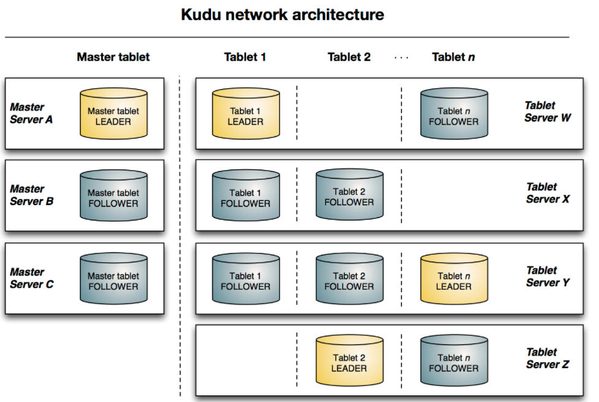
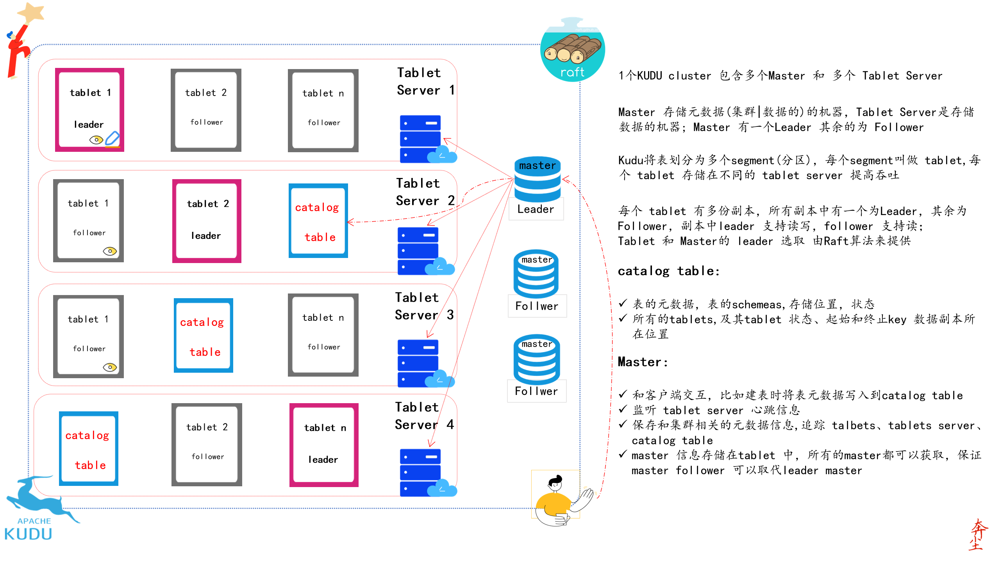

# Kudu

先学习两个单词

* Kudu 捻角羚  
* Impala   高角羚 

这两个组件都是Apache顶级的开源组件，并且都是由Cloudera开源的，从Cloudera 给这两个组件命名的角度来讲，这个两个组件应当是对完美的CP，事实也是这样。官网对其的介绍为：

* open source distributed data storage engine.

* makes fast analytics on fast and changing data easy

该组件 Apache Kudu 1.0 在 2016-09-19日由  [Cloudera](https://en.wikipedia.org/wiki/Cloudera)  发布

## KUDU 介绍

kudu是Hadoop生态系统中的**列存储引擎**，Kudu 可运行在商业硬件上，支持水平扩展和高可用。Kudu的设计让它与众不同，Kudu的优点包括：

* 在OLAP工作负载上有快速的表现

* 易于与Hadoop生态的组件（如MapReduce、Spark、Impala 等）集成

* 与 impala 紧密集成，可选择使用 Parquet 存储格式

* 提供灵活的强一致性，提供包括可序列化等一致性

* 顺序工作负载和随机工作负载都有很优异的表现（对随机读写和顺序读写都有很好的支持）

* 易于运维管理

* Master和TServer采用**raft**算法，该算法可确保只要副本总数的一半以上可用，tablet就可以进行读写操作。例如，如果3个副本中有2个副本或5个副本中有3个副本可用，则tablet可用。即便  `tablet-leader `挂掉的情况下，`tablet-follower `也可以提供读服务

* 结构化数据模型

综合上面的特性，Kudu 的目标是解决 Hadoop存储引擎很难或者不可能解决的问题，下面的问题使用Kudu可以得到很好的解决：

* 最近更新的数据，需要通过报表应用快速的反馈给终端用户
* 时序应用必须同时支持：
  * 快速查询历史数据
  * 快速的相应一些细粒度的查询，比如查询单条数据
* 基于所有历史数据定期刷新预测模型来做出实时决策的应用程序

## Kudu-Imapla 集成特点

**01 `CREATE/ALTER/DROP TABLE` | 建表、修改表、删除表**

impala在建立表，修改表，删除表时，可以使用Kudu 作为持久化层(存储引擎使用Kudu)，使用这种方式创建的表仍然支持独立建立impala表的操作，允许灵活的数据查询和摄取，**使用kudu作为持久层，不需要refresh table或者invalidate metadata table**

**02 `INSERT` | 插入数据**

和impala一致的插入语句

**03 `UPDATE` /`DELETE` 更新表数据，删除表数据**

友好支持impala语法

**04 Flexible Partitioning | 灵活分区**

为了更好的在用户距离更近的机器上执行分布式读写，kudu允许你使用hash 和range 两种方式进行分区，[Schema Design](https://kudu.apache.org/docs/schema_design.html#schema_design) 。

**05 Parallel Scan | 并行扫描**

使用impala查询引擎，在多个tablets执行并行扫描

**06 High-efficiency queries | 高效的查询**

在可能的情况下，Impala 将谓词评估下推到 Kudu，以便尽可能接近数据评估谓词。在许多工作负载中，查询性能可与 Parquet 相媲美。

## 架构

###  官网架构图



### 详细架构图



### 一些概念

#### 列式存储

kudu使用列式存储，OLAP中的常用存储格式，

* 便于获取少量列（相同列的数据相邻，行存储在分布在不同的block on disk），
* 便于压缩

#### Table

存储在Kudu中的表，会按照主键（primary key） 排序，一个表（table） 会被拆分成多个段(segment) ，每个段叫做 tablet

#### **Tablet** 分区

是表的一个段，类似于其他存储引擎中的分区，只是叫法不同，一个tablet 会有一个多个副本，其中一个副本是 leader tablet ,**所有的副本都可以相应读请求，写请求由 leader 来实现**，即单主模式。Tablet leader 失效时，由  [Raft Consensus Algorithm](https://kudu.apache.org/docs/index.html#raft) 来保证leader 共识问题(即选取中新的副本Leader)。

#### Tablet Server

一个 Tablet Server 包含多个 Tablet，一个Tablet 可以分布在多个Tablet Server, 即tablet 和 tablet-server是多对多的关系。

#### Master

有多个，都叫master，但是只有一个leader ，Mater leader 失效时，由  [Raft Consensus Algorithm](https://kudu.apache.org/docs/index.html#raft) 来处理 leader 共识问题（即选取中新的Leader）。Master的作用包括：

* 追踪所有的 Tablet 、tablet server 、Catalog Table 
* 保存集群的其他的元数据信息
* 处理 clinet  的读写请求，比如当客户端向Master提交建表请求时，master会在catalog table写入表元数据信息，并协调进程在Tablet Server 上创建Tablet 

此外，Master的数据信息存储在Tablet 中，保证 leader master 的数据的可靠性；master还会检测tablet Server 的心跳。

#### Catalog Table

存储两种元数据：

* 表的元数据，表的schemas,存储位置，状态
* Tablet（分区）元数据，存在Tablets，每个Tablet Server  具有那个Tablet的副本，当前状态，起始和终止key

#### Logical Replication逻辑复制

kudu采用的复制方式并不是基于磁盘的物理复制，逻辑复制，具有以下优点：

* `insert` 插入和`update` 更新需要通过网络传输数据，`delete` 操作时，不需要传输数据，只需要传输命令到Tablet Server，所以删除是本地删除。
* 压缩操作，不需要通过网络传输数据，这一点不同于使用HDFS存储的系统需要通过网络进行大量的数据传输
* 在执行压缩时，Tablet不需要立即执行，在存储层表现为异步压缩，如此可以避免在执行压缩和高负载写入时导致的查询高延迟


## Kudu Schema 设计

**Kudu 表具备和RDBMS相似的结构化数据模型**，Kudu表Schema的设计是非常重要的，因为这影响到kudu能否实现最佳的性能，下面的文档描述设计高效kudu表Schema的哲学，尤其要注意设计kudu表结构和设计关系型数据库系统表结构的差别。

在更高的层次来看，设计kudu表结构主要涉及三处：**<u> 设计列、设计主键、设计分区</u>**  ，其中设计分区是有别于关系型数据库系统中表结构设计的。加下来的部分讨论 修改已经存在表的schema，了解其中（各种schema）的局限。

[直接参考官网]()

## 将 Kudu 和 Impala 结合使用

kudu 和 impla可以进行几乎完美的结合，对于存储于Kudu中的数据，您可以使用impala的语法进行 增删改查。
### 内部表和外部 impala表
当你使用impala 创建kudu表的时候，您可以选择创建外部表或者是内部表
* 内部表： 当您使用impla创建表的时候，通常是有个内部表，内部表是 被impala 管理的表，删除表意味着表结构和数据都将会被删除
* 外部表：使用 `create external table --语句` ，一个外部表并不会被impala管理，删除外部表时，仅仅会删除impala  和 kudu表的映射关系。这种方便于将kudu中存在得表映射到impala。
### 使用impala SQL语法创建 kudu表
```sql 
create table test.my_first_table(
    id   bigint,
    name string,
    primary key (id)
) partition by hash partitions 16
stored as kudu
tblproperties ('kudu.master_addresses' = 'cdhkudumaster001:7051,cdhkudumaster002:7051,cdhkudumaster003:7051',
    'kudu.num_tablet_replicas' = '3');
```
关于建表语句中需要注意的地方：
* 主键必须放置在第一位，且主键隐式标记 `not null`
* 默认的副本数为3，且**只能设置为奇数**，一但设置副本数量，就不能（`alter table`）修改
* 可以选择设置分区，也可以不设置分区
#### `create talbe as select`
下面的例子中通过 `create table .. as select` 的方式建表，
* 将`old_talbe`的所有记录导入 `new_table`表中，
* `new_table`的字段名和字段类型  取决于 `old_table`的字段名和字段类型
* 需要指定主键和分区信息
```sql 
create table new_table
primary key (ts, name)
partition by hash(name) partitions 8
stored as kudu tblproperties ('kudu.master_addresses' = 'cdhkudumaster001:7051,cdhkudumaster002:7051,cdhkudumaster003:7051','kudu.num_tablet_replicas' = '3')    
as select ts, name, value from old_table;
```
#### 指定Tablet 分区
理想情况下，Table较为均匀的分配到各个Tablet Server 中，Kudu目前没有手动或者自动的划分已经存在的Tablet的机制，在这个机制实现之前，您**必须在创建表的时候指定分区** 。在设置表的scheme时，**分区会按照主键(主键可能是分区主键)的字段去分区**。
```sql
create table cust_behavior (
  _id bigint primary key,
  salary string,
  edu_level int,
  usergender string,
  `group` string,
  city string,
  postcode string,
  last_purchase_price float,
  last_purchase_date bigint,
  category string,
  sku string,
  rating int,
  fulfilled_date bigint
)
partition by range (_id)
(
    partition values < 1439560049342,
    partition 1439560049342 <= values < 1439566253755,
    partition 1439566253755 <= values < 1439572458168,
    partition 1439572458168 <= values < 1439578662581,
    partition 1439578662581 <= values < 1439584866994,
    partition 1439584866994 <= values < 1439591071407,
    partition 1439591071407 <= values
)
stored as kudu
tblproperties ('kudu.master_addresses' = 'cdhkudumaster001:7051');
```
### impala databases 和 kudu
每个impala 表都有一个namespace 我们称之为 database,默认的database 叫做default，用户可以创建或者删除其他的database。
当我们使用impala创建kudu表的时候，被创建的kudu表会按照 `impala::database_name.table_name`的方式命名。
下面几个impala中的关键词，在创建kudu表的时候是无效的：partitioned - location - rowformat
### 优化-评估SQL谓词的性能
* where子句包含 `= <= >= < > between in` kudu会表现出最佳性能，因为kudu会直接将相关结果返回给impala 
* 对于 `!= like` 或者其他谓词，kudu会将所有结果集返回给impala，然后依赖impala去过滤结果集
### 分区表
kudu表会根据kudu 表的主键和分区scheme 将table  partition到tablets 中，每个tablet（分区）至少由一个 tablet server 提供服务。理想情况下，table 应该被划分到尽可能多的tablet server 以获得更大的并行操作。您的partition scheme 设计细节取决于您怎样访问您存储的数据和您存储的数据类型，关于苦读表的设计，参考Scheme design。

对于已经创建好的table，kudu 目前没有切割或者合并的机制，所以在您创建表的时候，必须要提供partition scheme。设计表时，请考虑使用主键，以便将 table  partition（分区）为以相似速率增长的tablet 。

您可以使用 impala 的 `partition by` 关键词，将 table partition 分区，分区方式为：`range ` 和 `hash` 。分区方式可以包含 0个或者多个 hash方式 , 加上可选的 range方式 。range 方式需要1个或者多个 主键列（可能多列主键）
#### 基础分区
##### partition by range
您可以指定主键的1列或者多列为range分区字段，kudu中的range分区方式支持等于特定值或者在某个特定的范围内，这样允许您平衡写入并行度和扫描效率。假设您有一张表具有 `state,name,purchaser_count` 3个字段，下面的例子中会创建50个tablets ，每个是美国的一个州。
💔 注意：对于单调递增的值，如果您使用了range的分区方式，并且分区字段呈现单调递增的趋势，那么最后一个tablet 相对于其他分区将会越来越大。在这种情况下，建议您使用hash的分区方式或者 将range 和 hash 结合起来使用。

```sql 
create table customers (
  state string,
  name string,
  purchase_count int,
  primary key (state, name)
)
partition by range (state)
(
  partition value = 'al',
  partition value = 'ak',
  partition value = 'ar',
  -- ... etc ...
  partition value = 'wv',
  partition value = 'wy'
)
stored as kudu;
```

##### partition by hash
并不像range 分区、或者结合范围分区方式那样，hash的方式将数据较为均匀的散列到  bucket 中。您需要指定散列的主键列和散列桶的个数。假设被分区的字段本身没有表现出严重的倾斜，数据也会比较均匀的分布在各个桶中。
您可以指定多个hash 列，而且可以使用联合主键，但是一列不能在hash 语句中出现多次。以a,b两列为例子：
* 允许 `hash(a)`, `hash(b)`, hash(a,b)
* 不允许 hash(a),hash(a,b)
🧡 注意：`partition by hash ` 没有指定具体的列，表示按照主键列 进行散列。

在主键数据均匀的分布在各个域中，而且数据没有呈现出明显的倾斜时， Hash 分区是一种合理的分区方式，例如时间戳和序列ID作为主键时。

下面的例子中，按照`id`,`sku` 列将表划分为了16个 tablets , 数据将会散列到16个tablet 中，在这个例子中，一个 `sku ` 范围的查询可能读取 16个 tablet ,因此对于这个表来说，当前的scheme并不是最优的scheme，在Advanced 分区 中我们会进行优化。

```sql 
create table cust_behavior (
  id bigint,
  sku string,
  salary string,
  edu_level int,
  usergender string,
  `group` string,
  city string,
  postcode string,
  last_purchase_price float,
  last_purchase_date bigint,
  category string,
  rating int,
  fulfilled_date bigint,
  primary key (id, sku)
)
partition by hash partitions 16
stored as kudu;
```

##### Advanced by range
您可以结合 hash  和 range 两种分区方式去创建复杂的分区 scheme。您可以指定0个或者多个hash 和 0个或者多个 range。每种分区方式都可以包含多个列，列举每一种可能的分区scheme超过了这个文档的范畴，下面将列举一些例子来说明一些可能性。
###### partiton by hash and range
考虑到在简单hash的例子中，如果您需要经常 对sku 的范围进行查询，您可以通过结合hash和range 来优化上面的分区方式。
下面的例子中仍然会创建16个tablet ，首先会按照 id 字段散列到4个桶中，然后使用range分区按照sku字段将每个桶划分到4个tablet 中。如此，写压力会负载到至少4个tablet（有可能达到16个），当您进行一个连续的sku范围查询时，您将会有很大的概率只需要查询 四分之一的 tablet。
🧡： 默认情况下，使用`partition by hash` 主键所有字段将会散列，当需要对主键部分字段散列时，需要特别指定 `partition by hash('id')`

```sql
create table cust_behavior (
  id bigint,
  sku string,
  salary string,
  edu_level int,
  usergender string,
  `group` string,
  city string,
  postcode string,
  last_purchase_price float,
  last_purchase_date bigint,
  category string,
  rating int,
  fulfilled_date bigint,
  primary key (id, sku)
)
partition by hash (id) partitions 4,
range (sku)
(
  partition values < 'g',
  partition 'g' <= values < 'o',
  partition 'o' <= values < 'u',
  partition 'u' <= values
)
stored as kudu;
```
###### multiple partition by hash 
继续上面的例子，假设查询模式是不可预测的，而且你希望保证写压力能够负载到尽可能多的tablet上，您可以多对主键列 hash 来实现最大程度的分区。
```sql
create table cust_behavior (
  id bigint,
  sku string,
  salary string,
  edu_level int,
  usergender string,
  `group` string,
  city string,
  postcode string,
  last_purchase_price float,
  last_purchase_date bigint,
  category string,
  rating int,
  fulfilled_date bigint,
  primary key (id, sku)
)
partition by hash (id) partitions 4,
             hash (sku) partitions 4
stored as kudu;
```
上面的例子中创建了16个tablet ，您也可以使用 `hash (id, sku) partitions 16` ，但是使用这种方式在进行查询时，就会扫描16个tablet ，而不是可能只扫描4个tablet。
###### 非覆盖范围分区
kudu 1.0 及更高版本支持使用 非覆盖范围分区，可以为下面这些问题提供解决方案：
* 在没有非覆盖范围分区情况下，如果是时间序列或者是其他不断递增的主键的scheme ，存储历史数据的tablet将会是固定大小，接受新数据的tablet 将会没有限制的增长

* 如果您想根据种类（例如销售地区，产品类型）来partition 数据，在没有非覆盖范围分区情况下，您必须提前知道所有的这些种类，以及在需要增加或者减少分区（比如增加或者减少产品类型）的时候，您必须重建您的table。

更详细的关于非覆盖范围分区，参考 Scheme Design

下面的例子中对于存储的日志数据，每年会创建一个tablet(一共5个tablet) ,当向表中插入数据时，仅仅接受 2012-2016年的数据，超过range范围的数据将会被拒绝插入。
```sql 
 create table sales_by_year (
  year int, sale_id int, amount int,
  primary key (year, sale_id)
)
partition by range (year) (
  partition value = 2012,
  partition value = 2013,
  partition value = 2014,
  partition value = 2015,
  partition value = 2016
)
stored as kudu;
```
当记录即将来到2017的时候，应该使用下面的语句将2017范围加入到表中：
`alter table sales_by_year add range partition value = 2017;` 
如果数据是按照滚动窗口保留的，可以使用下面的命令将分区数据删除，如果2012年的数据不在需要保留，下面命令会进行批量的删除：
`alter table sales_by_year drop range partition value = 2012;`
🧡 注意： 就像删除表一样，删除分区的数据也是不可挽回的。所以慎重删除。

###### 关于分区的重要规则
* 对于数据量很大的表，比如事实表，您的tablet （分区）数量应该和kudu集群的内核数保持一致
* 对于小表，比如维度表，保证每个tablet 至少有1GB大小。
通常来说，在当前的实现中，需要注意tablet的数量对读的并行性的限制，当tablet的数量超过内核数量过多时，可能会导致受益递减。

### 向 kudu 表中插入数据
impala允许您使用标准SQL语法向 Kudu中插入数据。
#### 插入单一数据
这个例子插入了一条数据
```sql 
insert into my_first_table values (99, "sarah");
```
下面这个例子插入了3条数据
```sql 
insert into my_first_table values (1, "john"), (2, "jane"), (3, "jim");

```
#### 批量插入
当进行批量插入的时候，最少有三种选择，每一种都有其优点和缺点，具体使用哪种方式取决您的数据和具体的情况。
##### multiple single insert statement 
这种方式很好理解和实现，但是这种方式很低效，因为相较于kudu的插入表现，impala 有很高的启动成本，这种方式会导致很高的延迟和有点差劲的吞吐。
##### single insert statement with multiple values
如果您的插入包含了超过1024个value 语句，在给kudu 发送请求之前，impal 会将1024（或者是batch_size）个值打包在一起，这种方式会比单独插入更好，因为摊销了impala启动的成本。您可以通过`set batch_size = 10000` 来设置当前的impala shell session 批量插入的size 。
🧡 注意：增加batch_size 的值会导致impala使用更多的内存，您应该考虑增加了之后对于集群的影响。
##### batch insert
这种方式通常是表现最好的方式，通常使用 select  from 的方式导入到kudu

*  如果您的数据不在impala 中，一种可选的策略就是从 文本文件 (比如tsv 文件或者 csv文件)中导入到impala

* 创建kudu 表，注意设计为主键的列不能为null
* 通过查询的方式将数据导入到kudu，就像下面的例子中：
```sql
insert into my_kudu_table
  select * from legacy_data_import_table;
```

##### 通过C++/Java API摄取数据
在很多情形下，通过C++ / Java API 直接向 kudu中插入数据是一种比较合适的方式。通过API插入到kudu 的数据，并不需要并不像Impala 表那样需要 `invalidate metadata` 就可以使用。

#### 插入 和 主键唯一性违规 insert and primary key uniqueness violations
在大多数关系型数据中，如果您尝试插入一行已经存在的数据，由于唯一性约束您的插入会失败。但是在 kudu + impala 中，会执行插入语句，但是会生成一个告警。
如果插入的行是为了替代已经存在的行，可以使用 `upsert` 语句 而不是 `insert` 语句，比如下面的例子：

```sql 
insert into my_first_table values (99, "sarah");
upsert into my_first_table values (99, "zoe");
-- the current value of the row is 'zoe'
```
### 更新 1 行
```sql
update my_first_table set name="bob" where id = 3;
```
🧡 注意，`update` 语句只有在impala + kudu 环境下才会生效
#### 批量更新
您可以像批量插入那样记性批量更新
`update my_first_table set name="bob" where age > 10;`

### 删除 1 行
`delete from my_first_table where id < 3;`
你可以使用更复杂的删除语法。from 子句中的 逗号是impala join 查询的一种方式，关于更多的impala join 查询参考  https://impala.apache.org/docs/build/html/topics/impala_joins.html.
`delete c from my_second_table c, stock_symbols s where c.name = s.symbol;`
🧡 注意，`delete` 语句只有在impala + kudu 环境下才会生效

#### 批量删除
您可以像批量插入那样记性批量删除
`delete from my_first_table where id < 3;`
### 在执行 `insert、 update、 delete ` 操作时，失败
`insert、update、delete` 不能作为一个整体性的事务性语句，所以kudu 不能像众多的关系型数据库那样提供事务的支持，如果您需要事务，需要在应用中进行设计。
### 更改表属性
您可以通过更改表属性的方式来改变更和kudu表关联的impala元数据信息，包括
* 表名
* kudu master 地址
* 内部或者外部表
#### impala 映射表 重命名
`alter table my_table rename to my_new_table`
🧡 在impala 3.2 或者更低的版本中，使用`alter table ... rename ` 语句只会重命名 impala 映射表，不管这个表是外部表还是内部表。从impala-3.3开始，重命名表名同样会重命名底层的kudu表名
#### 为一个内部表重命名基础kudu表
在 impala-2.11 或者更低的版本中，通过 `kudu.table_name` 属性可以将kudu 基础表重命名：
```sql
alter table my_internal_table
set tblproperties('kudu.table_name' = 'new_name')
```
#### 重新映射一个外部表和一个不同kudu表
如果另外一个应用在impala下重名了一个kudu表，我们可以重新映射外部表以指向一个不同的kudu表
```sql
alter table my_external_table_
set tblproperties('kudu.table_name' = 'some_other_kudu_table')
```
#### 变更kudu master 地址
```sql
alter table my_table
set tblproperties('kudu.master_addresses' = 'kudu-new-master.example.com:7051');
```
#### 变更内部表为外部表
```sql
alter table my_table set tblproperties('external' = 'true');
```
### 使用impala 删除 kudu表
如果使用impala创建了一个内部表 `create table` , `drop table`语法会删除表及表中的数据，如果是 `create external table` 创建的外部表，`drop table` 仅仅会删除impala 和 kudu 表之间的映射关系 ，但是 Kudu 表完好无损，包括所有数据。
`drop table my_first_table;`


## kudu parper 部分
### 0.摘要 Abstract
kudu是一个针对结构化数据的开源存储引擎，支持低延迟的随机访问和高效分析模式。kudu的Raft 支撑的分区和副本机制能够保证低平均恢复时间和低尾部延迟。kudu 和Hadoop生态组件有很好的兼容性，比如使用 spark impala等进行访问。
### 1.介绍 Introduction
主要介绍开发Kudu的目的，介于HDFS存储和HBASE存储之间，HDFS（静态数据集）对变更的数据不友好，HBASE对SQL支持不完善。
### 2.Kudu at a high level
### 3.Architecture
### 4.Tablet storage


## Kudu 扩展指南

这里会详细的描述Kudu如何扩展各种系统资源，包括内存、文件描述符、线程等。[scaling limits](https://kudu.apache.org/docs/known_issues.html#_scale)  中保存着Kudu 集群相关参数的最大建议值，您可以基于数据量粗略的估计需要配置的参数。

### Terms

我们会使用到以下的几个条款：

* 热副本：所谓热副本就是不断的接收写入的Tablet 副本。比如，在一个时序的例子中，在最近的Range 分区中（按照time字段分区）总会接收到最新的数据，这就是热副本
* 冷副本：相对于热副本而言，低频的接收写入，注意这里是写入。例如在时间为range 分区的例子中，过去的时间不会在接收写入，但是会被频繁的读取，这部分数据就是冷副本。
* 磁盘数据：所有存储在磁盘中的Tablets Server 的（复制后、压缩后、编码后）数据，

### 工作负载例子

下面的例子中使用下面的参数进行计算：

* 200 个 热副本 / Tablet Server
* 1600 个冷副本 / Tabet Server
* 8TB 的数据量 / Table Server （4.5G / replicat)
* 512MB Block cache
* 40 个内核 / 每个机器
* 每个机器能够打开的文件描述符为 32000个
* 具有一个40列的读工作负载表

### 内存

--memory_limit_hard_bytes  参数决定Kudu Table Server 能够使用的最大内存。Kudu Tablet Server 内存的使用随着数据规模、写工作负载，读并发变化。下表提供了一些参数值用于粗略的及计算内存使用量。

#### 表1，Tablet Server 内存使用

| 类型                                | 乘数                                       | 描述                                              |
| ----------------------------------- | ------------------------------------------ | ------------------------------------------------- |
| 每TB磁盘数据需要内存                | 1.5GB/TB                                   | 在Tablet Server中每增加1TB数据，需要增加1.5GB内存 |
| 热副本的MemRowSets 和DeltaMemStores | 至少128M/热副本                            | 每次MemRowSets 需要刷新的最小数据量，             |
| 扫描                                | 256Kb每列每核心高频读取表                  | 扫描需要大量内存                                  |
| Block Cache 块缓存                  | `-block_cache_capacity_mb` (default 512MB) | 专门给块缓存用的内存                              |

根据上表来计算需要的内存

#### 表2 工作负载实例需要的内存

| 类型               | 数量                              |
| ------------------ | --------------------------------- |
| 磁盘数据量 ： 8 TB | 8 TB * 1.5GB / 1TB = 12G          |
| 200个热副本        | 200 * 128M =  25.6GB              |
| 1 个40列高频扫描表 | 40 * 40 *   256KB = 409.6MB       |
| 块存储             | --block_cache_capacity_mb = 512MB |
| 期望内存使用       | 38.5G                             |
| 建议内存限制       | 52G                               |

使用以上方法可粗略的估计Kudu的内存使用量，期望值应该是限制值的50%-75%。

#### 验证内存限制是否是充足的

在配置了 --memery_limit_hadd_bytes的限制内存之后，执行一个空座负载观察Kudu Tablet Server 进程的RAM的使用情况，进程的使用情况大部分时间应该在限制内存使用量的50%- 70% ，并允许偶尔的超过75% 但是在100%以下，如果总是超过75%，那么内存限制需要提高内存限制。

除此之外，监控内存拒绝日志也非常有效：

`Service unavailable: Soft memory limit exceeded (at 96.35% of capacity)`

并且观察内存拒绝矩阵：

* leader_memory_pressure_rejections
* follower_memory_pressure_rejections
* transaction_memory_pressure_rejections

由于内存压力导致的偶尔拒绝是可以的，并且可以作为对客户端的背压，客户端将透明地重试操作。但是，任何操作都不应超时。

### 文件描述符

   

> 🤣 **文件描述符** 🤣：文件描述符在形式上是一个非负整数。实际上，它是一个索引值，指向[内核](https://zh.wikipedia.org/wiki/内核)为每一个[进程](https://zh.wikipedia.org/wiki/进程)所维护的该进程打开文件的记录表。当程序打开一个现有文件或者创建一个新文件时，内核向进程返回一个文件描述符。Linux 系统中，把一切都看做是文件，当进程打开现有文件或创建新文件时，内核向进程返回一个文件描述符，文件描述符就是内核为了高效管理已被打开的文件所创建的索引，用来指向被打开的文件，所有执行I/O操作的系统调用都会通过文件描述符。
>
> [关于更多的文件描述符内容](https://segmentfault.com/a/1190000009724931)

进程被允许的打开文件描述符（File Descriptors [fds]）的最大数量。如果一个 Tablet Server 尝试打开太多的fds , 会产生一个告警信息“ too many open files ” ，下面的表格总结了Tablet Server 应该配置的 文件描述符参数。

#### 表3 Tablet Server 文件描述符使用

| 类型     | 乘数                                                         | 描述                                                         |
| -------- | ------------------------------------------------------------ | ------------------------------------------------------------ |
| 文件缓存 | --block_manager_max_open_files 参数指定，默认为进程最大值的40% | 文件缓存能够使用的最大打开文件描述符数量                     |
| 热副本   | 2个/WAL 段文件 , 1个 / WAL 索引文件                          | 每个热副本应该使用的文件描述符                               |
| 冷副本   | 3个 / 冷副本                                                 | 每个冷副本使用的文件描述符，2个/给WAL 段文件，1个/给WAL 索引文件 |

每个副本至少有一个WAL 段文件和一个WAL索引文件，而且WAL段文件和WAL索引文件的数量应该一致；但是，一个正常的副本的WAL索引文件和段文件数量可能会被一个落后的副本大，WAL段和索引文件描述符会被关闭当WAL被垃圾回收的时候。

在假设某些副本滞后并使用 10 个 WAL 段的情况下，将此信息用于示例负载可提供文件描述符使用情况的以下细分：

| 类型        | 数量                                                         |
| ----------- | ------------------------------------------------------------ |
| 文件缓存    | 40% * 32000dfs = 12800fds                                    |
| 1600 冷副本 | 1600 冷副本 * 3 fds / 冷副本 = 4800fds                       |
| 200个热副本 | (2/段文件*10段文件/热副本 * 200热副本) + (1/索引文件 * 10 索引文件/热副本 * 200 热副本) = 6000dfs |
| 总计        | 23600fds                                                     |

所以对于在这个例子来说，Tablet Server 大概有 32000 - 23600 = 8200 个fds空余。如果接近当前配置的限制，配置更高的文件描述符限制通常没有缺点。

### 线程

操作系统允许进程使用的最大线程数，而且这个参数通常很难或不可能改变。因此这部分会有更多的介绍信息。

如果一个kudu Tablet Server  的线程个数超过了操作系统的限制，会产生日志信息 “ pthread_create failed: Resource temporarily unavailable” ，如果系统的线程个数超过了限制，相同节点的其他进程可能也会发生这个问题。

线程和线程池在KUDU 中用于各种目的，线程的数量不会随着负载、数据量、Tablet 大小进行 扩充，线城是一个硬编码常量 或者是一个配置参数，或者依赖于一些静态维度（比如CPU核数）

唯一的例外是WAL 追加线程，kudu会为每个热副本分配一个WAL 追加线程，尤其要注意所有的副本在启动的时候都会认为是热的，所以Tablet Server 的线程数会在副本启动的时候达到顶峰，在结束的时候数量会下降。

PS： **预写式日志（WAL, write-ahead-log）**（也称为**重做日志（redo log）**）。这一般是一个仅追加的文件。


### 分区管理

#### 删除分区

```sql 
show range partitions tmp.kudu_live_order_basic_rt_01; -- 查询range 分区
alter table tmp.kudu_live_order_basic_rt_01 drop range PARTITION '2021-10-01' <= VALUES; -- 删除分区，注意范围关系 
-- 下面的删除是无法通过的
alter table tmp.kudu_live_order_basic_rt_01 drop range PARTITION  VALUES >= '2021-10-01'
```

```sql 


In the CREATE TABLE statement, the columns that comprise the primary key must be listed first. Additionally, primary key columns are implicitly marked NOT NULL.

A replication factor must be an odd number

When a managed Kudu table is created from within Impala, the corresponding Kudu table will be named 
eg:
'impala::ods.kudu_ywcloud_org_df'

The following Impala keywords are not supported when creating Kudu tables: - PARTITIONED - LOCATION - ROWFORMAT

You must provide a partition schema for your table when you create it

PARTITION BY HASH with no column specified is a shortcut to create the desired number of buckets by hashing all primary key columns.

Column 'platform_order_no' in 'HASH (platform_order_no) PARTITIONS 4' is not a key column. Only key columns can be used in PARTITION BY
```

 Kudu的存储是不基于HDFS的，构建集群时，kudu颇有可能和HDFS共同占用物理磁盘或者云磁盘，理想状况是独立空间。

### Optimizing Performance

```sql

=, <=, '\<', '\>', >=, BETWEEN, or IN This provides optimum performance, because Kudu only returns the relevant results to Impala

!=, LIKE, or any other predicate type supported by Impala  return implala depend on impala filer 


For large tables, such as fact tables, aim for as many tablets as you have cores in the cluster.

For small tables, such as dimension tables, ensure that each tablet is at least 1 GB in size.

Increasing the number of tablets significantly beyond the number of cores is likely to have diminishing returns.


-- insert  bulk 
Multiple single INSERT statements
This approach has the advantage of being easy to understand and implement. This approach is likely to be inefficient because Impala has a high query start-up cost compared to Kudu’s insertion performance. This will lead to relatively high latency and poor throughput.

Single INSERT statement with multiple VALUES
If you include more than 1024 VALUES statements, Impala batches them into groups of 1024 (or the value of batch_size) before sending the requests to Kudu. This approach may perform slightly better than multiple sequential INSERT statements by amortizing the query start-up penalties on the Impala side. To set the batch size for the current Impala Shell session, use the following syntax: set batch_size=10000;
Increasing the Impala batch size causes Impala to use more memory. You should verify the impact on your cluster and tune accordingly.

```


## impala kudu

```sql
create external table -- 外部表 不受impala管理，删除表时候删除kudu和impala之间的映射

create table  -- 内部表 impala管理，删除表，真正的删除
```


建表指定参数

```sql 
create table if not exists ods.kudu_live_goods_category_df
(
    id                 int comment '自增id',
    pk_id              string comment '来源+商品id',
    from_source        string comment '平台来源,4快手,5有赞,8抖音',
    goods_id           string comment '商品id',
    goods_name         string comment '商品名称',
    category_id        string comment '第三方类目id,叶子级',
    category_name      string comment '叶子级名称',
    category_path      string comment '多级类目全路径id,!@!分割',
    category_path_name string comment '多级类目全路径名称',
    `group` string comment 'implala关键字用漂号'
    status             string comment '类目状态 1：正常 2：禁用',
    created_at         timestamp,
    updated_at         timestamp,
    etl_time           timestamp comment '数据时间',
    primary key (id,pk_id)
) partition by hash partitions 2
stored as kudu tblproperties ('kudu.master_addresses'='cdhkudumaster001:7051,cdhkudumaster002:7051,cdhkudumaster003:7051','kudu.num_tablet_replicas' = 'n');

-- 设置range 和 hash 复合分区时，必须 先 hash 后range 
```


### insert into 

```sql 
INSERT INTO my_first_table VALUES (1, "john"), (2, "jane"), (3, "jim");
-- 之后
INSERT INTO my_first_table VALUES (1, "isea"), (2, "wo"), (3, "air");
-- 之后查询内容，可以观察到数据没有发生改变

UPSERT INTO my_first_table VALUES (1, "ise"), (2, "andy"), (3, "wudi"),(5,"so happy")
-- 执行上述语句之后，可以观察到数据发生变化


```

### 构建udf函数

```sql 
create function if not exists impala_get_province_v1(string) returns string  location 'hdfs:///user/benchen/lib/impala-getAddress.jar' symbol='com.ywwl.warehouse.GetProvince';
```


## 报错

### 01：Service unavailable: Soft memory limit exceeded (at 106.05% of capacity).

解决方案：

```sql 
memory_limit_hard_bytes
maintenance_manager_num_threads 
block_cache_capacity_mb 
-- 增大目前的3个参数
```

* Kudu Tablet Server Maintenance Threads 这个参数决定了Kudu后台对数据进行维护操做，如写入数据时的并发线程数。并发数越大，吞吐量越高，
* memory_limit_hard_bytes Tablet Server能使用的最大内存量，有多大，设置多大，tablet Server在批量写入数据时并不是实时写入磁盘，而是先Cache在内存中，   在flush到磁盘。这个值设置太小时，会形成Kudu数据写入性能显著降低。对于写入性能要求比较高的集群，建议设置更大的值（通常是机器内存的百分之80） Kudu Tablet Server Hard Memory Limit Kudu的Tablet Server能使用的最大内存。Tablet Server在批量写入数据时并不是实时写入磁盘，  而是先Cache在内存中，在flush到磁盘。这个值设置太小时，会形成Kudu数据写入性能显著降低。对于写入性能要求比较高的集群，建议设置更大的值，好比32GB。
* block_cache_capacity_mb 分配给Kudu Tablet Server块缓存的最大内存量，建议是2-4G.


## value too large for column 问题

**报错信息**：Kudu error(s) reported, first error: Invalid argument: value too large for column 'sku_id' (105741 bytes, maximum is 65536 bytes)

* 方法1：修改配置，
* 方法2：检查当前字段，是否可以通过某种手段减少字符串的长度，如执行group_concat之后对字段去重。

## Index

[可参考文档]([kudu 学习知识点总结（二） - 尚码园 (shangmayuan.com)](https://www.shangmayuan.com/a/9fd32ba49aaa408591358592.html)) 对于KUDU的总结很到位。

