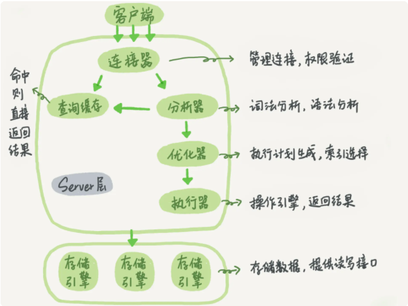
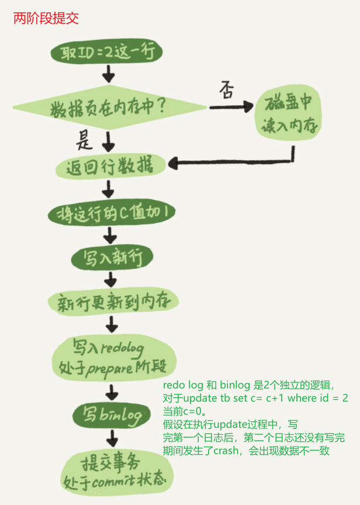

# MySQL实战45讲

**IO成本**

IO成本就是寻址时间和上下文切换所需要的时间，最主要是用户态和内核态的上下文切换。我们知道用户态是无法直接访问磁盘等硬件上的数据的，只能通过操作系统去调内核态的接口，用内核态的线程去访问。 这里的上下文切换指的是同进程的线程上下文切换，所谓上下文就是线程运行需要的环境信息。 

:one: 首先，用户态线程需要一些中间计算结果保存CPU寄存器，保存CPU指令的地址到程序计数器（执行顺序保证），还要保存栈的信息等一些线程私有的信息。

:two:  然后切换到内核态的线程执行，就需要把线程的私有信息从寄存器，程序计数器里读出来，然后执行读磁盘上的数据。读完后返回，又要把线程的信息写进寄存器和程序计数器。 

:three: 切换到用户态后，用户态线程又要读之前保存的线程执行的环境信息出来，恢复执行。这个过程主要是消耗时间资源。 

《Linux性能优化实战》。

------

# 01 基础架构：一条SQL是如何执行的

`select * from T where ID=10; `

## MySQL 基础架构

   **如右图所示**：   

### 连接器

* 客户端连接连接器使用的协议是 **TCP 协议**
* 连接完成后，如果没有后续动作，这个连接就会处于**sleep**[^另外一个状态是 Query]状态 ,也就是空闲状态。
* 客户端如果 **wait_timeout**[^默认是8h] 时间内没的动静，连接就会断开

#### MySQL 长短连接：

* 长连接：连接成功后，一直持有这个连接，向 Server 发起请求
* 短连接：执行完几次查询之后就断开连接，下次查询的时候在重新建立一个

:tipping_hand_man: 由于连接的过程是比较复杂的，开发中需要尽量减少连接动作，也就是使用长连接。

MySQL 在执行的过程中临时使用的内存是管理在连接对象里面的，这些资源在连接断开的时候才释放，所以有时候MySQL的内存会涨的很快，有可能会因为内存占用过大导致被 **Kill**掉 ，表现为MySQL异常重启。如何避免：

* 定期断开长连接
* MySQL5.7  之后的版本，在执行一个比较大的操作后，执行`mysql_reset_connection`来初始化连接(该操作不需要重连和鉴权，就恢复到刚创建完的状态)。

### 执行器

执行器是和存储引擎交互的部分，会调用存储引擎的接口，举个例子对于

`select * from T where ID=10;` ID 字段没有索引。

> * 调用 InnoDB引擎接口取这个表的第一行，判断 ID 值是不是 10，如果不是则跳过，如果是则将这行存在结果集中；
>
> * 调用引擎接口取“下一行”，重复相同的判断逻辑，直到取到这个表的最后一行(取满足条件的第一行和满足条件的下一行这个逻辑在存储引擎中已经实现)。
> * 执行器将上述遍历过程中所有满足条件的行组成的记录集作为结果集返回给客户端。

# 02 日志系统：一条SQL更新是如何执行的

MySQL中有2个重要的日志：

* redo log 重做日志 **引擎层日志**(InnoDB引擎特有)

* bin log 归档日志 **server 层日志**

| redo log                          | bin log                                             |
| --------------------------------- | --------------------------------------------------- |
| 引擎模块，InnoDB引擎特有          | server模块，所有引擎都可用                          |
| 循环写                            | 追加写                                              |
| 物理日志[^在某个页面做了什么修改] | 逻辑日志[^语句的更改逻辑，如给id=2这一行的c字段加1] |


## redolog

对于一个更新操作来说，如果每次更新都需要立刻写磁盘，则MySQL的存储引擎需要找到被更新的记录，然后更新。这个先定位再更新的机制必然有一定的成本（查找成本+IO成本）。MySQL尝试使用下面的思路来提升 **更新效率**

> **WAL : Write - Ahead Logging ： 先写日志，后写磁盘。**

**当涉及更新一条记录的时候，InnoDB引擎会将记录写到 redo log 里，并且更新内存**。InnoDB引擎会在适当（系统比较空）的时候，将操作记录刷写到磁盘。在细节上：MySQL了会设置固定大小的 redo log，比如配置一组4个文件，每个文件1GB。

 

 有了redo log， InnoDB可以实现 [**crash-safe**](保证在数据库发生异常重启之后，之前提交的记录不会丢失)。

redo log的写入 被拆分为2个步骤 ： prepare + commit 也就是**两阶段提交**： 

 右图两阶段提交：            

**两阶段提交实现了 bin log 和 redo  log 的逻辑一致。**

对于 ` update T set c=c+1 where ID=2 ;` id 是主键  , 更新的细节如下：

> :one: 执行器先找引擎取 ID=2 这一行。ID 是主键，引擎直接用树搜索找到这一行。如果 ID=2 这一行所在的数据页本来就在内存中，就直接返回给执行器；否则，需要先从磁盘读入内存，然后再返回。
>
> :two: 执行器拿到引擎给的行数据，把这个值加上 1，比如原来是 N，现在就是 N+1，得到新的一行数据，再调用引擎接口写入这行新数据。
>
> :three: 引擎将这行新数据更新到内存中，同时将这个更新操作记录到 redo log 里面，此时 redo log 处于 prepare 状态。然后告知执行器执行完成了，随时可以提交事务。
>
> :four: 执行器生成这个操作的 binlog，并把 binlog 写入磁盘。
>
> :five: 执行器调用引擎的提交事务接口，引擎把刚刚写入的 redo log 改成提交（commit）状态，更新完成。

## bin log

bin log 是MySQL server层维护的一种二进制日志，记录所有的DML和DDL。

作用有：

* 复制： MySQL Master端开启binlog，slave 可以获得数据备份，同样可以实现数据同步（如数据采集）
* 数据恢复：根据binlog来回放历史数据

binlog 包含两类文件

* 二进制日志索引文件(.index)：记录所有的二进制文件。
* 二进制日志文件(.00000*)：记录所有 DDL 和 DML 语句事件。

```sql
-- 查看二进制索引文件和二进制日志文件存储位置
show variables like '%log_bin%';

-- 查看binlog文件列表
show binary logs;


-- 解析binlog 日志文件
show binlog events in  'mysql-bin.000238'; 

-- 查看binlog的状态：查看当前二进制日志文件的状态信息，显示正在写入的二进制文件，及当前position
show master status;
```

show master  status 命令结果如下：

> Executed_Gtid_Set : 数据发生变化，当前值就会发生变化

binlog 日志格式

- Statement 模式：基于 SQL 语句的复制(statement-based replication-SBR)
- Row 模式：基于行的复制(row-based replication-RBR)
- Mixed 模式：混合模式复制(mixed-based replication-MBR)

[参考1](https://zhuanlan.zhihu.com/p/33504555)

[参考2](https://www.cnblogs.com/rickiyang/p/13841811.html)


# 03 事务隔离： 为什么你改了，我还看不见

在 MySQL 中，事务支持是在引擎层实现的。

## 隔离性和隔离级别

SQL 标准的事务隔离级别包括：

* 读未提交（read uncommitted）
* 读提交（read committed）
* 可重复读（repeatable read） [PS](MySQL 默认的隔离级别)
* 串行化（serializable ）

结合右边图在上面前3种隔离级别下v1,v2,v3 的值   

```sql
-- 查看 MySQL当前的隔离级别设置值：
show variables like 'tx_isolation' 
show variables like 'transaction_isolation' --mysql5.7以上version 
```

## 事务隔离的实现

>  在实现上，数据库里面会创建一个视图，访问的时候以视图的逻辑结果为准。
>
> * 在“可重复读”隔离级别下，这个视图是在事务启动时创建的，整个事务存在期间都用这个视图。
> * 在“读提交”隔离级别下，这个视图是在每个 SQL 语句开始执行的时候创建的。
> * “读未提交”隔离级别下直接返回记录上的最新值，没有视图概念；
> * “串行化”隔离级别下直接用加锁的方式来避免并行访问。

拿可重复读来说：假设一个值从 1 被按顺序改成了 2、3、4，在回滚日志里面就会有类似下面的记录。


当前值是4，不同时刻启动的事务会有不同的 **[read-view](事务视图)**，对于是三个视图记录的值分别不同：

* read-view A 				1
* read-view B                 2
* read-view C                 4

> **MVCC : 同一条记录在系统中可以存在多个版本，这就是数据库的多版本并发控制**。

对于 read-view A，要得到 1，就必须将当前值依次执行图中所有的回滚操作得到。

:tipping_hand_man:  **[建议尽量不要使用长事务](尽量使用长连接，尽量避免使用长事务)**：长事务意味着系统里面会存在很老的事务视图。由于这些事务随时可能访问数据库里面的任何数据，所以这个事务提交之前，数据库里面它可能用到的回滚记录都必须保留，这就会导致大量占用存储空间。

## 事务启动方式

事务启动的方式如下：

:one: : 显示启动事务语句，`begin / start transaction` 开启事务，`comit / rollback` 结束事务

:two: : `set autocommit = 0` ,将线程的自动提交off ，意味着如果你只执行一个 select 语句，这个事务就启动了，而且并不会自动提交。这个事务持续存在直到你主动执行 commit 或 rollback 语句，或者断开连接， **这会导致长事务**。

:tipping_hand_man: **[建议：set autocommit = 1](开启自动提交)**，通过显式语句的方式来启动事务。commit work and chain，则是提交事务并自动启动下一个事务，这样也省去了再次执行 begin 语句的开销。

```sql
-- 你可以在 information_schema 库的 innodb_trx 这个表中查询长事务
select * from information_schema.innodb_trx where TIME_TO_SEC(timediff(now(),trx_started))>60
```

# 04 深入浅出 索引 (上)

## 索引的常见模型

* 哈希表 ： 只是适合等值查询的场景，对范围查询不友好
* 有序数组： 等值查询、范围查询都很快，[对数据更新不友好](比如说在中间插入一条数据)

* N叉树：在读写上有性能有点，适配磁盘的访问模式
* 跳表 ：  可以说是有序的[带层次的](在数据的基础上一层层加索引)链表，todo 等待更新
* LSM树  ： 日志结构合并内存树，

## InnoDB的索引模型

InnoDB 使用了 B+ 树索引模型，所以数据都是存储在 B+ 树中的。每一个索引在 InnoDB 里面对应一棵 B+ 树。举个例子来说：

```sql
create table T
(
    id   int primary key,
    k    int not null,
    name varchar(16),
    index (k)
) engine = InnoDB;
-- 插入数据
insert into T
values (100, 1),
       (200, 2),
       (300, 3),
       (500, 5),
       (600, 6)
;
```

对于上述的索引和数据，形成2颗索引树：

  

#### 基于主键索引的查询和基于普通索引的查询的区别

* `select * from T where ID=500`，即主键查询方式，则只需要搜索 ID 这棵 B+ 树；

* `select * from T where k=5`，即普通索引查询方式，则需要先搜索 k 索引树，得到 ID 的值为 500，再到 ID 索引树搜索一次。这个过程称为回表。

## 索引维护

这里我们讨论2种情况

:one: 插入新行 id = 700 ，只是需要在R5的后面插入新记录，

:two: 插入新行 id = 400 ，这种情况下又分成2种情况：

* R3~R5所在的数据页没有满，需要移动R4,R5的数据，给id=400空出位置
* R3~R5所在的数据页满了，会发生 [页分裂,性能下降，同时空间利用率下降](需要申请新的数据页,将R4，R5移动到新的分页，同时如果相邻的2个页由于数据删除，数据页会进行合并)。

建表时维护自增主键的优势：

:one: 不会发生页分裂

:two: 自增主键一般占用的空间比较小，二级索引存储主键时，占用存储也比较小。

:tipping_hand_man: 无论是删除主键索引还是创建主键索引，都会导致表重建，而重建普通索引可以达到节省空间的目的，如果你有重建主键索引的需求：`alter table T engine=InnoDB` 会触发MySQL重建表，并进行碎片处理，达到节省空间的目的。

# 05 深入浅出 索引 (下)

对于上面的表插入如下数据：

```sql
insert into T
values (100, 1, 'aa'),
       (200, 2, 'bb'),
       (300, 3, 'cc'),
       (500, 5, 'ee'),
       (600, 6, 'ff'),
       (700, 7, 'gg');


select * from T where k between 3 and 5;
```

问执行上述的查询，需要执行几次树的搜索操作，会扫描多少行？SQL 的执行流程如下：

:one: 在 k 索引树上找到 k=3 的记录，取得 ID = 300；

:two:再到 ID 索引树查到 ID=300 对应的 R3；

:three: 在 k 索引树取下一个值 k=5，取得 ID=500；

:four: 再回到 ID 索引树查到 ID=500 对应的 R4；

:five:在 k 索引树取下一个值 k=6，不满足条件，循环结束。

上面的查询过程读了K索引的3条记录，（步骤1，步骤3和5）[回表](从普通索引树搜索回到主键索引锁搜索的过程，就叫做回表)了2次（步骤2和4）。回表的过程会影响数据响应时间，所以查询应该尽可能的避免回表，[索引覆盖](普通索引已经满足了我们的查询需求，需要回表)会解决这个问题。

### 索引覆盖

`select ID from T where k between 3 and 5`  查询，只需要查询索引K就可以得到查询结果，不需要回表，这就是索引覆盖。其中

* 对引擎来说：在引擎内部使用覆盖索引在索引 k 上其实读了三个记录，R3~R5（对应的索引 k 上的记录项）
* MySQL 的 Server 层来说，它就是找引擎拿到了两条记录，因此 MySQL 认为扫描行数是 2

### 最左前缀原则

```sql
CREATE TABLE `tuser` (
  `id` int(11) NOT NULL,
  `id_card` varchar(32) DEFAULT NULL,
  `name` varchar(32) DEFAULT NULL,
  `age` int(11) DEFAULT NULL,
  `ismale` tinyint(1) DEFAULT NULL,
  PRIMARY KEY (`id`),
  KEY `id_card` (`id_card`),
  KEY `name_age` (`name`,`age`)
) ENGINE=InnoDB
```

>  **最左前缀可以是联合索引的最左 N 个字段，也可以是字符串索引的最左 M 个字符。**

* `where name like '张%' ` 

* `where name  = '张三'`

以上两种查询都可以用到 name_age 这个索引。

### 索引下推

对于下面的查询

```sql
select * from tuser where name like '张%' and age=10 and ismale=1;
```

查询过程如下：

:one: 使用普通索引(name_age)树,找到第一个满足条件的记录ID3

:two:  按照版本分

* MySQL 5.6前 ： 只能从 ID3 开始一个个回表。到主键索引上找出数据行，再对比字段值。
* MySQL 5.6后 ：可以在索引遍历过程中，对索引中包含的字段先做判断，直接过滤掉不满足条件的记录，减少回表次数。

下图是二者的区别： 左表回表4次，右表回表2次


# 06 全局锁和表锁 ：给表加个字段怎么有这么多阻碍？

数据库锁设计的初衷是为了处理[并发](多线程访问同一个资源)问题，按照锁的范围分：

* 全局锁
* 表锁
* 行锁

## 全局锁

MySQL通过[FTWRL](`Flush tables with read lock` ),来加全局锁，加上全局锁之后，所有的数据更新语句和DML语句都会被阻塞。全局锁的典型使用场景是：**做全库的逻辑备份**。[通过FTWRL的方式来添加全局锁，可以有效的突破的存储引擎带来的限制](MyISAM是不支持事务的，如果是InnoDB引擎，在RR的情况下，可以实现逻辑备份并且备份的时是支持更新的)。

[关于使用FTWRL 还是使用 set global readonly=true](https://time.geekbang.org/column/article/69862)

## 表级锁

MySQL 的表级锁有2种

* 表锁
* DML锁 （Metadata Lock）

### 表锁

（假设是线程A）锁表的语法`lock table t1 read,t2 write` ,使用 `unlock talbe ` 释放锁，对于该锁表语句：

* 除了A之外的线程 对 t1 可读，对 t2 不可读写，
* 线程A 在执行unlock tables之前，只能执行读 t1, 读写 t2, 不能在访问其他表（写t1都不行，更别他其他的表了）

### DML锁

* 对一个表做增删改查的操作的时候（会申请读锁），加DML 读锁，**读锁之间不互斥**
* 对表做DML 变更的时候，加DML写锁，**读写锁、写写锁之间互斥**

如下例子中，给表T增加字段表T变的完全 不可读写


处理上述问题，我们首先要尽量避免长事务（session A位置 及时 commit）

```sql
ALTER TABLE tbl_name NOWAIT add column ...
ALTER TABLE tbl_name WAIT N add column ... 
```

# 07 行锁功过：怎么减少行锁对性能的影响

MySQL 的行锁是在引擎层面实现的，InnoDB支持行锁，MyISAM不支持行锁。

## 两阶段锁

右图事务B需等A释放锁才能获得id=1的锁 

在InnoDB事务中，**行锁满足[两阶段锁协议](在InnoDB事务中，行锁是在需要的时候才加上的，但并不是不需要了就立刻释放，在事务结束的时候才释放)。**这个协议对我们的帮助就是： **如果你的事务中需要锁多个行，要把最可能造成锁冲突、最可能影响并发度的锁尽量往后放。** ，比如在一个简易的影票交易系统中，如顾客A要在影院B 购买电影票，步骤如下：

:one: 从顾客A账户余额中扣除电影票价 update

:two: [给影院B的账户余额增加这张电影票价 update  ](同时可能有另外一个顾客C在影院B购票，此处可能是最容易造成锁冲突的地方) 

:three: 记录一条交易日志 insert

1,2,3应在一个事务中，根据两阶段锁协议，我们的事务应该将2 安排在最后。**能够最大限度的减少事务之间的锁等待**。

## 死锁和死锁检测

[死锁概念](当并发系统中不同线程出现循环资源依赖，涉及的线程都在等待别的线程释放资源时，就会导致这几个线程都进入无限等待的状态，称为死锁)

下面的例子为，行锁中的死锁。

出现死锁后，有2种策略：

:one:进入等待状态，直到[超时](超时时间有innodb_lock_wait_timeout 指定，默认50s), 由于超时时间阈值设置过小可能会导致[假阴性](误杀)，通常不会采用此方案

:two:发起[死锁检测](innodb_deadlock_detect 设置为 on) , 发现死锁后，主动回滚其中一个事务，让其他事务继续执行。死锁检测有额外的负担：

> 比如在所有事务要更新同一行的场景中，每个新来的被堵住的线程，都要判断会不会由于自己的加入导致了死锁，这是一个时间复杂度是 O(n) 的操作。假设有 1000 个并发线程要同时更新同一行，那么死锁检测操作就是[100 万](1000*1000，O(N^2)复杂度)这个量级的。虽然最终检测的结果是没有死锁，但是这期间要消耗大量的 CPU 资源。因此，你就会看到 CPU 利用率很高，但是每秒却执行不了几个事务。
>
> [为什么死锁检测是O(N^2)的时间复杂度](整体死锁检测的耗费代价是 O(n2)级别的。 并发更新同一行的1000个线程，整体耗费的死锁检测操作为1000*1000=100万。 为什么是个乘法——并发更新此行R1的某单个线程Tx，其所作的死锁检测工作为，Tx会有查看锁持有情况，耗费1000此操作——a.查看自身持有的行锁; b.遍历其他999个线程所持有的行锁，总共为1+999=1000次。 为什么会遍历其他999个线程，而不是仅看当前持有R1行锁的这个线程就行了？—— 因为行锁排队。某线程Tm排队获取R1行锁，排在Tx前。如果Tx当前持有行锁R2，过会Tm先于Tx获持R1后，会变成——Tm持有R1，等待R2 && Tx持有R2，等待R1——Tm和Tx成环死锁。 因此并发更新同一行的有N个线程，对应的死锁检测耗费代价为O(N2) ! 死锁检测不可避免，为防止死锁检测代价过高引起性能问题——想办法减少同时对同一行的更新的并发并发度。即降低N值)。

**减少死锁的主要方向，就是控制访问相同资源的并发事务量**，即降低N值

为了避免死锁检测带来的性能问题，我们可以也可以从业务逻辑的角度出发去解决这个问题，比如在购买影票的例子中，我们可以[将一行改为逻辑上的多行来减少锁冲突](可以考虑放在多条记录上，比如 10 个记录，影院的账户总额等于这 10 个记录的值的总和。这样每次要给影院账户加金额的时候，随机选其中一条记录来加。这样每次冲突概率变成原来的 1/10，可以减少锁等待个数，也就减少了死锁检测的 CPU 消耗,如果账户余额可能会减少，比如退票逻辑，那么这时候就需要考虑当一部分行记录变成 0 的时候，代码要有特殊处理)。


# 08 | 事务到底是隔离的还是不隔离的？

当前讨论的隔离级别：RR

如下图的一个问题：


* A事务查到的  k = 1
* B事务查到的 k = 3

## MVCC是如何工作的？

[**transaction id** ](InnoDB中每个事务都有一个唯一的事务ID，记为 transaction id ,该 id 是事务开启的时候向InnoDB的事务系统申请的，该 id 按照申请顺序严格递增)： 每个事务的唯一 id号

[**row  trx_id**](每次事务更新数据时，会生成新的数据版本，row trx_id 记录当前的数据版本是被哪个事务改为当前值的) ： 记录当前数据是被哪个transaction_id 改为当前值的

如右图：一个记录被多个事务连续更新后的状态：


一个数据版本，对于一个事务视图来说，除了自己的更新总是可见以外，有三种情况：

> :one: 版本未提交，不可见；
>
> :two: 版本已提交，但是
>
> * 在视图创建后提交的，不可见；
> * 是在视图创建前提交的，可见。

按照上面的规则来判断事务A，事务A的一致性视图是在事务A启动的时候生成的，此时：

* (1,3) 还没有提交，不可见 ，属于情况 1
* (1,2) 已经提交，但是是在A的一致性视图创建**后**提交的，不可见，属于情况2.1
* (1,1) 已经提交，而且是在A的一致性视图创建**前**提交的，可见，属于情况2.2

真实的物理实现，涉及到**[高水位](视图数组最大值+1)、[低水位](视图数组的最小值)、[视图数组](已经开始，但没有提交的事务id构成的数组)**，等相关概念和理论，[具体参考](https://time.geekbang.org/column/article/70562)

## [更新逻辑](当前读)

我们再来分析一下事务B的update 逻辑，按照上述的一致性读逻辑，事务B，是不能读到事务C的(1,2)的，因为事务C的是在事务B的一致性视图生成后提交的，按理说不可见；视图B在更新前去查询一次数据，返回的K=1，但是当更新的时候，必须拿到最新的值（1,2），否则事务C的更新就丢失了，因此更新数据涉及到一条规则：

> **[当前读](更新数据是先读后写的，读只能读当前的值，这个读 称之为当前读)**

因此，事务B查询结果 是 (1,3)。

此外，**除了update 语句外，select 语句如果加锁，也是当前读**，如我们将事务A的查询改为如下语句，也可以得到K=3的结果

```sql

select k from t where id=1 lock in share mode; -- 读锁（S 锁，共享锁）
select k from t where id=1 for update; -- 写锁（X 锁，排他锁)
```

进一步假设事务C还没有提交，事务B就更新，事务B的更新语句会如何处理：


由于[2阶段锁协议](在InnoDB事务中，行锁是在需要的时候才加上的，但并不是不需要了就立刻释放，在事务结束的时候才释放)的存在，事务C‘ 没有提交，即  (1,2) 这个版本的写锁 还没有释放，而事务B是当前读，必须得到当前版本(1,2),而且必须加锁，因此阻塞了，必须等事务C'释放这个锁，才能继续它的当前读，如下图：


下面更改隔离级别为：RC


* 事务A ： K=2
* 事务B： K = 3

# 09 | 普通索引和唯一索引，应该怎么选？

对于表T 查询，讨论在 k 上建立唯一索引还是普通索引


## 查询过程

对于`select id from T where k=5`查询，该查询在索引树上的查询过程，先是从 B+ 树的 root 开始，按层搜索到[叶子节点](右下角数据页，可以认为数据页内部通过二分法来定位记录)，

:one: : 对于普通索引来说，查找满足条件的第一个记录(5,500)后 ,需要查找下一个记录，直到碰到第一个不满足k=5条件的记录

:two:: 对于唯一索引来说，由于索引定义了唯一性，查找到第一个满足条件的记录后，就停止检索

但是两者的性能差异微乎其微的，因为[`InnoDB`引擎是以数据页为单位来进行数据的读写的](当需要读一条记录的时候，并不是将目标记录本身从磁盘中读出来，而是以页为单位，将目标记录所在的页整体读入内存，每个数据页大小默认为16KB)，当找到 k = 5 的记录的时候，它所在的数据页已经在内存中了，普通索引需要多做一次的 **’查找和判断下一条记录‘**  只是一次指针寻址和一次计算,[如果k=5记录数据页的最后一个记录](这种情况的概率很低，计算平均性能的差异对现在的CPU来说可以忽略不计) 

## 更新过程

**[change buffer](既存储在内存中，也存储磁盘中)：**  当需要更新一个数据页时，MySQL会进行判断当前修改的数据页是否在内存中：

:one: : 在内存中，直接对数据进行更新

:two: : `InnoDB`将更新缓存在change buffer中，在下次访问这个数据页的时候，将数据读入内存，执行change buffer 中和这个数据页有关的更新操作。

**[merger](将change buffer的操作应用到数据页，得到最终的结果的过程称之为 merger)** : 访问数据页时会触发merge ，系统后台线程会定期merge，在数据库正常关闭过程中，也会执行merge 

无疑，使用change buffer  能够有效的提升语句的执行效率，而且由于数据页不需要读入内存占用**[buffer pool](changer buffer 使用的是buffer pool 的内存，默认占用50%，可以通过innodb_change_buffer_max_size来指定)**,还可以提高内存利用率。为什么唯一索引不能使用change buffer的 [reason](因为唯一索引需要检查当前的插入是否违反了唯一约束，这个检查需要将数据页读取到内存中，因此不能使用change buffer)。只有普通索引可以使用change buffer，对于一张表需要插入新记录 (5,500),`InnoDB`的处理流程如下：

:one: 这个记录在内存中

* 如果是唯一索引：找到3和5之间的位置，判断到没有冲突，插入这个值，语句执行结束
* 如果是普通索引：找到3和5之间的位置，插入这个值，语句执行结束

相比之下只是相差一个CPU时间

:two: 这个记录不在内存中：

* 唯一索引：将数据页读入到内存，判断到没有冲突，插入这个值，语句执行结束
* 普通索引：将更新记录在 change buffer，语句执行就结束了

相比下，普通索引省掉了[磁盘读入内存涉及随机IO的访问](这是数据库里成本最高的)， 使用change buffer，对于[写多读少的系统很合适，如账单日志类目](页面写完之后被访问的概率很低 )

:tipping_hand_man:关于唯一索引和普通索引选取的建议：

> **2类索引在查询上对性能没有什么影响，优先尽量使用普通索引；如果所有的更新后，都立马伴随着这个记录的查询，应该关闭change buffer。

#### 对比redo log WAL 和 Change buffer

在性能上：

>  redo log 主要节省的是随机写磁盘的 IO 消耗（转成顺序写），而 change buffer 主要节省的则是随机读磁盘的 IO 消耗

详细的比对，[看这里](https://time.geekbang.org/column/article/70848)

# 10 MySQL为什么有时候会选错索引？

双1设置可以=> 数据安全 [参考link](https://www.cnblogs.com/kevingrace/p/10441086.html)

```sql
show variables  like 'innodb_flush_log_at_trx_commit'; 
-- innodb_flush_log_at_trx_commit = 1 每次事务提交时MySQL都会把 redo log buffer的数据写入log file，并且flush(刷到磁盘)中去;
show variables  like 'sync_binlog'  
-- sync_binlog = 1  sync_binlog =N (N>0) ，MySQL 在每写 N次 二进制日志binary log时，会使用fdatasync()函数将它的写二进制日志binary log同步到磁盘中去。
```

 对于某个表t

```sql

CREATE TABLE `t` (
  `id` int(11) NOT NULL AUTO_INCREMENT,
  `a` int(11) DEFAULT NULL,
  `b` int(11) DEFAULT NULL,
  PRIMARY KEY (`id`),
  KEY `a` (`a`),
  KEY `b` (`b`)
) ENGINE=InnoDB;
```

在数据库中，影响执行效率的因素：

* 扫描行数是影响执行代价的因素之一，扫描的行数越少，意味着访问磁盘数据的次数越少，消耗的CPU资源越少。
* 否使用了 临时表 ，
* 是否排序等因素。
* 扫描普通索引会考虑到回表的代价

[索引基数](索引上不同值的个数)越大，索引的区分度越大，通过 `show index from table_name` 查看索引基数。该命令得到的是一个[采样估算值](InnoDB选取N个页，计算平均不同的值，然后乘以总页数)。

优化器存在选错索引的可能性。对于由于索引统计信息不准确导致的问题，你可以用 analyze table 来解决。而对于其他优化器误判的情况，

* 你可以在应用端用 force index 来强行指定索引，
* 也可以通过修改语句来引导优化器，
* 还可以通过增加或者删除索引来绕过这个问题。

# 11 怎么给字符串字段加索引

## 前缀索引

在原字段建立索引和建立前缀索引：

```sql
alter table SUser add index index1(email); -- 在email上建立索引
alter table SUser add index index2(email(6)); -- 在 email的前6个字符建立索引
```


前缀索引的优势：占用空间更小；前缀索引的劣势：

* 由于[长度定义的不好](前缀索引要选择合适的长度)，导致索引的基数变小，最终导致回表扫描变多。如何选择前缀索引的长度：
* 无法使用覆盖索引

```sql
select count(distinct left(email, 4)) as L4
     , count(distinct left(email, 5)) as L5
     , count(distinct left(email, 6)) as L6
     , count(distinct left(email, 7)) as L7
from SUser;
```

## 倒序存储 & hash 字段

2种方式否不支持范围查询，

# 12 | 为什么我的MySQL会“抖”一下？

一条 SQL 语句，正常执行的时候特别快，但是有时也不知道怎么回事，它就会变得特别慢，并且这样的场景很难复现，它不只随机，而且持续时间还很短。表现出来，就好像MySQL抖了一下。

**脏页** ： 当内存数据页跟磁盘数据页内容不一致的时候，我们称这个内存页为“脏页“

**干净页**：内存数据写入到磁盘后，内存和磁盘上的数据页的内容就一致了，称为“干净页”

**flush** : 将内存数据刷写到磁盘上使得，内存数据和磁盘的数据一致。

什么情况下会出发数据库的flash？

:one: redo log 写满，需要推进 checkpoint时 。 

:two: 内存不足，需要淘汰脏页时

:three: MySQL空闲时，刷脏页

:four: MySQL正常关闭的时候，刷写脏页

其中情况1出现的时候，MySQL会阻塞所有更新，从监控上看，更新数变为0 ；情况2出现的时候，MySQL使用buffer pool来管理内存，buffer pool 中的内存页存在三种状态：`

* 还没有使用的
* 使用了而且是干净页
* 使用了而且是脏页

当读入的数据页没有在内存中时，必须从 buffer pool中申请新页，淘汰则会淘汰最久不使用的数据页，如果是干净页直接释放出来使用，如果是脏页，必须将脏页刷写到磁盘变成干净也才能使用，MySQL刷脏页是一个常态，但是一个查询要淘汰的脏页个数太多时，会导致查询时间加长。

[`InnoDB`刷脏页的控制策略 待更]()。


# 13 | 为什么表数据删掉一半，表文件大小不变？

MySQL在进行数据删除的时候，会将数据页标记为可复用，实际上并不会进行删除，会造成空洞；如果主键不是依次递增的，插入数据会导致页分裂，会导致页空洞，更新数据可以认为是先删除在插入，也会导致页分裂。如果把这些空洞去掉，就可以达到收缩表空间的目的。而重建表，就可以达到这样的目的。

左图：MySQL5.5 | 右图： MySQL5.6


# 14 | count(*)这么慢，我该怎么办？

[普通索引树比主键索引树小很多](主键索引树的叶子节点是数据，而普通索引树的叶子节点是主键值)，对于count(*) 这样的操作，遍历哪个索引树得到的结果逻辑上是一致的，MySQL优化器会找到最小的那棵树来遍历，**在保证逻辑正确的前提下，尽量减少扫描的数据量，是数据库系统涉及的通用法则之一**。

InnoDB 表直接` count(*)` 会遍历全表，虽然结果准确，但会导致[性能问题](全表扫描会导致所导致的性能问题)。可以考虑使用外部存储的方式来存储`count(*)`,比如redis。不能够保证计数和 MySQL 表里的数据精确一致的原因，是这两个不同的存储构成的系统，不支持分布式事务，无法拿到精确一致的视图。

## count(?) 的用法

至于分析性能差别的时候，你可以记住这么几个原则：

* server 层要什么就给什么；
* InnoDB 只给必要的值；
* 现在的优化器只优化了 count(*) 的语义为“取行数”，其他“显而易见”的优化并没有做。

:one: 对于 count(主键 id) 来说，InnoDB 引擎会遍历整张表，把每一行的 id 值都取出来，返回给 server 层。server 层拿到 id 后，判断是不可能为空的，就按行累加。

:two: 对于 count(1) 来说，InnoDB 引擎遍历整张表，但不取值。server 层对于返回的每一行，放一个数字“1”进去，判断是不可能为空的，按行累加。

:three: 对于 count(字段) 来说：

* 如果这个“字段”是定义为 not null 的话，一行行地从记录里面读出这个字段，判断不能为 null，按行累加；
* 如果这个“字段”定义允许为 null，那么执行的时候，判断到有可能是 null，还要把值取出来再判断一下，不是 null 才累加。

:four: `count(*)` 是例外，并不会把全部字段取出来，而是专门做了优化，不取值。count(*) 肯定不是 null，按行累加。

按照效率排序的话，`count(字段)`<`count(主键 id)`<`count(1)`≈`count(*)`，所以我建议你，尽量使用 `count(*)`。


# 15 | 答疑文章（一）：日志和索引相关问题

redo log buffer 就是一块内存，用来先存 redo 日志的。可以认为WAL和redo log 是一个东西。

# 16 |  `order by `是怎么工作的?

对于下面的查询，MySQL是如何执行的呢？

```sql
select city,name,age from t where city='杭州' order by name limit 1000  ; -- id是主键， city上有索引
```

## 全字段排序


:one: 初始化 [sort buffer](), 确定放入 name,city,age 3个字段；

:two: 根据 city 的索引树，找到第一个满足 city = '杭州' 的主键id 

:three: 回表取出整行，取name,city , age 3个字段的值，存入 sort buffer

:four: 从索引city 取下一个记录的主键id

:five: 重复3,4 直到不满足查询条件为止

:six: 对 sort buffer 中的数据按照name 做 快排 [sort_buffer_size](当前参数的大小决定排序是基于内存还是开辟磁盘空间，使用归并排序)

:seven: 取前1000行返回给客户端

## row_id 排序


:one: 初始化 sort_buffer，确定放入两个字段，即 name 和 id；

:two: 从索引 city 找到第一个满足 city='杭州’条件的主键 id，也就是图中的 ID_X；

:three: 到主键 id 索引取出整行，取 name、id 这两个字段，存入 sort_buffer 中；

:four: 从索引 city 取下一个记录的主键 id；

:five: 重复步骤 3、4 直到不满足 city='杭州’条件为止，也就是图中的 ID_Y；

:six: 对 sort_buffer 中的数据按照字段 name 进行排序 , [max_length_for_sort_data](设置该参数，对于太长的字段，可以实现只是取排序字段  和主键 排序，select的字段通过回表的方式获取)；

:seven: 遍历排序结果，取前 1000 行，并按照 id 的值回到原表中取出 city、name 和 age 三个字段返回给客户端。

## 联合索引

执行如下语句：`alter table t add index city_user(city, name);` 


:one: 从索引 (city,name) 找到第一个满足 city='杭州’条件的主键 id；

:two: 到主键 id 索引取出整行，取 name、city、age 三个字段的值，作为结果集的一部分直接返回；

:three: 从索引 (city,name) 取下一个记录主键 id；

:four: 重复步骤 2、3，直到查到第 1000 条记录，或者是不满足 city='杭州’条件时循环结束。

当然我们可以进一步在 `city name age` 3个字段上建立索引，然后当前的查询就会索引覆盖，更快。

# 17 如何正确的显示随机消息

对于需求：从单词表中随机选出3个单词，`select word from words order by rand() limit 3;` 测试插入10W条记录，本章使用了

* 内存临时表 -> 按照row id 的方式进行排序
* 磁盘临时表 -> 优先队列排序算法，生成一个大根堆，完成排序


然后介绍了一种随机1排序的方法：

:one: 取得这个表的主键 id 的最大值 M 和最小值 N;

:two: 用随机函数生成一个最大值到最小值之间的数 X = (M-N)*rand() + N;

:three: 取不小于 X 的第一个 ID 的行。

最后又介绍了一种随机2的排序方法：

:one: 取得整个表的行数，并记为 C。

:two: 取得 Y = floor(C * rand())。 floor 函数在这里的作用，就是取整数部分。

:three: 再用 limit Y,1 取得一行。

# 18 为什么我的这些SQL语句逻辑相同，性能确差异巨大？

## 条件字段函数操作

对索引字段做函数操作，可能会破坏索引值的有序性，因此优化器就决定放弃走树搜索功能。比如，你在 `t_modified` 、`id`上建立索引，却产生了下面的SQL写法：`where month(t_modified)  = 7` 或者 `where id - 1 = 100`  

## 隐式类型转换

首先，**在MySQL、PostgreSQL、 Hive 中，字符串类型和数字类型比较的时候，都是将字符串转为数字比较**，验证方法如下：

```sql
select '10' > 9;
-- 如果是字符类型转为数字类型，返回结果应该为1或者是true
-- 如果是数字类型转为字符类型，返回的结果应该是0或者是false
```

所以对于表 tradelog（tradeid 类型为字符类型），执行如下查询将无法使用索引：

```sql
select * from tradelog where tradeid=110717; 
-- 因为实际的SQL是：

mysql> select * from tradelog where  CAST(tradid AS signed int) = 110717;
```

## 隐士字符编码转换

表trade_detail 字符集使用utf8; tradelog 表使用 utf8mb4字符集，2个表在做关联Join的时候

```sql
select d.*
from tradelog l
   , trade_detail d
where d.tradeid = l.tradeid -- l表的tradeid 有索引
  and l.id = 2;
```


# 19 为什么我只查一行的语句，也执行这么慢？

如果MySQL数据库本身就有很大的压力，导致的数据库的CPU利用率很高或者是 iotil(IO 利用率) 很高，这种情况下所有的语句执行都可能便慢。除了这个原因之外，还有2种情况：

## 一： 查询长时间不返回

这种情况下，有2种原因导致，遇到这种情况，具体可以参考 [链接](https://time.geekbang.org/column/article/74687)

:one:  等 DML锁，通过[sys.schema_table_lock_waits](`select blocking_pid from sys.schema_table_lock_waits`)表可以定位到哪个 process id 造成了阻塞

:two:  等flush， flush table 是很快的，出现 waiting for table flush 状态的情况可能是,有一个flush tables  命令被别的语句阻塞了，然后flush table 又阻塞了我们的select 语句。

```sql
flush tables t with read lock;  -- 只关闭表t
flush tables with read lock;     -- 关闭 MySQL里所有打开的表
```

 复现如左图

```sql
show variables like '%long_query_time%'; -- 查看慢查询阈值
set long_query_time = 1; -- 设置慢查询阈值
select *
from mysql.slow_log; -- 记录慢查询可以记录到表中，也可以记录到文件中，如果记录到表中，可以按照当前的方式查询
```

## 二：查询慢

:one: 全表扫描， 从SQL上来说，我们应该避免全表扫描

:two: 当前读 ： 对于`select * from t where id = 1; -- 10w记录，id是主键，从查询返回来看返回结果很慢`  


# 20 幻读是什么，幻读有什么问题？

```sql
CREATE TABLE `t` (
  `id` int(11) NOT NULL,
  `c` int(11) DEFAULT NULL,
  `d` int(11) DEFAULT NULL,
  PRIMARY KEY (`id`),
  KEY `c` (`c`)
) ENGINE=InnoDB;

insert into t values(0,0,0),(5,5,5),
(10,10,10),(15,15,15),(20,20,20),(25,25,25);
```


幻读说明：

:one: 在可重复读隔离级别下，普通的查询是快照读，是不会看到别的事务插入的数据的。因此，幻读在“当前读”下才会出现。

:two: 下面 session B 的修改结果，被 session A 之后的 select 语句用“当前读”看到，不能称为幻读。幻读仅专指“新插入的行”。

幻读会导致：

* 破坏语义
* 破坏数据一致性

## 间隙锁

行锁只能锁住行，但是新插入记录的动作要更新的是记录之间的**“间隙” **， 为了解决幻读的方式是MySQL引入了 **[间隙锁](Gap Lock)**。  


跟行锁有冲突关系的是“另外一个行锁”。但是间隙锁不一样，跟间隙锁存在冲突关系的，是“往这个间隙中插入一个记录”这个操作。间隙锁之间都不存在冲突关系。


间隙锁和行锁合称 next-key lock，**每个 next-key lock 是前开后闭区间**。也就是说，我们的表 t 初始化以后，如果用 `select * from t for update` 要把整个表所有记录锁起来，就形成了 7 个 next-key lock，分别是 (-∞,0]、(0,5]、(5,10]、(10,15]、(15,20]、(20, 25]、(25, [+supremum](InnoDB 给每个索引加了一个不存在的最大值 supremum，这样才符合我们前面说的“都是前开后闭区间)]。

右图是一个间隙锁导致的死锁例子：

可以发现间隙锁的引入，可能会导致同样的语句锁住更大的范围，这其实是影响了并发度的。**只有在可重复读的隔离级别下，才会有间隙锁。读提交的隔离级别下不会有间隙锁**

# 21 | 为什么我只改一行的语句，锁这么多？

隔离级别：RR；间隙锁和 next-key lock的加锁规则：

:one: 原则 1：加锁的基本单位是 next-key lock，next-key lock 是前开后闭区间。

:two: 原则 2：查找过程中访问到的对象才会加锁。

:three: 优化 1：索引上的等值查询，给唯一索引加锁的时候，next-key lock 退化为行锁。

:four:优化 2：索引上的等值查询，向右遍历时且最后一个值不满足等值条件的时候，next-key lock 退化为间隙锁。

:five:一个 bug：唯一索引上的范围查询会访问到不满足条件的第一个值为止。

具体案例[移步](https://time.geekbang.org/column/article/75659). 本篇文章真TM复杂！！！

# 22 | MySQL有哪些“饮鸩止渴”提高性能的方法？

下面这些优化的方式都是有损的。

## 短链接风暴 

连接过程涉及TCP+鉴权等会占用CPU资源。

:one: 第一种方法：先处理掉那些占着连接但是不工作的线程。[`kill connection + id `的命令](select * from information_schema.innodb_trx; 查找处于事务中的id)， 一个客户端处于 sleep 状态时，它的连接被服务端主动断开后，这个客户端并不会马上知道

 :two: 第二种方法：减少连接过程的消耗。重启数据库，并使用–skip-grant-tables 参数启动。风险很高

## 慢查询性能问题

引发性能的情况有三种：

* 索引没有设计好； 可以Online DDL
* SQL 语句没写好；参见文章 18 为什么这些SQL语句逻辑相同，性能差异确巨大
* MySQL 选错了索引。应急方案 force index

如何避免情况1和情况2？

:one: 上线前，在测试环境，把慢查询日志（slow log）打开，并且把 long_query_time 设置成 0，确保每个语句都会被记录入慢查询日志；

:two: 在测试表里插入模拟线上的数据，做一遍回归测试；

:three: 观察慢查询日志里每类语句的输出，特别留意 Rows_examined 字段是否与预期一致。

不要吝啬这段花在上线前的“额外”时间，因为这会帮你省下很多故障复盘的时间。

**查询重写**：

```sql
insert into query_rewrite.rewrite_rules(pattern, replacement, pattern_database) values ("select * from t where id + 1 = ?", "select * from t where id = ? - 1", "db1");

call query_rewrite.flush_rewrite_rules();
```


## QPS 突增问题

有时候由于业务突然出现高峰，或者应用程序 bug，导致某个语句的 QPS 突然暴涨，也可能导致 MySQL 压力过大，影响服务。

[移步](https://time.geekbang.org/column/article/75746)

# 23 | MySQL是怎么保证数据不丢的？

关于数据可靠性,也即持久性。

## binlog 写入机制

> **只要redo log 和binlog 写入了磁盘，就能确保MySQL异常重启后，数据可以恢复。**


:one: 事务执行过程中，先把日志写入到binlog cache ，事务提交的时候，再把binlog cache写入到binlog 文件中，并清空binlog cache

:two: 系统给 binlog cache 分配了一片内存，每个线程会按照参数[binlog_cache_size]() 的大小获取自己享有的cache大小，如果不够用就暂存到磁盘。

write 和 fsync 的时机，是由参数 sync_binlog 控制的：

* sync_binlog=0 的时候，表示每次提交事务都只 write，不 fsync；
* sync_binlog=1 的时候，表示每次提交事务都会执行 fsync；
* sync_binlog=N(N>1) 的时候，[表示每次提交事务都 write，但累积 N 个事务后才 fsync](对应的风险是：如果主机发生异常重启，会丢失最近 N 个事务的 binlog 日志)。

将 sync_binlog 设置成一个比较大的值，可以提升性能。在实际的业务场景中，比较常见的是将其设置为 100~1000 中的某个数值

## redo log 的写入机制

redo log 3种存储状态  

InnoDB 提供了 innodb_flush_log_at_trx_commit 参数 来控制 redo log 的写入策略：

* 设置为 0 的时候，表示每次事务提交时都只是把 redo log 留在 redo log buffer 中 ;
* 设置为 1 的时候，表示每次事务提交时都将 redo log 直接持久化到磁盘；
* 设置为 2 的时候，表示每次事务提交时都只是把 redo log 写到 page cache。

[InnoDB 有一个后台线程，每隔 1 秒，就会把 redo log buffer 中的日志，调用 write 写到文件系统的 page cache，然后调用 fsync 持久化到磁盘](所以一个正在执行的事务产生的redo log 也是直接写到 redo  log buffer 的，即一个未被提交的事务也有可能持久化到磁盘)。此外还有2种情况也会写盘：

* redo log buffer 占用的空间即将达到 innodb_log_buffer_size 一半的时候，[后台线程会主动写盘](只是write 不 fsync)
* 并行事务提交时，顺带将这个事务的redo log buffer 持久化到磁盘

**[日志逻辑序列号](log sequence number，LSN)** : 是单调递增的，用来对应 redo log 的一个个写入点。每次写入长度为 length 的 redo log， LSN 的值就会加上 length。

**[组提交]()**

todo : 部分内容没有做总结

# 24 | MySQL是怎么保证主备一致的？

## MySQL 主备的基本原理

左图为[主备切换流程](M-S架构)，右图为节点 A 到 B 这条线的内部流程是什么样的。

 

一个事务日志同步的完整过程是这样的：

:one: 在备库 B 上通过 change master 命令，设置主库 A 的 IP、端口、用户名、密码，以及要从哪个位置开始请求 binlog，这个位置包含文件名和日志偏移量。

:two: 在备库 B 上执行 start slave 命令，这时候备库会启动两个线程，就是图中的 io_thread 和 sql_thread。其中 io_thread 负责与主库建立连接。

:three: 主库 A 校验完用户名、密码后，开始按照备库 B 传过来的位置，从本地读取 binlog，发给 B。

:four: 备库 B 拿到 binlog 后，写到本地文件，称为中转日志（relay log）。

:five: sql_thread 读取中转日志，解析出日志里的命令，并执行。

## binlog 的三种格式对比

* statement

* row
* mixed

row 格式使用 mysqlbinlog工具解析出来的结果：


越来越多的场景要求把 MySQL 的 binlog 格式设置成 row。其中一个直接看出来的好处：**恢复数据**

M-M架构 

 


# 25 | MySQL是怎么保证高可用的？

## 主备延迟

和数据同步有关的时间点主要包括以下三个：

:one: 主库 A 执行完成一个事务，写入 binlog，我们把这个时刻记为 T1;

:two: 之后传给备库 B，我们把备库 B 接收完这个 binlog 的时刻记为 T2;

:three: 备库 B 执行完成这个事务，我们把这个时刻记为 T3。

主备延迟，就是同一个事务，在备库执行完成的时间和主库执行完成的时间之间的差值，也就是 T3-T1。

### 造成主备延迟的原因

:one: 备库所在机器的性能要比主库所在的机器性能差

:two: 备库的压力大

:three: [大事务](一次性地用 delete 语句删除太多数据。其实，这就是一个典型的大事务场景,另一种典型的大事务场景，就是大表 DDL)

:four: 备库的并行复制能力

### 可靠性优先策略

推荐。

### 可用性优先策略


还介绍了异常切换的情况。


# 26 | 备库为什么会延迟好几个小时？

主要介绍：备库并行复制能力。MySQL5.6之前备库的复制时单线程的。为什么要有多线程复制呢？这是因为单线程复制的能力全面低于多线程复制，对于更新压力较大的主库，备库是可能一直追不上主库的。从而导致备库上 seconds_behind_master 的值越来越大。

 

coordinator 在分发的时候，需要满足以下这两个基本要求：

* 不能造成更新覆盖。这就要求更新同一行的两个事务，必须被分发到同一个 worker 中。
* 同一个事务不能被拆开，必须放到同一个 worker 中。

todo:待更

# 27 | 主库出问题了，从库怎么办？

大多数的互联网应用场景都是读多写少,在发展过程中很可能先会遇到读性能的问题。而在数据库层解决读性能问题，就要涉及到接下来两篇文章要讨论的架构,一主多从。（前3章是一主一备）

备库和从库的概念是不同的，虽然二者都是只读的，但是从库对外提供服务，而备库只是为主库提供备份

:one: [基于位点的主备切换](需要注意的是这个位点并不准确)

:two: GTID

[GTID](全称是 Global Transaction Identifier，也就是全局事务 ID，是一个事务在提交的时候生成的，是这个事务的唯一标识) 的格式： `GTID=server_uuid:gno`

* server_uuid 是一个实例第一次启动时自动生成的，是一个全局唯一的值；
* [gno 是一个整数，初始值是 1，每次提交事务的时候分配给这个事务，并加 1](在 MySQL 里面我们说 transaction_id 就是指事务 id，事务 id 是在事务执行过程中分配的，如果这个事务回滚了，事务 id 也会递增，而 gno 是在事务提交的时候才会分配)。


# 28 | 读写分离有哪些坑？

自定义的[过期读](在从库上会读到系统的一个过期状态”的现象，在这篇文章里，我们暂且称之为“过期读”) 。 涉及到的处理过期读的方案如下：

:one: 强制走主库方案；[对于必须要拿到最新结果的请求，强制将其发到主库上。对于可以读到旧数据的请求，才将其发到从库上](比如，在一个交易平台上，卖家发布商品以后，马上要返回主页面，看商品是否发布成功。那么，这个请求需要拿到最新的结果，就必须走主库。买家来逛商铺页面，就算晚几秒看到最新发布的商品，也是可以接受的)

:two: sleep 方案；

:three: 判断主备无延迟方案；

:four: 配合 semi-sync 方案；

:five: 等主库位点方案；

:six: 等 GTID 方案。

# 29 | 如何判断一个数据库是不是出问题了？

# 30 | 答疑文章（二）：用动态的观点看加锁

# 31 | 误删数据后除了跑路，还能怎么办？

误删数据的事后处理办法要说，更重要是要做到事前预防误删数据，下面是2个建议：

* [sql_safe_updates 参数设置为 on。这样一来，如果我们忘记在 delete 或者 update 语句中写 where 条件，或者 where 条件里面没有包含索引字段的话，这条语句的执行就会报错](如果你确定这个删除操作没问题的话，可以在 delete 语句中加上 where 条件，比如 where id>=0。)。
* 代码上线前，必须经过 SQL 审计。

防止误删表，误删库的建议：

* 第一条建议是，账号分离
* 第二条建议是：[制定操作规范。这样做的目的，是避免写错要删除的表名。](比如：在删除数据表之前，必须先对表做改名操作。然后，观察一段时间，确保对业务无影响以后再删除这张表。改表名的时候，要求给表名加固定的后缀比如加 _to_be_deleted ，然后删除表的动作必须通过管理系统执行。并且，管理系删除表的时候，只能删除固定后缀的表)。

# 32 | 为什么还有kill不掉的语句？

# 33 | 我查这么多数据，会不会把数据库内存打爆？

## 全表扫描对 server层的影响

假如，现在有一个 对 200G的`InnoDB`表 db1.t 进行全表扫描，并将结果集保存在客户端的需求，你可能会有下面命令：

```sql
mysql -h$host -P$port -u$user -p$pwd -e "select * from db1.t" > $target_file
```

那么server端 取数据和发数据的流程是下面这样的：

:one: 获取一行，写到 net_buffer 中。这块内存的大小是由参数 net_buffer_length 定义的，默认是 16k。

:two: 重复获取行，直到 net_buffer 写满，调用网络接口发出去。

:three: 如果发送成功，就清空 net_buffer，然后继续取下一行，并写入 net_buffer。

:four: 如果发送函数返回 EAGAIN 或 WSAEWOULDBLOCK，就表示本地网络栈（socket send buffer）写满了，进入等待。直到网络栈重新可写，再继续发送。

整个流程如下：

 

执行 `show processlist ` state 处于 Sending to client 状态的，就表示服务器端的网络线程写满了。**对于正常的线上业务来说，如果一个查询的返回结果不会很多的话，我都建议你使用 `mysql_store_result` 这个接口，直接把查询结果保存到本地内存**。

## 全表扫描对`InnoDB`的影响

**内存利用率**： [buffer pool](实际是 buffer pool 中的 change buffer) 可以起到加速更新的作用，同时也具备加速查询的作用，事务提交的时候，磁盘的数据页是旧的，如果马上有一个查询来读数据页，MySQL并不需要将redo log 应用到数据页，也是直接读内存页就可以了。Buffer pool 对查询的加速效果，依赖内存命中率。`show engine innodb status`  搜索hit 即可定位到。[如何设置buffer pool的大小？](其中 buffer pool 的大小，可通过 参数 `innodb_buffer_pool_size` 设置，一般设置为物理内存的 60%~80%。)  

`InnoDB` 内存管理使用的 [LRU](Least Recently Used) 这个缓存淘汰算法，并且是基于链表实现的缓存淘汰算法。 


# 34 | 到底可不可以使用join？

:fire: 首先，对于我们的查询语句，在上线之前，explain一下是很有必要的，那么对于explain的几种类型需要了解：

:one: `const `: 根据主键 等值匹配，唯一索引(is null除外) 等值匹配

:two: index : 索引覆盖，无须回表

:three: ref ： 普通索引等值匹配 ，普通索引 is null ，唯一索引 is null

:four: range: 主键索引或者唯一索引范围查询，或者普通索引范围查询 ， 若范围在总范围中占比大，会变为 ALL

其中，各个类型的优劣如下：

>  `const `> ref > index > range > all 

t1 和 t2的表结构如下：其中t1中100条记录，t2中1000条记录。

```sql
create table `t2` (`id` int(11) not null,
                   `a`  int(11) default null,
                   `b`  int(11) default null,
                   primary key (`id`),
                   key `a` (`a`)
) engine = innodb
```

## Index Nested-Loop Join

```sql
select * from t1 straight_join t2 on (t1.a = t2.a);
```

当前语句的执行流程：

:one: 从表 t1 中读入一行数据 R；

:two: 从数据行 R 中，取出 a 字段到表 t2 里去查找；

:three: 取出表 t2 中满足条件的行，跟 R 组成一行，作为结果集的一部分；

:four: 重复执行步骤 1 到 3，直到表 t1 的末尾循环结束。

 

如果t1 = N 行，t2 M 行，近似复杂度如下：
$$
O(N)= N + N \times2\times\log2 M
$$
可以发现，N 越小，整个复杂度越低。

## Simple Nested-Loop Join

```sql 
select * from t1 straight_join t2 on (t1.a=t2.b);
```

由于t2的字段b上没有索引，每次去t2匹配的时候，就需要做一个全表扫描。共需要扫描：  
$$
100,000 = 100\times1000
$$
MySQL并没有使用这个Simple Nested-Loop Join 算法， 而是 Block Nested-Loop Join

## Block Nested-Loop Join

对于 查询，流程如下：`select * from t1 straight_join t2 on (t1.a=t2.b);`

:one: 把表 t1 的数据读入线程内存 join_buffer 中，由于我们这个语句中写的是 select *，因此是把整个表 t1 放入了内存；

:two: 扫描表 t2，把表 t2 中的每一行取出来，跟 join_buffer 中的数据做对比，满足 join 条件的，作为结果集的一部分返回。

这个过程对 t1和 t2都做了一次全表扫描 ， 总的扫描行数是1100，对于t2的每一行都需要在内存中做判断，共需要 100,000 次比较。但是这个比较是基于内存操作，比Simple Nested-Loop Join 快很多。

其中 [join_buffer](是可以通过 join_buffer_size 进行设定的,默认256k) 如果放不下驱动表，就需要分块（block）放置，过程如下：

:one: 扫描表 t1，顺序读取数据行放入 join_buffer 中，放完第 88 行 join_buffer 满了，继续第 2 步；

:two: 扫描表 t2，把 t2 中的每一行取出来，跟 join_buffer 中的数据做对比，满足 join 条件的，作为结果集的一部分返回；

:three: 清空 join_buffer；

:four: 继续扫描表 t1，顺序读取最后的 12 行数据放入 join_buffer 中，继续执行第 2 步。

 

* 扫描行数 : N+λ * N * M （λ 取值(0,1)）

* 内存判断 : N * M

**在决定哪个表做驱动表的时候，应该是两个表按照各自的条件过滤，过滤完成之后，计算参与 join 的各个字段的总数据量，数据量小的那个表，就是“小表”，应该作为驱动表**。

# 35 | join语句怎么优化？

```sql
create table t1(id int primary key, a int, b int, index(a)); 
-- t1 插入1000行数据，每行的a = 1001-id，即表t1中的字段a是逆序的
create table t2 like t1;  -- 在表t2中插入 100w 数据
```

## Multi-Range Read 优化

```sql
select * from t1 where a>=1 and a<=100;
```

如上查询中，会涉及到回表的过程，回表过程是一行行查询数据，还是批量的查询数据呢？主键索引是一颗B+树，每次只能根据一个主键id 查到一行数据，因此**回表一定是一行行搜索主键索引的**。在上面的例子中，如果随着a的值递增顺序查询的话，id的值就变成随机的了，那么就会出现随机访问磁盘，性能相对较差。

> 因为大多数的数据都是按照主键递增顺序插入得到的，所以我们可以认为，如果按照主键的递增顺序查询的话，对磁盘的读比较接近顺序读，能够提升读性能。

以上，就是 MRR 优化的设计思路。此时，语句的执行流程变成了这样：

:one: 根据索引 a，定位到满足条件的记录，将 id 值放入 read_rnd_buffer 中 ; (如果read_rnd_buffer 放置满了，就会先执行 2,3步骤)

:two: 将 read_rnd_buffer 中的 id 进行递增排序；

:three: 排序后的 id 数组，依次到主键 id 索引中查记录，并作为结果返回。

 

## Batched Key Access

Batched Key Accesss（BKA）算法，其实是对[NLJ](Index Nested Loop Join) 算法的优化，NLJ的逻辑是，从驱动表t1，一行行取出a的值，再到被驱动表t2做join,而BKA的逻辑是，将表t1的数据取出来一部分，放置到join_buffer中，然后一起传给表t2。


Post Script : BKA 算法的优化要依赖于 MRR，使用BKA的前提是开启了 MRR。


# 36 | 为什么临时表可以重名？


# 37 | 什么时候会使用内部临时表？


# 38 | 都说`InnoDB`好，那还要不要使用Memory引擎？


# 39 | 自增主键为什么不是连续的？


# 40 | insert语句的锁为什么这么多？


# 41 | 怎么最快地复制一张表？


# 42 | grant之后要跟着flush privileges吗？


# 43 | 要不要使用分区表？


# 44 | 答疑文章（三）：说一说这些好问题


# 45 | 自增id用完怎么办？


**MySQL  的 unique key 约束  ： 允许多个null**

```sql
create table if not exists `unique_key_test`
(
    id bigint,
    id_card varchar(18) ,
    name varchar(30),
    primary key (id),
    unique key (id_card)
);

insert into unique_key_test values (1,'411524199710094032','z3');
insert into unique_key_test values (2,null,'l4');
insert into unique_key_test values (3,null,'w5'); -- 插入成功
```


