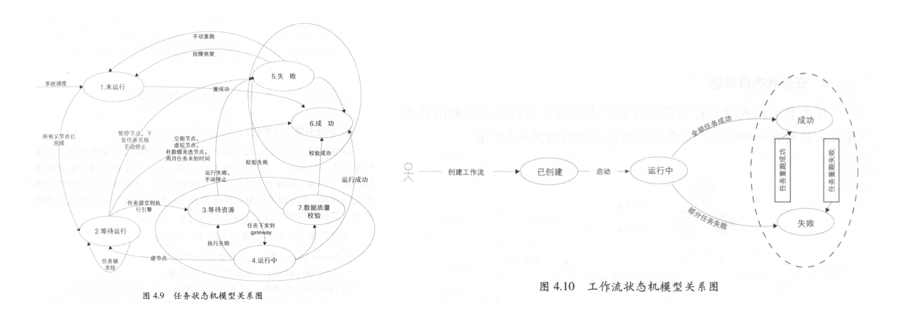

# 阿里巴巴大数据之路

全书总的结构如下图所示：

### 1.总述

日志的采集称为：**数据采集**；数据库数据的采集称之为**数据同步**

数据计算频率角度来看，阿里数据仓库分为:a:离线数据仓库， :b: 实时数据仓库

阿里数据仓库的数据加工链路~分层理念~

:one: 数据层(Operational Data Store, ODS)

:two: 明细数据层(Data Warehouse Detail , DWD)

:three: 汇总数据层(Data Warehouse Summary, DWS)

:four: 应用数据层(Application Data Store, ADS)/APP 

数据仓库不同层次之间 的加工过程实现从数据资产向信息资产的转化

元数据主要包括：:one:数据源元数据、:two:数据仓库元数据 、:three:数据链路元数据、:four:工 具 类元数据 、 :five:数据质量类元数据

统一的数据服务平台~OneService~ 以数据仓库整合计算好的数据作为数据源，对外通过**接口**的方式提供数据服务，主要提供:one:简单数据查询服务、:two:复杂数据查询服务(承接集团用户识别、用户画像等复 杂数据查询服务)、:three:实时数据推送服务三大特色数据服务

## 一，数据技术篇

### 2.日志采集

#### 2.1-基于浏览器/web端日志采集技术方案

##### 2.1.1-页面浏览日志采集

页面浏览日志的采集互联网产品的两大基本指标: :a:页面浏览量(Page View, PV) 和 :b:访客数(Unique Visitors, UV)的统计基础

典型的网页访问过程是以浏览器请求、服务器响应并返回所请求的内容 (大多以HTML 文档的形式)这种模式进行的，浏览器和服务器之间的通信遵守HTTP协议(~超文本传输协议，目前以HTTP1.1为主，逐渐向最新的HTTP2.0过渡~)。浏览器发起的请求被称为HTTP请求~HTTPRequest~，服务器的返回则被称为 HTTP响应~HTTPResponse~ 

访问淘宝请求和相应的过程

:one: 地址栏中输人 www.taobao.com 并回车

:two: 浏览器向淘宝服务器发起HTTP请求[^a]

:three: 服务器接受并解析请求，处理结果以 HTTP 响 应 形式发回浏览器[^b]

:four: 浏览器接受懂啊服务器的响应内容，并将其展示给用户~浏览器HTML文档规范解析文档并将页面渲染在屏幕上~

> [^a]:一个标准的http请求由三部分组成：请求行~请求行3要素分别是：请求方法，请求资源URL，HTTP协议版本号~，请求报头~请求服务器时增加的附加信息，如cookie数据项~，请求正文~可选项，可忽略~
> [^b]:一个标准的http响应由三部分组成：状态行~标识服务器对此次http请求的处理结果，如200表示成功响应，404表示请求资源在服务器没有找到~，响应报头~服务器响应客户的时附带信息，如cookie，cookie是由服务器生成的~，响应正文~可选项~

上述4步中，前三部不能确保用户已确实打开页面，需要在第四步执行采集日志的动作，**在HTML文档内适当位置增加一个日志采集节点，当浏览器解析到这个节点时，将自动触发一个特定的 HTTP请求到日志采集服务器** ，流程如下图所示

##### 2.1.2-页面交互日志采集

页面交互日志采集用户的互动行为数据 ，以便通过量化获知用户的兴趣点或者体验优化点，由于页面的交互行为无法触发浏览器加载新页面，无法使用PV的相同的逻辑来采集，阿里设计了一个**黄金令箭**的产品来处理这个问题：

:one: 在原数据管理页面注册需要采集交互日志的业务，系统将自动与之对应的交互采集代码模版

:two: 将交互采集代码模板采集代码植入目标页面，并将采集代码和需要检测的交互行为绑定

:three: 当用户在页面上产生指定行为时，采集代码和业务互动响应代码一起被触发和执行

:four: 采集代码在采集动作完成后将对应日志通过HTTP协议发送到日志服务器

##### 2.1.3-页面日志在服务器端的清洗和预处理

采集到日志服务器的日志需要进行相应的离线预处理才能使用，需要进行如下的预处理

:one: 识别流量攻击、网络爬虫和流量作弊(虚假流量)

:two: 数据缺项补正：取值归 一 、标准化处理或反向补正~根据新日志对稍早收集的日志中的个别数据项做回补或修订(例如，在用户登录后，对登录前页面日志做身份信息的回补)~

:three: 无效数据剔除

:four: 日志隔离分发。基于数据安全或者业务特性的考虑，某些日志在进入公共数据环境之前需要做隔离

原始日志经过上述处理之后， 就具备了结构化/半结构化的特征，可以方便地被RDB装载和使用

#### 2.2-无线客户端的采集

在阿里使用采集SDK完成无线客户端的日志采集，**事件**为无线客户端日志行为的最小单位，如页面事件和控件点击事件，涉及处理 Hybrid 应用~实现H5和Native日志的统一~

##### 2.2.1-页面事件

每条页面事件日志记录三类信息 : 

* 设备及用户的基本信息
* 被访问页面的信息，主要是一些业务参数(如商品详情页的商品 ID、所属的店铺等) 
* 访问基本路径(如页面来源、来源的来源等 )，用于还原用户完整的访问行为

具体的实现可能是下面这样的：

* 基础接口A：页面展现时调用，但是不发送日志
* 基础接口B：页面关闭时调用，发送日志~接口AB的结合可以获取用户在页面停留的时长~
* 扩展接口C：页面离开前，使用该接口给页面添加相关参数，比如给店铺详情页添加店铺ID、店铺类别等

> 透传参数功能：即把当前页面的某些信息，传递到下一个页面甚至下下一个页面的日志中。如，在手机淘宝首页搜索“连衣裙”，进人 搜索list页面，然后点击某个商品进入商品A详情页，“连衣裙”参数一直传下去，如此便于分析搜索词的效果

##### 2.2.2-点控事件

交互类的行为呈现出高度自定义的业务特征，相对而言，控件点击事件比页面事件要简单得多，点控事件需要记录：

* 基本的设备信息、用户信息
* 控件所在页面名称、控件名称、控件的业务参数

具体要操作页面上哪个控件，告诉~配置~SDK即可，特殊场景下，为平衡日志大小，减小流量消耗/采集服务器压力/网络传输压力，采集 SDK应提供了聚合功能，如客户端聚合曝光次数后上传~1次滚屏场次会产生多次曝光生产多条日志~

##### 2.2.3-H5/Native 日志统一

现在的应用几乎都是HybridAPP，多数情况下情况下， Native和H5互跳，通常无法还原用户路径，数据丢失严重。对于产品经理/运营/管理/数据分析人员而言，在不同的终端采用不同的方案采集日志， 以不同的算法来做日志统计，忍受多端之间的数据隔离，并对由此导致 的多样数据口径进行整理分析和解释，已经是越来越不能容忍的切身之痛

阿里实现了H5和Native的日志统一

##### 2.2.4-其他

:one: 全局设备唯一标识

:two: 日志传输：

* 先存储在客户端本地，然后再伺机上传
* 按天切分维度，日志分流~高峰时可降级，只保留重要日志~
* 日志采集服务器同时作为**消息队列**的生产者，下游实时~实时消费~和离线~定期获取~可以按需订阅

#### 2.3-日志采集的挑战

互联网日志已跨越初级的饥饿阶段，面临被海量日志的淹没的风险，如今，采集方案提供者所面临的主要挑战是

* 如何实现日志数据的结构化和规范化组织，实现更高效的下游统计计算
* 提供符合业务特性的数据展现
* 为算法提供更便捷、灵活的支持

### 3.数据同步

对于大数据系统来说，数据同步包含:a: 数据从业务系统同步进入数据仓库，:b:数据从数据仓库同步进入数据服务或数据应用两个方面。源业务数据系统的来源：:one:关系型数据库的结构化数据~mysql,Oracle,DB2等~ ，:two: 非关系型数据库的半结构化数据~OceanBase,HBase,MongoDB~，:three: 文件系统的结构化或非结构化数据~阿里云对象存储oss、文件存储NAS~

同步方式分为：

* 直连同步 
* 数据文件同步
* 数据库日志解析同步

#### 3.1-直连同步

直连同步是指通过定义好的规范接口API~ODBC/JDBC~的方式直接连接业务库，

:heart:优势是：配置简单，实现容易

:broken_heart:劣势是：

* 直连业务库对源系统的性能影响较大，大批量数据同步时会降低甚至拖垮业务系统的性能
* 主备策略时，从备库抽取数据可以避免情况一，但是当数据量较大时，性能较差

#### 3.2-数据文件同步

数据文件同步通过约定好的文件编码、大小、格式等，直接从源系统生成数据的文本文件，由专门的文件服务器~如FTP服务器~传输到目标系统后加载到目标数据库系统。文件传输可加密，压缩，生产校验码等，来确保文件的安全，无错，高效传输

:heart: 优势是：

* 当数据源系统包含多的异构数据库系统~MySQL,Oracle,SQLServer,DB2~，这种方式比较简单，容易

* 互联网的日志类数据，通常以文本文件形式存储的，适合数据文件同步的方式

#### 3.3-数据库日志解析同步

数据库日志解析同步方式具备实时与准实时同步的能力，延迟可以控制在毫秒级别，且对业务系统的性能影响较小，目前广泛应用于业务系统到数据仓库系统的增量数据同步

> 以 Oracle 为例，可以通过源系统的进程，读取归档日志文件并收集变化的数据信息，判断日志中的变更是否属于被收集对象，将其 解析到目标数据文件中。这种读操作是在操作系统层面完成的，不需要通过数据库，不会给源系统带来性能影响

:heart: 优势：延迟可以控制在毫秒级别，且对业务系统的性能影响较小

:broken_heart: 劣势：

* 数据延迟：业务系统做批量补录可能会使数据更新量超出系统处理峰值，导致数据延迟
* 投人较大：需要在源数据库与目标数据库之间部署一个系统实时抽取数据
* 数据漂移和遗漏：同一个业务日期数据中包含前一天或后一天凌晨附近的数据或者丢失当天的变更数据

#### 3.4-批量/实时数据同步

对于不同的数据源， DataX 通过插件的形式提供支持， 将数据从数据源读出并转换为中间状态，并且在DataX中以中间状态存在， 最后在目标数据系统中将中间状态的数据转换为对应的数据格式后写人。DataX采用Framework+Plugin的开放式框架，传输过程全内存操作，不读写磁盘

:one: Job :数据同步作业 

:two: Splitter:作业切分模块，将一个大任务分解成多个可以并发行的小任务 

:three: Sub-Job:数据同步作业切分后的小任务~Task~

:four: Reader:数据读人模块，负责运行切分后的小任务，将数据从源系统装载到DataX

:five: Channel: Reader和Writer通过Channel交换数据

:six: Writer:数据写出模块，负责将数据从DataX导人目标数据系统

实时数据的同步，日志/增量数据库逻辑日志~如：mysql-binlog~，推入到消息队列，下游需要的订阅即可

#### 3.5-数据同步的问题/解决方案

##### 3.5.1-分库分表

在涉及分库分表问题的时候，我们希望下游的应用访问库表的时候就好像访问单表一样~即一张中间表将分布在不同数据库中的表集成一张表的能力~

TDDL~TaobaoDistributedDataLayer~是一个分库分表的规则引擎，如下图：

##### 3.5.2-高效同步和批量同步

OneClick通过库名和表名唯 一 定位，通过IDB[^c]接口获取元数据信息自动生成配置信息，实现与数据同步相关的建表、配置任务、发布、测试操作一键化处理

> [^c]: IDB是一个统一管理 MySQL,OceanBase,PostgreSQL等关系型数据库的平台，因此可以获取元数据信息			 			 		 	

##### 3.5.3-增量与全量同步的合并

周期全量同步的方式，如果数据量巨大，非常影响同步效率，所以在日调度中，可以将当天的增量数据和前一天的全量数据做全外连接，重新加载最新的全量数据，即：全外连接`full outer join`+数据全量覆盖重新加载`insert overwrite`

##### 3.5.4-数据漂移的处理

数据漂移问题是指ODS表的同一个业务日期数据中包含前一天或后一天凌晨附近的数据或者丢失当天的变更数据，处理方式是多获取就在 ODS 每个时间分区中向 前、向后多冗余一些数据，保障数据只会多不会少，然后在dwd进行数据的合并

### 4.离线技术开发

数据只有被整合和计算，完成从数据到信息/知识的转变，才能实现大数据价值，达到赋能商业和创造价值的目的。阿里的数据计算层包括2大体系：:a:数据存储及计算平台~离线计算平台MaxCompute和实时计算平台StreamCompute~ ,:b:数据整合及管理体系~OneData~。离线技术开发主要描述MaxCompute。

#### 4.1- 数据开发流程

数据研发的流程包括：

:one: 了解需求 

:two: 模型设计

:three: ETL开发

:four: 测试

:five: 发布上线

:six: 日常运维

:seven: 任务下线

SQLSCAN主要有如下三类规则校验：

* 代码规范类规则，如表命名规范、生命周期设置、表注释等

- 代码质量类规则，如调度参数使用检查、分母为 0 提醒、 NULL值参与计算影响结果提醒、插入字段顺序错误等
- 代码性能类规则，如分区裁剪失效、扫描大表提醒、重复计算检测等

**Data Quality Center**~数据质量中心~自动在数据处理任务过程中进行数据质量~校验规则可配置~的监控。DQC监控规则有:主键监控、表数据量及波动监控、重要字段的非空监控、重要枚举字段的离散值监控、 指标值波动监控、业务规则监控等

数据测试最典型的测试方法是功能测试，即验证目标数据是否符合预期，有以下2种场景：

:a: 新增业务需求：需要开发新的ETL任务，主要针对目标数据和源数据的对比，包括数据量/主键/字段空值/字段枚举值/复杂逻辑(如 UDF、多路分支)等

:b: 数据迁移、重构和修改： 对于修改类的业务，需要对**修改前后的数据**进行对比，包括数据量差异、宇段值差异对比等

#### 4.2-状态机模型

如下2种状体机模型：**任务状态机模型**，**工作流状态机模型**

### 5.实时技术

按照数据的延迟情况，数据时效性一般分为三种

:one: 离线：在今天(T)处理N天前 (T-N,N > 1)的数据，延迟时间粒度为天

:two: 准实时：在当前小时(H)处理 N小时前 (H-N, N>0，如 0.5小时，1小时等)的数据，延迟时间粒度为小时

:three: 实时：当前时刻处理当前的数据，延迟时间粒度为秒

实时处理中，数据采集总是数据源一般作为消息中间件的生产者，将新增的消息~触发时间/存储阈值~发送给消息中间件，如数据库的逻辑日志~如mysqlbinlog~，新增的日志文件~用户访问日志~

实时应用出于性能考虑，计算任务往往是多线程的，一般会根据业务主键进行分桶处理，且大部分计算过程需要的数据都会放在内存中，这样会大大提高应用的吞吐量，同时为了避免内存溢出， 内存中过期的数据需要定时清理，可以按照LRU或者业务时间集合归类清理(比如业务时间属于 T-1 的，会在今天凌晨进行清理)

#### 5.1-实时应用会遇到的问题：

:one: 去重指标：

* 精确去重：此情形需要保留数据明细，如果遇到内存问题，可用数据倾斜的拌饭处理
* 模糊去重：若去重的明细数据量非常大，然后业务精确度要求不高的情况下，可以使用布隆过滤器/基数估计等算法进行粗估

:two: 数据倾斜：单节点处理能力有限，可以对指标分桶，计算结果后，最后merge

:three: 事务处理：主要为了保证数据的幂等性

#### 5.2-实时计算的数据存储

实时计算任务中，会计算很多维度和指标，这些数据需要放在一个存储系统中作为恢复或者关联使用。主要涉及三种类型的数据:

* 中间计算结果：主要用于故障恢复
* 最终结果数据：ETL处理后的实时结果数据，由于是实时更新的，写的频率非常高，这些结果数据可被下游直接使用
* 维表数据：在离线计算系统中，通过同步工具导人到在线存储系统中，供实时任务来关联实时流数据

#### 5.3-流式数据模型

实时建模跟离线建模非常类似，数据模型整体上分为五层(ODS/ DWD/DWS/ADS/DIM)，由于实时计算的局限性，每一层中并没有像离线做得那么宽，维度和指标也没有那么多，特别是涉及回溯状态的指标，在实时数据模型中几乎没有 todo:现在呢？

##### A-ods

原始数据层/数据帖源层，Operational Data Store

##### B-dwd

DWD层是在ODS层基础上，根据业务过程建模出来的实时事实明 细层

##### C-dws

DWS订阅明细层~DWD~的数据后，会在实时任务中计算各个维度的汇总指标，如果维度是各个垂直业务线通用的，则会放在实时**通用**汇总层，作为通用的数据模型使用。例如:电商数据的几大维度的汇总表(卖家,商品,买家)

##### D-ads

个性化维度汇总层~ADS~，对于不是特别通用的统计维度数据会放在这一层中，计算只有自身业务才会关注的维度和指标，与其他业务线一般没有交集，常用于一些垂直创新业务中

##### E-dim

实时维表层的数据基本上都是从离线维表层导出来的，抽取到在线 系统中供实时应用调用，如商品维表、卖家维表、买家维表、 类目维表

以下是一个具体的案例和各个层次之间流转的示意图

##### F-多流关联

流式计算中经常碰到的操作是**双流关联**以得到对应的实时明细表。流式计算中数据的到达是一个增量的过程，并且数据到达的时间是不确定的和无序的，因此在数据处理过程中会涉及**中间状态的保存**和**恢复机制**等细节问题。比如A表和B表使用 ID 进行实时关联，由于无法知道两个表的到达顺序，因此在两个数据流的每条新数据到来时，都需要到另外一张表中进行查找，如A 表的某条数据到达，到B表的全量数据中查找，

* 如果能查找到，说明可以关联上，拼接成一条记录直接输出到下游 

* 如果关联不上，则需要放在内存或外部存储中等待，直到B表的记录也到达。**多流关联的一个关键点就是需要相互等待，只有双方都到达了，才能关联成功**
* 不管是否关联成功，内存中的数据都需要备份到外部存储系统中，在任务重启时，可以从外部存储系统中恢复内存数据 ， 这样才能保证数据不丢失
* 订单记录的变更有可能发生多次(比如订单的多个字段多次更新)，在这种情况下 ， 需要根据订单ID去重，避免A表和B表多次关联成功
* 实时关联一般会把数据按照关联主键进行分桶处理，并且在故障恢复时也根据分桶来进行，以降低查找数据量和提高吞吐量

##### G-维表使用

关联维表一般会使用当前的实时数据$(T)$去关联$T-2$的维表数据~如果维表是分区表~，为什么不使用$T-1$是因为,零点的时候，可能$T-1$的数据并没有准备好

实时任务是常驻进程的，维表的使用分为两种形式

:a: 全量加载：在维表数据较少的情况下，可以一次性加载到内存中，在内存中直接和实时流数据进行关联，优点是效率高，缺点是内存一直占用着，并且需要定时更新。例如:类目维表，每天只有几万条记录，在每天零点时全量加载到内存中

:b: 增量加载：维表数据很多，无法法全部加载到内存中，可以使用增量查找和LRU过期的形式，让最热门的数据留在内存中。其优点是可以控制内存的使用量，缺点是需要查找外部存储系统，运行效率会降低。例如会员维表，有上亿条记录，每次实时数据到达时，去外部数据库中查询，并且把查询结果放在内存中，然后每隔一段时间清理一次最近最少使用的数据，以避免内存溢出

##### H-实时任务优化策略

:one: 独占资源和共享资源的策略：

在一台机器中，共享资源池可以被多个实时任务抢占，如果 一个任务在运行时 80%以上的时间都需要去抢资源，这时候就需要考虑给它分配更多的独占资源，避免抢不到CPU资源导致吞吐量急剧下降

:two: 合理选择缓存机制，尽量降低读写库次数：

内存读写性能是最好的，根据业务的特性选择不同的缓存机制，让最热和最可能使用的数据留在内存中，读写库次数降低后，吞吐量自然就上升了

:three: 计算单元合并，降低拓扑层级：

拓扑结构层级越深，性能越差，因为数据在每个节点间传输时，大部分是需要经过序列化和反序列化的，而这个过程非常消耗CPU和时间

:four: 内存对象共享，避免字符拷贝：

在海量数据处理中，大部分对象都是以字符串形式存在的，在不同线程间合理共享对象，可以大幅降低字符拷贝带来的性能消耗，不过要注意不合理使用带来的内存溢出问题

:five: 在吞吐和延迟之间取舍：

高吞吐量和低延时这两个特性是一对矛盾体，当把多个读写库操作或者ACK操作合并成一个时，可以大幅降低因为网络请求带来的消耗， 不过也会导致延时高一些，在业务上衡量进行取舍

### 6.数据服务

本章主要描述：数据部门产出的海量数据，如何方便高效地开放出去

#### 6.1-数据服务架构演进

阿里数据服务架构演进/各个阶段的变更点

4个阶段服务架构对比图

#### 6.2-OneService

Get请求~返回一条数据~和List~返回多条数据~请求拆分为为不同的线程池，这样做的目的是为了避免Get请求在单线程时，因为排队消耗大量的时间，进一步导致整体的QPS不理想

### 7.数据挖掘

近年来，数据量暴增，然而海量数据中的有效信息越来越稀疏，大数据没有诞生之前，大部分挖掘应用所需处理的样本量在百万以内，特征维度一般少于100维，如今的挖掘算法需要面对的训练数据量动辄上亿，特征维度动辄百万

就数据挖掘的商业场景来来说：可以分为2大应用

:a: 个体挖掘应用 ： 指对单个实体的行为特征进行预测与分析，如预测某商品的销量、划分某行业的价格区间等，比较常见的个体挖掘应用有：消费者画像和业务指标预测

:b: 关系挖掘应用：指研究多个实体间的关系特征，如商品/店铺的相似关系、竞争关系。常见的关系挖应用是相相似关系，竞争关系

就挖掘技术而言，分为2大要素：数据+算法

数据挖掘中主要包含2类数据：特征数据和结果数据，挖掘项目中80%的时间可能都是在处理特征，

#### 用户画像

对用户有深刻的理解是网站推荐、企业经营制胜的重要一环，用户画像通俗的讲：即是为用户打上各种各样的标签，如年龄、性别、职业、商品品牌偏好、商品类别偏好等。这些标签的数目越丰富 ，标签越细化，对用户的刻画就越精准

用户画像可以分为

* 基础属性
* 购物偏好
* 社交关系
* 财富属性

## 二，数据模型篇

### 8.大数据建模综述

数据建模强调从业务，数据的存取，使用的角度合理的存储数据

关系数据库的鼻祖是：[E.F.Codd~就职于IBM~](https://en.wikipedia.org/wiki/Edgar_F._Codd)，第一个关系型数据库是IBM的System R

#### 8.1-ER模型

数据仓库之父[ Bill lnmon](https://en.wikipedia.org/wiki/Bill_Inmon) 提出了数据仓库的概念：

> what a data warehouse is - a subject oriented, nonvolatile~非易失的~, integrated, time variant collection of data in support of management's decisions

其提出的建模方法是从全企业的高度设计一 个3NF模型~并不是某个业务流程上的实体对象关系抽象~，用实体关系(Entity Relationship, ER)模型描述企业业 务，在范式理论上符合3NF，其建模分为三个阶段：

:one: 高层模型:一个高度抽象的模型，描述主要的主题以及主题间的关系，用于描述企业的业务总体概况

:two: 中层模型:在高层模型的基础上，细化主题的数据项

:three: 物理模型(底层模型):在中层模型的基础上，考虑物理存储，同时基于性能和平台特点进行物理属性的设计，也可能做一些表的合并/分区的设计

相比于维度模型，是一种**自顶向下**的建模方式

#### 8.2-维度模型

维度模型是数据仓库领域内的另外一位大师+先驱[Ralph Kimball](https://en.wikipedia.org/wiki/Ralph_Kimball)所倡导的，其建模主要致力于更快速地完成需求分析，同时具有较好的大规模复杂查询的响应性能。其建模主要分为以下步骤：

:one: 选择需要进行分析决策的业务过程。业务过程可以是单个业务事件，比如交易的支付、退款等

:two: 选择粒度。在事件分析中，我们要预判所有分析需要细分的程度，从而决定选择的粒度。**粒度是维度的 一个组合**

:three: 识别维表。选择好粒度之后，就需要基于此粒度设计维表，包括维度属性，用于分析时进行分组和筛选

:four: 选择事实。确定分析需要衡量的指标

相比于ER建模， 是一种**自下而上**的建模方式

#### 8.3-阿里数据模型实践

阿里巴巴数据公共层建设的指导方法是**一套统一化的集团数据整合及管理的方法体系**(在内部这一体系称为“ OneData”)，其包括一致性的指标定义体系,模型设计方法体系以及配套工具

### 9.阿里数据整合及管理体系

### 10.维度设计

### 11.事实表设计

