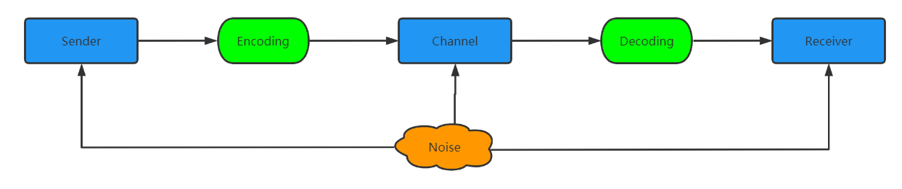

# 一，文字和语言Vs数字和信息

数字，语言，文字都是信息的载体，信息是目的，是Why，数字，语言，文字是手段，是How。

## 1.1-通信模型

如下

如何去理解这个模型，举个栗子：美国人Bob肚子饿了，于是将很这个信息编码: I am hungary , 通过空气传播，Alice 听到后，将 I am hungry 解码后，得到信息： Bob 饿了。

其中： Bob是发送者；Alice 是接受者；空气是信道；编码和解码方式是英语；噪音可能是风声或者其他声音等。

## 2.1-要点

:one: 翻译这件事之所以能达成，是因为不同的文字系统在记录信息上的能力是等价的

:two: 常用字笔画少，生僻字笔画多，这符合信息论的最短编码原理；在通信时，如果信道较宽，则不必压缩就可以直接传递，如果信道很窄，则需要压缩传递。在古代比如说话就是一个宽信道无须压缩，而书写来的慢(古代成本高)就是一个窄信道，需要压缩，因此有了文言文。

# 二，自然语言处理，从规则到统计

## 2.1-要点

:one: 图灵测试：让人和机器进行交流，如果人无法判断自己交流的对象是人还是机器，就说说明这个机器具有智能了。

:two: NLP的发展主要有2个阶段：

* 20世纪50年代-70年代，基于规则的自然语言处理：鸟飞派，即为看看鸟是怎么飞的，就能模仿鸟造出飞机，不需要了解空气动力学。基于规则(语法、语义、词法等)进行判断，比如：The pen is in the box. The box is in the pen[^1]
* 基于统计的自然语言处理

:three: NLP的应用：从单纯的句法分析和语义理解，到贴近实际应用的 机器翻译、语音识别、文本到数据库自动生成、数据挖掘、知识获取。

# 三，统计语言模型

为自然语言这种上下文相关的特性建立数学模型[^2]是NLP的关键问题。

## 3.1-要点

[^1]: pen 钢笔；栅栏
[^2]: 这个数学模型就是：自然语言处理中常说的统计语言模型。