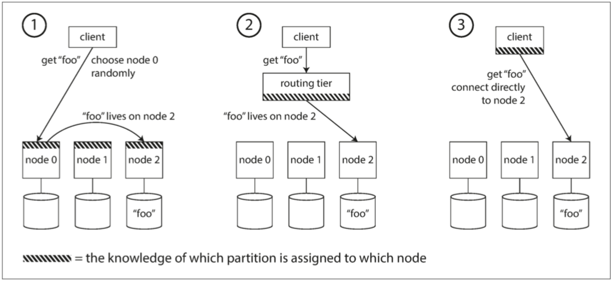

### 零、开篇词

欢迎各位，给大家分享一下自己最近读的书，ddia ,全名叫做：design data-intensive application 直译为：设计数据密集型应用；或者叫做，数据密集型应用的设计。

🎈**为什么分享这本书**🎈

我相信在场的各位一定历经过这样的场景：春节档档期一下子上映了很多场电影，一场电影要不要去看，你是如何决策的？对于我来说呢，通常都是先看一下豆瓣评分，如果高的话，就买票入场，对吧，所以为什么选择分享这本书，那就不得不说下这本书

#### 0.1：关于ddia的溢美之词

可以看到，这本书的评价惊人的高，居然达到了 9.7分的高分，有的同学可能觉得9,7分并不是一个很高的分数，来看下面这部是个码农都知道的书《算法导论》，这本书的评分是多少呢？ 9.2分，当然这是一个很高的分数，但是ddia 比这个高度还要高 0.5分；有的同学可能还是不能很直接的get到这本书的魅力，OK，我们来和豆瓣电影评分类比一下，要知道豆瓣中电影评分最高的也就是9.7分，也就是大名鼎鼎的，我相信各位应该都看过《肖申克的救赎》。


甚至ByteDance 这家公司将这本书写进入interview doc。**所以结论来了，DDIA , 你值得拥有**。

#### 0.2 关于作者

接下来，我们一起来看下这本书的作者，上图中的靓仔就是了。

### 一 、整书大纲

下面是整书的一个脉络：分为**3**个部分12个章节，


#### 1.1-3部分12章节

#####  :one:数据系统的基石

主要讲述了数据系统底层的一些概念，无论是单机上的单点数据系统，还是分布在多机器上的分布式系统。这个讨论的范围是 *单机或者多机器，区别于第二部分仅谈论多机器上的分布式系统*。

* **1：可靠性、可扩展性、可维护性**  在开发一个应用的时候，必须要满足各种功能需求才能称之为有用，除了功能需求（也就是能够实现什么功能）还需要一些非功能需求，也就是通用属性，比如说可靠性[^1]，可扩展性[^2]，可维护性[^3]。

  > [^1]:意味着即使发生故障，系统也能正常工作
  > [^2]: 意味着即使在负载增加的情况下也有保持性能的策略
  > [^3]: 有许多方面，但实质上是关于工程师和运维团队的生活质量的

* **2：数据模型与查询语言**  这个是从使用者的角度出发，:warning:*注意这个视角很重要* 描述数据录入数据系统的格式，已及如何将存入的数据取出来。涉及关系模型，文档模型，图模型。比如说对于关系型数据库来说，数据模型 = DML ；查询语言 = DSL(一种声明式的查询语句) 。阐述了关系模型的各个挑战者挑战关系模型的霸主地位最终落败的过程，数据模型发展至今关系模型依然王者。

* **3：存储与检索**  这个是从数据系统的角度出发，描述数据系统如何存储我们录入的数据，以及在我们需要这部分数据，存储系统如何精准、快速的定位到目标数据。这里注意区分*2章节和3章节的角度*。

* **4：编码与演化**  随着时间推移，数据系统由于功能的迭代，需要对初始涉及的数据模型(schema)进行更改，那么如何处理数据模型的前后兼容问题，就是这个章节要讨论的问题。

##### :two:分布式数据

多台机器参与数据的存储和检索，数据系统所面临的一些挑战

* **5：复制** ： 同一份数据，多个拷贝/副本
* **6：分区** ： 同一份数据，分割成多块
* **7：事务** ： 主要介绍 事务，ACID，隔离级别等内容，个人觉得这部分内容是重点也是难点
* **8：分布式系统的麻烦** ： 在极端情况下，分布式系统黑暗的诸多问题，看完这一章节，你会觉得你所处于的环境真的是太幸福了
* **9：一致性与共识** ：分布式数据系统如何去实现一致性和达成共识，从而避免类似于 brain split  的问题，这一章节会讨论在构建容错分布式系统的时候使用到的 算法和协议(比如Raft、Paxos、ZAB)，一定会让你有所收货。

##### :three:派生数据

主要讨论衍生(派生)数据：所谓*衍生数据* 是以输入数据输出新的数据，输出是衍生数据（derived data）的一种形式 ，流处理和批处理都会产生衍生数据。

* **10：批处理**  ： 有界数据的处理
* **11：流处理**  ： 无界数据的处理
* **12：数据系统的未来** 🤣

🎈**过度**🎈：以上呢，就是整本书的一个简短的概括，下面的内容就是我基于书中的内容做的一些总结，已及自己的一些启发

#### 1.2-计算密集与数据密集型应用区分

下图是应用程序的简要分类：


:a: 首先是计算密集型应用，这类应用的瓶颈是算力，比如进行气象预测，对于这类应用我们处理的方式就是不断的提升计算机的算力，比如增加CPU的核数，增加内存等

:b: 再有就是数据密集型，这类应用的瓶颈是：
* 数据量，Volume
* 数据的复杂性，Variety
* 数据的变更速度，Velocity

对于数据密集型应用，我们通常会使用标准的组件来处理：

:one: 存储数据，以便自己或其他应用程序之后能再次找到(数据库 database)

:two: 记住开销昂贵操作的结果，加快读取速度(缓存 cache)

:three: 允许用户按关键字搜索数据，或以各种方式对数据进行过滤(搜索索引 search indexes)

:four: 向其他进程发送消息，进行异步处理(流处理 stream processing)

:five: 定期处理累积的大批量数据(批处理 batch processing)

### 三、第3章节-存储与检索

那么在第一部分，第三章节，是存储与检索的内容，也就是说：数据库在最基础的层次上完成的2件事情：

:a: 当你把数据交付给它的时候，它如何将数据存储起来

:b: 当你向数据库索要数据时，它如何将数据返回给你

由于事务性负载和分析性负载的存储引擎之间存在着很大的差异，这两类的存储引擎我们分开来描述

**在事务处理方面**：

* 日志结构存储引擎  ；从最简单的数据库实现append-log(无索引日志)到 LSM(日志结构合并树) 树的演化历程。
* 面向页面的存储引擎 ，典型的比如B-Tree

在**分析性存储引擎方面**，我们谈谈

* 数据仓库
* 星型模型&雪花模型
* 列存储

#### 3.1-无索引日志

我们来看下 **世界上最简单的数据库** 是如何实现的

* 首先来一个插入操作
* 再来一个更新操作
* 最后，来一个get 操作


那么这个最简单的数据库底层是如何进行数据的摆放的呢？可以看到`db_set()`就是一个非常简单的追加[^4]，这**简直不是简单，甚至可以说是简陋**但正是由于这种设计使得写入变的非常的高效，代价就查找的开销是 $O(n)$ ，$O(n)$的复杂度，这意味着如果数据量增加一倍，查询响应时间将会增加一倍。也就是说查询时间和数据量之间的关系是线性相关的。所以我们需要**更快的得到目标结果**，那么如何去提升数据的查找效率？

> [^4]: 追加是顺序写，顺序写入速度>>随机写入

#### 3.2-如何提升查找效率？


当我们还在上小学的时候，可能也面临过类似的问题，假设说现在有2个小学生，忘记了**囧**字怎么写，想要用新华字典查询一下：

* @冰雨 同学使用的是一本没有目录的字典(比如说康熙字典)

* @流川同学 使用的是一本有目录的字典(现代新华字典)

  那么谁最后能更快的获知 `jiong` 字的写法呢？直觉告诉我们流川同学有较大的概率最快获取到 `joing`字的写法。

可以发现现代字典的特征就是都会有一个目录，这个目录是在**原始数据之外维护的额外的数据**，正是由于目录的存在，使得@流川同学能够更快的获取到目标数据。其实这个目录，其实就相当于英文中的 index , 而 index英译就是索引，至此我们可以得到一个结论：

> 索引 是在原始数据之外维护的额外的数据，索引 可以加速数据访问

🎈**Post Script**🎈

由于需要在原始数据之外额外维护一份数据，这就无形增加了空间复杂度，在计算机领域中，时间和空间就像鱼和熊掌一样，不可兼得，降低时间复杂度的方式就**用空间换取时间**； 可以说这个问题在计算机领域是一个绕不开的话题，如何去提升查找效率这个问题的另外一种问法是：**给我一个更低的时间复杂度**的实现，那么常见的比$O(n)$  还低的时间复杂度就是 $O(1)$，$O (log_n)$ 两个，$O(1)$的时间复杂度，我们很容易就会想到哈希表，因为哈希表的时间复杂度默认是O(1)$，接下来我们尝试构建哈希索引来提升查询效率。

#### 3.3-内存中构建hash索引


那么对于存储于磁盘中的数据，我们在内存中维护一个HashMap，维护key和value 的偏移量，这样一来，我们就能够迅速的定位到目标数据，比如我们想要find key = 42 的数据，通过查询内存中的HashMap表，获得偏移量64 ，所以可以直接定位到数据，而不在需要从头开始遍历。

随着我们不断的在文件末尾追加文件，磁盘中的单个文件也会越来越大，甚至单个文件可能吃掉整个磁盘的存储。所以，**如何用有限的存储存储更多的数据？** 也就是说如何避免磁盘的空间的消耗？

#### 3.4-压缩与分段合并 & hash索引的局限性


我们解决的方案是：

* 分段存储：也就是说当追加文件的size达到了一定的阈值之后，我们重新写入新的文件

* 压缩：丢弃重复的键，保留每个键的最新值

如上图中原本12个键 压缩之后之后3个键，整个文件的size降低。**如何进一步改进？** 


在执行压缩的同时，可以将压缩之后的**段合并**。如 Data file segment 1 和 Data file Segment 2 在压缩了之后，进行了一个合并操作，得到了 Merged Segment(比如mew 这个键压缩合并的过程)。压缩和合并对用户是没有感知的，由后台进程完成，在合并的时候由旧的段文件提供读写请求，在合并完成之后，读写请求转化为新的合并后的段。

那么由于hash表本身的特性，也会导致我们构建的哈希索引有一定的局限性，比如：

:a: 哈希表是存在于内存中的

:b: 范围查询是软肋

那么如何突破哈希表的局限性，寻找更好的索引结构？

#### 3.5-SSTable 排序字符串表


这个问题的答案是：排序字符串表，也就是**SSTable[^5]**, 也就是：在段文件中，对键值对的序列排序。比如上图中，对于已经排好序段文件1，段文件2 ，段文件3 ，进行压缩和合并，而且，在合并之后，仍然需要保证合并之后的段文件有序，所以我们需要一个合适的排序算法：**那么这个排序算法是什么呢？** 是冯诺依曼发明的归并排序算法；merge sort 的优势就在于：内存在小于被排序文件大小的时候，仍然可以将排序完成。

> [^5]:SSTable : Sort String Table

使用SSTable可以有效的突破内存限制和解决范围查询的问题。如下图中我们查找，handiwork 的过程，可以发现不是在内存中保存所有键的索引，由于SSTable维护了顺序关系，我们的索引以稀疏索引的方式存在于内存中。同时，可以支持范围查询。


#### 3.6-LSM 日志结构合并树

在前面的讲述中，我们默认了落盘段文件是有序的，在落盘写入段文件之前，**如何按键排序**？考虑到效率问题，最初的的写入一定是在内存中的，到达一定的时间阈值或者是内存阈值的时候，在进行落盘形成 SSTable，那么内存中**选择什么样的数据结构？**

:one: 内存表，**为什么是AVL-Tree ？** 
* 首先平衡二叉树本身就是二叉搜索树，而二叉搜索树中序遍历就是顺序结构，可以直接落盘形成SSTable；
* 由于平衡特性，可以保持树的结构，而不是退化成链表，使得查询的时间复杂度维持在 $O(logN)$, 而且对于新加入的数据，平衡二叉树通过左旋或者右旋的方式保持平衡性

:two: 落盘，也就是平衡二叉树的中序遍历方式落盘

:three: 读取请求，先请求内存，然后查询磁盘段

:four: 压缩和合并： 后台压缩合并段文件，并丢弃覆盖/删除旧值

:five: 防止数据库崩溃：磁盘保留一份单独的日志，每个写入都附加到磁盘上，防止数据库崩溃，内存数据丢失

那么使用这种结构的组件有哪些呢？


Cassandra[^6]、Bigtable、HBase、Elasticsearch、Solr[^7]、Hologres

> [^6]: 卡桑德拉，Apache Cassandra是一套开源分布式NoSQL数据库系统。它最初由Facebook开发，用于改善电子邮件系统的搜索性能的简单格式数据，集Google BigTable的数据模型与Amazon Dynamo的完全分布式架构于一身
> [^7]: 和ES一样是一个企业级的搜索索引

 **这种先内存排序，再落盘排序的结构，就是LSM(Log-Structure Merge Tree 日志结构合并树)结构**。

#### 3.7-面向页存储引擎

接下来我们介绍另外一种存储引擎：面向页面的存储引擎，比如B 树，B树会将数据库分解为固定大小的块或者是页面，传统大小为4K而且一次只能读取或者写入一个页面，和LSM对比一下


下图展示了面向页面的存储引擎是如何查询数据的


分支因子：**在B树中一个页面中对子页面的引用数量**。面向页面的存储引擎发展至今已经非常成熟了，伴随着上世纪70年代关系型数据库的发展至今。

#### 3.8-向页面添加元素

如何向B树中增加一个数据，如下图：


#### 3.9-比对LSM树 和 B树

最后我们来一起对比一下LSM树和B树，也即面向日志的存储引擎和面向B树的存储引擎的优劣势


#### 3.10-OLTP&OLAP 和 数据仓库

数据库在历史中主要为两种系统提供支持

:a: 在线事务处理系统，即OLTP

:b: 在线分析系统，即OLAP

下表中对比了两者之间的区别，


起初的数据库，能够同时应对以上两种查询的情况，无论是OLTP类型的查询，还是OLAP类型的查询，单一的数据库的表现的都很好，也就是说：**<u>也就是说两者是一家的</u>**。 OLAP通常会要求 **高可用**与**低延迟**，为了保证业务系统的稳定运行，所以DBA会密切关注他们的OLTP数据库，他们通常不愿意让业务分析人员在OLTP数据库上运行临时分析查询，因为这些查询通常开销巨大，会扫描大部分数据集，这会损害同时执行的事务的性能。可以见得，OALP和OLTP 这对亲兄弟发生了矛盾，矛盾会最佳解决方案就是分家。在二十世纪八十年代末和九十年代初期，渐渐地很多公司有停止使用OLTP系统进行分析，而是在单独的数据库上运行分析。这个单独的数据库被称为**数据仓库(data warehouse)**。因为最初的数据仓库是从关系型数据库中独立出来，只存储关系数据，而且是面向数据分析，BI(商业智能)的，只是到了后来随着大数据时代的到来，数据仓库才慢慢变的越来越像**数据湖[^8]** （就是各种数据都跑往数据仓库里面塞）。

> [^8]: 数据湖：是指使用[大型二进制对象](https://zh.wikipedia.org/wiki/二進位大型物件)或文件这样的自然格式储存数据的系统[[1\]](https://zh.wikipedia.org/wiki/数据湖#cite_note-1)  ，数据湖可以包括[关系数据库](https://zh.wikipedia.org/wiki/关系数据库)的[结构化数据](https://zh.wikipedia.org/wiki/数据模型)(行与列)、半结构化的数据([CSV](https://zh.wikipedia.org/wiki/逗号分隔值)，日志，[XML](https://zh.wikipedia.org/wiki/XML), [JSON](https://zh.wikipedia.org/wiki/JSON))，非结构化数据 (电子邮件、文件、PDF)和 二进制数据(图像、[音频](https://zh.wikipedia.org/wiki/數位音訊)、视频)
>
> 数据沼泽：**数据沼泽** 是一个劣化的数据湖，用户无法访问，或是没什么价值。

又或者说，**数据湖是下一代数据仓库**，从OLTP数据库中提取数据，转换成适合分析的模式，清理并加载到数据仓库中，因此数据仓库包含公司各种OLTP系统中所有的只读数据副本。下图是一个简要的示意图：


#### 3.11-数据仓库系统组件

我们来看一些比较出名的商业数据仓库系统，尽管他们是冠以出名的商业数据仓库系统，但是其中"商业"两个字可能是太贵，导致我们大多数从事数据仓库相关工作的人，其实并不知道：


* SQL - Server   使用两套不同的存储和查询引擎来应对OALP和OLTP环境
* Teradata       天睿
* Vertica          维蒂卡
* SAP HANA    SAP  汉那
* ParAccel        帕加速

相对而言，我们更喜欢免费的开源产品，下面是一些SQL-on-Hadoop 项目：

Hive-SQL、Spark-SQL、Flink-SQL、Presto、Druid、Kylin、Impala

#### 3.11-雪花模型

在OLTP系统中，可用的数据模型很丰富，比如大类上分为

:a: 关系模型

:b: 新的非关系模型，No-SQL模型
* 文档数据库模型
* 图形数据库模型

相对于OATP系统来说，OLAP系统的数据模型多样性就少的多，数据仓库大多使用一样的公式化模型：**<u>星型模式|星型模型(也叫维度建模)</u>** 如下图：


:one: 模式的中心是一个所谓的事实表，事实表的每一行代表在特定时间发生的事件（这里，每一行代表客户购买的产品）

:two: 事实表中的一些列是属性，例如产品销售的价格和从供应商那里购买的成本（允许计算利润余额），通常是数字等可统计指标

:three: 事实表中的其他列是对其他表（称为维表）的外键引用，由于事实表中的每一行都表示一个事件，因此这些维度代表事件的发生地点，时间，方式和原因

:four: 事实表格有100列以上，有时甚至有数百列，快手宽表列长达1000+列

:five: 星型模型进一步的扩展是雪花模型，也就是基于维度表进一步拆分

当表关系可视化时，事实表在中间，由维表包围；与这些表的连接就像星星的光芒，所以这模式被命名为：“星型模式”。

#### 3.12-列式存储

在前面的存储结构中，我们介绍了

:a: 基于日志的存储：日志结构学派

:b: 基于页面的存储：就地更新学派

然而，典型的数据仓库查询一次只访问较少的列，如果使用行存储的话，面向行的存储引擎仍然需要将所有这些行(每个包含超过100个属性)从磁盘加载到内存中，解析它们，并过滤掉那些不符合要求的条件。这可能需要很长时间。面向列的存储背后的想法很简单：不要将所有来自一行的值存储在一起，而是将来自每一列的所有值存储在一起。如下图


可以观察到红色框选出来的值序列，他们是重复数据，而**重复数据是压缩的好兆头**。我们根据列中的数据，可以使用不同的压缩技术来进一步降低对磁盘吞吐量的需求，在数据仓库中特别有效的一种技术是*位图编码*(类似哈夫曼编码)，如下图：


### 四、第5章节-复制

接下来是第5章的内容，这章节的内容主要是复制，所谓复制就是**同一份数据保留多个副本**。 复制数据的原因呢？

:one: 使得数据与用户在地理上接近(从而减少延迟)

:two: 即使系统的一部分出现故障，系统也能继续工作(从而提高可用性)

:three: 扩展可以接受读请求的机器数量(从而提高读取吞吐量)

真正的麻烦在于如何**处理复制数据的变更** 。本章主要讨论三种变更复制算法：单主复制、多主复制、无主复制。这里介绍单主场景。

🎈**过度**🎈

当存在多个副本时，会不可避免的出现一个问题：如何确保所有数据都落在了所有的副本上？我们来看一个非常普遍且常用解决方案：**单主复制**

#### 4.1-单主复制

来具体看一个场景，更换新的用户头像的实例：

总结一下单主复制符合以下的特点：

:one: 多个副本中only 一个设置为leader,其他是flower

:two: leader 接受读请求和写请求，follower只接受读请求

:three: follower从leader拉去日志，更新本地数据库副本

这种复制模式是很多关系型数据库内置的功能，比如PostgreSQL(9.0之后)，MySQL，SQL Server，文档型数据库 MongoDB。其实基于领导者的复制不局限于数据库，像一些高可用的分布式MQ也也再用，比如说常见的Kafka、RabbitMQ

> 关于主从和主备，主从中从是向外提供服务的，而主备中的备不是对外提供的，备的作用是待主crash的时候成为主。

🎈**过度**🎈

接下来呢，我们讨论复制系统的一个重要细节：复制是**同步(synchronously)**发生还是**异步(asynchronously)**发生

#### 4.2-同步/异步

如下图：

:one: 用户id为1234的用户向主库提交数据变更请求

:two: 主库将数据变更同步给从库1，并且等待从库1的响应，这里从库1复制的方式是同步

:three: 主库将数据变更同步给从库2，但是不等待从库2的确认，这里从库2的复制方式是异步

整体的配置方式也被称作是半同步。我们来一起看下同步和异步复制的优劣势：

:a: 同步复制能够保证数据可靠性，但是如果从库迟迟不能响应主库，主库就不能接收新的读写请求

:b: 异步复制的优点是，即便从库落后了，主库也可以继续处理写入请求

我们再来看一下设置新从库的步骤：

:one: 获取某个时刻主库的一致性快照

:two: 将快照复制到从库节点

:three: 从库连接主库，拉取快照之后发生的数据变更。拉取快照之后的变更往往 快照和主库复制日志关联，记录关联关系的不同的数据库实现有着不同的名称：
* PostgreSQL 的叫做**日志序列号(log sequence number, LSN)**
* MySQL将其称为 **二进制日志坐标(binlog coordinates)**

🎈**过度**🎈 接下来我们说一下如何进行故障节点的处理，从库失效的问题很好解决，从库在重新和主库建立连接之后，可以从日志知道最后一个失败的事务。然后开始追赶主库。我们重点说下主库失效如何处理。

#### 23  处理故障节点

**主库失效如何处理？**

:one: 确认主库失效，

:two: 选择一个新的主库，**<u>让所有的副本达成一致意见(共识问题)</u>**

:three: 重新配置新的主库，并且启用新的主库

一些挑战：

* 如果使用异步复制，发生的数据丢失问题，GitHub事故中MySQL主库挂掉了，新的主库在开始的时候大都是美好的
* 脑裂的情况，设置新的主库之后，老的主库又一次活过来了，可能会存在两个主库的情况，同时接受写入，可能会导致数据损坏，解决的方案可能是，发送kill 去干掉一个主库
* 宣告主库死亡的阈值，主库在宣告死亡前，超时时间的设置。主库失效时，太长意味着恢复时间长，太短就会发生不必要的切换

**基于主库的复制底层是如何工作的？**

:one: 基于语句的复制，有非确定性函数、自增列的问题

:two: 传输预写式日志(WAL)，日志包含所有数据库写入的仅追加字节序列，可以将其发给从库，比如说PostgreSQL 、Oracle
缺点是数据过于底层，WAL包含哪些磁盘块中的哪些字节发生了更改。这使复制与存储引擎紧密耦合，对数据库版本不友好，这对运维升级数据库带来了一定的困难。

:three: 逻辑日志复制（基于行），也即复制日志和存储引擎存储的日志采用不同的格式，这种复制日志被称为逻辑日志。

* 对于插入的行，日志包含所有列的新值。
* 对于删除的行，日志包含足够的信息来唯一标识已删除的行。通常是主键，但是如果表上没有主键，则需要记录所有列的旧值。
* 对于更新的行，日志包含足够的信息来唯一标识更新的行，以及所有列的新值（或至少所有已更改的列的新值）。

这样的逻辑日志，而使领导者和跟随者能够运行不同版本的数据库软件甚至不同的存储引擎。

* 基于触发器的复制，触发器能够实现，在数据库系统中发生数据更改（写入事务）时自动执行的自定义应用程序代码，不同于数据库系统实现的复制。

### 分区

分区[^28]是一种切分大数据集的方法，分区的目的是为了可扩展性，从而提高吞吐量。在实践中，分区通常和复制结合使用，如此一来每个分区的副本处在多个节点上，以此获得容错能力。下图是主从复制模型下，分区和复制相结合的示意图：

> [^28]:分区有很多中叫法，比如Solr Cloud中被称为分片(shard),在HBase中称之为区域(Region)，Bigtable/kudu中则是表块(tablet，Cassandra和Riak中是虚节点(vnode), Couchbase中叫做虚桶(vBucket)，但是分区(partition是约定俗成的叫法


#### 键值数据的分区方式：

分区最核心的问题是

:a:避免处理倾斜(skew)，即热点数据处理

:b: 处理访问路由问题，即查询性能的保证

下面我们介绍几种常见的分区方式：

:one: 按照key 的范围分区，这种方式天生可以解决访问路由的问题，对于热点数据，可根据数据状况进行拆分，如下12号分区。Hbase,BigTable使用这种策略。在处理时间范围分区，应对当前时间写入同一个分区的这种写入过载问题，可引入其他列值+时间做分区


:two: 散列[^29]分区。散列分区可以很好的处理热点问题，弊端是查询能力无法保证，因为曾经相邻的密钥分散在所有分区中，这意味着如果执行范围查询，则该查询将被发送到所有分区中。


改进的办法是多个列组成的复合主键，键中只有第一列会作为散列的依据，而其他列则被用作SSTables中排序数据的连接索引，此时如果第一列已经指定了固定值，则可以对该键的其他列执行有效的范围扫描。例如，在社交媒体网站上，一个用户可能会发布很多更新。如果更新的主键被选择为`(user_id, update_timestamp)`，那么可以有效地检索特定用户在某个时间间隔内按时间戳排序的所有更新。Casssandra使用了这种优化方式。

> [^29]:该分区方式依赖于散列函数，一个32位散列函数,无论何时给定一个新的字符串输入，它将返回一个0到$2^{32}$ -1之间的"随机"数

#### 分区和二级索引

上文中我们讨论了键值数据模型的分区方案，次级索引是关系型数据库/文档型数据库的基础，也是Solr和ElasticSearch等搜索服务器的基石，次级索引由于不具备主键唯一的特性，导致我们并不能整齐的映射到各自的分区，有2种用二级索引对数据库进行分区的方法：

:a: 基于文档的分区(docment-based)，如下图在汽车表/文档上建立颜色和厂商的次级索引，这种索引方法中，**每个分区是完全独立，每个分区维护自己的次级索引**，因此，文档分区索引也叫做本地索引(local index)。在执行特定的颜色的搜索的时候，需要将查询发送到所有分区，并合并所有返回的结果。故，这种分区查询数据库的方式有时被称为**分散/聚集(scatter/gather)**，这种基于二级索引上的查询*可能*会相当昂贵。


:b: 基于关键词(term-based)的分区，对所有分区的数据构建全局索引，同时全局索引进行分区。这种索引称为**关键词分区(term-partitioned)** [^30]，(在任何时候)使用关键词本身进行分区适用于范围扫描，而对关键词的哈希分区提供更好的负载均衡能力。关键词分区的全局索引的优势在于不需要**分散/收集**所有分区，客户端只需要向包含关键词的分区发出请求。全局索引的缺点在于写入速度较慢且较为复杂，因为写入单个文档现在可能会影响索引的多个分区。在实践中，对全局二级索引的更新通常是**异步**的


> [^30]: 我们搜索的关键词决定了次级索引的分区方式，因此称之为关键词索引，关键词(term)一词来源于全文搜索索引(一种特殊的次级索引)。

#### 分区再平衡

将负载(数据存储和读写请求)从集群中的一个节点向另一个节点移动的过程称为**再平衡(reblancing)**，再平衡应该满足一下几个要求：

* 再平衡之后，负载（数据存储，读取和写入请求）应该在集群中的节点之间公平地共享

* 再平衡发生时，数据库应该继续接受读取和写入

* 节点之间只移动必须的数据，以便快速再平衡，并减少网络和磁盘I/O负载

相应的，我们有三种分区方式，来进行处理

:one: 固定数量的分区，创建比节点更多的分区，并为每个节点分配多个分区，如果一个节点被添加到集群中，新节点可以从当前每个节点中**窃取**一些分区，直到分区再次公平分配，如下图。Riak，Elasticsearch使用了这种再平衡的分区方式。


:two:动态分区，当分区增长到超过配置的大小时(在HBase上，默认值是10GB)，会被分成两个分区，每个分区约占一半的数据，反之进行合并，类似B树的页分裂/合并的过程。

:three:按照节点比例分区，分区数与节点数成正比，每个分区的大小与数据集大小成比例地增长，而节点数量保持不变，但是当增加节点数时，分区将再次变小。

#### 请求路由

请求路由解决的这样的一个问题：数据集已经分割到多个机器上运行的多个节点上，那么当客户想要发出请求时，如何知道要连接哪个节点？这个问题也可以概括为**服务发现(service discovery)**，有目前一下三种方案：

:one:允许客户联系任何节点(例如，通过**循环策略的负载均衡(Round-Robin Load Balancer)**)。如果该节点恰巧拥有请求的分区，则它可以直接处理该请求;否则，它将请求转发到适当的节点，接收回复并传递给客户端。

:two:首先将所有来自客户端的请求发送到路由层，它决定了应该处理请求的节点，并相应地转发。此路由层本身不处理任何请求；它仅负责分区的负载均衡。

:three:要求客户端知道分区和节点的分配。在这种情况下，客户端可以直接连接到适当的节点，而不需要任何中介。

以上三种方式都会面临一个问题：作出路由决策的组件(可能是节点之一，还是路由层或客户端)如何了解分区-节点之间的分配关系变化？许多分布式数据系统都依赖于一个独立的协调服务，比如ZooKeeper来跟踪集群元数据，每个节点在ZooKeeper中注册自己，ZooKeeper维护分区到节点的可靠映射。 其他参与者（如路由层或分区感知客户端）可以在ZooKeeper中订阅此信息。 只要分区分配发生的改变，或者集群中添加或删除了一个节点，ZooKeeper就会通知路由层使路由信息保持最新状态。比如HBase，SolrCloud和Kafka也使用ZooKeeper来跟踪分区分配。



### 24 第7章节-事务

其实很早就接触事务这个概念，关于事务呢，看网上的文章动不动就把转账的的例子拿出来，更坑的时候有的压根就没有讲明白对吧，概念也背的烂熟，也知道事务的4大特性ACID (也就是原子性、一致性、隔离性、持久性)，所谓事务就是 **事务要不就执行成功，要不执行失败，只有这2种状态**，但是这么些年从来没有思考过，为什么要有事务？他解决了什么样子的问题和痛点。那么我们带着这样的一个问题来回顾一下事务起源：


上图中有一个名为猪小明程序员抱着自己的电脑在疯狂的写代码，开发应用程序，其中应用程序需要透过网络和数据库进行数据的存储和获取，数据库软件是依托于什么？是操作系统画，在操作系统的底层呢？是一些计算机硬件，比如说，存储介质，磁盘，缓存Cache,RAM ,ROM,CPU,主板等。在整个场景中呢，很多事情都有可能出错，比如：

:one: 网络中断，客户端和应用程序服务之间，服务和数据库之间

:two: 数据库软件本身挂掉了，硬件发生故障[^9]

> [^9]: 关于硬件故障：硬件故障率是很高的，磁盘在进行大量的读写之后失效的概率是很高的，IDC数据中心对物理环境的要求是很苛刻的，为了降低温度空调不够用，甚至把数据中心搬到山洞里，比如阿里在贵州云南的IDC，地板使用静电地板，每个机房入口的挡鼠板比膝盖还高，供电都是双路供电等。

:three: 应用程序在进行写入的时候，写到一半，自己崩溃了。

:four: 多个客户端同时操作数据库，覆盖彼此的更新。

:five: 客户写到一半的数据，被另外一个客户读取到。

:six: 客户之间的竞争导致的令人惊讶的错误。

所有的这一些都需要应用程序的开发者猪小明去解决，其实这个工作量是巨大的，应用开发应该专注于业务，而不是通用问题的处理，所以对上面的问题的处理，应该放在下层处理，也就是说留给数据库去处理。所以为了**<b>简化应用编程模型</b>** ，事务诞生了。通过使用事务，应用程序可以自由地忽略某些潜在的错误情况和并发问题，因为数据库会替应用处理好这些。

1974年的时候，IBM的圣荷西研究中心发布了第一款提供优秀的事务处理能力的关系型数据库。在我们已经习惯了事务的时候，我们就是觉得事务是理所当然的，他是天然就存在的，然而并不是，了解事务出现的历史，我们可以发现事务不是自然存在的，事务是我们的计算机先驱们为了解决一揽子问题，提供的一种解决方案。

#### 25 ACID

前面我们也提到了，谈及事务，必谈事务的 4大特性，ACID  ；解释这四个特性，需要说清楚3个问题：

* ACID 四个特性分别指的什么
* 这个四个特性之间的关系
* 和事务的关系

**😁ACID 分别指的是什么呢？**

A ： 原子性，在没有原子性的时候，如果有多次更改，但是更改发生一半的时候发生了错误，应用程序此时很难判断哪些更改生效了，哪些没有生效。如果有了原子性，应用程序可以确定的知道在发生错误时，所有更改都没有生效。**能够在错误时中止事务，丢弃该事务进行的所有写入变更的能力**，可以理解为**可终止性**。**没有原子性，错误处理就会变的很复杂**。

区别于线程的原子操作：多线程中的原子操作描述的是如果一个线程执行一个原子操作，意味着另外一个线程无法看到该原子操作的中间结果。而这个特性在ACID中是 *I(isolation)* 来描述的。

D ：持久性，持久性是事务得一个承诺，也即事务完成后，即便发生硬件故障或者数据库崩溃，写入的任务数据也不会丢失。持久性过去一般被认为写入了非易失性存储介质。

C：一致性。这是一个一词多意的词，用行话来说，是这个词被重载了

> :one: 有别于副本一致性，比如在单主复制的模式下，采用异步复制的方式，收敛最终一致。
>
> :two: 还有大家有可能会听过一致性hash （一致性散列）那是一种为了避免重新分区带来的复杂度提高的一种解决方案。
>
> :two: CAP定理中，C指的是线性一致性。

在事务中，一致性是指：**对数据的一组特定陈述必须始终成立**，即为*不变量*，在会计系统中，所有账户整体上必须借贷相抵。原子性，隔离性和持久性是数据库的属性，而一致性（在ACID意义上）是应用程序的属性。

I：隔离性，**竞争条件下，同时执行的事务是相互隔离的**，下图是两个客户之间的竞争状态同时递增计数器的图述。**缺乏隔离性，就会导致并发问题**

 

4个特性之间的关系，一致性是目的，原子性、隔离性、持久性手段。如果说数据库能够提供事务的能力，那么就具备ACID4个特性，如果具备这4个特性，也就表明有事务能力，也就是说事务和4大特性形成充分必要条件。

####  26 单对象操作和多对象操作

**单一对象操作**，所谓单对象操作中的对象指的是数据库中被修改的对象，比如你正在向数据库写入一个20KB的Json文档，可能会发生下面几个场景：

:one: 在发送第一个10KB之后，网络连接中断，数据库是否存储了不可解析的10KBJSON片段

:two: 在数据库正在覆盖的磁盘上的前一个值的过程中电源发生故障，是否最终将新旧值拼接在一起？

:three: 如果另一个客户端在写入过程中读取该文档，是否会看到部分更新？

这里的 JSON对象，就是单一对象，单一对象是相对于多对象而言的，待会我们会谈及到多对象。为了针对以上的问题，存储引擎会在单个对象上提供原子性和隔离性，如此一来：

:a: 原子性通过WAL日志来实现崩溃恢复

:b: 使用每个对象的锁来实现隔离（每次仅仅允许一个线程访问对象）

**CAS**，为了防止多个客户端同时写入同一个对象时的更新丢失，除了单对象操作，还有就是CAS（Compare-and-set) ，也就是当值没有并发并其他人修改的时候，才允许执行写入操作。CAS操作和单对象操作，被称作是轻量级事务。**事务通常更多的强调 ： 将多个对象的多个操作合并为一个执行的单元的机制**。

**何为多对象？** 在操作数据库时，需要协调写入几个不同的对象：

* 关系模型中，一个表中的行对另外一个表的外键引用。你得确保外键是最新的，可用的
* 在字段冗余的场景中，单个字段在多处被存储，你得保证这几处是同步的
* 二级索引的数据库中，数据更新的时候，二级索引也需要更新

在这种情形下，需要使用事务来进行处理。

🎈**过度**🎈，接下来我们会讲述隔离级别，在讲述隔离级别之前，明确两点：

:a: 隔离级别是在事务的4大特性之一的隔离性上划分的一个等级，隔离级别是事务的4大特性之一；其中SQL标准的事务隔离级别包括：

* 读未提交（read uncommitted）
* 读已提交（read committed）
* 可重复读/快照隔离（repeatable read） 
* 串行化（serializable ）

:b: 隔离级别最高是可序列化，表示同一时间只能有一个事务，隔离级别和性能之间是一个负相关的关系，也就是说隔离级别越高，数据一致性的保证越好，但是性能越差。所以说，隔离级别是数据一致性和服务性能的一场博弈。为了实现更优的性能，我们需要较弱的隔离级别。

隔离级别在实现上，数据库里面会创建一个视图，访问的时候以视图的逻辑结果为准。

:one: “读未提交”隔离级别下直接返回记录上的最新值，没有视图概念。

:two: 在“读提交”隔离级别下，这个视图是在每个 SQL 语句开始执行的时候创建的。

:three: 在“可重复读”隔离级别下，这个视图是在事务启动时创建的，整个事务存在期间都用这个视图。

:four: “串行化”隔离级别下直接用加锁的方式来避免并行访问。

下面介绍这些隔离级别：

#### 27 读已提交

最基本的弱隔离级别是，读已提交，它提供了两个保证：

* 从数据库读时，只能看到已提交的数据（没有**脏读（dirty reads）**）
* 写入数据库时，只会覆盖已经写入的数据（没有**脏写（dirty writes）**）

另外补充：读未提交：

* 可以防止脏写
* 但是不能够防止脏读

下图是一个没有脏读的例子：可以看到*直到用户1提交了之后*，用户2才看到提交之后的值x=3,而在这之前用户3只能看到x=2。

 

那么为什么要防止脏读呢？主要是下面两个原因：

:one: 如果事务需要更新多个对象，脏读取意味着另一个事务可能会只看到一部分更新。比如说下面这个电子邮件的例子。事务还没有提交，但是用户2看到了未读邮件，可是未读邮件的数量却还是旧值。

 

:two: 数据库允许脏读，那就意味着一个事务可能会看到稍后需要回滚的数据，即从未实际提交给数据库的数据。比如下面的例子中红色标记的位置读到了未提交的数据，但是后面事务回滚了。

 

没有脏写，在写入数据库时，只会覆盖已经写入的数据，也就是说两个事务同时更新数据库中的对象，先前的写入没有提交，后面的写入覆盖这个尚未提交的值，这就是脏写。在**读已提交**的隔离级别上运行的事务必须防止脏写，通常是延迟第二次写入，直到第一次写入事务提交或中止为止。下图是脏写发生的示例，发票属于Alice; 销售属于Bob。

 

#### 28 实现读已提交

读已提交是一种非常Fashion的一个隔离级别，有很多数据库软件将读已提交设置为默认的隔离级别，比如Oracle 11、PostgreSQL、SQLServer 2012 ，那么如何实现

:one: 无脏写保证：数据库通过使用**行锁（row-level lock）[^10]**来防止脏写；即当事务想要修改特定对象时，必须获取该对象的锁，然后必须持有该锁直到事务被提交或终止。这种锁定是读已提交模式（或更强的隔离级别）的数据库自动完成的。

> [^10]: 行锁满足两阶段锁协议，两阶段锁协议是说：锁需要的时候才加上的，在事务结束的时候才释放；同时行锁也是2PC，在当前事务写入时必须持有排它锁，直到事务提交才释放排它锁

:two: 无脏读保证：MVCC[^11] ，数据库都会记住旧的已提交值，和由当前持有写入锁的事务设置的新值。 当事务正在进行时，任何其他读取对象的事务都会拿到旧值。 只有当新值提交后，事务才会切换到读取新值。

> [^11]: 同一条记录在系统中可以存在多个版本，这就是数据库的多版本并发控制；如下图中一个值从1按顺序修改为4的过程。在读已提交的隔离级别下，仅仅保留为提交版本和提交前版本2个版本
>
>  

 同时读已提交的隔离级别也会有一定的问题，比如出现*不可重复读*的情况，下面的例子：爱丽丝在银行有1000美元的储蓄，两个账户，每个500美元；现在一笔事务从她的一个账户中转移了100美元到另一个账户

* Alice在转账事务之前查询了账户1的金额为500元
* Alice在转账之后完成之后，查询了账户2的金额为400元
* 此时账户的总额为900元，Alice就很疑惑为什么自己的钱少了？

 

这种，这种异常被称为**不可重复读（nonrepeatable read）**，如果Alice在事务结束时再次读取账户1的余额，她将看到与她之前的查询中看到的不同的值（600美元）。在读已提交的隔离条件下，**不可重复读**可能会发生。

#### 29 实现快照隔离

快照隔离和读已提交一致，使用写锁来防止脏读，也就是正在进行写入的事务会阻止另外一个事务修改同一个对象。

读取没有任何的锁定，**写不阻塞读，读不阻塞写**，RC下也是，数据库使用 **多版本并发控制（MVCC, multi-version concurrentcy control）** 数据库必须可能保留一个对象的几个不同的提交版本。另外使用MVCC实现快照隔离的存储引擎通常也会使用MVCC来实现读已提交（一个对象的两个版本就足够了：提交的版本和被覆盖但尚未提交的版本）。

可以看下面这个PostgreSQL的例子：

 

那么我们再来看一下*一致性快照的可见性规则*：也就是说当一个事务从数据库中读取时，事务ID用于决定它可以看见哪些对象，看不见哪些对象。规则如下：

:one: 在每次事务开始时，数据库列出当时所有其他（尚未提交或中止）的事务清单，即使之后提交了，这些事务的写入也都会被忽略。

:two: 被中止事务所执行的任何写入都将被忽略。

:three: 由具有较晚事务ID（即，在当前事务开始之后开始的）的事务所做的任何写入都被忽略，而不管这些事务是否已经提交。

:four: 所有其他写入，对应用都是可见的。

快照隔离和可重复读是同样的一个隔离级别。

#### 30 丢失更新 & 写偏差 

前面描述的是读-写并发场景下，只读事务在并发写入时候能看到什么，另外一个问题是两个事务并发写入的问题，即写-写冲突。如下图就是丢失更新的例子

 

解决写-写冲突有很多方式，比如比较并设置（CAS）

```sql
update wiki_pages set content = '新内容'
  where id = 1234 and content = '旧内容';
```

在MySQL中，使用当前读[^12]的方式来处理写-写冲突，下图为RR隔离级别下，写-写冲突的例子。

> [^12]: 更新数据是先读后写的，读只能读当前**已提交**的最新值，这就是当前读。


下面是写偏差的例子，描述的是一个医生轮班管理程序，医院有以下的要求：至少有一位医生在待命，现在Alice 和 Bob 两位值班医生都感觉到不适，决定请假：

 

如果两个事务读取相同的对象，然后不同的事务可能更新不同的对象，则可能发生写偏差（写偏差包含丢失更新）。在多个事务更新同一个对象的特殊情况下，就会发生脏写或丢失更新（取决于时机） **防止写偏差需要使用序列化隔离级别。**

> 幻读会导致写偏差。快照隔离避免了只读事务中的幻读，但是无法避免读写事务中的幻读。从上面的例子来看，幻读的问题貌似是没有对象可以加锁。人为的引入锁对象的方式被称之为*物化冲突*。

下图是一个幻读的例子：

 

:one: 主事务，检测表中是否有 id 为 1 的记录，没有则插入，这是我们期望的正常业务逻辑

:two: 干扰事务，目的在于扰乱主事务 的正常的事务执行

我们看到，干扰事务率先执行了，主事务发生了幻读，因为主事务读取的状态并不能支持他的下一步逻辑，感觉看到了幻影。**一个事务中的写入改变另一个事务的搜索查询的结果，被称为幻读** ，在我们的例子中是干扰事务妨碍了主事务搜索结果。在MySQL中，使用间隙锁来处理幻读问题，下文会涉及到。*不可重复读侧重表达 读-读，幻读则是说 读-写，用写来证实读的是鬼影*。

#### 31 序列化/串行化

对串行化的理解应当是这样的：一次只执行一个事务。设计用于单线程的系统有时候比支持并发的系统更好，因为它可以避免协调锁的开销。数据库的早期，数据库意图包含整个用户的活动流程，但是如今的web应用，一个事务不会跨越多个请求，事务会在同一个Http请求被提交。

##### 31.1- 两阶段锁定-2PL

大约30年来，在数据库中只有一种广泛使用的序列化算法：**两阶段锁定（2PL，two-phase locking）**。2PL要求只要没有写入，就允许多个事务同时读取同一个对象。但对象只要有写入（修改或删除），就需要**独占访问（exclusive access）** 权限。锁可以处于*共享模式*，可以处于*独占模式*：

:one: 若事务要读取对象，则须先以共享模式获取锁。允许多个事务同时持有共享锁。但如果另一个事务已经在对象上持有排它锁，则这些事务必须等待。

:two: 若事务要写入一个对象，它必须首先以独占模式获取该锁。没有其他事务可以同时持有锁（无论是共享模式还是独占模式），所以如果对象上存在任何锁，该事务必须等待。

:three: 如果事务先读取再写入对象，则它可能会将其共享锁升级为独占锁。升级锁的工作与直接获得排他锁相同。

:four: 事务获得锁之后，必须继续持有锁直到事务结束（提交或中止）。这就是“两阶段”这个名字的来源：第一阶段（当事务正在执行时）获取锁，第二阶段（在事务结束时）释放所有的锁。

##### 31.2-谓词锁

谓词锁类似于共享/排它锁，但不属于特定的对象（例如，表中的一行），它属于所有符合某些搜索条件的对象，如：

```sql
select * from bookings
where room_id = 123 and
      end_time > '2018-01-01 12:00' and 
      start_time < '2018-01-01 13:00';
```

谓词锁限制访问：

:one: 如果事务A想要读取匹配某些条件的对象，就像在这个 `SELECT` 查询中那样，它必须获取查询条件上的**共享谓词锁（shared-mode predicate lock）**。如果另一个事务B持有任何满足这一查询条件对象的排它锁，事务A必须等到B释放它的锁之后才允许进行查询。

:two: 如果事务A想要插入，更新或删除任何对象，则必须首先检查旧值或新值是否与任何现有的谓词锁匹配。如果事务B持有匹配的谓词锁，那么A必须等到B已经提交或中止后才能继续。

谓词锁的关键思想是，**谓词锁甚至适用于数据库中尚不存在，但将来可能会添加的对象（幻象）**。和快照隔离的区别在是：快照隔离中 读不阻塞写，写不阻塞读；2PL中，写阻塞读，读阻塞写。

##### 31.3-索引范围锁

谓词锁的弊端是性能不佳：**如果活跃事务持有很多锁，检查匹配的锁会非常耗时**。因此，大多数使用2PL的数据库实际上实现了索引范围锁（也称为**间隙锁（next-key locking）**），间隙锁是一种简化的近似版谓词锁。

比如在房间预订数据库中，您可能会在`room_id`列上有一个索引，并且/或者在`start_time` 和 `end_time`上有索引（否则前面的查询在大型数据库上的速度会非常慢）：

:one: 假设您的索引位于`room_id`上，并且数据库使用此索引查找123号房间的现有预订。现在数据库可以简单地将共享锁附加到这个索引项上，指示事务已搜索123号房间用于预订。

:two: 或者，如果数据库使用基于时间的索引来查找现有预订，那么它可以将共享锁附加到该索引中的一系列值，指示事务已经将12:00~13:00时间段标记为用于预定。

无论哪种方式，搜索条件的近似值都附加到其中一个索引上。现在，如果另一个事务想要插入，更新或删除同一个房间和/或重叠时间段的预订，则它将不得不更新索引的相同部分。在这样做的过程中，它会遇到共享锁，它将被迫等到锁被释放。这种方法能够有效防止幻读和写入偏差。

####  32 序列化快照隔离（SSI）

**可序列化快照隔离(SSI, serializable snapshot isolation)** 它提供了完整的可序列化隔离级别，但与快照隔离相比只有只有很小的性能损失。

#### 33 总结

:one: 脏读: 一个客户端读取到另一个客户端尚未提交的写入。**读已提交**或更强的隔离级别可以防止脏读。

:two: 脏写: 一个客户端覆盖写入了另一个客户端尚未提交的写入。几乎所有的事务实现都可以防止脏写。

:three: 读取偏差（不可重复读）: 在同一个事务中，客户端在不同的时间点会看见数据库的不同状态。**快照隔离**经常用于解决这个问题，它允许事务从一个特定时间点的一致性快照中读取数据。快照隔离通常使用**多版本并发控制（MVCC）** 来实现。

:four: 更新丢失: 两个客户端同时执行**读取-修改-写入序列**。其中一个写操作，在没有合并另一个写入变更情况下，直接覆盖了另一个写操作的结果。所以导致数据丢失。快照隔离的一些实现可以自动防止这种异常，而另一些实现则需要手动锁定（`SELECT FOR UPDATE`）。

:five: 写偏差: 一个事务读取一些东西，根据它所看到的值作出决定，并将决定写入数据库。但是，写的时候，决定的前提不再是真实的。只有可序列化的隔离才能防止这种异常。

:six: 幻读 : 事务读取符合某些搜索条件的对象。另一个客户端进行写入，影响搜索结果。快照隔离可以防止直接的幻像读取，但是写入歪斜环境中的幻影需要特殊处理，例如索引范围锁定。弱隔离级别可以防止这些异常情况，但是让应用程序开发人员手动处理其他应用程序（例如，使用显式锁定）。只有可序列化的隔离才能防范所有这些问题。我们讨论了实现可序列化事务的三种不同方法：

* 字面意义上的串行执行: 如果每个事务的执行速度非常快，并且事务吞吐量足够低，足以在单个CPU核上处理，这是一个简单而有效的选择。
* 两阶段锁定: 数十年来，两阶段锁定一直是实现可序列化的标准方式，但是许多应用出于性能问题的考虑避免使用它。
* **可串行化快照隔离（SSI）**

### 34 第9章节-一致性与共识

构建容错系统的最好方法，是找到一些带有实用保证的通用抽象，实现一次，然后让应用依赖这些保证。比如通过使用**事务** 这个抽象，应用可以假装没有崩溃（原子性），没有其他人同时访问数据库（隔离），存储设备是完全可靠的（持久性）。即使发生崩溃，竞态条件和磁盘故障，事务抽象隐藏了这些问题，因此应用不必担心它们。

同样的分布式系统最重要的抽象之一就是**共识（consensus）**：**其非正式定义就是让所有的节点对某件事达成一致**

>  分布式一致性模型  和事务的特性ACID中的一致性 ，隔离级别   的区别   :question:    
>
> ACID一致性的概念是，**对数据的一组特定陈述必须始终成立**。即**不变量（invariants）**
>
> 分布式一致性主要是关于：面对延迟和故障时，如何协调副本间的状态
>
> 
>
> 事务隔离的目的是为了，避免由于同时执行事务而导致的竞争状态，而分布式一致性主要是关于，面对延迟和故障时，如何协调副本间的状态。

#### 35 线性一致性

多数的数据库提供了最终一致性的保证（数据是最终收敛的）。最终一致性的问题是：如果你在同一个时刻问2个副本同样一个问题，可能得到不同的答案，**线性一致性**尝试提供只有一个副本的假象，即提供新鲜度保证（一个客户端完成写操作，所有client可以必须能看到最新的答案）。

> 线性一致性和可序列化的区别 :question:
>
> 可序列化是事务的隔离性，它确保事务的执行是特定的顺序。
>
> 线性一致性是读取和写入寄存器（单个对象）的新鲜度保证，他不会将组合操作为事务。
>
>  一个数据库可以提供可串行性和线性一致性，这种组合称之为，单副本强可串行性（strong-1SR）,基于2阶段锁的可串行化实现，通常是线性一致的。可重复读不是线性一致的。

##### 35.1-线性一致性的作用

:one: 单主复制的系统中，领导选取（只有一个节点持有锁）

:two: 唯一性约束（只有一个对象持有该id）

##### 35.2-实现线性一致的系统

:one: 单主复制，可能线性一致

:two: 共识算法：线性一致

:three: 多主复制：非线性一致

#### 36 CAP

有一种说法是： 一致性、可用性、分区容错性，三者只能选择其二，这种说法有一定的误导性。这里的*P*指的是网络分区[^13]，网络分区是一种故障，是一定会（概率事件）存在的，P不是一个可选项而是一个必选项，那么就有了

:a: CP : 在网络分区下一致但不可用 。若应用需要线性一致性，某些副本和其他副本断开连接，那么这些副本掉线时不能处理请求（单主复制+同步），请求必须等到网络问题解决，或直接返回错误。（无论哪种方式，服务都**不可用（unavailable）**

:b: AP : 在网络分区下可用但不一致 。应用不需要线性一致性，那么某个副本即使与其他副本断开连接，也可以独立处理请求（例如多主复制）。在这种情况下，应用可以在网络问题前保持可用，但其行为不是线性一致的。

> [^13]:网络分区区别于分区，分区是一种中将数据集划分为多块，以此来提升并发读写能力； 而网络分区是指节点*彼此断开*但是仍然活跃。

#### 37 全序 vs 偏序

##### 37.1-因果顺序不是全序的

自然数集是全序的，如1,2,3；数学集合是偏序的，比如`{a,b}`  和 `{b,c}` 是没有办法比较大小的。线性一致是全序的，不存在任何并发，所有的操作在一条时间线上。因果关系是偏序的，存在着并发。

线性一致性强于因果一致性，但是性能不如因果一致性。

##### 37.2-序列号顺序

显示跟踪所有已读数据确保因果关系意味着巨大的额外开销，可以使用序列号或时间戳来排序事件，时间戳并不一定来自时钟，可以是一个逻辑时钟（自增计数器），单主复制的数据库中，主库为每个操作自增一个计数器，从库按照复制日子中出现的顺序来应用写操作，那么从库的状态始终是因果一致的。

##### 37.3-非因果序列号生成器

对于无主复制或者多主复制，如何生成序列号呢？有下面三种方式：

:one: 每个节点生成自己独立的一组序列号，如有2个节点，一个奇数一个偶数

:two: 将物理时钟附加到每个操作上，也许可以提供一个全序关系

:three: 预先分配序列区块号，如节点A是1-1000区块的所有权；节点B是1001-2000区块的所有权

三种共同的问题是：生成的序列号与因果关系不一致。兰伯特时间戳可以产生与因果关系一致的时间戳。

##### 37.4-兰伯特时间戳

（计数器，节点ID）$(counter, node ID)$ 组成 兰伯特时间戳，每个节点和每个客户端跟踪迄今为止所见到的最大**计数器**值，并在每个请求中包含这个最大计数器值。当一个节点收到最大计数器值大于自身计数器值的请求或响应时，它立即将自己的计数器设置为这个最大值。下面2条规则去判断：

:a: 如果你有两个时间戳，则**计数器**值大者是更大的时间戳

:b:  如果计数器值相同，则节点ID越大的，时间戳越大

 

其中客户端 A 从节点2 接收计数器值 `5` ，然后将最大值 `5` 发送到节点1 。此时，节点1 的计数器仅为 `1` ，但是它立即前移至 `5` ，所以下一个操作的计数器的值为 `6` 。

 虽然兰伯特时间戳定义了一个与因果一致的全序，但它还不足以解决分布式系统中的许多常见问题，比如确保用户名能唯一标识用户帐户的系统，你得搜集所有相同用户名的兰伯特时间戳，才能比较他们的时间戳，节点无法马上决定当前请求失败还是成功。所以仅知道全序是不够的，还需要知道全序何时结束。

#### 38 全序广播(原子广播)

全序广播通常被描述为在节点间交换消息的协议。 非正式地讲，它要满足两个安全属性：

:one: 可靠交付（reliable delivery）:  没有消息丢失：如果消息被传递到一个节点，它将被传递到所有节点。

:two: 全序交付（totally ordered delivery）:  消息以相同的顺序传递给每个节点。

正确的全序广播算法必须始终保证可靠性和有序性，即使节点或网络出现故障。当然在网络中断的时候，消息是传不出去的，但是算法可以不断重试，以便在网络最终修复时，消息能及时通过并送达。

可以使用全序广播来实现可序列化的事务，由于具备上诉2个安全属性，数据库的分区和副本就可以相互保持一致。*节点得到了共识*。

> :a: **全序广播等于共识**。
>
> :b: **线性一致的CAS等于共识。**

#### 39 分布式事务与共识

共识的目标只是**让几个节点达成一致（get serveral nodes to agree on something）**。节点达成一致（共识）的应用场景：

:one: 领导选取：如在单主复制中，如果有2个以上领导就会有发生脑裂情况，脑裂时都2主都会接收写入，导致数据不一致或数据丢失

:two: 原子提交：在跨多节点或跨多分区事务的数据库中，所有节点必须就：一个事务是否成功 这件事达成一致（要不都成功；要不都失败）。

2PC是一个最简单的共识算法，更好的一致性算法比如ZooKeeper（Zab）和etcd（Raft）中使用的算法。

> 区分普通事务和两种的不同的分布式事
>
> :zero: 普通事务是相对单个节点而言的多对象操作；而分布式事务涉及多个节点。
>
> :one: 数据库内部的分布式事务， 一些分布式数据库（即在其标准配置中使用复制和分区的数据库）支持数据库节点之间的内部事务，比如MySQL Cluster的NDB存储引擎就有这样的内部事务支持。此情形下，所有参与事务的节点都运行相同的软件。
>
> :two: 异构分布式事务：在异构事务中，参与者是2或者或者以上的技术，比如来自不同供应商的2个数据库/消息代理，跨系统的分布式事务需要保证原子提交。

#### 40 原子提交和2PC

对于多对象事务及维护次级索引的数据库，原子提交可以防止失败的事务搅乱数据库，避免数据库陷入半成品结果和半更新状态；对于单对象的原子性一般时都由数据库（存储引擎）本身保证。**两阶段提交（two-phase commit）**是一种用于实现跨多个节点的原子事务提交的算法，即确保所有节点提交或所有节点中止。

 

2PC使用一个通常不会出现在单节点事务中的新组件：**协调者(coordinator)**（也称为**事务管理器(transaction manager)**）。2PC事务以应用在多个数据库节点(**参与者(participants)**)上读写数据开始。当应用准备提交时，协调者开始阶段 1 ：它发送一个**准备（prepare）**请求到每个节点，询问它们是否能够提交。然后协调者会跟踪参与者的响应：

- 如果所有参与者都回答“是”，表示它们已经准备好提交，那么协调者在阶段 2 发出**提交(commit)**请求，然后提交真正发生。
- 如果任意一个参与者回复了“否”，则协调者在阶段2 中向所有节点发送**中止(abort)**请求

2PC具体的流程如下：

:one: 当应用想要启动一个分布式事务时，它向协调者请求一个事务ID。此事务ID是全局唯一的

:two: 应用在每个参与者上启动单节点事务，并在单节点事务上捎带上这个全局事务ID

:three: 当应用准备提交时，协调者向所有参与者发送一个**准备**请求，并打上全局事务ID的标记。如果任意一个请求失败或超时，则协调者向所有参与者发送针对该事务ID的中止请求

:four: 参与者收到准备请求时，需要确保在任意情况下都的确可以提交事务。这包括将所有事务数据写入磁盘（出现故障，电源故障，或硬盘空间不足都不能是稍后拒绝提交的理由）以及检查是否存在任何冲突或违反约束。通过向协调者回答“是”，节点承诺，只要请求，这个事务一定可以不出差错地提交。换句话说，*参与者放弃了中止事务的权利，但没有实际提交*

:five: 当协调者收到所有准备请求的答复时，会就提交或中止事务作出明确的决定（只有在所有参与者投赞成票的情况下才会提交）。协调者必须把这个决定写到磁盘上的事务日志中，如果它随后就崩溃，恢复后也能知道自己所做的决定。这被称为**提交点(commit point)**。

:six:一旦协调者的决定落盘，提交或放弃请求会发送给所有参与者。如果这个请求失败或超时，协调者必须永远保持重试，直到成功为止。没有回头路：如果已经做出决定，不管需要多少次重试它都必须被执行。如果参与者在此期间崩溃，事务将在其恢复后提交——由于参与者投了赞成，因此恢复后它不能拒绝提交

下图是MySQL的两阶段提交过程，该过程保证bin-log和redo-log一致

 

#### 41 协调者失效

上述第:three:步中很协调者发送“准备”请求之前失败，参与者可以安全的终止事务；在第:five: 步中如果任何提交和终止请求失败，协调者将无条件重试，但是协调者崩溃，参与者就什么也做不了只能等待。参与者的这这种事务状态称为：**存疑或者不确定**。

 

上图中：协调者实际上决定提交，数据库2 收到提交请求。但是，协调者在将提交请求发送到数据库1 之前发生崩溃，因此数据库1 不知道是否提交或中止。这里即便**超时**， 也是没用的：

* 如果数据库1 在超时后单方面中止，它将最终与执行提交的数据库2 不一致
* 单方面提交也是不安全的，因为另一个参与者可能已经中止了

此时完成2PC的唯一方法是等待协调者恢复，因此，协调者必须在向参与者发送提交或中止请求之前，将其提交或中止决定写入磁盘上的事务日志，协调者恢复后，通过读取其事务日志来确定所有存疑事务的状态。任何在协调者日志中没有提交记录的事务都会中止。

#### 42 恰好一次的消息处理

异构的分布式事务能够集成两种不同的系统，比如当用于处理消息的数据库事务成功提交后，消息队列中的一条消息可以被认为已处理。如果消息或者数据库事务任意一者失败，2者都会终止，而消息代理可能会在稍后安全的重传消息。通过这种方式，可以确保消息被有效地恰好处理一次。

#### 43 XA事务

扩展架构（eXtended Architecture） 是跨异构技术实现两阶段提交的标准。许多关系型数据库（PostgresSQL、MySQL、SQL Server、Oracle) 和消息代理（包括ActiveMQ，HornetQ，MSMQ和IBM MQ） 都支持XA。

#### 44 容错共识

>  共识的定义：一个或多个节点可以**提议（propose）**某些值，而共识算法**决定（decides）**采用其中的某个值。
>
> 共识算法需要满足以下性质：
>
> :one: 一致同意：没有2个节点的决定不同
>
> :two: 完整性：没有节点决定2次
>
> :three: 有效性：如果一个节点决定了值`v`,则`v`由某个节点所提议
>
> :four: 终止 ： 由所有未崩溃的节点来最终决定值

终止属性形成了容错的思想，该属性是一个活性属性，而另外三个是安全属性。如果不关心容错，仅仅满足前三个属性就OK，比如2PC就能够满足，但是2PC的问题是，协调者失效，存疑的参与者无法决定是提交还是终止。

#### 45 共识算法和全序广播

最著名的容错共识算法是**视图戳复制(VSR, viewstamped replication)**，Paxos，Raft 以及 Zab。视图戳复制，Raft和Zab直接实现了全序广播，因为这样做比重复**一次一值(one value a time)**的共识更高效，因为全序广播的要求是：

> :one: 可靠交付（reliable delivery）:  没有消息丢失：如果消息被传递到一个节点，它将被传递到所有节点。
>
> :two: 全序交付（totally ordered delivery）:  消息以相同的顺序传递给每个节点。

等于进行了多轮共识。在单主复制中，将所有的写入操作都交给主库，并以相同的顺序将他们应用到从库，从而使副本保持在最新状态，这里其实是一种**“独裁类型”**的共识算法，领导者是运维指定的，一旦故障必须人为干预，它无法满足共识算法的终止属性。

#### 46 时代编号和法定人数

共识协议一般会定义1个**时代编号(epoch number)**（在Paxos中称为**投票编号(ballot number)**，视图戳复制中的**视图编号(view number)**，以及Raft中的**任期号码(term number)**），并确保在每个时代中，领导者都是唯一的。每次领导者被认为挂掉的时候，会产生全序且单调递增的新的时代编号，更高时代编号的领导才真的领导。节点在做出决定之前对提议进行投票的过程是一种同步复制，这是共识的局限性。

#### 47 总结：

广泛的一系列问题实际上都可以归结为共识问题，并且彼此等价(从这个意义上来讲，如果你有其中之一的解决方案，就可以轻易将它转换为其他问题的解决方案)。这些等价的问题包括：

:one: **线性一致性的CAS寄存器**:  寄存器需要基于当前值是否等于操作给出的参数，原子地**决定**是否设置新值。

:two: **原子事务提交** :  数据库必须**决定**是否提交或中止分布式事务。

:three:  **全序广播**:  消息系统必须**决定**传递消息的顺序。

:four: **锁和租约**:  当几个客户端争抢锁或租约时，由锁来**决定**哪个客户端成功获得锁。

:five: **成员/协调服务**: 给定某种故障检测器（例如超时），系统必须**决定**哪些节点活着，哪些节点因为会话超时需要被宣告死亡。

:six: **唯一性约束**: 当多个事务同时尝试使用相同的键创建冲突记录时，约束必须**决定**哪一个被允许，哪些因为违反约束而失败。

如果你只有一个节点，或者你愿意将决策的权能分配给单个节点，所有这些事都很简单。这就是在单领导者数据库中发生的事情：所有决策权归属于领导者，这就是为什么这样的数据库能够提供线性一致的操作，唯一性约束，完全有序的复制日志，以及更多。但如果该领导者失效，或者如果网络中断导致领导者不可达，这样的系统就无法取得任何进展。应对这种情况可以有三种方法：

>  :one:等待领导者恢复，接受系统将在这段时间阻塞的事实。许多XA/JTA事务协调者选择这个选项。这种方法并不能完全达成共识，因为它不能满足**终止**属性的要求：如果领导者续命失败，系统可能会永久阻塞
>
> :two: 人工故障切换，让人类选择一个新的领导者节点，并重新配置系统使之生效，许多关系型数据库都采用这种方方式。这是一种来自“天意”的共识 —— 由计算机系统之外的运维人员做出决定。故障切换的速度受到人类行动速度的限制，通常要比计算机慢得多
>
> :three: 使用算法自动选择一个新的领导者。这种方法需要一种共识算法，使用成熟的算法来正确处理恶劣的网络条件是明智之举

### 48 衍生数据

第三部分的内容，主要讨论将多个不同数据系统(有着不同的数据模型，并针对不同的访问模式进行优化)集成为一个协调一致的应用架构时，会遇到的问题。

从高层次看，存储和记录数据系统分为2大类：

:a: 记录系统(System of record) ：数据的权威版本(如果其他系统和**记录系统**之间存在任何差异，那么记录系统中的值是正确的)

:b: 衍生数据系统(Derived data systems) ：通常是另一个系统中的现有数据进行转换或处理的结果，如缓存、索引、物化视图等，推荐系统中，预测汇总数据通常衍生自用户日志。

三种不同的数据处理系统：

:one: 服务（在线系统）

:two: 批处理系统（离线系统）

:three: 流处理系统（准实时系统）

流处理和批处理最关键的区别是处理无界数据和有界数据。

MPP数据库(大规模并行处理（MPP， massively parallel processing)专注于在一组机器上并行执行分析SQL查询，而MapReduce和分布式文件系统的组合则更像是一个可以运行任意程序的通用操作系统,批处理框架看起来越来越像MPP数据库了

#### UNIX

基于Unix的awk，sed，grep，sort，uniq和xargs等工具的组合，可以轻松的帮助我们完成一些数据分析的工作，而且性能相当的好。而且，我们发现这些工具使用相同的接口，在Unix中，这种接口是一个file(准确的说是一个文件描述符)

> 文件是一个统一的接口，如果我们的程序的输入和输出都是文件，那么所有的程序缝合起来，像接力一样完成复杂的工作；统一的接口还包括URL和HTTP(我们可以在网站和网站之间无缝跳转)。这和函数式编程的理念非常类似。

Unix工具很强大，但是其局限性就是只能在一台机器上运行，所以Hadoop这样的工具应运而生。

## MapReduce和分布式文件系统

#### MapReduce

Unix和MapReduce比对

| MR   | 除了生成输出没有副作用 | 简单粗暴却有效 | 分布式 | 分布式文件系统上镀读写文件        | 使用无共享架构 | 通过工作流(workflow)将多个MR作业连接在一起，文件 |
| ---- | ---------------------- | -------------- | ------ | --------------------------------- | -------------- | ------------------------------------------------ |
| Unix | 除了生成输出没有副作用 | 简单粗暴却有效 | 单机   | 使用`stdin`和`stdout`作为输入输出 | 共享架构       | 内存缓存区[^17]                                  |

> [^17]:多个MR任务连接的方式是将后一个MR任务的输入配置为前一个MR任务的输出；而Unix命令管道是直接将一个进程的输出作为另外一个进程的输入，仅用一个很小的内存缓冲区

MapReduce是一个编程框架，可以使用它编写代码处理HDFS等分布式文件系统中的大型数据集，并且遵循移动计算大于移动数据的原则。MapReduce的数据处理过程如下：

:one: 读取一组输入文件，并将其分解成记录(records)

:two: 调用Mapper函数，从每条输入记录中提取一对键值；map的任务数由输入文件块的数量决定

:three: 按键排序所有的键值对

:four: 调用Reducer函数遍历排序后的键值对，相同的key，将会在reducer中相邻；reduce的任务数量是可配置的

其中第:two::four:步是自定义数据处理代码的地方，第:three:步Mapper的输出始终在送往Reducer之前进行排序，无须编写。下图是个三个Mapper和三个Reducer的MR任务：


🎈：Mapper中的数据去往Reducer的过程可以看做是Mapper将消息发送给Reducer，每当Mapper发出一个键值对，这个键的作用就好像是去往到目标地址。

#### Reducer端联接：

如下图，左侧是事件日志，右侧是用户数据库，分任务需要将用户活动和用户档案相关联：


整个连接的MapReduce过程如下:


MapReduce框架通过键对Mapper输出进行分区，然后对键值对进行排序，使得具有相同ID的所有活动事件和用户记录在Reducer输入中彼此相邻。 Map-Reduce作业可以进一步让这些记录排序，使Reducer总能先看到来自用户数据库的记录，紧接着是按时间戳顺序排序的活动事件(二次排序/secondary sort)。

然后Reducer可以执行实际的连接逻辑：每个用户ID都会被调用一次Reducer函数，且因为二次排序，第一个值应该是来自用户数据库的出生日期记录。 Reducer将出生日期存储在局部变量中，然后使用相同的用户ID遍历活动事件，输出已观看网址和观看者年龄的结果对。随后的Map-Reduce作业可以计算每个URL的查看者年龄分布，并按年龄段进行聚集。

因为Mapper的输出是按键排序的，然后Reducer将来自连接两侧的有序记录列表合并在一起，所以这个算法被称为排序合并连接(sort-merge join)。

MapReduce实现这分组操作的方法是设置Mapper，使得Mapper生成的键值对使用所需的分组键。

> 热键(hot pot)和倾斜连接(skewed join) ： 热键是指记录中某个键记录数显著高于其他的键，热键关联是会产生倾斜关联(1个Reducer会处理比其他Reducer更多的记录)；一般处理倾斜连接方式是分2次MR

#### Map端联接[^18]：

在Reducer端连接中，排序，复制至Reducer，以及合并Reducer输入，所有这些操作可能开销巨大，如果数据具备某些特性，或许可以使用一些性能更优的连接方式，如：

:one:广播散列连接：在小表足够小的情况下，将小表读取到内存散列表中，然后Mapper扫描大表在散列表中查找每个事件

:two: 分区散列连接：本质是GRACE Hash Join，在Hive中叫做：Map 端桶连接

:three: Map端合并连接：本质是 sort-merge-join

> [^18]: 关于上述三种连接方式请参阅：https://mp.weixin.qq.com/s/lulNpgxillQ0s5fb_rgvdw

批处理的常见用途是：构建机器学习系统(分类器/推荐系统等)，建立搜索索引(google最初使用MR就是为其搜索索引建立索引)，批处理的输出哲学和Unix一致，除了产生输出不会产生任何副作用，即容错能力高。

#### Hadoop与分布式数据库比对

Hadoop很像Unix的分布式版本，其中HDFS是分布式文件系统，MapReduce是Unix进程的变种实现，我们一直讨论的并行连接算法在MPP数据库中已有实现，区别在于MPP数据库专注于在一组机器上并行执行分析SQL，而MapReduce和分布式文件系统的组合更像是可以运行任意通用程序的操作系统。

|              | 存储多样性                | 处理模型                                          | 故障处理                      |
| ------------ | ------------------------- | ------------------------------------------------- | ----------------------------- |
| Hadoop       | 字节序列                  | MapReduce模型，SQL模型等<br />处理模型多样性[^19] | 针对故障频繁而设计[^21]       |
| 分布式数据库 | 要求特定的模型(关系/文档) | SQL模型[^20]                                      | 查询失效时，多数MPP会终止查询 |

> [19]: 并非所有数据类型的处理都可以合理的用SQL表达(推进系统、特征工程等)，所以编写代码是必须的，而MR能使得工程师可以轻松的在大型数据集上执行自己的代码，甚至还可以基于MapReduce+HDFS 建立SQL查询执行引擎，比如Hive就是这么做的；除了SQL和MapReduce之外，由于Hadoop平台的开放性，还可以构建更多的模型。由于不需要将数据导入到专门的系统进行不同类型的处理，采用新的处理模型也更容易。如MPP风格的分析型数据库impala，随机访问风格的OLTP数据库HBase(LSM)。
>
> [^20]: MPP 是单体的紧密集成的软件，负责磁盘上的存储布局，查询计划，调度和执行，这些组件针对数据库的特定需求做了优化，因此可以对特定查询有很好的性能，即只是支持SQL模型。
> [^21]: 落盘一方面是容错，一方面是假设数据集太大不能适应内存。并且支持支持资源的过度使用。

💔：使用原始的`MapReduce API`来实现复杂的处理工作实际上是非常困难，所以在MapReduce上有很多高级编程模型(Pig，Hive，Cascading，Crunch)被创造出来。:a:方面，MapReduce非常稳健；:b:方面，对于某些类型的处理而言，其他工具有时会快上几个数量级。流处理组件(storm、spark、flink)可以认为是解决"慢"这个问题而被发展出来的，物化中间状态也是一种加速方式。

#### 物化中间状态

将数据发布到分布式文件系统中众所周知的位置能够带来**松耦合**，这样作业就不需要知道是谁在提供输入或谁在消费输出，一个作业的输出只能用作另一个作业的输入的情况下，分布式文件系统上的文件只是简单的**中间状态(intermediate state)**：一种将数据从一个作业传递到下一个作业的方式。将这个中间状态写入文件的过程称为**物化(materialization)**[^22][^23]

> [22]:物化：意味着对某个操作的结果立即求值并写出来，而不是在请求时按需计算
> [23]:关于物化视图和视图的区别：物化视图基于磁盘，并且基于查询定期更新；视图是虚拟表，每次查询查询的是虚拟
>
> [^10]: link: https://en.wikipedia.org/wiki/Materialized_view + https://stackoverflow.com/questions/93539/what-is-the-difference-between-views-and-materialized-views-in-oracle + https://en.wikipedia.org/wiki/Materialized_view

💔：Unix管道将一个命令的输出与另一个命令的输入连接起来。管道并没有完全物化中间状态，而是只使用一个小的内存缓冲区，将输出增量地**流（stream）**向输入，与Unix管道相比，MapReduce完全物化中间状态的方法的不足之处在于：

:one:MapReduce作业只有在前驱作业(生成其输入)中的所有任务都完成时才能启动，而由Unix管道连接的进程会同时启动，输出一旦生成就会被消费。

:two: Mapper通常是多余的，如果Reducer和Mapper的输出有着相同的分区与排序方式，那么Reducer就可以直接串在一起，而不用与Mapper相互交织。

:three: 将中间状态存储在分布式文件系统中意味着这些文件被复制到多个节点

#### 数据流引擎

为了解决MapReduce的这些问题，几种用于分布式批处理的新执行引擎(Spark、Tez、Flink)被开发出来，它们的设计方式有很多区别，但有一个共同点：把整个工作流作为单个作业来处理，而不是把它分解为独立的子作业。由于它们将工作流显式建模为 数据从几个处理阶段穿过，所以这些系统被称为**数据流引擎(dataflow engines)**，像MapReduce一样，它们在一条线上通过反复调用用户定义的函数来一次处理一条记录，我们称这些函数为**算子（operators）**，数据流引擎提供了几种不同的选项来将一个算子的输出连接到另一个算子的输入：

- 一种选项是对记录按键重新分区并排序，就像在MapReduce的混洗阶段一样。这种功能可以用于实现排序合并连接和分组
- 另一种可能是接受多个输入，并以相同的方式进行分区，但跳过排序。当记录的分区重要但顺序无关紧要时，这省去了分区散列连接的工作，因为构建散列表还是会把顺序随机打乱
- 对于广播散列连接，可以将一个算子的输出，发送到连接算子的所有分区。

与MapReduce模型相比，它有几个优点：

:one:排序等昂贵的工作只需要在实际需要的地方执行，而不是默认地在每个Map和Reduce阶段之间出现。

:two: 没有不必要的Map任务，因为Mapper所做的工作通常可以合并到前面的Reduce算子中(因为Mapper不会更改数据集的分区)。

:three:由于工作流中的所有连接和数据依赖都是显式声明的，因此调度程序能够总览全局，知道哪里需要哪些数据，因而能够利用局部性进行优化。例如，它可以尝试将消费某些数据的任务放在与生成这些数据的任务相同的机器上，从而数据可以通过共享内存缓冲区传输，而不必通过网络复制。

:four:通常，算子间的中间状态足以保存在内存中或写入本地磁盘，这比写入HDFS需要更少的I/O(必须将其复制到多台机器，并将每个副本写入磁盘)。 MapReduce已经对Mapper的输出做了这种优化，但数据流引擎将这种思想推广至所有的中间状态。

:five: 算子可以在输入就绪后立即开始执行；后续阶段无需等待前驱阶段整个完成后再开始。

:six: 与MapReduce(为每个任务启动一个新的JVM)相比，现有Java虚拟机（JVM）进程可以重用来运行新算子，从而减少启动开销。

你可以使用数据流引擎执行与MapReduce工作流同样的计算，而且由于此处所述的优化，通常执行速度要明显快得多。相同的处理逻辑，可以通过修改配置切换底层计算引擎，简单地从MapReduce切换到Tez或Spark[^24]。

> [^24]:Tez是一个相当薄的库，它依赖于YARN shuffle服务来实现节点间数据的实际复制【58】，而Spark和Flink则是包含了独立网络通信层，调度器，及用户向API的大型框架。

#### 总结

本章主要讲述了Unix的管道思想，MapReduce与其接口HDFS，最后是数据流引擎构建自己的管道式的数据传输机制。并且还讨论了分布式批处理框架要解决的2个主要问题：

:a: 分区：这一过程的目的是把所有的**相关**数据（例如带有相同键的所有记录）都放在同一个地方

:b:容错：MapReduce经常写入磁盘，这使得从单个失败的任务恢复很轻松，无需重新启动整个作业，但在无故障的情况下减慢了执行速度。数据流引擎更多地将中间状态保存在内存中，更少地物化中间状态，这意味着如果节点发生故障，则需要重算更多的数据。确定性算子减少了需要重算的数据量。

### 流处理

流处理和批处理最原始的区别在于，流处理处理无界数据，而批处理针对有界数据。在流处理中的上下文中，记录通常被叫做**事件**，一个事件由生产者(producer)/发布者(publisher)/发送者(sender)生成一次，然后可能由多个消费者(consumer)/订阅者(subscribers)/接收者(recipients)进行处理。流处理的目标是**事件发生后，立刻得到处理**。流处理中相关的事件通常被聚合为一个主题(topic)或流(stream)

本质上来说，文件或者是数据库可以连接生产者和消费者，但是这种方式下消费者需要不断降低轮询文件或者数据库的间隔才能降低事件处理的延迟，轮询会增加数据库的额外开销，我们希望在有新的事件产生的时候，能够通知到消费者，数据库的触发器或许是一个可选项，但是触发器功能有限，为了解决这个问题，消息系统应运而生

> 2个进程之间进行消息传递(通信)，可以通过接口调用，另外一个选项是使用消息服务

#### 消息系统

消息系统一定要考虑2个问题：

:a:生产者发送消息的速度比消费者能够处理的速度快该如何应对？有三种方式处理：

* :one:丢掉消息
* :two:将消息放入缓冲队列
* :three: 背压机制(backpressure)/流量控制(flow control)：即为阻塞生产者，避免其发送更多的消息[^14]

> [^14]: 比如能够恰好连接1个生产者和一个消费者Unix管道和TCP连接，他们在应对这个问题的时候使用背压机制，它们有一个固定大小的缓冲区，一旦填满发送者就会被阻塞，直到接受者从缓冲区取出数据

:b: 如果节点崩溃或者短暂脱机，是否会有消息丢失？也即**持久性**要求。

批处理的一个优良的特性是，它提供了强大的可靠性保证：失败的任务会自动重试，且失败任务的部分输出会自动丢弃。这意味着好像故障没有发生一样，我们尝试:warning:*在流处理中达到类似的保证*。有些消息系统是直连生产者和消费者，比如使用UDP连接的应用，这种方式的确latency很低，但此类应用有一个前提假设：消费者和生产者始终在线，流处理如果是用这种方式，消费者一旦脱机，可能会丢失期间的消息。

##### 消息代理/消息队列

本质上消息代理是**针对处理消息流**的数据库。消息代理解决了上文中提及的2个问题：

:a: (消费者)消费能力不足时，暂存消息；不需要丢弃消息或者背压

:b: 持久性保证：落盘

| 消息代理 | 消息*成功*传递给消费者后，自动删除 | 基于主题的模式匹配 | 不支持任意查询，数据变化时，会通知消费者 |
| -------- | ---------------------------------- | ------------------ | ---------------------------------------- |
| 数据库   | 数据库保留数据直到显示删除         | 数据库支持二级索引 | 查询时，往往是基于某个时间点的快照       |

如上描述的，消息队列和常规的数据的差别，其中行1是关于消息代理的传统观点，被封装在JMS/AMQP[^15]标准中，其实现有RabbitMQ，ActiveMQ等。

> [^15]: JMS: Java Message Service，是关于Java消息中间的一组接口标准，所有消息中间件(MOM)需要实现这组接口，可类比JDBC
>
> AMQP: Advanced Message Queuing Protocol 高级消息队列协议：面向消息中间件提供的开放的应用层协定

消息代理中，如果有多个消费者读取同一个主题的消息时，使用2种主要的消息传递模式:

:a: 负载均衡(load balance) : 在消费者间共享消费主题

:b: 扇出(fan-out) ： 将每条消息传递给多个消费者

两种模式可以组合使用：两个独立的消费者组可以每组各订阅一个主题，每一组都共同收到所有消息，但在每一组内部，每条消息仅由单个节点处理。


消息代理使用确认(acknowledgment)[^16]机制，来确保消息不会丢失，但一种可能的情况是：代理向消费者传递消息后消费者崩溃了或者处理了部分崩溃了，代理由于超出一段时间没有收到确认(也可能是确认在网络中丢失了)，便将消息传递给另外一个消费者，当消费者的消费模式是负载均衡时，下面的情况可能会发生：处理m3时消费者2崩溃，因此稍后重传至消费者1

 

> [^16]: 确认机制：消费者必须显示的告知代理处理完毕的时间，以便代理将消息从队列中移除

我们一直在提的批处理的关键特性是：重试失败任务不会发生任何副作用。而AMQP/JMS风格的消息传递收到消息是具有破坏性的，因为确认可能导致消息从代理中被删除，因此再次运行同一个消费者可能会得到不同的结果。即便是注册新的消费者到消息系统，通常只能接收到消费者注册之后开始发送的消息，而文件系统/数据库系统新增的客户端能够读取到任意久远的数据。

**基于日志的消息代理(log-based message brokers)** 尝试实现 :a:既有数据库的持久存储方式；:b:又有消息传递的低延迟通知

#### 基于日志的消息代理

在基于日志(append only mode)的消息代理中，生产者通过将消息追加到日志末尾来发送消息，而消费者通过依次读取日志来接收消息，若消费者读到日志末尾，则会等待新消息追加的通知(如Unix的 `tail -f`)。同时为了提升吞吐量，基于日志的消息代理可以对日志进行分区，每个分区内，代理为每个消息分配一个*单调递增*的序列号/偏移量(offset)。并且*分区内消息完全有序(跨分区无顺序保证*)


 Apache Kafka、Amazon Kinesis Streams、Twitter的DistributedLog都是基于日志的消息代理。其中下面几点要注意：

:one:消费者组：支持多个消费者组成一个消费者主订阅一个主题，单个节点消费特定的分区，一般而言单线程处理单分区是更适合的选择，通过增加分区的方式提高并行度。

:two: 消费者偏移量：所有偏移量小于消费者的当前偏移量的消息已经被处理(类似单主复制中的日志序列号)[^25]

> [^25]: :question:消费者节点失效，则失效消费者的分区将指派给其他节点，并从最后记录的偏移量开始消费消息。如果消费者已经处理了后续的消息，但还没有记录它们的偏移量，那么重启后这些消息将被处理两次，这个问题如何解决呢?

:three:重播旧消息：消费者的消费唯一的副作用就是导致偏移量的前进，但是消费者可以操纵偏移量(类似于批处理)

#### 流和数据库

此间的讨论，我们发现基于日志的消息代理从数据库中获得灵感并将其应用于消息传递，其实也可以反过来，从消息传递和流中获得灵感，并将他们应用于数据库。在单主复制中，主库的写入事件构成写入流，将写入流应用到从库，最终得到数据的精确副本。在异构数据系统中，由于相同或相关的数据出现在了不同的地方，因此相互间需要保持同步：如果某个项目在数据库中被更新，它也应当在缓存，搜索索引和数据仓库(使用ETL)中被更新，我们在批处理将描述了如何使用批处理去更新其他衍生数据系统。使用的批处理的弊端是latency，如何保证衍生数据系统低延迟获取记录系统的变更数据？

这就涉及到**变更数据捕获(change data capture, CDC)**,这是一种观察写入数据库的所有数据变更，并将其提取并转换为可以复制到其他系统中的形式的过程。如下图：捕获数据库中的变更，并不断将相同的变更应用至搜索索引


从本质上说，变更数据捕获使得一个数据库成为领导者(被捕获变化的数据库)，并将其他组件变为追随者。基于日志的消息代理非常适合从源数据库传输变更事件，因为它保留了消息的顺序。 LinkedIn的Databus，Facebook的Wormhole和Yahoo!的Sherpa大规模地应用这个思路。 Bottled Water使用解码WAL的API实现了PostgreSQL的CDC，Maxwell和Debezium通过解析binlog对MySQL做了类似的事情。

重放**所有**对数据库进行变更的日志，过于耗时，因此一般会保留数据库的快照，快照+快照时刻对应的偏移量可以加快重建数据库的完整状态。另外一个加速重建数据库完整状态的方式是日志压缩[^26]，Apache Kafka支持这种日志压缩功能

> [^26]:日志压缩：类似在hash索引中讨论的日志压缩，存储引擎定期查找具有相同键的记录，丢弃到重复的内容并且只保留每个键的最新值。比如在CDC系统被配置为，每个变更都包含一个主键，且每个键的更新都替换了该键以前的值，那么只需要保留对键的最新写入就足够了。无论何时需要重建衍生数据系统（如搜索索引），你可以从压缩日志主题0偏移量处启动新的消费者，然后依次扫描日志中的所有消息

#### 事件溯源( Event Sourcing)

事件溯源起源于领取驱动设计(domain-driven design,DDD)，和CDC类似，事件溯源将**所有涉及对应用状态的变更存储为变更事件日志**，其核心在于将用户的行为记录为不可变的事件，而不是在可变数据库中记录这些行为的影响。事件存储是仅追加的，原地删除和更新是不被鼓励的。事件日志和星型模式中的事实表有相似之处。

使用事件溯源的应用需要拉取事件日志(表示写入系统的数据)，并将其转换为适合向用户显示的应用状态，和CDC一样，重放事件日志可以重新构建系统的当前状态。 事件溯源的哲学是仔细区分**事件(event)**和**命令(command)**，用户的请求刚到达时，它一开始是一个命令(在这个时间点上它仍然可能可能失败，比如违反了一些完整性条件)应用必须首先验证它是否可以执行该命令。如果验证成功并且命令被接受，则它变为一个持久化且不可变的事件。从数学角度来看，应用状态是事件流对时间求积分的结果 $state(now) = \int_{t=0}^{now}{stream(t) \ dt}$，变更流是应用状态对时间求微分的结果 $stream(t) = \frac{d\ state(t)}{dt}$ 。

日志压缩是连接事件日志与数据库状态之间的桥梁：它只保留每条记录的最新版本，并丢弃被覆盖的版本。

我们可以基于事件溯源中的记录的事件日志派生出多个视图，通过将数据写入的形式与读取形式相分离[^27]，并允许几个不同的读取视图，极大的提高了灵活性。

> [^27]: 写入和读取形式相分离，也叫命令查询责任分离(command query responsibility segregation, CQRS）

事件溯源和变更数据捕获的最大缺点是事件日志的消费者通常是异步的，所以可能出现的情况是：用户写入日志，然后从日志衍生视图中读取，结果发现他的写入还没有反映在读取视图中，一种解决方案是将事件附加到日志时同步执行读取视图的更新，如果是事件日志和读取视图保存在同一个存储系统中，需要使用事务，如果是异构数据库则涉及分布式事务。

🎈至此，我们谈及到了流的来源:one:用户活动事件，:two:传感器，:three:写入数据库；流如何传:one:直接通过消息传送 :two:消息代理 :three: 事件日志。那么我们用流干什么？

#### 流处理

流一般有以下三种用途

:one:你可以将事件中的数据写入数据库，缓存，搜索索引或类似的存储系统，然后能被其他客户端查询

:two: 以某种方式将事件推送给用户，如发送报警邮件或推送通知，或将事件流式传输到可实时显示的仪表板上。这种情况下，人是流的最终消费者。

:three: 你可以处理一个或多个输入流，并产生一个或多个输出流。流可能会经过由几个这样的处理阶段组成的流水线，最后再输出:one:或:two:

我们将重点讨论:three:处理流产生其他衍生流，处理这样的流的代码片段，称之为算子(operator)或者作业(job)；流处理和批处理最大的区别是流处理处理无界数据，由于是无界导致排序没有意义，也就无法使用排序合并连接，容错机制也不能像批处理那样通过从头执行的方式

#### 流处理应用

:one:复合事件处理(complex,event processing CEP)，CEP通常使用高层次的声明式查询语句如SQL，在流中搜索某些事件(就像正则表达式一样)，当发现匹配时，引擎发出一个**复合事件(complex event)**(因此得名)。一般而言，数据库会持久存储数据，并将查询视为临时的，当查询进入时，数据库搜索与查询匹配的数据，然后在查询完成时丢掉查询。 CEP引擎反转了角色：查询是长期存储的，来自输入流的事件不断流过它们。CEP的实现包括Esper、IBM InfoSphere Streams

:two:流分析，流分析关注大量事件上的聚合与统计指标，统计指标通常是在固定时间区(窗口[window])间内进行计算的。许多开源分布式流处理框架的设计都是针对分析设计的：例如Apache Storm，Spark Streaming，Flink。

:three: 维护物化视图。数据库的变更流(CDC或是事件日志)可以用于维护衍生数据系统，使其与源数据库保持最新，基于衍生查询(写入和查询相分离)。也是流的一个应用，但是要求任意时间段内的所有事件，和流分析场景有很大的不同。类似Spark Streaming 不支持。

##### 关于事件时间和处理时间

:a: 处理时间：事件到达处理节点的时钟，使用处理时间定义窗口，会因为处理速率的变动引入人为因素，如下图：


:b: 事件时间：事件发生的时间，延迟先发生的时间先到达处理节点，无法确定是否已经收到了特定窗口的所有事件，如何处理这种在窗口宣告完成之后到达的滞留(straggler)事件。

##### 窗口

:one: 滚动窗口(Tumbling Window):窗口有固定的长度，而且每个事件都只属于一个窗口。

:two:跳动窗口(Hopping Window) ：窗口有固定的长度，如1分钟跳跃步长的5分钟窗口

:three:滑动窗口(Sliding Window)： 滑动窗口包含了彼此间距在特定时长内的所有事件，通过维护一个按时间排序的事件缓冲区，并不断从窗口中移除过期的旧事件，可以实现滑动窗口

:four:会话窗口(Session window) 将同一用户出现时间相近的所有事件分组在一起，而当用户一段时间没有活动时（例如，如果30分钟内没有事件）窗口结束

#### 流式连接

涉及**流-流**连接，**流-表**连接，与**表-表**连接。

:one: 流流连接，实际是窗口的连接，Window join 作用在两个流中有*相同 key* 且处于*相同窗口*的元素上。比如Flink将流流连接细分为滚动Window Join，滑动Window Join，会话Window Join。[Flink的双流Join](https://nightlies.apache.org/flink/flink-docs-master/zh/docs/dev/datastream/operators/joining/)。比如下图是Spark Streaming中一个广告流和一个点击流的连接


:two:流表连接，实际是流扩展，如下图的点击流和用户档案的连接，首先将数据库副本加载到流处理器中，然后流处理器需要一次处理一个活动事件。 流表连接实际上非常类似于流流连接；最大的区别在于对于表的变更日志流，连接使用了一个可以回溯到“时间起点”的窗口


:three: 表表连接，在推特时间线的例子中，用户查看自身主页时间线时，迭代用户所关注人群的推文并合并它们需要一个时间线缓存，在流处理器中实现这种缓存维护，需要推文事件流(发送与删除)和关注关系事件流(关注与取消关注)，即该流处理的过程是维护了一个连接了两个表（推文与关注）的物化视图，如下时间线实际上是这个查询结果的缓存，每当基础表发生变化时都会更新。

```sql
select follows.follower_id as timeline_id, 
    array_agg(tweets.* order by tweets.timestamp desc)
from tweets
join follows on  tweets.sender_id = follows.followee_id
group by follows.follower_id
```

#### 连接的时间依赖性

流流、流表、表表连接有很多共同点，**他们都需流处理器维护连接一侧的一些状态(广告流和点击流，用户档案，关注列表)，然后当连接另外一侧的消息到达时查询该状态**。这里会有一个问题，如在流表连接的例子中，如果用户更新了档案，哪些活动事件与旧档案连接(在档案更新前)？，哪些又与新档案连接(在档案更新后)？即连接存在*时序依赖*，比如处理发票和税率问题时，当连接销售额与税率表时，你可能期望的是使用销售时的税率参与连接。如果你正在重新处理历史数据，销售时的税率可能和现在的税率有所不同。

即如果跨流事件的顺序是未定的，则连接会变成不确定性的，那么在同样输入上重跑可能会得到不同的结果。这个问题在数仓中叫*缓慢变化的维度(slowly changing dimension,SCD)[^31]*，通常通过对特定版本的记录使用唯一的标识符来解决：例如，每当税率改变时都会获得一个新的标识符，而发票在销售时会带有税率的标识符。这种变化使连接变为确定性的，但也会导致日志压缩无法进行：表中所有的记录版本都需要保留。

> [^31]: SCD，处理SCD问题有很多种方式，从SCD0到SCD6，其中最流行的是：SCD1和SCD2；wiki：https://en.wikipedia.org/wiki/Slowly_changing_dimension；YouTube tutorial：https://www.youtube.com/watch?v=XqdZF0DJpUs

#### 流处理如何处理容错

在批处理中，容错的方式就是重跑，而且其输出的效果就像只处理了一次一样，这个原则叫做恰好/精确一次语义(exactly-once semantics)，流处理为了实现恰好一次语义，有以下2种方式

:a: 微批，即将流分解成小块，并像微型批处理一样处理每个块，微批次(通常为1S)也隐式提供了一个与批次大小相等的滚动窗口(*按处理时间而不是事件时间戳分窗*)，代表应用为Spark Streaming 。

:b:存档点， Apache Flink会定期生成状态的滚动存档点并将其写入持久存储。如果流算子崩溃，它可以从最近的存档点重启，并丢弃从最近检查点到崩溃之间的所有输出。

在流处理框架的范围内，微批次与存档点方法提供了与批处理一样的**恰好一次语义**。但是，只要输出离开流处理器(例如，写入数据库，向外部消息代理发送消息，或发送电子邮件)，框架就无法抛弃失败批次的输出了。在这种情况下，重启失败任务会导致外部副作用发生两次，只有微批次或存档点不足以阻止这一问题，我们需要确保事件处理的所有输出和副作用**当且仅当**处理成功时才会生效。分布式事务是一种解决方案，另外一种方式是**幂等性**(idempotence)

幂等操作是多次重复执行与单次执行效果相同的操作，例如，将键值存储中的某个键设置为某个特定值是幂等的(再次写入该值，只是用同样的值替代)，而递增一个计数器不是幂等的(再次执行递增意味着该值递增两次)。在使用来自Kafka的消息时，每条消息都有一个持久的，单调递增的偏移量。将值写入外部数据库时可以将这个偏移量带上，这样你就可以判断一条更新是不是已经执行过了，因而避免重复执行。

