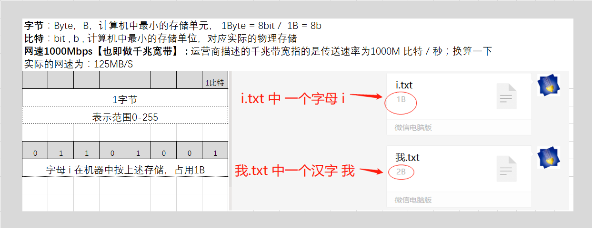
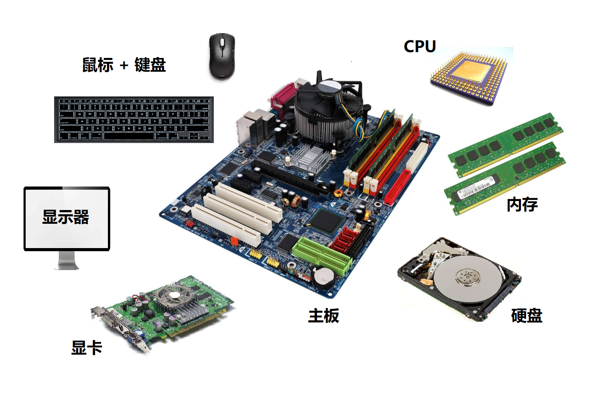

# 趣谈Linux操作系统

##### 将操作系统当成一家软件外包公司，Linux内核当成一家软件外包公司的老板

锦上云科技有限公司   Linux操作系统；

老板			      Linux 内核

**计算机的架构：**

硬盘是个物理设备，要按照规定格式化成为文件系统，才能存放文件。放在操作系统内核中的程序，进程是不能随便调用的，但是操作系统提供了系统调用，进程可以根据系统调用来调用。

鼠标和键盘是计算机的输入设备，通过输入设备告知计算机用户的需求。屏幕，也就是显示器，是计算机的输出设备，将计算机处理用户请求返回给客户。当客户告诉对接员需求的时候，对于操作系统来说，输入设备会发起一个中断，该客户发送的需求叫做**中断事件**。

**客户对接员**： 将客户的需求拿回来，也就是**输入设备驱动**； **交互人员**： 将客户的需求的处理结果反馈给用户，也就是**输出设备驱动**，比如显卡驱动 **项目执行计划书**： 一个项目打算怎么做，先执行什么，在做什么的步骤。也就是**编译为二进制的程序代码**，如QQ

**办事大厅**：主要的作用是立项，有了项目执行计划书才能*立项*，**系统调用（System Call）**，罗列哪些接口能够调用。任何一个程序想要运行起来，需要调用系统调用，创建进程。 **立项** ：办事大厅根据项目执行计划书给项目立项，编译成二进制的程序调用系统调用创建进程，**调用动作** **项目**：一旦项目运行起来，就需要分配开发人员，并按照项目执行计划书一步步执行，此时组成了项目组，如果项目多，就需要项目经理的调度能力。一个个**进程**可以理解为一项目。 **会议室管理子系统**：项目执行的过程中，会产生会议，但是每个项目都有自己的私密资料，如中间成果，流程图，架构图，会议室是有限的，所有有人负责分配和管理。在操作系统中，不同的进程也有不同的内存，但是由于内存有限，所有需要有人负责内存的分配和管理，这就是**内存管理子系统** **对外合作部**： 如果客户对接员对接来的需求需要和其他的公司合作，就需要对外合作部，对应着网络子系统

文件管理子系统：硬盘格式化为文件系统之后，可以存放文件，文件系统交由文件管理子系统进行管理； 进程管理子系统：在操作系统中有多个进程，进程的执行需要分配CPU，也即按照二进制代码一行行的执行，如果运行多个进程，就需要CPU的调度能力。

公司架构图：

操作系统内核体系结构图：

#### Linux下软件的操作

~~~shell
drwxr-xr-x 1 isea_you 197121    0 11月 21 17:53 clitoris-algo/
# 文件/文件夹  所属人，所属组，其他用户的权限
# 硬连接数量
# 所属人 所属组，文件大小（字节），最后一次修改的时间，文件名
~~~

##### Linux下的软件安装

就CentOS而言，软件的安装有几种方式：

| 方式       | 命令                                     | 说明                                                   |
| ---------- | ---------------------------------------- | ------------------------------------------------------ |
| 下载安装包 | `rpm -i jdk-XXX_linux-x64_bin.rpm`       | 先下载rpm包 使用`rmp`命令安装                       |
| 软件管家   | `yum install java-11-openjdk.x86_64`     | 配置好yum源 使用yum命令安装                         |
| 下载解压缩 | `tar -xvzf jdk-XXX_linux-x64_bin.tar.gz` | 先下载tar.gz包 使用tar命令安装 修改`.bashrc`文件 |

##### Linux下载

Linux 上面有一个工具 `wget`，后面加上链接，就能从网上下载了。如果下载下来是tar包，Linux下默认有tar程序，可以直接解压，如果是zip包，就需要另外安装zip包的解压和压缩程序：

~~~shell
# 使用yum安装zip
yum install zip.x86_64 unzip.x86_64
~~~

##### Linux下程序的运行

* 通过shell在交互命令行里面运行，`./可执行文件名`

* 后台运行，`nohup(no hang up)` 不挂起，也即当交互命令行退出的时候，程序还继续运行

  ~~~shell
  nohup command >out.file 2>&1 &
  #“1”表示文件描述符 1，表示标准输出，“2”表示文件描述符 2，意思是标准错误输出，“2>&1”表示标准输出和错误输出合并了。合并到哪里去呢？到 out.file 里,&表示后台运行
  ~~~

* 以服务的方式运行，Windows下对应的也有这种运行方式 `systemctl start mysql`

**关闭程序**

~~~shell
ps -ef |grep 关键字  |awk '{print $2}'|xargs kill -9

jps -l | grep pyd-electrician-app-0.0.1-SNAPSHOT.jar | awk '{print $2}' | xargs kill -9
~~~

##### 简图

### 系统调用

立项的动作对应的是操作系统里面的什么？进程的创建服务由谁提供？服务大厅对应着OS中的什么？进程创建为什么叫做fork（分支），Linux fork进程的策略是什么？如果是子进程需要执行那个系统调用来执行当前的程序？`execve`，如果父进程想要知道子进程的运行状况，父进程需要调用哪个系统调用？`waitpid`，祖宗对应着OS里的什么？

立项对应着OS中的进程创建，进程创建由系统调用提供，服务大厅对应的OS中的系统调用，之所以叫做fork是因为所有的进程都是从父进程中创建出来的，会形成一个分支。Linux进程创建的策略是先拷贝再修改，祖宗对应着OS里的祖先进程。

项目执行计划书对应着OS中的什么？进程的内存空间被分为几个部分，各自的作用是什么？32为操作系统的内存空间是多少G？会议室表示的是什么？

项目执行计划书对应着OS中的程序，进程的内存空间被分为代码段和数据段，代码段的作用是经过编译之后的二进制代码，数据段主要存放要操作的数据和中间过程产生的数据。32位操作系统的内存空间是4G。会议表示的是系统内存资源。

##### 图谱

### X86架构

计算机的工作模式 ，如下图：

CPU 和其他设备连接，要靠一种叫作总线（Bus）的东西，其实就是主板上密密麻麻的集成电路，这些东西组成了 CPU 和其他设备的高速通道。内存（Memory）。CPU依赖内存保存中间的计算结果，从而进行下一步的计算。总线上还有一些其他设备，例如显卡会连接显示器、磁盘控制器会连接硬盘、USB 控制器会连接键盘和鼠标等等。

**CPU 和内存是完成计算任务的核心组件**，CPU 和内存是如何配合工作的呢？CPU 其实也不是单纯的一块，它包括三个部分，**运算单元、数据单元、控制单元**。

* 运算单元：负责运算，如加法，移位操作，>> 1 右移1位表示除以2
* 数据单元：包含CPU内部的缓存和寄存器，用来存放数据和运算结果
* 控制单元：控制单元是一个统一的指挥中心，它可以获得下一条指令，然后执行这条指令。

进程一般被分成了哪两个段位？各个段位的作用是什么？

* 代码段：程序加载到进程中后，会形成代码段
* 数据段：程序运行的过程中要操作的数据和计算结果都会放在数据段中

那 CPU 怎么执行程序，操作数据，产生的结果如何回内存呢？CPU 的控制单元里面，有一个**指令指针寄存器**，它里面存放的是下一条指令在内存中的地址。控制单元会不停地将代码段的指令拿进来，先放入**指令寄存器**。

指令寄存器中的指令由哪两个部分组成？并简述运算的过程。指令表征两部分①进行什么操作和②被操作的数据，①交给运算单元，②交给数据单元，数据单元根据数据在内存中的地址得到数据，然后就可以参与运算了，运算结果存放在**数据寄存器中**，最终会有指令将数据写回到内存。

##### X86中地址总线和型号

#### 经典处理器8086

8086的结构图：

##### 数据单元

8086中所有多少个通用寄存器，多少位的？指出这些寄存器的名字，和这些寄存器的作用？

8个通用寄存器，都是16位的，AX、BX、CX、DX、SP、BP、SI、DI都是属于CPU的数据单元，用于存储计算过程中的数据。

##### 控制单元

IP的全称是什么？IP的作用是什么？控制单元有多少个段寄存器，分别是什么？CS是什么，作用是什么？DS是什么，作用是什么？SS是什么，作用是什么？CPU在进行运算的时候，如何加载内存中的数据？

IP的全称是指令指针寄存器，IP中存放着下一条指令的地址，CPU会不断根据IP将指令从内存中取过来放入到指令寄存器中，然后再将一部分放入到数据单元，一部分放入到运算单元；控制单元有CS、DS、SS、ES四个16位寄存器，CS是代码段寄存器，可以通过他找到代码在内存中的位置；DS是数据段寄存器，可以通过他找到数据在内存中的位置；SS 是栈寄存器（Stack Register）；CS中放着代码段的起始地址，DS中放数据段的起始地址，代码段偏移量在IP寄存器中，数据段的偏移量在通用寄存器中，然后起始地址 *16+ 偏移量”，也就是把 CS 和 DS 中的值左移 4 位，变成 20 位的，加上 16 位的偏移量，这样就可以得到最终 20 位的数据地址。

一个段能有多大？为什么？

#### 32为处理器

在 32 位处理器中，有 32 根地址总线，可以访问 2^32=4G 的内存。寄存器的扩展方式：

其中**通用寄存器是兼容的，但是段寄存器是不兼容的**。所以CS、SS、DS、ES 仍然是 16 位的，但是不再是段的起始地址。**段的起始地址放在内存的某个地方。**这个地方是一个表格，表格中的一项一项是段描述符（Segment Descriptor）。**这里面才是真正的段的起始地址。而段寄存器里面保存的是在这个表格中的哪一项，称为选择子（Selector）**。这样，将一个从段寄存器直接拿到的段起始地址，就变成了先间接地从段寄存器找到表格中的一项，再从表格中的一项中拿到段起始地址。

32位操作系统架构下什么是实模式，什么是保护模式？实模式能够寻址多少？保护模式能够寻址多少？实模式就是x86为了兼容8086做出的设计，实模式寻址是1M，而保护模式能够寻址4G；其中每个段是16K。

##### 总结图

### 从BIOS到`BootLoader`

按下启动按钮的时候，意味着什么？什么是ROM？什么是RAM？ROM里固化的是什么程序？

按下启动按钮，意味着主板开始加电，ROM是只读存储器，ROM中固化的是BIOS，基本输入输出程序，RAM是随机访问存储器。

##### 1M内存空间分配

