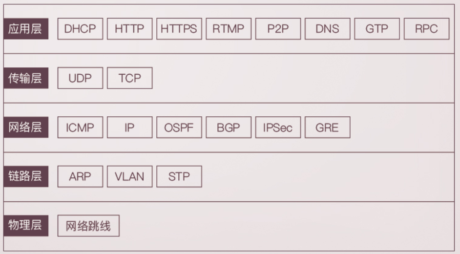
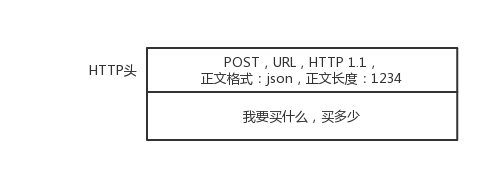
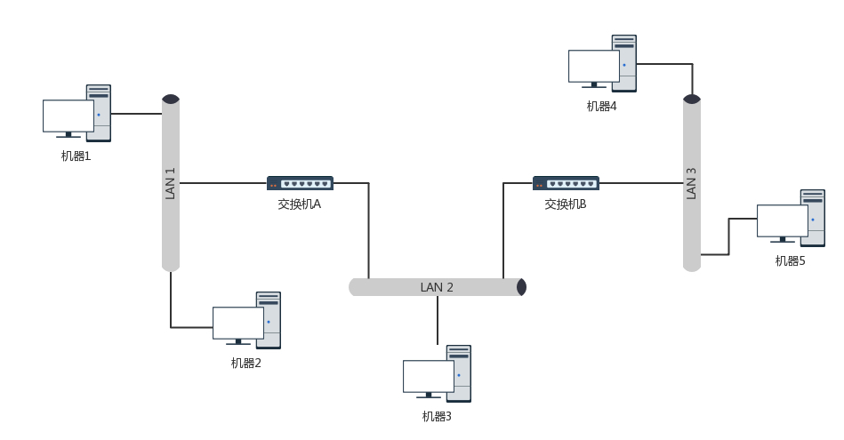
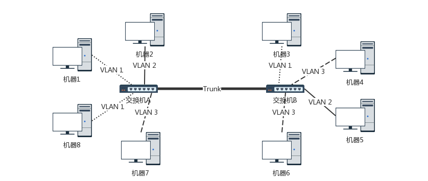

# 计算机网络协议

## 网络协议概述

网络分层：

从浏览器下一个订单动作串联起网络协议的几层是如何工作的：浏览器地址栏是$xxx.com$ ，浏览器将用户的订单信息添加HTTP头，发起HTTP或者是HTTPS请求，其中URL会先经由DNS查询到域名对应的IP地址。

#### 应用层（5）

消息的下一站是传输层，传输层通过Socket编程实现，经过Socket编程之后会确定UDP或者TCP协议，传输层会加上**源端口和目的端口**，形成如下的结构

#### 传输层（4）

传输层封装完毕之后，浏览器会将包交给**操作系统的网络层**，在网络层使用IP协议，原包会被加上IP头，其中含有**源IP地址和目的IP地址**，

#### 网络层（3）

操作系统在知道了目标IP之后，会判断是是内网地址还是外网地址，

* 内网地址：

* 外网地址：

操作系统需要先去寻找网关（操作系统在启动的时候，就会被DHCP协议配置IP地址和默认网关，默认网关一般是网段的首地址，192.168.1.1），操作系统是通过ARP地址解析协议（也即广播），基于ARP操作系统就可以获取网关的MAC地址，然后操作系统继续将包添加**源MAC地址和目的MAC（也即网关的MAC地址）**，并发往MAC层。

#### MAC层（2）媒体访问控制

报文于是就到了网关，网关一般是一个路由器，到达了网关之后，需要将IP头取出来，如此才能获取到目的IP地址并通过路由表查询到去往目的IP的路径。在网关路由器和目的地址之间还有很多的路由器，而路由器也承载着一个内网，（路由器组成了巨大的互联网）路由器之间的路径选择使用**OSPF，BGP等路由协议**。最到会到达目的IP所在的网关，该网关获取到包之后，取出IP头，发现是内网地址。利用ARP协议，会找到目的IP的MAC地址，报文来到了目标服务器，目标服务器取下MAC头，将消息发给操作系统的网络层，发现目的IP就是自己，取下IP头，交由传输层。即TCP层。

TCP层有端口号信息，该端口是某一个进程正在监听的端口，通常是Tomcat，消息就到了Tomcat，在这里有程序员写的处理HTTP请求的进程，该进程会告知订单进程进行订单的相关管理，支付进程负责费用的结算等逻辑，告知的方式一般是RPC调用（也有现在的微服务架构下的RESTful方式）。处理HTTP请求的进程发现订单管理进程，支付进程都处理完毕的时候，会回复一个HTTPS的包，返回给浏览器。

**编译** ：首先理解编译的作用，比如将我们写的Java代码运行起来，在运行之前，首先要对java文件进行编译，这样机器才能识别，这个编译的过程类似翻译的过程。

**问答**

协议的三要素是什么？三要素大致上都指的是什么？语法：要满足特定的格式；语义：这段内容代表着什么含义；顺序，先做什么，在做什么；

说说NDS是什么？NDS的作用是什么？应用层的下一层是什么？域名解析系统，是IP地址和网址的映射表，使用DNS可以查询到域名对应的IP地址；应用层的下一层是传输层，传输层由Socket编程实现，该层的协议是UDP和TCP；

说说你知道的应用层协议；DHCP是什么，作用是什么？谈谈你对网络的理解，网络默认的地址是什么？HTTP，该协议是基于TCP的，DHCP是动态主机分配协议，当一台新的电脑要上网的时候，可以由DHCP给其分配地址。

什么是ARP？网关对应的物理设备一般是什么？ARP是地址解析协议，作用是找到一个IP地址的MAC地址；网关对应的物理设备一般是路由器。

到达网络是否需要查IP，路由表的作用是什么？说说OSPF，Open Shortest Path First开放式最短路径优先。到达网络需要检查IP，路由表的作用是查询去往目标IP需要先去哪个IP地址。

## 网络分层

**问答**

网络分层的意义是什么？一层传输的数据，二层的数据叫什么，三层的数据叫什么，四层的数据叫什么？网络分层和代码分层的本质是一样的，区分每一层都应该专注做的事情，也将每一层的逻辑隔离开来；一层也就是物理层传输的数据是比特；二层的传输的数据叫做帧；三层的数据叫做报文，四层传输的数据叫做段。不管怎么样都可以叫做**包**

在路由的时候，A—>B—>C—>D 从A发出来的包，应该将B的IP地址放在哪里？B知道自己的下一站是C，从B发出来的包，应该将C的地址放在哪里？在数据传输的过程中，下层是否是必须的？当数据到达了A的时候，A会先将MAC头拿下来，发现是自己，然后将IP头取下来，发现目的地址不是自己，所以需要转发出去，查看自己的路由表，要去B，A是知道B（通过ARP）的MAC地址的，于是乎添加上B的MAC地址发给B。

TCP在进行三次握手的时候，IP层和MAC层都在干什么？TCP在进行三层握手的时候，IP层，MAC层也在工作，

**包的传输只可能有下层没有上层，但是不可能有上层没有下层。**

## IP地址

说说你知道获取IP地址的命令？`ifconfig 、ip addr`  前者是是net-tools的工具，后者是IProute2的命令。

解释下面的返回信息的含义：

~~~shell
root@test:~# ip addr
1: lo: <LOOPBACK,UP,LOWER_UP> mtu 65536 qdisc noqueue state UNKNOWN group default 
    link/loopback 00:00:00:00:00:00 brd 00:00:00:00:00:00
    inet 127.0.0.1/8 scope host lo
       valid_lft forever preferred_lft forever
    inet6 ::1/128 scope host 
       valid_lft forever preferred_lft forever
2: eth0: <BROADCAST,MULTICAST,UP,LOWER_UP> mtu 1500 qdisc pfifo_fast state UP group default qlen 1000
    link/ether fa:16:3e:c7:79:75 brd ff:ff:ff:ff:ff:ff
    inet 10.100.122.2/24 brd 10.100.122.255 scope global eth0
       valid_lft forever preferred_lft forever
    inet6 fe80::f816:3eff:fec7:7975/64 scope link 
       valid_lft forever preferred_lft forever
~~~

尤其的：上面显示的信息中，显示了几张网卡？IPv4有多少位？IPv6有多少位？1亿字节多少G？MTU是什么？UP,	BROADCAST,LOWER_UP，分别指的是什么？

上面显示的信息，有两张网卡，一张是回环网卡用于本地计算机内部的通信，IPv4 有 32位，IPv6 有128位，1亿字节= 0.1G。MTU表示的是最大传输单元（是MAC），接下来这几个是网络设备的状态标识，BROADCAST表示这个网卡有广播地址，可以发送广播包，MUTICAST表示网卡可以发送多播包。LOWER_UP表示L1是启动的，也即网线是插着的。	

IPv4被分成了多少类？前三类固定位是前几位？CIDR解释一下，CIDR是为了解决什么问题？

IPv4被分成了5类，目前我们接触最多的是A，B，C类，这三类分别固定了，第一个字节，第二个字节，第三个字节，CIDR表示的是无间类路由，是为了解决IP地址不够用的问题。

名词解释，网络号，主机号，子网掩码（注意的是，子网掩码的概念存在于CIDR中），网络号如何计算，网关的地址一般是什么，广播地址一般是什么？

一个IP地址和子网掩码按位与得到的就是网络号，剩余的是网络号。网关的地址是网络中的第一个地址，广播地址是网络中的最后一个地址。

每张网卡都有IP地址么？`qdisc pfifo_fast` 表示的queueing discipline 排队策略，（这玩意太多了，直接去看原文吧）

一般而言，每张网卡都有IP地址，但是并不是所有的网卡都有IP地址，

**MAC地址用于内网定位，IP用于外网定位**，如果一定需要一个比喻的话，IP地址可以是门牌号（如某市某路某小区某单元，北京西二旗地铁站，领秀新硅谷，）MAC地址可以是身份证号。

## DHCP

##### DHCP discover：

##### DHCP offer

##### DHCP request

##### DHCP `ack`

如果A 机器 和B机器不在同一个网段，A需要先将包发给谁？DHCP协议的全称是什么？数据中心的IP地址和你进入一个新的环境获取的IP地址有什么区别？DHCP解决了什么问题？简述DHCP的四个过程？

如果A机器和B机器不在同一个网段，A需要先将包发送给网关，DHCP：动态主机分配协议，数据中的IP地址一般都是相对固定的，DHCP解决了手动设置IP带来的巨大工作量，DHCP的过程是：`discover，offer，request，ack`。

### PXE（pre-boot-execution-environment)

预启动执行环境。下图是PXE的架构图：

PXE基于什么架构？PXE解决了什么问题？PEX的客户端一般都放置在什么位置？DHCP对于PXE的作用是什么？

PXE基于CS架构，PXE，也即预执行环境，可以使用PXE来自动安装操作系统，PXE的客户端放置在BIOS中。客户端会将PXE服务器的位置存在DHCP中，客户端在获取IP地址的时候，获取PXE服务器的地址。在获取了PXE服务器之后，就能够获知到内核启动相关的信息，进而进行操作系统的安装或者是启动。

## 物理层和MAC层（宿舍网）

两台电脑之间的网络包，是否包含MAC层？两台电脑相连，组成一个什么网络？以前好几台计算机相连组成的局域网（LAN）是通过什么物理设备？现在多台计算机组成一个局域网是通过什么设备？Hub也就是集线器，发送报文是基于什么模式？

必须包含网络层，两台电脑相连可以组成一个小型的局域网，在过去几台计算机组成的局域网通过hub进行连接，该设备包的转发基于广播，该设备不够智能，从一个端口进入的包，会广播给所有的出口。如今多台计算机组成的局域网通过的设备是交换机。

MAC层的全称叫做什么？媒体访问控制是为了解决什么问题？这里的名字有控制二字，控制什么呢？控制众多往媒体上发送数据的时候，谁先发，谁后发。这个官称：多路访问！多路访问的解决方案有哪三种？解释信道划分，轮流协议，随机接入协议，以太网使用的是什么？

MAC的全称是媒体访问控制，媒体访问控制主要是为了解决包在链路上，谁先发送，谁后发送的问题；多路访问有三种解决方案，分别是信道划分，也即你走你的，我走我的，我们是不同的道路，第二种解决方案是轮流协议，你先走，我在走，也即轮询；第三种是随机接入协议，以太网使用的就是随机接入协议，不管什么情况，我先走，要是堵我就先回来。

如果在一个局域网内不知道目标地址的MAC地址，依靠什么协议获取目的地址的MAC地址？Hub的劣势是什么？交换机对Hub进行了什么改进？该改进的技巧是什么？

依靠ARP，地址解析协议，也即在局域网内部发送广播，IP地址为\**的MAC的地址是什么，IP地址为**的主机收到该地址之后，会响应该广播。Hub也即集线器，交换机更加智能，会记住进来的端口的IP地址，慢慢的会记住所有的端口对应的IP地址。

## 交换机和VLAN（办公室网）

机器1的目的地址是机器4，请简述这一过程，其中包含交换机的学习过程，如果交换机不知道目的IP的MAC地址在哪，采取什么手段？如果交换机不知道目的IP的MAC地址，会将包广播出去。

环路问题，简述下图中机器1访问机器2的过程中，环路的产生过程：

解决环路一般使用什么方法？STP，生成树，

**虽然交换机比Hub更加智能，但是同样存在着广播的问题**。

VLAN的出现是为了解决什么问题？网络隔离有哪几种方式？物理隔离是否需要配置单独的交换机，和路由器，并配置单独的子网？虚拟隔离的别称叫什么？交换机怎么区分那个机器属于那个局域网？12位可以划分多少个VLAN？如果是云厂商中，不够怎么解决的？

VLAN能够解决网络隔离问题，和安全问题，网络隔离有物理隔离，和虚拟隔离，，物理隔离需要配置单独的交换机，和路由器，和单独的子网。虚拟隔离的别称是VLAN，虚拟局域网。交换机通过VLANid来区分各个局域网。12位可以维护4096个虚拟局域网、

支持VLAN的交换机和交换机之间使用什么进行连接？trunk口的作用是什么？

支持VLAN的交换机trunk口进行连接。trunk口的作用是交换机之间的数据传输。

## ICMP和ping

ICMP全称是什么？互联网控制报文协议；ICMP报文封装在哪里？封装在IP里面

##### ICMP报文格式

