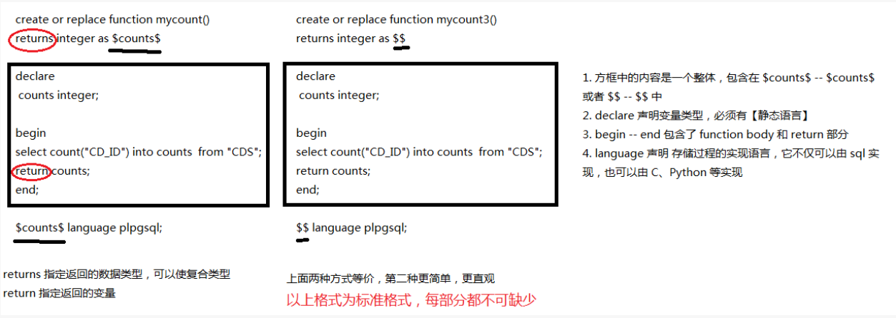

# postgres

 **post-gress-Q-L**

PostgreSQL中主要有三种类型的数据类型：

- 数值数据类型
- 字符串数据类型
- 日期/时间数据类型

模式(也叫架构)是指定的表集合，除了包含表，它还可以包含视图，索引，序列，数据类型，运算符和函数。postgreSQL标准的模式是 **public**

```sql 
drop schema my_schema cascade ; --  删除模式，并删除该模式下的所有。	
```

```sql
SELECT *   
FROM EMPLOYEES   
WHERE AGE BETWEEN 24 AND 27;-- 包含 24,27 [24,27]
```


PostgreSQL跨连接(`CROSS JOIN`)将第一个表的每一行与第二个表的每一行相匹配 ，就是 **笛卡尔积**

###  视图

在PostgreSQL中，视图(VIEW)是一个伪表。 它不是物理表，而是作为普通表选择查询。
视图也可以表示连接的表。 它可以包含表的所有行或来自一个或多个表的所选行。

**视图便于用户执行以下操作：**

- 它以自然和直观的方式构建数据，并使其易于查找。
- 它限制对数据的访问，使得用户只能看到有限的数据而不是完整的数据。
- 它归总来自各种表中的数据以生成报告。

### 存储过程

PostgreSQL函数也称为PostgreSQL存储过程，PostgreSQL函数 是

* 存储在数据库服务器上
* 并可以使用SQL界面调用的一组SQL和过程语句    (声明，分配，循环，控制流程等)

```sql  
-- 删除存储过程的时候
drop function total_records1(text,text);  -- 函数的声明也需要加上。
```




```sql 
-- 创建1个存储过程
create or replace function total_records ()
returns integer as $$
declare
    total integer;
begin
   select count(*) into total from tb_dc_task_info;
   return total;
end;
$$ language plpgsql;

------------- 把 sql 语句赋给变量-------------
create or replace function total_records()
    returns integer as
$$
declare
    sql_dsl text;
    total   integer;
begin
    sql_dsl := 'select count(*) from tb_dc_task_info';
    execute sql_dsl into total;
    return total;
end;
$$ language plpgsql;

-------------  带变量，且 sql 语句用字符串拼接 -------------
create or replace function total_records1(table_name text, column_name text)
    returns integer as
$$
declare
    sql_dsl text;
    total integer;
begin
    sql_dsl := 'select count('
                   || quote_ident(column_name)
                   || ') from '
        || quote_ident(table_name);
    execute sql_dsl into total;
    return total;
end;
$$ language plpgsql;


select total_records1('tb_dc_task_info', 'task_id')


--------------- 换一种拼接方式，并且函数体加了 if 判断 ---------------

create or replace function total_records4(table_name text, column_name text)
    returns integer as
$$
declare
    sql_dsl text;
    total   integer;
begin
--     sql_dsl := 'select count("' || $2 || '") from "' || $1 || '"'; -- 方式1
--     sql_dsl := 'select count(' || $2 || ') from ' || $1 || ' ';    -- 方式2
    execute sql_dsl into total using table_name,column_name;

    if total < 100
    then
        return total;
    else
        return 1000;
    end if;
end;
$$ language plpgsql;
```

* 每个子句后面，需要加上 分号
* 单引号的解析力更强


## 时间函数

### age

```sql 
select age( timestamp '2021-01-26 00:01:02',timestamp '2020-01-01 00:00:01'); -- 1 years 0 mons 25 days 0 hours 1 mins 1.00 secs
select age( '2021-01-26 00:01:02','2020-01-01 00:00:01'); -- 1 years 0 mons 25 days 0 hours 1 mins 1.00 secs
select age(timestamp '2021-01-01');  -- 0 years 10 mons 14 days 0 hours 0 mins 0.00 secs 当前时间减去传入时间
```

### current系列

```sql
select current_timestamp -- 提供带时区的值  2021-11-15 23:10:56.583845 +08:00
     , current_date      -- 提供当前日期 2021-11-15
     , current_time      -- 提供带市区的值 23:10:56.583845 +08:00
     , now() -- 2021-11-15 23:10:56.583845 +08:00 
;

select current_timestamp = now(); -- 这两个相等


select current_timestamp    -- 2021-11-15 23:21:22.715275 +08:00
     , current_timestamp(3) -- 2021-11-15 23:21:22.715000 +08:00  可以选择使用precision参数，这将使结果在四分之一秒的范围内四舍五入。
     , current_timestamp(0) -- 2021-11-15 23:21:23.000000 +08:00
;
```

### truncate 

```sql
-- 效果等效于 delete from table_name , 但是效率更高，尤其在大表上,delete 会扫描表，但是 truncate不会
truncate table table_name
```


## index

由于在大表上创建是一个很耗时的操作，所以默认情况下，PG 在建立索引的情况下，建立索引不阻塞读，但是阻塞写操作直到索引建立完成。但是在生产环境中，建索引阻塞写操作是很危险的，你需要的是并发建立索引，[参考这个](https://www.postgresql.org/docs/10/sql-createindex.html#SQL-CREATEINDEX-CONCURRENTLY) 。

~~~sql
-- 查看当前表建立了哪些索引：
select * from pg_indexes where tablename='table_name';
~~~


### Index type

*  B-tree , 默认情况下使用这个，可适应大多数场景
*  Hash,
*  GiST,
*  SP-GiST,
*  GIN 
*  BRIN.

索引满足最左前缀原则

### Multicolumn Indexes


###  Indexes and `ORDER BY`


### Combining Multiple Indexes


### Indexes on Expressions


[关于pg的索引](http://mysql.taobao.org/monthly/2018/11/06/)


## PG的内存参数设置

目前PG的设置


