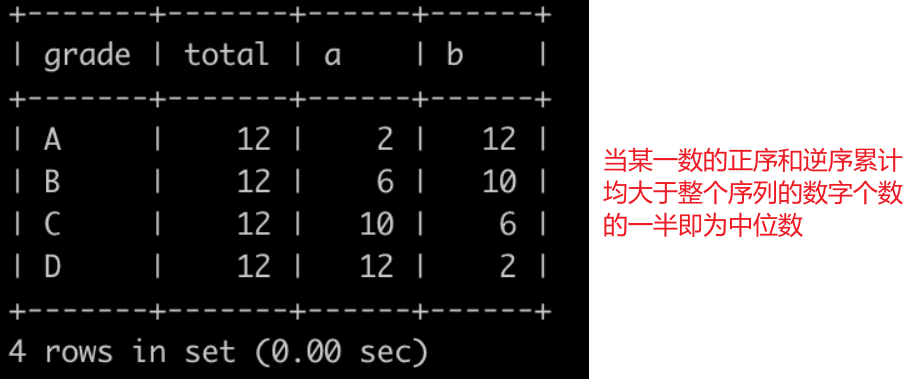

# Plan 600 

🤣 : At first ,  talk about the title 'plan 600' , why did I take this tile? Just because I wanna enhance my SQL ability and algorithm ability , I plan complete 600 SQL/Algorithm problems in January 2022, and dead line is  2022-02-01. The following is my record of the challenge.

Almost 20 per day , it is really a challenge!

## SQL

### tag-easy

some problem is extremely easy , so there is no need to describe solution

###### [001 - `LeetCode`175 problem](https://leetcode.com/problems/combine-two-tables/submissions/)

###### [002- `LeetCode` 181problem](https://leetcode.com/problems/employees-earning-more-than-their-managers/submissions/)

###### [003- `LeetCode`182problem ](https://leetcode.com/problems/duplicate-emails/submissions/)

###### [004- `LeetCode`183problem](https://leetcode.com/problems/customers-who-never-order/submissions/)

###### [005- `LeetCode`196problem](https://leetcode.com/problems/delete-duplicate-emails/)
```sql
-- method 1 
delete
from Person
where Id not in (
    select Id
    from (
             select min(Id) as Id
             from Person
             group by Email
         ) t
)
;
-- method 2 
delete
from Person
where id In
      (
          select id
          from (
                   select email
                        , id
                        , row_number() over (partition by email order by id asc) as rank_id
                   from Person
               ) as c
          where c.rank_id > 1
      );
-- the following method doesn't work , you will get 
-- " You can't specify target table 'Person' for update in FROM clause"
delete
from Person
where Id not in (
    select min(Id) as Id
    from Person
    group by Email
)：
```

###### [006- `LeetCode`197problem](https://leetcode.com/problems/rising-temperature/submissions/)

:one: lead,  ↓    from top to down direction 

:two: lag,    ↑     from down to top direction

```sql
-- just a windows function 
select id
from (
         select id
              , temperature
              , recordDate
              , timestampdiff(day,lag(recordDate, 1) over (order by recordDate),recordDate) as date_diff
              , lag(temperature, 1) over (order by recordDate) yes_temperature

         from Weather
     ) t
where temperature > yes_temperature
and date_diff = 1
```

###### [007- `LeetCode`595problem](https://leetcode.com/problems/big-countries/submissions/)

###### [008- `LeetCode`596problem](https://leetcode.com/problems/classes-more-than-5-students/submissions/)

###### [009- `LeetCode`620problem](https://leetcode.com/problems/not-boring-movies/submissions/)
###### [010- `LeetCode627`problem](https://leetcode.com/problems/swap-salary/)

```sql
update Salary
set sex = if(sex = 'm','f','m');
```

###### [011- `LeetCode`1179 problem](https://leetcode.com/problems/reformat-department-table/submissions/)

```sql
select id
     , sum(if(month = 'Jan', revenue,null)) as Jan_Revenue
     , sum(if(month = 'Feb', revenue,null)) as Feb_Revenue
     , sum(if(month = 'Mar', revenue,null)) as Mar_Revenue
     , sum(if(month = 'Apr', revenue,null)) as Apr_Revenue
     , sum(if(month = 'May', revenue,null)) as May_Revenue
     , sum(if(month = 'Jun', revenue,null)) as Jun_Revenue
     , sum(if(month = 'Jul', revenue,null)) as Jul_Revenue
     , sum(if(month = 'Aug', revenue,null)) as Aug_Revenue
     , sum(if(month = 'Sep', revenue,null)) as Sep_Revenue
     , sum(if(month = 'Oct', revenue,null)) as Oct_Revenue
     , sum(if(month = 'Nov', revenue,null)) as Nov_Revenue
     , sum(if(month = 'Dec', revenue,null)) as Dec_Revenue
from Department
group by id;

-- if remove sum agg function ,we will find mysql return the first row
```

### tag-medium

###### [012- `LeetCode`176problem](https://leetcode.com/problems/second-highest-salary/submissions/)

```sql
-- the sql can pass oj
select max(salary) as "SecondHighestSalary"
from employee
where salary < (select max(salary) from employee) ;

-- the sql also cant pass oj
select max(salary) as SecondHighestSalary
from Employee
where salary = (
    select distinct salary
    from Employee
    order by salary desc
    limit 1,1
);

-- the following sql can't pass oj ,the following picture explain the reason
select max(salary) as SecondHighestSalary
from Employee
where salary = (
    select distinct salary
    from Employee
    order by salary desc
    limit 1,1
)
```


###### [013- `LeetCode`177problem](https://leetcode.com/problems/nth-highest-salary/)

```sql
create function getnthhighestsalary(n int) returns int
begin
    return (
        # write your mysql query statement below.
        select max(salary)
        from (
            select t1.salary
            from Employee t1
            inner join Employee t2 
            on t1.salary <= t2.salary
            group by t1.salary
            having  count(distinct  t2.salary) = n
            ) t
    );
end
-- the following pic explain the sql
```


###### [014- `LeetCode`178problem](https://leetcode.com/problems/rank-scores/)

dense_rank , the word dense means “稠密的” , dense_rank means the   no holes between ranks

###### [015- `LeetCode`180problem](https://leetcode.com/problems/consecutive-numbers/)

```sql
select distinct num as  ConsecutiveNums 
from (
         select num
              , lag(num, 1) over (order by id ) lag_1
              , lag(num, 2) over (order by id ) lag_2
         from Logs
     )t
where lag_1 = num
and lag_2 = num
```

###### [016- `LeetCode`184problem](https://leetcode.com/problems/department-highest-salary/)

```sql
select t2.name as Department
     ,  t1.name as Employee
     ,  t1.salary as Salary
from  Employee t1
left join Department t2
on t1.departmentId = t2.id
left join     
    (
         select departmentId
              , max(salary) max_sal
         from Employee
         group by departmentId
     ) t3
on t1.departmentId= t3.departmentId
where t1.salary = t3.max_sal
;
```

###### [017- `LeetCode`626problem](https://leetcode.com/problems/exchange-seats/)

```sql
select case
           when mod(id, 2) != 0 and counts != id then id + 1
           when mod(id, 2) != 0 and counts = id then id
           else id - 1 end as id
     , student
from seat
   , ( select count(*) as counts
       from seat ) as seat_counts
order by id asc;
```

### tag-hard

###### [018- `LeetCode`185problem](https://leetcode.com/problems/department-top-three-salaries/)

```sql
select Department
        , Employee
        , Salary
from (
         select t2.name   as                                                             Department
              , t1.name   as                                                             Employee
              , t1.salary as                                                             Salary
              , dense_rank() over (partition by t1.departmentId order by t1.salary desc) rk
         from Employee t1
         left join Department t2
         on t1.departmentId = t2.id
     )t
where t.rk <= 3
```

###### [019- `LeetCode`1601problem](https://leetcode.com/problems/human-traffic-of-stadium/)

```sql
select distinct t1.*
from stadium t1, stadium t2, stadium t3
where t1.people >= 100
  and t2.people >= 100
  and t3.people >= 100
  and ( -- from small to big
        (t1.id + 1 = t2.id and t1.id + 2 = t3.id) or -- t1,t2,t3  like 4,56
        (t2.id + 1 = t1.id and t2.id + 2 = t3.id) or -- t2,t1,t3
        (t2.id + 1 = t3.id and t2.id + 2 = t1.id) -- t2,t3,t1
    )
order by id;

-- the first method is faster than the second method

select distinct t1.*
from Stadium t1
cross join Stadium t2
cross join Stadium t3
where t1.people >= 100
  and t2.people >= 100
  and t3.people >= 100
  and ( -- from small to big
        (t1.id + 1 = t2.id and t1.id + 2 = t3.id) or -- t1,t2,t3  like 4,56
        (t2.id + 1 = t1.id and t2.id + 2 = t3.id) or -- t2,t1,t3
        (t2.id + 1 = t3.id and t2.id + 2 = t1.id) -- t2,t3,t1
    )
order by id
;
```

###### [020-`LeetCode`262 problem](https://leetcode.com/problems/trips-and-users/)

```sql
select request_at as  Day
     , round(sum(if(t1.status in ('cancelled_by_client', 'cancelled_by_driver'), 1, 0)) / count(*), 2) as `Cancellation Rate`
from Trips t1
left join Users t2
on t1.client_id = t2.users_id
-- and t2.banned = 'No'
left join Users t3
on t1.driver_id = t3.users_id
-- and t3.banned = 'No'
where t1.request_at >= '2013-10-01'
  and t1.request_at <= '2013-10-03'
  and t2.banned = 'No'
  and t3.banned = 'No'
group by request_at
```


###### 021~027-`滴滴数据分析实习生笔试` 7 个 problem

详细题目地址 :  ./img/滴滴出行国际化数据分析实习生笔试题.pdf

```sql 
-- 1 “五一”期间北京地区完成订单量；
select count(*) order_cnt
from `od`
where order_status = 5
  and finish_time >= '2021-05-01 00:00:00'
  and finish_time < '2021-05-08 00:00:00'
  and city_name = 'Beijing'
;

-- 2 截至2021年5月1日北京地区注册司机总数（不算5月1日）；

select count(*) as driver_cnt
from `drv`
where city_name = 'Beijing'
  and reg_time < '2021-05-01 00:00:00'
;

-- 3 北京地区所有激活司机“五一”期间每日人均完成订单量；
-- method 1
select to_date(finish_time)
     , count(*) / count(distinct t1.driver_id)
from `od` t1
         left join `drv` t2
                   on t1.driver_id = t2.driver_id
where t1.finish_time >= '2021-05-01 00:00:00'
  and t1.finish_time < '2021-05-08 00:00:00'
  and t1.city_name = 'Beijing'
  and t1.order_status = 5
  and t2.is_regular = '1'
group by to_date(t1.finish_time)
;
--
select count(*) / count(distinct t1.driver_id) / 7
from `od` t1
         left join `drv` t2
                   on t1.driver_id = t2.driver_id
where t1.finish_time >= '2021-05-01 00:00:00'
  and t1.finish_time < '2021-05-08 00:00:00'
  and t1.city_name = 'Beijing'
  and t1.order_status = 5
  and t2.is_regular = '1'
;

-- 4.“五一”期间北京地区的日均DAU（司机在当地时区的当日完成订单数>=1则该司机算当日活跃司机）；
select count(*)/7
from (
         select driver_id
         from `od` t1
         where t1.finish_time >= '2021-05-01 00:00:00'
           and t1.finish_time < '2021-05-08 00:00:00'
           and t1.city_name = 'Beijing'
           and t1.order_status = 5
         group by driver_id
         having count(*) >= 1
     ) t
;

-- 5.在巴西时间5月1日至5月5日巴西Belo城市快车和优享各自的日均完成订单量
select product_id,
         count(*)/5
from od
where city_name = 'Belo'
 and from_utc_timestamp(to_utc_timestamp(finish_time, 'GMT+8'), "GMT-3") >= '2021-05-01'
 and from_utc_timestamp(to_utc_timestamp(finish_time, 'GMT+8'), "GMT-3") < '2021-05-06'
 and order_status = '5'
 and  product_id in (1,2)
group by  product_id
;
--6 在巴西时间5月1日至5月5日巴西Belo城市连续两天活跃的司机数；


select count(*)
from (
         select driver_id
         from (
                  select driver_id
                       , date_sub(order_date, row_number() over (partition by driver_id order by order_date)) diff
                  from (
                           select driver_id
                                , to_date(from_utc_timestamp(to_utc_timestamp(finish_time, 'GMT+8'), "GMT-3")) order_date
                           from od
                           where city_name = 'Belo'
                             and from_utc_timestamp(to_utc_timestamp(finish_time, 'GMT+8'), "GMT-3") >= '2021-05-01'
                             and from_utc_timestamp(to_utc_timestamp(finish_time, 'GMT+8'), "GMT-3") < '2021-05-06'
                             and order_status = '5'
                           group by driver_id, to_date(from_utc_timestamp(to_utc_timestamp(finish_time, 'GMT+8'), "GMT-3"))
                       ) t
              ) t1
         group by diff
         having count(*) > 3
     ) t2
;
-- 7 北京地区在4月26日至5月2日注册并激活且在5月3日至5月9日完成首单的司机数量（要求使用窗口函数）。

select count(*)
from (
         select driver_id
         from (
                  select t1.driver_id
                       , row_number() over (partition by t1.driver_id order by finish_time desc ) rk
                  from od t1
                           left semi
                           join (
                          select driver_id
                          from drv
                          where is_regular = '1'
                            and reg_time >= '2021-04-26'
                            and reg_time < '2021-05-03'
                      ) t2
                                on t1.driver_id = t2.driver_id
                  where t1.finish_time >= '2021-05-03'
                    and t1.finish_time < '2021-05-10'
                    and t1.order_status = '1'
              ) t
         where rk = 1
     ) t1
;
select count(*)
from (
         select driver_id
         from (
                  select t1.driver_id
                       , t1.finish_time
                       , t1.order_status
                       , row_number() over (partition by t1.driver_id order by finish_time desc) rk
                  from od t1
                           left join drv t2
                                     on t1.driver_id = t2.driver_id
                                         and t2.reg_time >= '2021-04-26'
                                         and t2.reg_time <= '2021-05-02'
                                         and t2.is_regular = '1'
                  where t1.finish_time > '2021-04-26'
                    and t1.finish_time < '2021-05-10'
                    and t1.city_name = 'Beijing'
              ) t
         where rk = 1
           and finish_time >= '2021-05-03'
           and finish_time < '2021-05-10'
           and order_status = '1'
     ) t1
;
```

#### from nowcoder website SQL 

###### [028-`nowcoder` SQL93 Problem](https://www.nowcoder.com/practice/048ed413ac0e4cf4a774b906fc87e0e7?tpId=82&&tqId=38864&rp=1&ru=/ta/sql&qru=/ta/sql/question-ranking)

```sql
select distinct  music_name
from music_likes t1
left join music t2
on t1.music_id = t2.id
where t1.user_id in ( -- 2,4
    select follower_id
    from follow
    where user_id = 1
)
and t1.music_id not in (
    select music_id
    from music_likes
    where user_id = 1
    )
order by music_id
;
```

###### [029-`nowcoder` SQL92 Problem](https://www.nowcoder.com/practice/f257dfc1b55e42e19eec004aa3cb4174?tpId=82&tags=&title=&difficulty=0&judgeStatus=0&rp=1)

```sql
select t1.goods_id  as id
     , max(t2.name) as name
     , max(weight)  as weight
     , sum(count)   as total
from trans t1
left join goods t2
on t1.goods_id = t2.id
group by t1.goods_id
having sum(count) > 20
   and max(t2.weight) < 50
order by t1.goods_id
;
```


###### [030-`nowcoder` SQL89 Problem](https://www.nowcoder.com/practice/1bfe3870034e4efeb4b4aa6711316c3b?tpId=82&&tqId=38359&rp=1&ru=/ta/sql&qru=/ta/sql/question-ranking)

```sql
select t2.name as name,
       sum(t1.grade_num) as grade_num
from grade_info t1
left join user t2
on t1.user_id = t2.id
group by t2.name
order by grade_num desc
limit  1;
```


###### [031-`nowcoder` SQL90 Problem](https://www.nowcoder.com/practice/f257dfc1b55e42e19eec004aa3cb4174?tpId=82&tags=&title=&difficulty=0&judgeStatus=0&rp=1)

```sql
select id
     , name
     , grade_num
from (
         select max(t2.id)        as                                id
              , t2.name           as                                name
              , sum(t1.grade_num) as                                grade_num
              , dense_rank() over (order by sum(t1.grade_num) desc)  as rk
         from grade_info t1
         left join user t2
         on t1.user_id = t2.id
         group by t2.name
     ) t
where rk = 1
order by id
;
```

###### [032-`nowcoder` SQL91 Problem](https://www.nowcoder.com/practice/d2b7e2a305a7499fb310dc82a43820e8?tpId=82&tags=&title=&difficulty=0&judgeStatus=0&rp=1)

```sql
select id
     , name
     , grade_num
from (
         select max(t2.id)                                            as id
              , t2.name                                               as name
              , sum(if(t1.type = 'add', t1.grade_num, -1 * t1.grade_num)) as grade_num
              , dense_rank() over (order by sum(if(t1.type = 'add', t1.grade_num, -1 * t1.grade_num)) desc)   as rk
         from grade_info t1
         left join user t2
         on t1.user_id = t2.id
         group by t2.name
     ) t
where rk = 1
order by id
;
```

###### [033-`nowcoder` SQL87 Problem](https://www.nowcoder.com/practice/ae5e8273e73b4413823b676081bd355c?tpId=82&&tqId=37925&rp=1&ru=/ta/sql&qru=/ta/sql/question-ranking)

```sql
select grade,
       sum(number) over (order by  grade) t_rank
from class_grade
order by t_rank
;
```

###### [033-`nowcoder` SQL88 Problem](https://www.nowcoder.com/practice/165d88474d434597bcd2af8bf72b24f1?tpId=82&tqId=37925&rp=1&ru=%2Fta%2Fsql&qru=%2Fta%2Fsql%2Fquestion-ranking)

```sql
select grade
from (
         select grade
              , ( select sum(number) from class_grade ) as total
              , sum(number) over (order by grade)          a
              , sum(number) over (order by grade desc)     b
         from class_grade
     ) t
where a >= total / 2
  and b >= total / 2
order by grade;
```



###### [034-`nowcoder` SQL Problem](https://www.nowcoder.com/practice/96263162f69a48df9d84a93c71045753?tpId=268&tags=&title=&difficulty=0&judgeStatus=0&rp=0)

```sql
select  video_id
, round(sum(tag)/count(*),3) as avg_com_play_rate
from(
select t1.video_id
        , if(t2.duration <= timestampdiff(second, t1.start_time, t1.end_time),1,0) as tag
from tb_user_video_log t1
left join tb_video_info t2
on t1.video_id = t2.video_id
    where t1.start_time >= '2021-01-01 00:00:00'
    and t1.end_time < '2022-01-01 00:00:00'
    ) t
group by video_id
order by avg_com_play_rate desc
;
```

###### [035-`nowcoder` SQL Problem](https://www.nowcoder.com/practice/c60242566ad94bc29959de0cdc6d95ef?tpId=268&tqId=2285032&ru=%2Fta%2Fsql-factory-interview&qru=%2Fta%2Fsql-factory-interview%2Fquestion-ranking)

```sql
select tag,
       concat(round(avg(rate) * 100,2),'%')  as avg_play_progress
from (
select t1.video_id
        , t2.tag
        , if(t2.duration <= timestampdiff(second, t1.start_time, t1.end_time),1, timestampdiff(second, t1.start_time, t1.end_time) / t2.duration) as rate
from tb_user_video_log t1
left join tb_video_info t2
on t1.video_id = t2.video_id
    ) t
group by tag
having avg(rate)> 0.6
order by avg_play_progress desc
;
```

###### [036-`nowcoder` SQL Problem](https://www.nowcoder.com/practice/a78cf92c11e0421abf93762d25c3bfad?tpId=268&tqId=2285068&ru=/ta/sql-factory-interview&qru=/ta/sql-factory-interview/question-ranking)

:one: 

```sql
select t2.tag
    , sum(if(t1.if_retweet=1,1,0)) as retweet_cnt
    , round(sum(if(t1.if_retweet=1,1,0)) / count(*),3) as retweet_rate
from  tb_user_video_log t1
left join tb_video_info t2
on t1.video_id = t2.video_id
where datediff((select max(start_time) from tb_user_video_log), t1.start_time) <= 29
group by  t2.tag
order by retweet_rate desc;
```

:two:

```sql
select t2.tag
    , sum(t1.if_retweet) as retweet_cnt
    , round(sum(t1.if_retweet) / count(*),3) as retweet_rate
from  tb_user_video_log t1
left join tb_video_info t2
on t1.video_id = t2.video_id
where datediff((select max(start_time) from tb_user_video_log), t1.start_time) <= 29
group by  t2.tag
order by retweet_rate desc;
```

Gudience ：we will find that if we use the method 2 ,it will use the data feature to avoid judge 'if_retweet=1' logic,sometime we can optimize the SQL via the data status.

###### [037-`nowcoder` SQL Problem](https://www.nowcoder.com/practice/f90ce4ee521f400db741486209914a11?tpId=268&tags=&title=&difficulty=0&judgeStatus=0&rp=0)

```sql
select tag
     , dt
     , sum_like_cnt_7d
     , max_retweet_cnt_7d
from (
         select tag
              , dt
              , like_cnt
              , retweet_cnt
              , sum(like_cnt) over (partition by tag order by dt rows 6 preceding)    as sum_like_cnt_7d
              , max(retweet_cnt) over (partition by tag order by dt rows 6 preceding) as max_retweet_cnt_7d
         from (
                  select t2.tag
                       , date(t1.start_time) dt
                       , sum(if_like)    as  like_cnt
                       , sum(if_retweet) as  retweet_cnt
                  from tb_user_video_log t1
                           left join tb_video_info t2
                                     on t1.video_id = t2.video_id
                  where date(start_time) <= '2021-10-03'
                    and date(start_time) >= date_sub('2021-10-01', interval 6 day)
                  group by t2.tag, date(t1.start_time)
              ) t
     ) t2
where dt >= '2021-10-01'
  and dt <= '2021-10-03'
order by tag desc,dt;
```

###### [038-`nowcoder` SQL Problem](https://www.nowcoder.com/practice/0226c7b2541c41e59c3b8aec588b09ff?tpId=268&tqId=2285071&ru=/practice/f90ce4ee521f400db741486209914a11&qru=/ta/sql-factory-interview/question-ranking)

```sql
select video_id,
       round((100 * complete_rate + 5 * like_cnt + 3 * comment_cnt + 2 * retweet_cnt) / (un_play_day_cnt + 1),0) as hot_index
from (
         select t1.video_id
              , sum(if(t2.duration <= timestampdiff(second, start_time, end_time), 1, 0)) / count(*) as complete_rate
              , sum(if_like)                                                                         as like_cnt
              , count(comment_id)                                                                    as comment_cnt
              , sum(if_retweet)                                                                      as retweet_cnt
              , datediff(( select max(end_time) from tb_user_video_log ), max(t1.end_time))          as un_play_day_cnt
         from tb_user_video_log t1
                  inner join tb_video_info t2
                             on t1.video_id = t2.video_id
         where datediff(( select max(end_time) from tb_user_video_log ), t2.release_time) <= 29
         group by t1.video_id
     ) t
order by hot_index desc limit 3
```

###### [039-`nowcoder` SQL Problem](https://www.nowcoder.com/practice/8e33da493a704d3da15432e4a0b61bb3?tpId=268&tqId=2285071&ru=%2Fpractice%2Ff90ce4ee521f400db741486209914a11&qru=%2Fta%2Fsql-factory-interview%2Fquestion-ranking)

```sql
select  substring(in_time,1,10) as dt ,
       round(sum(timestampdiff(second ,in_time,out_time)) / count(distinct uid),1) as avg_view_len_sec
from tb_user_log
where in_time >= '2021-11-01'
and in_time < '2021-12-01'
and artical_id <> 0
group by substring(in_time,1,10)
order by avg_view_len_sec;
```

###### [040-`nowcoder` SQL Problem](https://www.nowcoder.com/practice/fe24c93008b84e9592b35faa15755e48?tpId=268&tqId=2285071&ru=%2Fpractice%2Ff90ce4ee521f400db741486209914a11&qru=%2Fta%2Fsql-factory-interview%2Fquestion-ranking)

```sql
select artical_id,
       max(uv) as max_uv
from (
         select artical_id
              , sum(diff) over (partition by artical_id order by dt,diff desc) uv
         from (
                  select artical_id
                       , in_time as dt
                       , 1       as diff
                  from tb_user_log
                  where artical_id <> 0
                  union all
                  select artical_id
                       , out_time as dt
                       , -1       as diff
                  from tb_user_log
                  where artical_id <> 0
              ) t
     ) t1
group by artical_id
order by max_uv desc;
```

Gudience : this method called **[code plus union](编码+联立)**, you should pay attention to the `over (partition by artical_id order by dt,diff desc)`。

###### [041-`nowcoder` SQL Problem](https://www.nowcoder.com/practice/fe24c93008b84e9592b35faa15755e48?tpId=268&tqId=2285071&ru=%2Fpractice%2Ff90ce4ee521f400db741486209914a11&qru=%2Fta%2Fsql-factory-interview%2Fquestion-ranking)

```sql
select artical_id,
       max(uv) as max_uv
from (
         select artical_id
              , sum(diff) over (partition by artical_id order by dt,diff desc) uv
         from (
                  select artical_id
                       , in_time as dt
                       , 1       as diff
                  from tb_user_log
                  where artical_id <> 0
                  union all
                  select artical_id
                       , out_time as dt
                       , -1       as diff
                  from tb_user_log
                  where artical_id <> 0
              ) t
     ) t1
group by artical_id
order by max_uv desc;
```


###### [042-`nowcoder` SQL Problem](https://www.nowcoder.com/practice/1fc0e75f07434ef5ba4f1fb2aa83a450?tpId=268&tags=&title=&difficulty=0&judgeStatus=0&rp=0)

```sql
with tmp as (
    select uid
         , dt
         , count(*) over (partition by uid order by dt) cnt
    from (
             select uid
                  , date(in_time) as dt
             from tb_user_log
             union
             select uid
                  , date(out_time) as dt
             from tb_user_log
         ) t
)
select today.dt as dt
     , round(count(tomorrow.uid) / count(*),2) as uv_left_rate
from tmp today
left join tmp tomorrow
on today.uid= tomorrow.uid
and today.dt = date_sub(tomorrow.dt, interval 1 day)
where today.cnt = 1
and today.dt >= '2021-11-01'
and today.dt <= '2021-11-30'
group by today.dt
order by dt;
```

Gudience: when we wanna get   **left rate** relate index , Left join is high frequency

###### [043-`nowcoder` SQL Problem](https://www.nowcoder.com/practice/6765b4a4f260455bae513a60b6eed0af?tpId=268&tags=&title=&difficulty=0&judgeStatus=0&rp=0)

```sql
with max_day as (
    select date(max(in_time)) as today
    from tb_user_log
)
select user_grade,
       round(count(*) / (select count(distinct uid) from tb_user_log),2) as ratio
from (
         select uid
              , case
                    when date(max(in_time)) between date_sub(( select today from max_day ), interval 6 day) and ( select today from max_day ) -- 最大活跃日期在7天之内
                        and date(min(in_time)) < date_sub(( select today from max_day ), interval 6 day) -- 最小活跃日期在7天开外
                        then '忠实用户'
                    when date(min(in_time)) between date_sub(( select today from max_day ), interval 6 day) and ( select today from max_day ) -- 最小活跃日期在7天之内
                        then '新晋用户'
                    when date(max(in_time)) between date_sub(( select today from max_day ), interval 6 day) and date_sub(( select today from max_day ), interval 29 day) -- 最大活跃日期在7天和30天范围之间的
                        then '沉睡用户'
                    else '流失用户'
             end as user_grade
         from tb_user_log
         group by uid
     ) t
group by user_grade
order by ratio desc
```

Gudience：when you meet in 7 days or 30days , you should reflect the following equals:

* in 7 day =  date_sub(current_day,interval 6 day) 
* in 30 day = date_sub(current_day,interval 29 day)


## algorithms

### easy-tag

###### [001-`LeetCode`268problem](https://leetcode.com/problems/missing-number/)

:one:

```java
private int missingNumber(int[] nums) {
    int sum = ((nums.length + 1) * (0 + nums.length)) >> 1;
    for (int i = 0; i < nums.length; i++) {
        sum -= nums[i];
    }
    return sum;
}
```

:two:

```java
public int missingNumber2(int[] nums) { //xor
    int res = nums.length;

    for (int i = 0; i < nums.length; i++) {
        res ^= i;
        res ^= nums[i];
    }
    return res;
}
```

the method 1 is easy to understand , but the second method is confused , thus you can print log to understand, like the following:

```java
public int missingNumberComplain(int[] nums) { //xor
    int res = nums.length;
    System.out.println("init res:" + res);
    System.out.println("---------------------------------------");

    for (int i = 0; i < nums.length; i++) {
        System.out.print("i = " + i + "\t=>\t");
        System.out.println("num[" + i + "] = " + nums[i]);
        res ^= i;
        System.out.print("res ^= " + i + " = " + res + "\t=>\t");
        res ^= nums[i];
        System.out.print("res ^= nums[" + i + "] = " + res + "\n");
        System.out.println("---------------------------------------");
    }
    System.out.println("the last value:" + res);
    return res;
}
```

###### [002-`LeetCode`21problem](https://leetcode.com/problems/merge-two-sorted-lists/)

offer two method one of is recursive

:one:

```java
public ListNode mergeTwoLists(ListNode list1, ListNode list2) {
    if (list1 == null && list2 == null)
        return null;
    if (list1 == null) {
        return list2;
    }
    if (list2 == null) {
        return list1;
    }

    ListNode head = new ListNode(-1);
    ListNode pre = head;

    while (list1 != null && list2 != null) {
        if (list1.val <= list2.val) {
            pre.next = list1;
            list1 = list1.next;
        } else {
            pre.next = list2;
            list2 = list2.next;
        }
        pre = pre.next;
    }
    while (list1 != null) {
        pre.next = list1;
        break;
    }
    while (list2 != null) {
        pre.next = list2;
        break;
    }
    return head.next;
}
```

:two:

```java
public ListNode mergeTwoLists2(ListNode list1, ListNode list2) {
    if (list1 == null) {
        return list2;
    }
    if (list2 == null) {
        return list1;
    }
    if(list1.val <= list2.val){
        list1.next = mergeTwoLists2(list1.next,list2);
        return list1;
    }else {
        list2.next = mergeTwoLists2(list1,list2.next);
        return list2;
    }
}
```
###### [003-`LeetCode`27problem](https://leetcode.com/problems/remove-element/)

un solve the problem.


