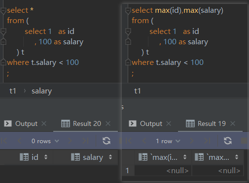
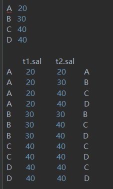

# Plan 600 

🤣 : At first ,  talk about the title 'plan 600' , why did I take this tile? Just because I wanna enhance my SQL ability and algorithm ability , I plan complete 600 SQL/Algorithm problems in January 2022, and dead line is  2022-02-01. The following is my record of the challenge.

Almost 20 per day , it is really a challenge!

## SQL

#### tag-easy

some problem is extremely easy , so there is no need to describe solution

###### [001 - `LeetCode`175 problem](https://leetcode.com/problems/combine-two-tables/submissions/)

###### [002- `LeetCode` 181problem](https://leetcode.com/problems/employees-earning-more-than-their-managers/submissions/)

###### [003- `LeetCode`182problem ](https://leetcode.com/problems/duplicate-emails/submissions/)

###### [004- `LeetCode`183problem](https://leetcode.com/problems/customers-who-never-order/submissions/)

###### [005- `LeetCode`196problem](https://leetcode.com/problems/delete-duplicate-emails/)
```sql
-- method 1 
delete
from Person
where Id not in (
    select Id
    from (
             select min(Id) as Id
             from Person
             group by Email
         ) t
)
;
-- method 2 
delete
from Person
where id In
      (
          select id
          from (
                   select email
                        , id
                        , row_number() over (partition by email order by id asc) as rank_id
                   from Person
               ) as c
          where c.rank_id > 1
      );
-- the following method doesn't work , you will get 
-- " You can't specify target table 'Person' for update in FROM clause"
delete
from Person
where Id not in (
    select min(Id) as Id
    from Person
    group by Email
)：
```

###### [006- `LeetCode`197problem](https://leetcode.com/problems/rising-temperature/submissions/)

:one: lead,  ↓    from top to down direction 

:two: lag,    ↑     from down to top direction

```sql
-- just a windows function 
select id
from (
         select id
              , temperature
              , recordDate
              , timestampdiff(day,lag(recordDate, 1) over (order by recordDate),recordDate) as date_diff
              , lag(temperature, 1) over (order by recordDate) yes_temperature

         from Weather
     ) t
where temperature > yes_temperature
and date_diff = 1
```

###### [007- `LeetCode`595problem](https://leetcode.com/problems/big-countries/submissions/)

###### [008- `LeetCode`596problem](https://leetcode.com/problems/classes-more-than-5-students/submissions/)

###### [009- `LeetCode`620problem](https://leetcode.com/problems/not-boring-movies/submissions/)
###### [010- `LeetCode627`problem](https://leetcode.com/problems/swap-salary/)

```sql
update Salary
set sex = if(sex = 'm','f','m');
```

###### [011- `LeetCode`1179 problem](https://leetcode.com/problems/reformat-department-table/submissions/)

```sql
select id
     , sum(if(month = 'Jan', revenue,null)) as Jan_Revenue
     , sum(if(month = 'Feb', revenue,null)) as Feb_Revenue
     , sum(if(month = 'Mar', revenue,null)) as Mar_Revenue
     , sum(if(month = 'Apr', revenue,null)) as Apr_Revenue
     , sum(if(month = 'May', revenue,null)) as May_Revenue
     , sum(if(month = 'Jun', revenue,null)) as Jun_Revenue
     , sum(if(month = 'Jul', revenue,null)) as Jul_Revenue
     , sum(if(month = 'Aug', revenue,null)) as Aug_Revenue
     , sum(if(month = 'Sep', revenue,null)) as Sep_Revenue
     , sum(if(month = 'Oct', revenue,null)) as Oct_Revenue
     , sum(if(month = 'Nov', revenue,null)) as Nov_Revenue
     , sum(if(month = 'Dec', revenue,null)) as Dec_Revenue
from Department
group by id;

-- if remove sum agg function ,we will find mysql return the first row
```

#### tag-medium

###### [012- `LeetCode`176problem](https://leetcode.com/problems/second-highest-salary/submissions/)

```sql
-- the sql can pass oj
select max(salary) as "SecondHighestSalary"
from employee
where salary < (select max(salary) from employee) ;

-- the sql also cant pass oj
select max(salary) as SecondHighestSalary
from Employee
where salary = (
    select distinct salary
    from Employee
    order by salary desc
    limit 1,1
);

-- the following sql can't pass oj ,the following picture explain the reason
select max(salary) as SecondHighestSalary
from Employee
where salary = (
    select distinct salary
    from Employee
    order by salary desc
    limit 1,1
)
```




###### [013- `LeetCode`177problem](https://leetcode.com/problems/nth-highest-salary/)

```sql
create function getnthhighestsalary(n int) returns int
begin
    return (
        # write your mysql query statement below.
        select max(salary)
        from (
            select t1.salary
            from Employee t1
            inner join Employee t2 
            on t1.salary <= t2.salary
            group by t1.salary
            having  count(distinct  t2.salary) = n
            ) t
    );
end
-- the following pic explain the sql
```




###### [014- `LeetCode`178problem](https://leetcode.com/problems/rank-scores/)

dense_rank , the word dense means “稠密的” , dense_rank means the   no holes between ranks

###### [015- `LeetCode`180problem](https://leetcode.com/problems/consecutive-numbers/)

```sql
select distinct num as  ConsecutiveNums 
from (
         select num
              , lag(num, 1) over (order by id ) lag_1
              , lag(num, 2) over (order by id ) lag_2
         from Logs
     )t
where lag_1 = num
and lag_2 = num
```

###### [016- `LeetCode`184problem](https://leetcode.com/problems/department-highest-salary/)

```sql
select t2.name as Department
     ,  t1.name as Employee
     ,  t1.salary as Salary
from  Employee t1
left join Department t2
on t1.departmentId = t2.id
left join     
    (
         select departmentId
              , max(salary) max_sal
         from Employee
         group by departmentId
     ) t3
on t1.departmentId= t3.departmentId
where t1.salary = t3.max_sal
;
```

###### [017- `LeetCode`626problem](https://leetcode.com/problems/exchange-seats/)

```sql
select case
           when mod(id, 2) != 0 and counts != id then id + 1
           when mod(id, 2) != 0 and counts = id then id
           else id - 1 end as id
     , student
from seat
   , ( select count(*) as counts
       from seat ) as seat_counts
order by id asc;
```

