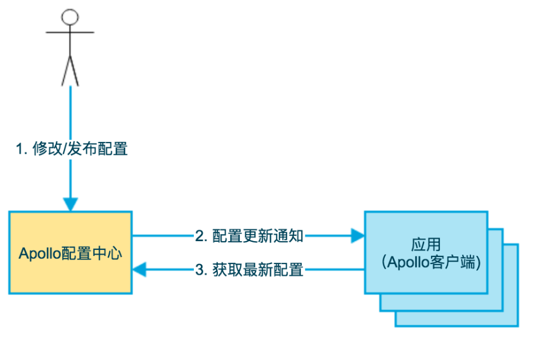
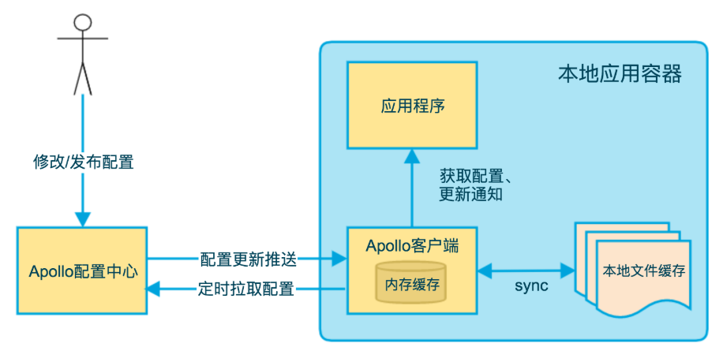
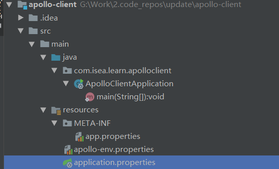
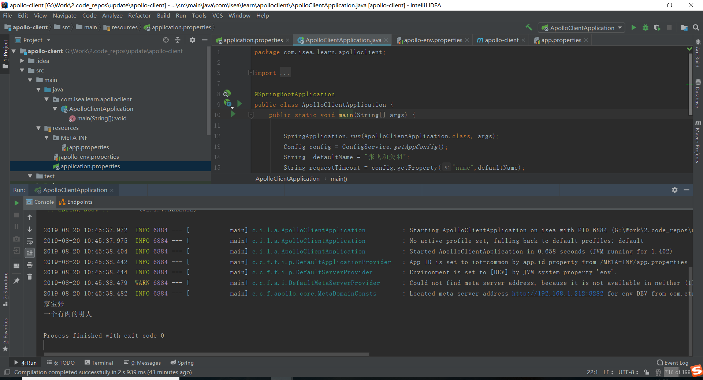
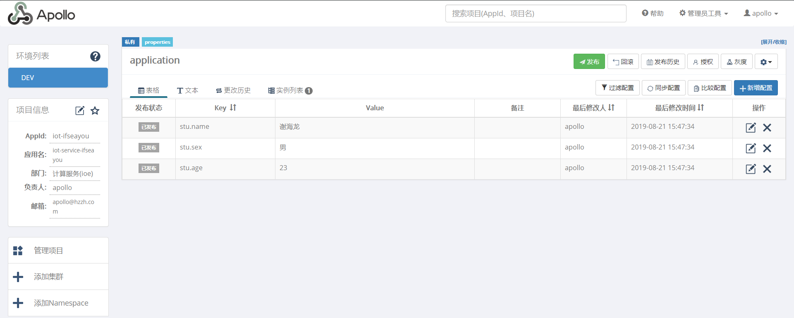
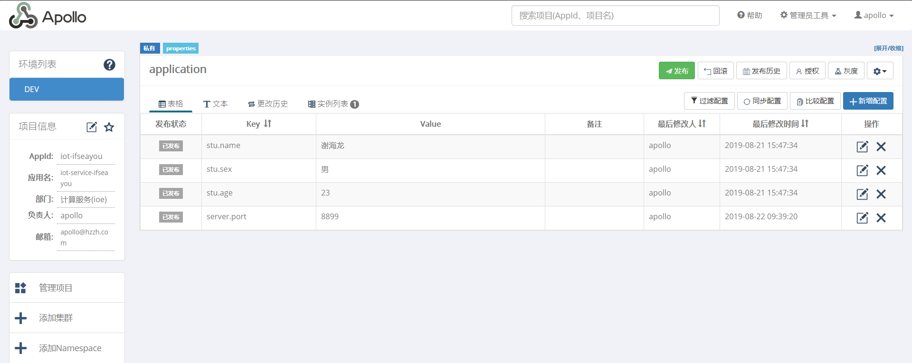

# Apollo

一句话介绍：**Apollo是 一个配置管理中心**

## 01-Apollo是什么？

Apollo（阿波罗）是携程框架部门研发的分布式配置中心，能够集中化管理应用不同环境、不同集群的配置，配置修改后能够实时推送到应用端，并且具备规范的权限、流程治理等特性，**适用于微服务配置管理场景**。

Apollo支持4个维度管理Key-Value格式的配置：

1. application (应用)
2. environment (环境)
3. cluster (集群)
4. namespace (命名空间)

配置也有很多种加载方式，常见的有程序内部hard code，配置文件，环境变量，启动参数，基于数据库等

Apollo目前唯一的外部依赖是MySQL

**配置需要治理**

- 权限控制

  由于配置能改变程序的行为，不正确的配置甚至能引起灾难，所以对配置的修改必须有比较完善的权限控制
- 不同环境、集群配置管理

  同一份程序在不同的环境（开发，测试，生产）、不同的集群（如不同的数据中心）经常需要有不同的配置，所以需要有完善的环境、集群配置管理
- 框架类组件配置管理
  - 还有一类比较特殊的配置 - 框架类组件配置，比如CAT客户端的配置。
  - 虽然这类框架类组件是由其他团队开发、维护，但是运行时是在业务实际应用内的，所以本质上可以认为框架类组件也是应用的一部分。
  - 这类组件对应的配置也需要有比较完善的管理方式。

## 02-Apollo的原理

### 2.1服务端原理



### 2.2客户端原理



## 03-上手案例

现在已经有了Apollo的服务中心，建立java客户端来读取服务器的配置。建立一个boot项目

添加依赖：

~~~xml
<dependency>
    <groupId>com.ctrip.framework.apollo</groupId>
    <artifactId>apollo-client</artifactId>
    <version>1.4.0</version>
</dependency>
~~~

配置文件

~~~properties
# app.properties
app.id=iot-common

#apollo-env.properties
local.meta=http://192.168.1.212:8282
dev.meta=http://192.168.1.212:8282

#vm配置：
-Denv=DEV
~~~

配置文件的层级关系

 

代码逻辑

```java
@SpringBootApplication
public class ApolloClientApplication {
    public static void main(String[] args) {

        SpringApplication.run(ApolloClientApplication.class, args);
        Config config = ConfigService.getAppConfig();
        String  defaultName = "张飞和关羽";
        String requestTimeout = config.getProperty("name",defaultName);
        String sex = config.getProperty("sex","女");
        System.out.println(requestTimeout);
        System.out.println(sex );
    }
}
```

Apollo的配置：


测试通过：




## 04-Apollo和spring-boot

### 4.1 spring boot 读取Apollo配置的案例1：

Apollo上面的配置信息：

 

项目的结构：

 

代码：

~~~java
// Student类 ，这里一定要添加get方法，set设值，get取值
@Component
@EnableApolloConfig
@ConfigurationProperties(prefix = "stu")
public class Student {
    private String name;
    private String sex;
    private int age;
    public void setName(String name) {
        this.name = name;
    }
    public String getName() {
        return name;
    }
    public String getSex() {
        return sex;
    }
    public int getAge() {
        return age;
    }
    public void setSex(String sex) {
        this.sex = sex;
    }
    public void setAge(int age) {
        this.age = age;
    }
}

// Controller
@RestController
public class HelloController {

    @Autowired
    private Student student;

    @GetMapping(path = "show")
    public String show() {
        return JSON.toJSONString(student);
    }
}

// 启动类
@SpringBootApplication
public class ApolloClientApplication {
    public static void main(String[] args) {
        SpringApplication.run(ApolloClientApplication.class, args);
    }
}
~~~

配置信息：

~~~properties
#app.properties
app.id=iot-ifseayou

# apollo-env.properties
local.meta=http://192.168.1.212:8282
dev.meta=http://192.168.1.212:8282

# bootstrap.properties
apollo.bootstrap.enabled = true
apollo.bootstrap.namespaces = application
~~~

最终访问的结果：

 

### 4.2 spring boot读取Apollo配置的案例2：

Apollo的配置信息：



项目结构：

 

代码：

```java
// Student类 ，这里一定要添加get方法，set设值，get取值
@Component
@EnableApolloConfig
public class Student {
    @Value("${stu.name}")
    private String name;
    @Value("${stu.sex}")
    private String sex;
    @Value("${stu.age}")
    private int age;

    public void setName(String name) {
        this.name = name;
    }
    public String getName() {
        return name;
    }
    public String getSex() {
        return sex;
    }
    public int getAge() {
        return age;
    }
    public void setSex(String sex) {
        this.sex = sex;
    }
    public void setAge(int age) {
        this.age = age;
    }
}

// Controller
@RestController
public class HelloController {

    @Autowired
    private Student student;

    @GetMapping(path = "show")
    public String show() {
        return JSON.toJSONString(student);
    }
}

// 启动类
@SpringBootApplication
public class ApolloClientApplication {
    public static void main(String[] args) {
        SpringApplication.run(ApolloClientApplication.class, args);
    }
}
```

配置信息：

```properties
#app.properties
app.id=iot-ifseayou

# apollo-env.properties
local.meta=http://192.168.1.212:8282
dev.meta=http://192.168.1.212:8282

# bootstrap.properties
apollo.bootstrap.enabled = true
apollo.bootstrap.namespaces = application
```

最终访问的结果：


