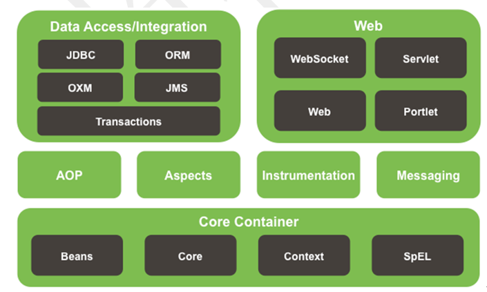
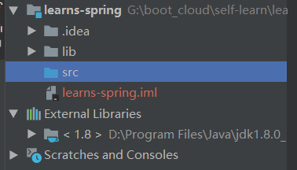
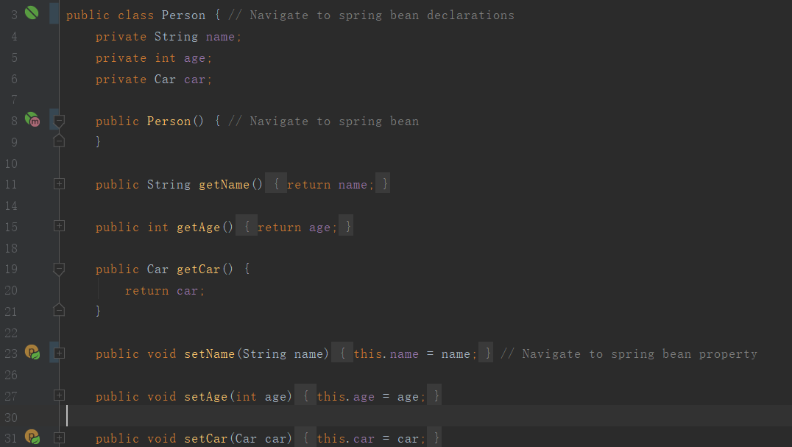
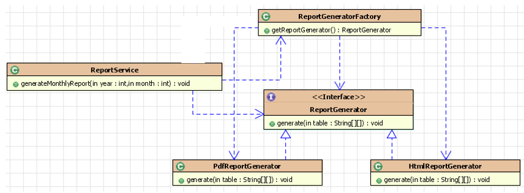
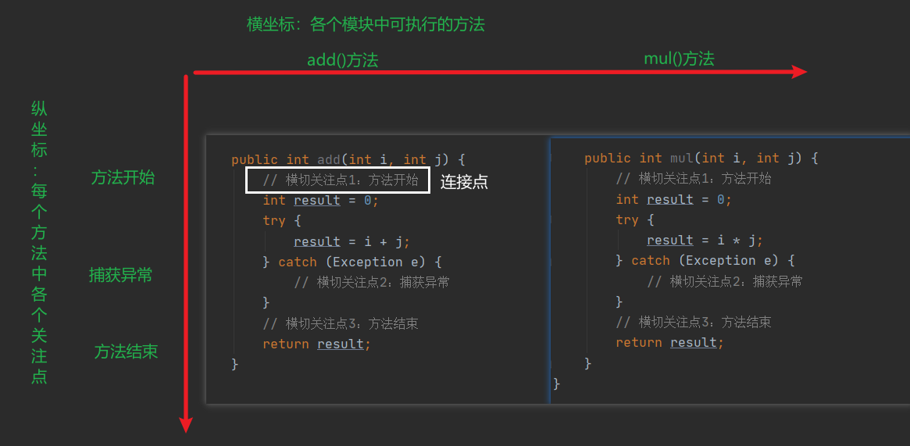

# Spring

## 一，概述

Spring框架具备了如下的特点：

* 轻量级：
* 依赖注入DI（dependency injection），IOC，**IOC是一种思想（以前是程序员自己控制对象，现在交付给容器，也就是框架），DI是IOC的实现**。例如Service依赖于dao层，我们可以使用Spring框架将dao注入到service中去，这个过程就是依赖注入；$Inversion Of Control$ 也就是反转控制。
* 面向切面编程，AOP 
* 容器，Spring是一个容器，因为它可以包含并且管理应用对象的生命周期

 

底层是IOC的部分，中间是AOP，上层是对数据库的访问，和对web的支持。建立一个Spring项目的目录结构：如下图所示

 

## 二，example

### 2.1-HelloWorld

正常的逻辑下，如果我们不使用Spring，我们创建一个JavaBean类，然后创建该类的实例，然后调用方法

~~~java
// JavaBean类
package com.isea.learn;

public class HelloWorld {
    private String name;

    public String getName() {
        return name;
    }

    public void setName(String name) {
        this.name = name;
    }

    public void hello(){
        System.out.println("hello " + name);
    }
}

// 主方法类
package com.isea.learn;

public class Main {
    public static void main(String[] args) {
        HelloWorld helloWorld = new HelloWorld();
        helloWorld.setName("z3");

        helloWorld.hello();
    }
}
~~~

**如果我们使用Spring来完成，框架帮助我们创建对象放置于IOC容器中，我们只是需要创建IOC容器，然后从容器中获取对象即可，至于对象属性的配置，从`xml` 配置文件中配置即可，然后就可以愉快的使用。**

~~~java
import org.springframework.context.support.ClassPathXmlApplicationContext;

public class Main {
    public static void main(String[] args) {
        // 获取一个容器对象
        ClassPathXmlApplicationContext ctx = new ClassPathXmlApplicationContext("applicationContext.xml");
        HelloWorld helloWorld =(HelloWorld)ctx.getBean("helloWorld");
        helloWorld.hello();
    }
}
~~~

对象的属性需要从配置文件中获取，如下：

~~~xml
<!--配置bean，
class:值为类的路径，这里告知全类名可以推断出是通过反射的方式进行对象的创建，要求bean中有无参的构造器

id:用来标识创建好的对象，如果我们需要使用这个对象，就用id的值来获取到，如我们在main方法中getBean("id值") 也即为对象的唯一标识。

-->
<bean id="helloWorld" class="com.isea.learn.HelloWorld">
    <!--这里的name属性值就是JavaBean中的set方法后面设置的名字，value就是javaBean中的属性对应的值-->
     <property name="name" value="Spring"></property>
</bean>
~~~

**重点：**

~~~java
ClassPathXmlApplicationContext ctx = new ClassPathXmlApplicationContext("applicationContext.xml");
~~~

* ***IOC***被创建的同时，就调用了JavaBean的构造方法，创建了对象，并调用了set方法对属性进行赋值。

* JavaBean需要有无参的构造方法

* xml中定义的进行bean配置的方式实际上是运用了反射（容器对象解析了xml文件之后，可以根据id来获取到后面的class对象，然后依照class对象，完成构建对象的过程）

  ~~~java
  // 首先解析xml，得到com.isea.virgin.Person
  Class clazz = Class.forName("com.isea.virgin.Person")
  Person person = clazz.newInstacne()
  // 这就是基本的得到对象的基本的原理	
  ~~~

* 在service层按照xml文件中的```id``` 属性获取容器中获取到的对象

IDEA的强大之处在于，帮助我们更好的理解和定位我们在配置文件中声明交给Spring的bean和我们在实体类中定义的类之间的关系，如下： 

 

## 三， IOC & DI

***Inversion of control***   传统的资源查找方式是，由组件向容器发送请求资源，然后容器将资源返回给组件。而IOC的思想是**容器主动将资源推送给需要的组件**。以前是上菜市场买菜，现在是直接在门口取菜。组件需要做的事情就是：**选择一种合适的方式来接收资源**。

***DI：dependency injection*** : 实际上是IOC的另外的一种表述方式，接收来自容器的资源注入。

**例子：** 获取B对象，并使B对象的a属性指向A对象。

~~~java
class A{}
class B{
    private A a;
    public void setA(A a){
        this.a = a;
    }
}

// 常规的方法
A a = getA();
B b = getB();
b.setA(a);

// IOC 的方式
B b = getB();
~~~

来一起看下IOC 的演进历程，假如我们现在有一个生成HTML和PDF两种不同形式的报表：

### 3.1-分离接口和实现类

在服务类中需要知道接口，和接口的实现类，此种方式的耦合度是最高的。如图表现的形式：

 

类比一下，远古时代如果需要一把斧头，人类要知道斧头的形状，还需要知道如何手工的打造一把斧头。

### 3.2-采用工厂设计模式

 

直接去铁匠铺告诉需要一把什么样的斧头，然后就可以直接获取到。

### 3.3-IOC 控制反转

这里容器直接将资源注入给service。

 

## 四，Spring容器(也即IOC容器)

Spring中有IOC思想，IOC思想必须基于 IOC容器来完成，而IOC容器在最底层实质上就是一个对象工厂

Spring提供了两种类型的IOC容器的实现：

* **BeanFactory **IOC的基本实现，是spring框架的基础设施，面向spring本身
* **ApplicationContext，**是BeanFactory的子接口，面向开发者 ，几乎所有场合我们都使用ApplicationContext

**IOC容器在底层实际上就是一个对象工厂。**下面给出一张图来理解IOC容器在底层就是一个对象工厂这一个本质：

 

***configurableApplicationContext*** 中定义了***refresh()、close()***  方法，让ApplicationContext具备了启动刷新关闭上下文的能力。

关于如何在XML文件中配置bean，直接参考文档即可。

### 4.1-FactoryBean（工厂bean）

我们将对象交给了容器管理（或者说是spring）之后，bean可以分为两类，一类是普通的bean，另一种是工厂bean，即FactoryBean。工厂bean跟普通bean不同，其返回的对象不是指定类的一个实例，其返回的是该工厂bean的getObject方法所返回的对象。目的是：**支持开发人员参与到bean对象的创建过程中。**

| bean的类型 | 说明                                                         |
| ---------- | ------------------------------------------------------------ |
| 普通bean   | 对象的创建过程，全部是容器完成，程序员参与不了               |
| 工厂bean   | 对象的创建过程是由程序员做的，对象创建完成之后，将对象交给容器管理 |

工厂bean必须实现`org.springframework.beans.factory.FactoryBean`接口。在使用xml文件配置工程bean的时候，注意返回的不是工厂bean的对象，而是工厂bean的***getObject***方法返回的对象。

### 4.2-bean的作用域

在Spring中，可以在`<bean>`元素的scope属性里设置bean的作用域，以决定这个bean是单实例的还是多实例的。默认情况下，Spring只为每个在IOC容器里声明的bean创建唯一一个实例，整个IOC容器范围内都能共享该实例：所有后续的getBean()调用和bean引用都将返回这个唯一的bean实例。bean的类型如下：

:one: singleton : 在SpringIOC容器找那个仅存在一个Bean实例，Bean以单例的方式存在

:two:prototype : 每次调用getBean() 都会返回一个新的实例

:three: request: 每次Http 请求都会创建一个新的Bean，该作用域仅适用于WebApplicationContext环境

:four: session： 同一个Http Session 共享一个Bean，不同的HttpSession 使用不同的Bean，该作用域仅仅适用于WebApplicationContext

当bean的作用域为单例时，Spring会在IOC容器对象创建时就创建bean的对象实例。而当bean的作用域为prototype时，IOC容器在获取bean的实例时创建bean的实例对象。

### 4.3-Bean的生命周期

Spring IOC容器可以管理bean的生命周期，Spring允许在bean生命周期内特定的时间点执行指定的任务。Spring IOC容器对bean的生命周期进行管理的过程如下：

:one: 通过构造器或工厂方法创建bean实例

:two: 为bean的属性设置值和对其他bean的引用

:three: 调用bean的初始化方法

:four: bean可以使用了

:five: 当容器关闭时，调用bean的销毁方法

#### 配置数据连接池

首先需要导入mysql数据库驱动和druid连接池的依赖（jar包），然后基于Spring编写配置文件：

```xml
<?xml version="1.0" encoding="UTF-8"?>
<beans xmlsn="...">
    <!--配置数据源-连接池 -->
    <bean id="dataSource" calss="com.alibaba.druid.pool.DruidDataSource">
        <prperty name="driverClassName" value="com.mysql.jdbc.Driver"/>
        <prperty name="url" value="jdbc:mysql://localhost:3306/test"/>
        <prperty name="username" value="root"/>
        <prperty name="password" value="123456"/>
    </bean>
</beans>
```

或者是使用下面的结合properties配置文件+xml的方式：

```properties
jdbc.driverClassName=com.mysql.jdbc.Driver
jdbc.url=jdbc:mysql://localhost/test
jdbc.username=root
jdbc.password=123456
```

```xml
<!--配置数据源-连接池 通过${}获取从属性文件中加载的值 -->
<bean id="dataSource" calss="com.alibaba.druid.pool.DruidDataSource">
    <prperty name="driverClassName" value="${jdbc.driverClassName}"/>
    <prperty name="url" value="${jdbc.url}"/>
    <prperty name="username" value="${jdbc.username}"/>
    <prperty name="password" value="${jdbc.password}"/>
</bean>
```

### 4.4-自动装配

根据指定的装配规则，Spring自动将匹配的属性值注入bean中。注意：自动装配只能装配通过**ref**引用的属性。通过xml的方式实现的自动装配如下，（但是这种方式一般在项目中不会使用,一般会使用注解的方式）

```xml
<?xml version="1.0" encoding="UTF-8"?>
<beans xmlsn="...">
    <!--配置数据源-连接池 -->
    <bean id="address" calss="com.isea.spring.autoware.Address">
        <prperty name="city" value="北京"/>
        <prperty name="location" value="昌平"/>
    </bean>
    <bean id="address" calss="com.isea.spring.autoware.Car">
        <prperty name="brand" value="奔驰"/>
        <prperty name="price" value="30w"/>
    </bean>
    <bean id="employee" calss="com.isea.spring.autoware.Employee" autowire="byName"> <!--这里-->
        <prperty name="empNmae" value="张三"/>
        <prperty name="friendName" value="李四"/>
    </bean>
    
</beans>
```

### 4.5-注解的方式来配置bean

| 注解           | 作用                                                         |
| -------------- | ------------------------------------------------------------ |
| @Component     | 普通组件，标识一个受Spring IOC容器管理的组件                 |
| @Repository    | 持久化层组件，标识一个受Spring IOC容器管理的**持久化层**组件 |
| @Service       | 业务逻辑层组件，标识一个受Spring IOC容器管理的**业务逻辑层**组件 |
| @Controller    | 表述层控制器组件：标识一个受Spring IOC容器管理的**表述层控制器**组件 |
| @Configuration | 从Spring3.0，@Configuration用于定义配置类，可替换xml配置文件，被注解的类内部含有一个或多个被@Bean注解的方法，这些方法将会被AnnotationConfigApplicationContext或AnnotationConfigWebApplicationContext类进行扫描，并用于构建bean，初始化Spring容器。 |

 组件命名规则

:one: 默认情况：使用组件的简单类名首字母小写后得到的字符串作为bean的id

:two: 使用组件注解的value属性指定bean的id

注意：事实上Spring并没有能力识别一个组件到底是不是它所标记的类型，即使将@Respository注解用在一个表述层控制器组件上面也不会产生任何错误，所以**@Respository、@Service、@Controller这几个注解仅仅是为了让开发人员自己明确当前的组件扮演的角色。**

组件被上述注解标识后还需要通过Spring进行扫描才能够侦测到。**base-package**属性指定一个需要扫描的基类包，Spring容器将会扫描这个基类包及其子包中的所有类，当需要扫描多个包时可以使用逗号分隔，此外，还可以进行排除和包含。

```xml
<context component-scan base-package = "com.isea.virgin.spring" >
```

:exclamation:进行包扫描的前提是：必须在原有JAR包组合的基础上再导入一个：`spring-aop-4.0.0.RELEASE.jar`

#### 注解的自动装配

:one: Controller组件中往往需要用到Service组件的实例，Service组件中往往需要用到Repository组件的实例。Spring可以通过注解的方式帮我们实现属性的装配。

:two: 实现依据，在指定要扫描的包时，`<context:component-scan>`元素会自动注册一个bean的后置处理器：`AutowiredAnnotationBeanPostProcessor`的实例。**该后置处理器可以自动装配标记了@Autowired、@Resource或@Inject注解的属性**。

:three: @Autowired注解：根据类型实现自动装配。 

:four: @Resource：@Resource注解要求提供一个bean名称的属性，若该属性为空，则自动采用标注处的变量或方法名作为bean的名称。

:five: @Inject：@Inject和@Autowired注解一样也是按类型注入匹配的bean，但没有reqired属性。

## 五，AOP

### 5.1-动态代理

代理设计模式的原理：**使用一个代理对象将原本对象包装起来**，然后用该代理对象”取代”原始对象。任何对原始对象的调用都要通过代理。代理对象决定是否以及何时将方法调用转到原始对象上。

 

> proxy.dynamic
>
> --service
>
> ​	--impl
>
> ​		--ArithmeticCalculatorImpl.java
>
> ​	--ArithmeticCalculator.java
>
> --ArithmeticCalculatorLogProxy.java

```java
public interface ArithmeticCalculator {
    int add(int a, int b);
    int sub(int a, int b);
    int mul(int a, int b);
    int div(int a, int b);
}

 * 	① 执行加减乘除运算
 * 	②日志：在程序执行期间追踪正在发生的活动
 * 	③验证：希望计算器只能处理正数的运算
 *
 * 	这样的写法的缺点是，日志信息嵌入到了逻辑方法中，增加了耦合度
 */
public class ArithmeticCalculatorImpl implements ArithmeticCalculator {

    @Override
    public int add(int a, int b) {return a + b;}
    @Override
    public int sub(int a, int b) {return a - b;}
    @Override
    public int mul(int a, int b) {return a * b;}
    @Override
    public int div(int a, int b) {return a / b;}
}


public class ArithmeticCalculatorLogProxy {

    // 要代理的对象
    private ArithmeticCalculator target;
    public ArithmeticCalculatorLogProxy(ArithmeticCalculator target) {
        this.target = target;
    }

    public ArithmeticCalculator getLoggingProxy() {
        ArithmeticCalculator proxy = null;
        // 代理对象由哪一个类加载器加载
        ClassLoader loader = target.getClass().getClassLoader();

        // 代理对象的类型，也即其中有哪些方法
        Class[] interfaces = {ArithmeticCalculator.class};
        InvocationHandler handler = new InvocationHandler() {
            /**
             * 	在invoke方法上实现代理的功能，并且将对代理实例方法的调用转到目标对象的方法上
             *
             * @param proxy  正在返回的那个代理对象，一般情况下，在invoke方法中都不使用该对象
             * @param method 正在被调用的方法
             * @param args 调用方法时，传入的参数
             * @return
             * @throws Throwable
             */
            @Override
            public Object invoke(Object proxy, Method method, Object[] args) throws Throwable {
                // 日志
                System.out.println(method.getName() + " start");
                // 执行方法
                Object result = method.invoke(target, args);
                System.out.println("the result = " + result);
                // 日志
                System.out.println(method.getName() + " end");
                return result;
            }
        };

        proxy = (ArithmeticCalculator) Proxy.newProxyInstance(loader, interfaces, handler);
        // 当调用代理对象其中的方法时，该执行的代码
        return proxy;
    }
}
```

### 5.2-AOP

:one:  AOP(Aspect-Oriented Programming，**面向切面编程**)：是一种新的方法论，是对传统 OOP(Object-Oriented Programming，面向对象编程)的补充。

:two: AOP编程操作的主要对象是切面(aspect)，而切面用于**模块化横切关注点（公共功能）**。

:three: 在应用AOP编程时，仍然需要定义公共功能，但可以明确的定义这个功能应用在哪里，以什么方式应用，并且不必修改受影响的类。这样一来横切关注点就被模块化到特殊的类里——这样的类我们通常称之为“切面”。 

AOP的好处： 每个事物逻辑位于一个位置，代码不分散，便于维护和升级；业务模块更简洁，只包含核心业务代码；AOP图解如下：

 

#### 5.2.1-AOP 术语

| 名词                  | 含义                                                         |
| --------------------- | ------------------------------------------------------------ |
| **横切关注点/方法**   | 从每个方法中抽取出来的同一类非核心业务。                     |
| **切面(Aspect)/类**   | 封装横切关注点信息的类，每个关注点体现为一个通知方法。       |
| 通知(Advice)          | 切面必须要完成的各个具体工作                                 |
| 目标(Target)          | 被通知的对象                                                 |
| 代理(Proxy)           | 向目标对象应用通知之后创建的代理对象                         |
| **连接点(Joinpoint)** | 横切关注点在程序代码中的具体体现，对应程序执行的某个特定位置。<br>例如：类某个方法调用前、调用后、方法捕获到异常后等。 |
| 切入点(pointcut)      | 定位连接点的方式。每个类的方法中都包含多个连接点，所以连接点是类中客<br>观存在的事物。如果把连接点看作数据库中的记录，那么切入点就是查询条件<br>AOP可以通过切入点定位到特定的连接点。<br>切点通过`org.springframework.aop.Pointcut` 接口进行描述，<br>它使用类和方法作为连接点的查询条件。 |

在应用程序中可以使用横纵两个坐标来定位一个具体的**连接点**：

 

无论连接点是正常返回还是抛出异常，后置通知都会执行。如果只想在连接点返回的时候(**正常执行完毕**)记录日志，应使用返回通知代替后置通知。

#### 5.2.2-环绕通知

环绕通知是所有通知类型中功能最为强大的，能够全面地控制连接点，甚至可以控制是否执行连接点。对于环绕通知来说，连接点的参数类型必须是ProceedingJoinPoint。它是 JoinPoint的子接口，允许控制何时执行，是否执行连接点。**在环绕通知中需要明确调用ProceedingJoinPoint的proceed()方法来执行被代理的方法。**如果忘记这样做就会导致通知被执行了，但目标方法没有被执行。注意：环绕通知的方法**需要返回目标方法执行之后的结果**，即调用 joinPoint.proceed();的返回值，否则会出现空指针异常。

**调用一个方法的时候，发现该方法上是切入点，先走前置通知，在走当前的方法，再走当前方法的返回通知，发生了异常，走异常通知，最后走后置通知**
