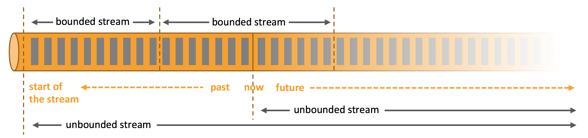
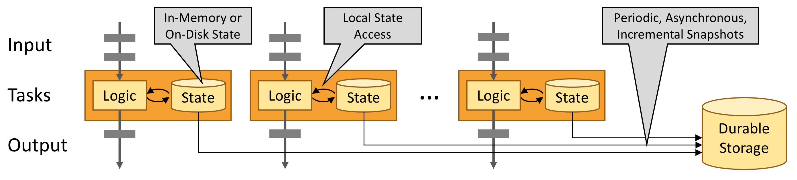
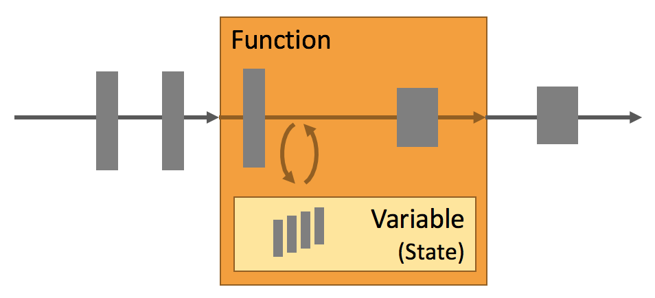
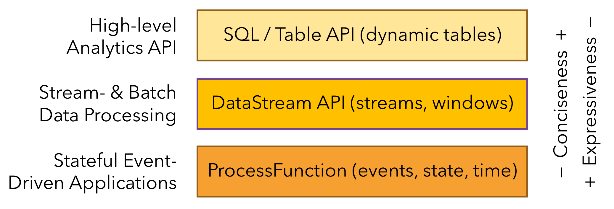

# What is Apache Flink? 

## Architecture

> Apache Flink is a framework and distributed processing engine for stateful computations over *unbounded and bounded* data streams. Flink has been designed to run in *all common cluster environments*, perform computations[^1] at *in-memory speed* and at *any scale*.
>
> Here, we explain important aspects of Flink’s architecture.

Apache Flink 是一个组件和分布式处理引擎，用于有限和无限数据流的状态计算。Flink被设计运行在所有普通的集群环境，以内存速度和任何规模执行计算。
这里我们阐述Flink架构的重要方面。

> ## Process Unbounded and Bounded Data
>
> Any kind of data is produced as a stream of events. Credit card transactions, sensor measurements[^2], machine logs, or user interactions on a website or mobile application, all of these data are generated as a stream.
>
> Data can be processed as *unbounded* or *bounded* streams.
>
> 1. **Unbounded streams** have a start but no defined end. They do not terminate and provide data as it is generated. Unbounded streams must be continuously processed, i.e.,[^3] events must be promptly[^4] handled after they have been ingested[^5]. It is not possible to wait for all input data to arrive because the input is unbounded and will not be complete at any point in time. Processing unbounded data often requires that events are ingested in a specific order, such as the order in which events occurred, to be able to reason about result completeness.
>
> 2. **Bounded streams** have a defined start and end. Bounded streams can be processed by ingesting all data before performing any computations[^6]. Ordered ingestion is not required to process bounded streams because a bounded data set can always be sorted. Processing of bounded streams is also known as batch processing.
>
>    
>
> **Apache Flink excels[^7] at processing unbounded and bounded data sets.** Precise control of time and state enable Flink’s runtime to run any kind of application on unbounded streams. Bounded streams are internally processed by algorithms and data structures that are specifically designed for fixed sized data sets, yielding[^8] excellent performance.
>
> Convince yourself by exploring the [use cases](https://flink.apache.org/usecases.html) that have been built on top of[^9] Flink.

处理无界和有界数据

任何类型的是数据以数据流的方式被生产，信用卡交易记录，传感器测量，机器日志，或是网站或手机应用的交互，所有这些数据以流的形式被生产。
数据可以被无界流或者有界流的方式被处理

:one: **无界流** 有一个开始但是没有确定的结束。他们不会终止，并且在生成数据的时候提供数据。无界流必须被连续处理，即：当事件摄入时必须被处理。等待所有数据到达后再处理是不可能的，因为输入是无界的，而且在任何时间点都不会完成。处理无界数据经常要求摄入有序的的事件，比如顺序发生的事件，能够推理结果的完整性。

:two: **无界流** 有一个确定的开始和结尾。在执行计算之前，flink通过摄取所有数据来处理有界流。处理有界流不要求有序的摄入，因为有界的数据总是可以被排序。有界数据流的处理也被称之为批处理。

Apache Flink 擅长处理有界数据集和无界数据集，精确的时间和状态控制能够保证Flink执行时可以运行在任何类型的无界流应用上。Flink内部专门为混合大小的数据集设计了算法和数据结构，去处理有界流，产生优秀的性能。
你可以通过探索基于Flink 构建的[案例](https://flink.apache.org/usecases.html)来说服自己。

> ## Deploy Applications Anywhere
>
> Apache Flink is a distributed system and requires compute resources in order to execute applications. Flink integrates with all common cluster resource managers such as [Hadoop YARN](https://hadoop.apache.org/docs/stable/hadoop-yarn/hadoop-yarn-site/YARN.html), [Apache Mesos](https://mesos.apache.org/), and [Kubernetes](https://kubernetes.io/) but can also be setup[^10] to run as a stand-alone[^11] cluster.
>
> Flink is designed to work well each of the previously listed resource managers. This is achieved by resource-manager-specific deployment modes that allow Flink to interact with each resource manager in its idiomatic[^12] way.
>
> When deploying a Flink application, Flink automatically identifies the required resources based on the application’s configured parallelism and requests them from the resource manager. In case of a failure, Flink replaces the failed container by requesting new resources. All communication to submit or control an application happens via REST calls. This eases the integration of Flink in many environments.

在任何地方部署应用。

Apache Flink是一个分布式系统，为了执行应用需要计算资源。Flink集成了所有常见的集群资源管理器，比如Hadoop YARN，Apache Mesos、K8S，而且可以设置为独立集群。

Flink被设计的可以和上面任意一个资源管理器良好工作。通过资源管理器的部署模式可以实现Flink和任何一个资源管理器按照器惯用的方式进行交互。
当部署Flink应用时，Flink会根据应用配置的并行度从资源管理器哪里自动识别需要的资源。如果发生了失败，Flink会申请新的容器来替换失败的容器。所有的提交和控制的交互都是通过REST调用。这种方式简化了Flink在很多环境中的集成。

> ## Run Applications at any Scale
>
> Flink is designed to run stateful streaming applications at any scale. Applications are parallelized into possibly thousands of tasks that are distributed and concurrently executed in a cluster. Therefore, an application can leverage[^13] virtually unlimited amounts of[^14] CPUs, main memory, disk and network IO. Moreover, Flink easily maintains very large application state. Its asynchronous and incremental checkpointing algorithm ensures minimal impact on processing latencies while guaranteeing exactly-once state consistency.
>
> [Users reported impressive scalability numbers](https://flink.apache.org/poweredby.html) for Flink applications running in their production environments, such as
>
> - applications processing **multiple trillions[^15] of events per day**,
> - applications maintaining **multiple terabytes[^16] of state**, and
> - applications **running on thousands of cores**.

在任何规模运行应用

Flink为在任何规模运行状态流应用而设计。应用可能并行为成千上百个任务，这些任务是分布式且并发在一个集群中。因此，一个应用可以利用无限数量的数量的CPU,主内存，磁盘和网络IO。而且，Flink可以轻易的维护大应用的状态。她异步和增长的检查点算法确保（在保证精确一次一致性保证时）处理延时的产生最小影响。

对于运行在生产环境中的Flink应用，用户报道了大量感人的数字：

* 应用每天处理数万亿的事件
* 应用维护数太字节的状态，而且
* 应用运行在成千上百的内核上

> ## Leverage In-Memory Performance
>
> Stateful Flink applications are optimized for local state access. Task state is always maintained in memory or, if the state size exceeds the available memory, in access-efficient on-disk data structures. Hence, tasks perform all computations by accessing local, often in-memory[^17], state yielding very low processing latencies. Flink guarantees exactly-once state consistency in case of[^18] failures by periodically and asynchronously checkpointing the local state to durable storage.
>
> 

利用内存性能

有状态的Flink应用对于本地状态访问进行的优化。任务状态总是维护在内存中，如果状态的大小超过了可用的内存，维护在支持高效访问的磁盘数据结构中。因此，任务通过访问本地的（通常是内存中的）状态执行所有计算，但是产生很低的处理延迟。Flink 保证发生故障时的精确一致性，通过定期异步CheckPointing本地状态到持久化存储的方式。

## Applications

> Apache Flink is a framework for stateful computations over unbounded and bounded data streams. Flink provides multiple APIs at different levels of abstraction and offers dedicated[^19] libraries for common use cases.
>
> Here, we present Flink’s easy-to-use and expressive APIs and libraries.

Apache Flink 是一个在无界和有界数据流上做状态计算的框架。Flink提供了在不同抽象级别的多种API，而且为普通的使用案例提供了专门的库。
这里，我们展示Flink的易于使用和富有表现力的API和库。

> ## Building Blocks for Streaming Applications
>
> The types of applications that can be built with and executed by a stream processing framework are defined by how well the framework controls *streams*, *state*, and *time*[^20]. In the following, we describe these building blocks for stream processing applications and explain Flink’s approaches to handle them.
>
> ### Streams
>
> Obviously, streams are a fundamental aspect of stream processing. However, streams can have different characteristics that affect how a stream can and should be processed. Flink is a versatile[^21] processing framework that can handle any kind of stream.
>
> - **Bounded** and **unbounded** streams: Streams can be unbounded or bounded, i.e., fixed-sized data sets. Flink has sophisticated[^22] features to process unbounded streams, but also dedicated[^19] operators to efficiently process bounded streams.
> - **Real-time** and **recorded** streams: All data are generated as streams. There are two ways to process the data. Processing it in real-time as it is generated or persisting the stream to a storage system, e.g., a file system or object store, and processed it later. Flink applications can process recorded or real-time streams.
>
> ### State
>
> Every non-trivial[^23] streaming application is stateful, i.e., only applications that apply transformations on individual events do not require state. Any application that runs basic business logic needs to remember events or intermediate[^24] results to access them at a later point in time, for example when the next event is received or after a specific time duration.

为流应用构建块。

he types of applications that can be built with and executed by a stream processing framework are defined by how well the framework controls *streams*, *state*, and *time*。下面，我们描述这些流处理应用构建块，并且解释Flink处理他们的方式。

流
显而易见地，流是流处理的基本方面。然而流可以有不同的特征，这些特征会影响怎么样去处理这个流。Flink 是一个多才多艺的流处理框架，可以处理各种流。

* 有界流和无界流： 流可以是有界的或者是无界的，即：混合大小数据集。Flink有复杂的特征去处理无界数据流，但也有专门的操作符去处理有界流
* 实时和记录的流： 所有数据以流的形式生成。有两种方式去处理这些数据，一种是当它产生的时候就处理它，另外一种方式是持久化到存储引擎中，即先存在文件系统或者是对象存储中，之后在处理。Flink 应用可以处理记录或者是实时流。

状态

所有重要的流应用都是有状态的，即 只有在单个事件上应用转换的应用不需要状态。任何运行基本商业逻辑的应用都需要记住事件或者是中间结果以便于在以后的任何时间访问，比如在收到下一个时间的时候或者是一个特定的时间段后。



> Application state is a first-class citizen[^25] in Flink. You can see that by looking at all the features that Flink provides in the context of state handling.
>
> - **Multiple State Primitives[^26]**: Flink provides state primitives for different data structures, such as atomic values, lists, or maps. Developers can choose the state primitive that is most efficient based on the access pattern of the function.
> - **Pluggable State Backends**: Application state is managed in and checkpointed by a pluggable state backend. Flink features[^27] different state backends that store state in memory or in [RocksDB](https://rocksdb.org/), an efficient embedded on-disk data store. Custom state backends can be plugged in as well.
> - **Exactly-once state consistency**: Flink’s checkpointing and recovery algorithms guarantee the consistency of application state in case of a failure. Hence, failures are transparently handled and do not affect the correctness of an application.
> - **Very Large State**: Flink is able to maintain application state of several terabytes in size due to its asynchronous and incremental checkpoint algorithm.
> - **Scalable Applications**: Flink supports scaling of stateful applications by redistributing the state to more or fewer workers.

在Flink中，应用状态是一等公民，通过查找Flink在状态处理上下文中提供的所有功能，你可以看到这些。

* 多状态源语：Flink为不同的数据结构提供状态源语，比如原子值，列表，映射。开发者可以根据函数的访问模式选择最高效的状态源语。
* 可拔插的状态后台：应用通过一个可拔插的状态后台管理和checkpoint应用状态。Flink具有不同的状态后台，这些状态后台存储状态在内存或者RocksDB(一个高效的嵌入式磁盘数据存储)。自定义的状态后台也是可以插入的。
* 精确一次状态一致性： Flink的检查点和恢复算法保证失败时的应用状态一致性。因此，失败可以被透明地处理而且不会影响状态的正确性。
* 非常大状态： Flink 能够维护几个太B字节大小应用的状态，因为其使用的是异步的增长的检查点算法。
* 可扩展应用程序： Flink 支持通过重分区状态到更多或者更少的工作节点来扩展/伸缩应用的状态。

> ### Time
>
> Time is another important ingredient[^30] of streaming applications. Most event streams have inherent time semantics because each event is produced at a specific point in time. Moreover, many common stream computations are based on time, such as windows aggregations, sessionization, pattern detection, and time-based joins. An important aspect of stream processing is how an application measures time, i.e., the difference of event-time and processing-time.
>
> Flink provides a rich set of time-related features.
>
> - **Event-time Mode**: Applications that process streams with event-time semantics compute results based on timestamps of the events. Thereby[^31], event-time processing allows for accurate and consistent results regardless whether recorded or real-time events are processed.
> - **Watermark Support**: Flink employs watermarks to reason about time in event-time applications. Watermarks are also a flexible mechanism to trade-off[^32] the latency and completeness of results.
> - **Late Data Handling**: When processing streams in event-time mode with watermarks, it can happen that a computation has been completed before all associated events have arrived. Such events are called late events. Flink features multiple options to handle late events, such as rerouting them via side outputs and updating previously completed results.
> - **Processing-time Mode**: In addition to its event-time mode, Flink also supports processing-time semantics which performs computations as triggered by the wall-clock time of the processing machine. The processing-time mode can be suitable for certain applications with strict low-latency requirements that can tolerate approximate results.

时间

时间是另外一个流应用的重要成分，多数流应用集成了时间语义，因为事件都是在一个特定的时间点产生的。此外，很多普通的流计算基于时间，比如窗口聚合，会话，模式探测，和基于时间的连接。流处理一个重要的角度是应用怎样处理时间，即：事件时间和处理时间的不同。

Flink 提供了很多关于时间(处理)的功能

* 事件时间模式：具有时间时间语义的流处理应用基于时间的时间戳计算结果，此外，事件时间处理允许准确和一致结果，无论是处理记录事件还是实时事件。
* 水位线支持：在事件时间应用中，Flink使用水位线去定位时间。水位线是一种灵活的机制去权衡延迟和结果完整性。
* 迟到数据处理：在事件时间模式下用水位线去处理流时，在所有相关事件到到前计算就已经完成的情况会发生，这些事件称之为迟到事件。Flink有多种选项去处理这种延迟事件，比如通过侧输出重新路由这些迟到事件而且重新之前已经完成的结果。
* 处理时间模式：除了事件时间模式，Flink也支持（当处理机器的时钟时间被触发时执行计算的）处理时间语义。对于那些有严格的低延迟要求但是容忍近似结果的应用，这种处理时间模式是比较适合的。

> ## Layered APIs
>
> Flink provides three layered APIs. Each API offers a different trade-off between conciseness and expressiveness and targets different use cases.
>
> 
>
> We briefly present each API, discuss its applications, and show a code example.
>
> ### The ProcessFunctions
>
> [ProcessFunctions](https://nightlies.apache.org/flink/flink-docs-stable/dev/stream/operators/process_function.html) are the most expressive function interfaces that Flink offers. Flink provides ProcessFunctions to process individual events from one or two input streams or events that were grouped in a window. ProcessFunctions provide fine-grained[^34] control over time and state. A ProcessFunction can arbitrarily modify its state and register timers[^35] that will trigger a callback function in the future. Hence, ProcessFunctions can implement complex per-event business[^36] logic as required for many [stateful event-driven applications](https://flink.apache.org/usecases.html#eventDrivenApps).
>
> The following example shows a `KeyedProcessFunction` that operates on a `KeyedStream` and matches `START` and `END` events. When a `START` event is received, the function remembers its timestamp in state and registers a timer[^35] in four hours. If an `END` event is received before the timer fires, the function computes the duration between `END` and `START` event, clears the state, and returns the value. Otherwise, the timer just fires and clears the state.

层级API

Flink提供了三层API，每个API提供了一致性和表达之间的权衡，致力于不同的使用案例

我们简要的展现了每一个API，讨论他的应用，并且展示一个代码示例

处理函数

处理函数是Flink提供的最有表达力的函数接口。Flink提供了处理函数去处理(来自于1个或2个输入流)单个事件，或者分组在一个窗口的事件。处理函数在时间和状态上提供细粒度的控制。处理函数可以随意地修改它的状态和注册未来会触发回调函数的计时器。因此，对于许多状态事件驱动应用来说，处理函数可以实现复杂的单个事件业务逻辑。

下面的例子展示了， `KeyedProcessFunction` 在 `KeyedStream`  上操作 去匹配起始和终止事件。当收到一个起始事件，这个函数会在状态中记住它的时间戳，而且会在4个小时内注册一个计时器。如果在计时器无效之前接收到终止事件，这个函数会计算起始事件和终止事件之间的持续时间，清除状态，然后返回结果。否则，计时器会销毁掉并且清理掉状态。

```java
/**
 * Matches keyed START and END events and computes the difference between 
 * both elements' timestamps. The first String field is the key attribute, 
 * the second String attribute marks START and END events.
 */
public static class StartEndDuration
    extends KeyedProcessFunction<String, Tuple2<String, String>, Tuple2<String, Long>> {

  private ValueState<Long> startTime;

  @Override
  public void open(Configuration conf) {
    // obtain state handle
    startTime = getRuntimeContext()
      .getState(new ValueStateDescriptor<Long>("startTime", Long.class));
  }

  /** Called for each processed event. */
  @Override
  public void processElement(
      Tuple2<String, String> in,
      Context ctx,
      Collector<Tuple2<String, Long>> out) throws Exception {

    switch (in.f1) {
      case "START":
        // set the start time if we receive a start event.
        startTime.update(ctx.timestamp());
        // register a timer in four hours from the start event.
        ctx.timerService()
          .registerEventTimeTimer(ctx.timestamp() + 4 * 60 * 60 * 1000);
        break;
      case "END":
        // emit the duration between start and end event
        Long sTime = startTime.value();
        if (sTime != null) {
          out.collect(Tuple2.of(in.f0, ctx.timestamp() - sTime));
          // clear the state
          startTime.clear();
        }
      default:
        // do nothing
    }
  }

  /** Called when a timer fires. */
  @Override
  public void onTimer(
      long timestamp,
      OnTimerContext ctx,
      Collector<Tuple2<String, Long>> out) {

    // Timeout interval exceeded. Cleaning up the state.
    startTime.clear();
  }
}
```

> The example illustrates the expressive power of the `KeyedProcessFunction` but also highlights that it is a rather verbose interface.
>
> ### The DataStream API
>
> The [DataStream API](https://nightlies.apache.org/flink/flink-docs-stable/dev/datastream_api.html) provides primitives for many common stream processing operations, such as windowing, record-at-a-time transformations, and enriching events by querying an external data store. The DataStream API is available for Java and Scala and is based on functions, such as `map()`, `reduce()`, and `aggregate()`. Functions can be defined by extending interfaces or as Java or Scala lambda functions.
>
> The following example shows how to sessionize a clickstream and count the number of clicks per session.

这个例子阐述`KeyedStream` 的强大表达力，但是强调了这是一个冗长的接口。

DataStrem API (数据流API)为许多普通的流处理操作提供源语，比如窗口，记录一次转换，通过外部的数据存储丰富事件。这些数据流API 支持Java或者Scala ，而且基于函数，比如 map(),reduce(),aggregate()。可以通过Java/Scala Lambda表达式扩展接口定义函数。

下面的例子中展示....

## Operations


[^1]: perform computations 执行计算；perform 履行；表演
[^2]: measurements 测量
[^3]: , i.e., 即
[^4]: promptly : 及时地
[^5]: ingested : 摄入
[^6]: x: 整句话是被动句式，但是翻译成主动句式从中文的角度理解起来才更通顺
[^7]: excel : 擅长
[^8]: yield : v,生产，n,产量
[^9]: on top of  sth : 在sth 之上，基于sth
[^10]: setup : 设置
[^11]: stand-alone : 独立的
[^12]: idiomatic : 惯用的
[^13]: leverage : 杠杆作用
[^14]: unlimited amounts of  无限数量的 ，这里of 不是译为 某某的 等同于 a lot of
[^15]: trillions : 万亿
[^16]: terabytes : 太字节
[^17]: ,, 对于此类逗号之间的内容往往是对前面内容的解释，翻译的时候可以加() 表示对前面内容的解释。
[^18]: in case of sth: 在 sth 的情况下
[^19]: dedicated : 专门的
[^20]: the sentenct : 不知道该怎么解释
[^21]: versatile  多才多艺的
[^22]: sophisticated : 复杂的
[^23]: non-trivial 重要的，trivial 不重要的
[^24]: intermediate 中间的；
[^25]: citizen : 公民

[^26]: Primitives : 原语

[^27]: features : 用动词时表示具备**的特征
[^28]: transparently  : 透明地
[^29]: ingredient  重要的
[^30]: semantics  语义
[^31]: Thereby : 因此
[^32]:  trade-off  :  权衡 ；交易；
[^33]: wall-clock : 挂钟
[^34]: fine-grained : 细粒度的
[^35]: timer : 计时器
[^36]: business ：业务； 商务
[^37]:verbose : 冗长的
