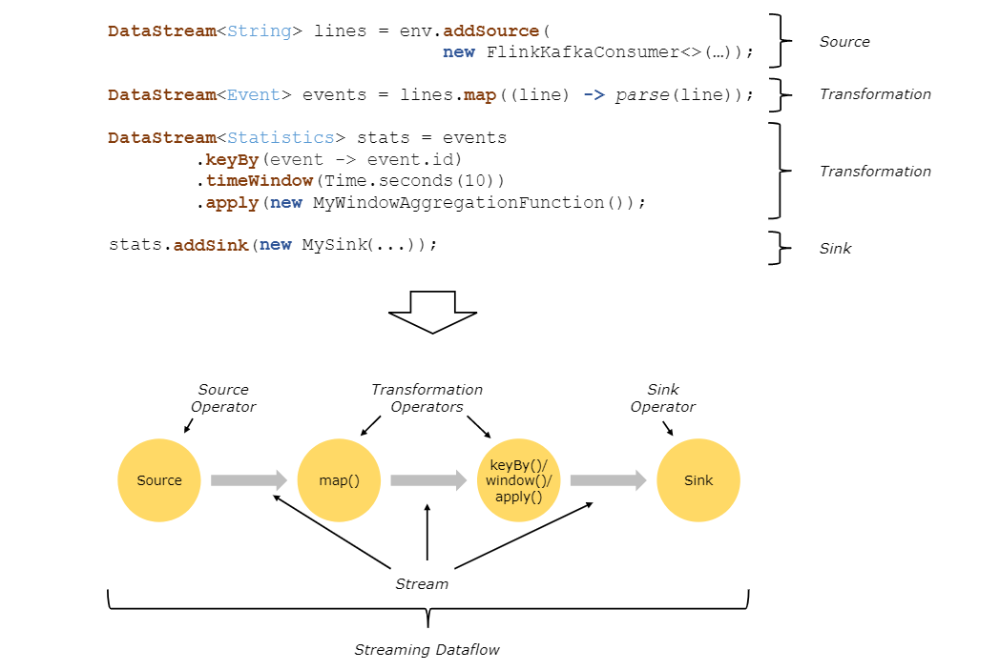
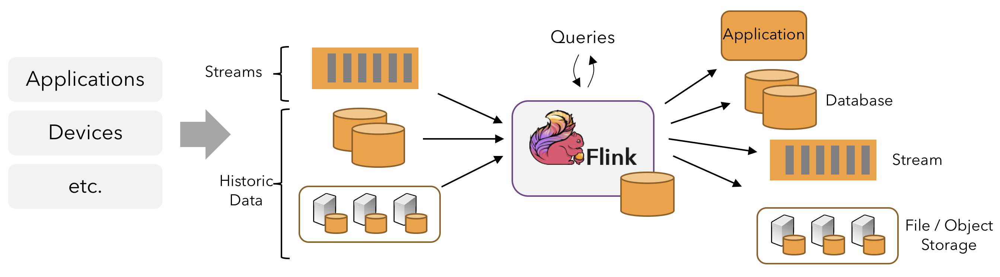
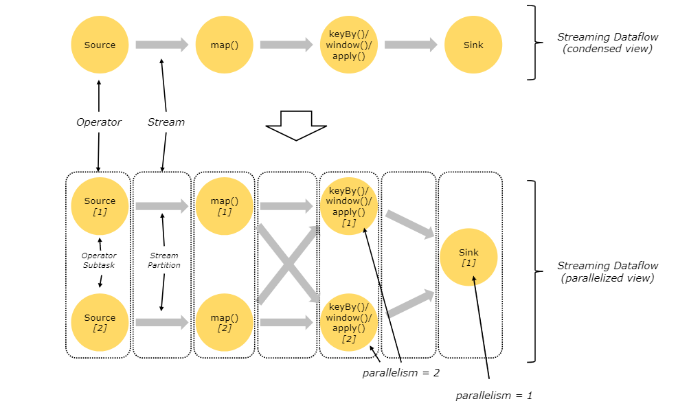

# Learn Flink ：Hands-On Training

> ## Goals and Scope of this Training
>
> This training presents an introduction to Apache Flink that includes just enough to get you started writing scalable streaming ETL, analytics, and event-driven applications, while leaving out[^1] a lot of (ultimately important) details. The focus is on providing straightforward introductions to Flink’s APIs for managing state and time, with the expectation that having mastered these fundamentals, you’ll be much better equipped to pick up the rest of what you need to know from the more detailed reference documentation. The links at the end of each section will lead you to where you can learn more.
>
> Specifically, you will learn:
>
> - how to implement streaming data processing pipelines
> - how and why Flink manages state
> - how to use event time to consistently compute accurate analytics
> - how to build event-driven applications on continuous streams
> - how Flink is able to provide fault-tolerant, stateful stream processing with exactly-once semantics
>
> This training focuses on four critical concepts: continuous processing of streaming data, event time, stateful stream processing, and state snapshots. This page introduces these concepts.
>
> **Note:** Accompanying this training is a set of hands-on exercises that will guide you through learning how to work with the concepts being presented. A link to the relevant exercise is provided at the end of each section.

学习Flink：上手训练

这个训练的目标和范围

这个训练展示Flink的介绍，包含的内容足够支持你编写大规模流ETL，分析和事件驱动应用，同时遗留了很多（最终重要的）细节。这个训练聚焦于提供Flink 管理时间和状态API的直观介绍，如果你有掌握这些基础的期望，你可以从更多相关的索引文档中获取更多内容。每个部分的末尾的连接你可以让你了解的更多。

特别地，你会学习到

:one: 如何实现流数据处理管道

:two: Flink 如何以及为什么管理状态

:three: 如何使用事件时间去一致地计算精确分析

:four: 如何在持续流上构建事件驱动应用

:five: Flink 如何使用精确一次语义 提供容错、状态流处理

这个训练聚焦在四个重要的概念上：流数据的持续处理，事件时间，状态流处理，状态快照。这一页介绍这些概念。

注意：这个训练是一个上手练习的合集，伴随着训练，这个训练会通过学习如何使用展示的这些概念指导你（使用Flink）  。在每个部分的最后会提供一个相关的练习的链接。

> ## Stream Processing
>
> Streams are data’s natural habitat[^2]. Whether it is events from web servers, trades from a stock exchange, or sensor readings from a machine on a factory floor, data is created as part of a stream. But when you analyze data, you can either organize your processing around `bounded` or `unbounded` streams, and which of these paradigms[^3] you choose has profound consequences[^4].
>
> **Batch processing** is the paradigm at work when you process a bounded data stream. In this mode of operation you can choose to ingest the entire dataset before producing any results, which means that it is possible, for example, to sort the data, compute global statistics, or produce a final report that summarizes all of the input.
>
> **Stream processing**, on the other hand, involves unbounded data streams. Conceptually, at least, the input may never end, and so you are forced to continuously process the data as it arrives.
>
> In Flink, applications are composed of[^5] **streaming dataflows** that may be transformed by user-defined **operators**. These dataflows form directed graphs[^6] that start with one or more **sources**, and end in one or more **sinks**.

流是数据自然的栖息地。不管它是 来自于web 服务器的事件，来自于股票交易所的交易记录，或者来自于工厂机器传感器读数，数据被以流的一部分被创建。但是当你分析数据的时候，你要么以有界流的形式要不以无界流的形式，你选择的范式有着深远的影响。

 

:one: 批处理： 批处理是当你处理有界数据流的范式。这种操作模式下，你可以在产生任何结果之前摄取整个数据集，这意味着对所有数据排序，全局统计分析是可能的，对所有输入的总结产生最终的报表是可能的。

:two: 流处理：另一方面，包含无界数据流。概念上来说，最终，输入可能永远没有终点，因此你必须处理不断到达的数据

在Flink中，应用是由流数据流组成，这些流数据流可能是由用户自定义操作符转换而成。这些数据流组成有向图，这些有向图从一个或者多个源开始，一个或者多个sink 结束。

>Often there is a one-to-one correspondence between the transformations in the program and the operators in the dataflow. Sometimes, however, one transformation may consist of multiple operators.
>
>An application may consume[^8] real-time data from streaming sources such as message queues or distributed logs, like Apache Kafka or Kinesis. But flink can also consume bounded, historic data from a variety of data sources. Similarly, the streams of results being produced by a Flink application can be sent to a wide variety of systems that can be connected as sinks.

通常，项目中的转换和数据流中的操作符之间是一一对应的，但是有时，一个转换是由多个操作符组成。

一个应用可能从消息队列（Kafka）或者分布式日志（Kinesis）这样的流源中消费实时数据。但是Flink也可以从各种数据源中消费 有界的历史数据。相似的，Flink应用产生的结果流可以被发送到各种系统，这些系统作为Sink。

 

> ### Parallel Dataflows 
>
> Programs in Flink are inherently parallel and distributed. During execution, a stream has one or more **stream partitions**, and each operator has one or more **operator subtasks**. The operator subtasks are independent of one another, and execute in different threads and possibly on different machines or containers.
>
> The number of operator subtasks is the **parallelism** of that particular operator. Different operators of the same program may have different levels of parallelism.

并行数据流

Flink中的程序天生就是并行的和分布式的，在执行期间，一个流有一个或者多个流分区，一个算子有一个或者多个算子子任务。算子子任务独立于其他算子子任务，并且是不同的线程执行，有可能是不同的机器或者容器中。

算子子任务的数量是该算子的并行度。同一个程序的不同算子可能有不同级别的并行度。

>Streams can transport data between two operators in a `one-to-one `(or forwarding) pattern, or in a `redistributing` pattern:
>
>* **One-to-one** streams (for example between the Source and the map() operators in the figure above) preserve the partitioning and ordering of the elements. That means that subtask[1] of the map() operator will see the same elements in the same order as they were produced by subtask[1] of the Source operator.
>* **Redistributing** streams (as between map() and keyBy/window above, as well as between keyBy/window and Sink) change the partitioning of streams. Each operator subtask sends data to different target subtasks, depending on the selected transformation. Examples are keyBy() (which re-partitions by hashing the key), broadcast(), or rebalance() (which re-partitions randomly). In a redistributing exchange the ordering among the elements is only preserved within each pair of sending and receiving subtasks (for example, subtask[1] of map() and subtask[2] of keyBy/window). So, for example, the redistribution between the keyBy/window and the Sink operators shown above introduces non-determinism regarding the order in which the aggregated results for different keys arrive at the Sink.

在2个流之间传输数据可以通过 ，一对一的方式或者是重新分发的模式

* 一对一流（比如在上图中的Source和map算子之间）保存元素的分区和排序。这意味着数据被source算子的子任务处理之后，map算子会看到和其相同的分区和排序

* 重心分发流（上图中的map和 keyBy/window之间， keyBy/window 和Sink 之间）改变了流的分区。根据所选的转换，每个算子的子任务发送数据都不同的目标子任务，比如keyby（根据键值散列重心分区），rebalance(随机分区)
* 

[^1]: leave out ： 遗漏
[^2]: habitat: 栖息地
[^3]:paradigms  范式
[^4]: profound consequences 深远的影响； profund 深远的，consequences： 后果，结果
[^5]: be composed of  由 ... 组成
[^6]: directed graphs ： 有向图
[^7]:  correspondence ：对应， 组成
[^8]:  consume： 消耗

